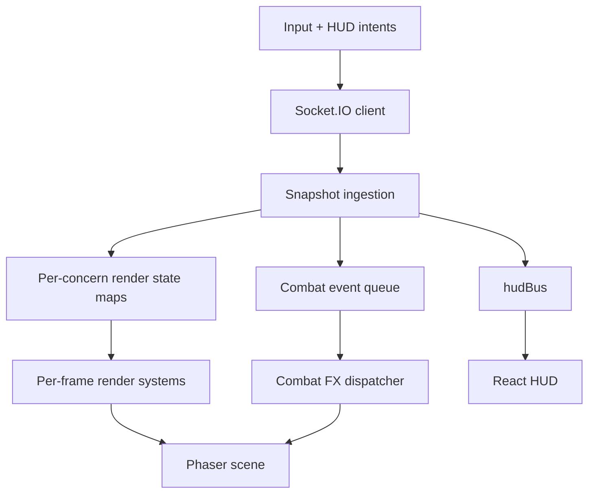
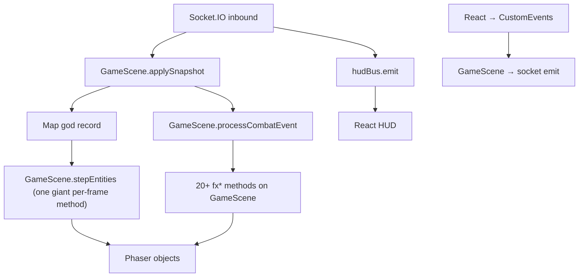
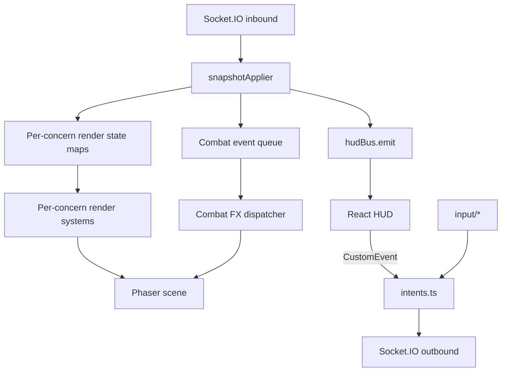

# MMO Idle Client Refactor PRD

## Summary

Carve up the existing client into a small, predictable renderer plus a few input and HUD bridge modules. The client remains a thin, dumb consumer of authoritative server snapshots: it does not simulate gameplay, does not predict outcomes, and does not own any combat, AI, reward, progression, or persistence logic. The goal of this refactor is structural clarity, not new behavior.

This PRD pairs with `server.md` (server-authoritative ECS migration) and `netcode.md` (deferred protocol improvements). The client refactor is the "80% refactor": most of the structural benefit of an ECS-shaped client without introducing miniplex on the client side.

## Problem

`client/src/scenes/GameScene.ts` has grown into a single 1800+ line class that owns:

- Phaser scene lifecycle.
- The Socket.IO connection and every inbound/outbound event.
- The full snapshot application loop, including diffing players and monsters by id, queueing combat events, and emitting HUD state.
- Two parallel `Map<string, Visual>` registries that bundle sprite, shadow, label, HP bar, cooldown bar, interpolation state, lunge offsets, debug overlays, status effect overlays, and snapshot caches into one record per entity.
- 30+ private methods covering rendering, combat presentation, debug overlays, particle effects, lunge tweens, minimap drawing, autopath dispatch, and Phaser teardown.
- Combat FX routing by `attackStyle` string, with one method per visual style.
- Procedural particle texture creation, biome backgrounds, exit gate markers, and the click-to-move target marker.

Effect descriptors currently live in `client/src/effects.ts` and are referenced by string IDs that the server emits. The contract is implicit and easy to break.

The HUD layer is split across five independent React roots wired through `hudBus`, plus a CustomEvent bridge for client → server intent. That part is already tolerable; the immediate pain is the scene class itself.

The result is that small visual changes ripple across `upsertPlayer`, `upsertMonster`, `stepEntities`, `destroyVisual`, and several FX methods. Adding a new entity-level visual requires editing the `Visual` record plus four to five other places.

## Goals

1. Keep the client thin. No game logic, no client-side prediction, no authoritative state.
2. Decompose `GameScene.ts` into small, focused modules with one clear job each.
3. Replace the `Visual` god record with several small per-concern maps keyed by network id.
4. Make adding a new visual concern (a new bar, a new overlay, a new effect dispatcher) a localized change.
5. Move effect descriptors and any cross-cutting display metadata into `shared/` so the server and client agree on string IDs and animation metadata.
6. Preserve current rendering, animation timing, lunge feel, debug overlays, minimap, and HUD behavior as functionally identical.
7. Avoid introducing miniplex or any new ECS framework on the client.

## Non-Goals

- Do not introduce miniplex or any other ECS library on the client.
- Do not change the wire protocol or snapshot shape; that is `server.md`'s scope.
- Do not implement entity-delta networking; that is `netcode.md`'s scope.
- Do not implement client-side authoritative prediction or rollback.
- Do not redesign the React HUD layout, HUD bus contract, or CustomEvent intent bridge as part of this refactor.
- Do not change combat balance, animation timing, or visual identity.
- Do not move authoritative game logic to the client under any circumstances.

## Relationship to Other PRDs

- `server.md` — the server miniplex/ECS refactor. Defines the protocol DTOs (`PlayerSnapshot`, `MonsterSnapshot`, `NodeSnapshot`, `CombatEvent`) the client consumes, and the shared registries the client reads.
- `netcode.md` — deferred protocol/bandwidth work. The client refactor must keep snapshot ingestion behind a clear seam so a future delta protocol can swap in without rewriting render systems.

## Architectural Principles



- The client is a pipeline: snapshot in → render state out.
- Each render concern owns its own state map and its own per-frame system.
- Combat FX is an event consumer, not part of the per-frame loop.
- HUD bridging stays exactly as it is today.
- Inputs flow back out as Socket.IO intents.

## Users and Use Cases

### Developer: Add a new entity-level visual

The developer should be able to add a new visual (for example, a debuff icon stack above the head) by:

1. Creating a new state map keyed by network id (or extending an existing one if it logically belongs).
2. Adding a small "ensure / update / destroy" helper module.
3. Calling that module from the snapshot ingestion path and from the per-frame render loop.

The developer should not need to touch `GameScene.ts` core logic, the `Visual` record, or any unrelated render concern.

### Developer: Add a new combat FX style

The developer should be able to register a new entry in the combat FX dispatcher by mapping `attackStyle` (or a more structured discriminator from `CombatEvent`) to a render function. No edits to scene-level code should be required.

### Developer: Add a new effect overlay ID

The developer should add a single descriptor in `shared/registries/effects.ts`. The server emits the ID; the client renders the matching sprite using the descriptor. No client-side ID list, no parallel definition.

### Player: Watch combat and move

The client receives authoritative snapshots, interpolates positions toward server-supplied targets, plays queued combat events as visual effects, and emits movement and HUD intents back to the server. Behavior is identical to today.

## Target Architecture

### Folder Layout

```text
client/src/
  scenes/
    GameScene.ts            ← thin: lifecycle, system schedule, scene-level Phaser setup
  net/
    socket.ts               ← Socket.IO connect + event dispatch
    snapshotApplier.ts      ← turn NodeSnapshot into render state mutations
    intents.ts              ← outbound: player:move, player:setAuto, etc.
  render/
    state.ts                ← per-concern Map<NetworkId, T> registries
    sprites.ts              ← upsert/destroy player + monster sprites
    shadows.ts              ← shadow ellipse render system
    labels.ts               ← name plate / boss label render system
    healthBars.ts           ← HP + shield bar render
    cooldownBars.ts         ← attack cooldown bar render
    interpolation.ts        ← position interpolation + lunge offsets
    effectOverlays.ts       ← persistent status effect sprites (chill, freeze, etc.)
    combatFx.ts             ← one-shot combat event FX dispatcher
    minimap.ts              ← minimap draw
    debugRanges.ts          ← debug pull/leash/attack rings, gated by toggle
    biomeBackground.ts      ← background tiling per node
    exitMarkers.ts          ← gate markers + click-to-move target marker
  fx/
    slash.ts, impact.ts, gunshot.ts, lightning.ts, frost.ts, fire.ts, ...
                            ← one file per attack style, exporting a render fn
  input/
    clickToMove.ts          ← world-space click → player:move intent
    autoPath.ts              ← BFS path execution against the world map
  hud/                      ← React components (unchanged in shape)
  ui/                       ← React panels (unchanged in shape)
  hudBus.ts                 ← unchanged
  combatLog.ts              ← unchanged
  clientAuth.ts             ← unchanged
  effects.ts                ← removed; replaced by shared/registries/effects.ts
  sprites.ts                ← unchanged
  main.ts                   ← unchanged Phaser bootstrap + React mounts
```

### Render State Model

Replace the `Visual` god record with a small set of independent maps. Each map represents one render concern. An entity exists in a given map iff that concern currently applies to it:

```ts
type NetworkId = string;

interface RenderState {
  ids: Set<NetworkId>;
  kind: Map<NetworkId, 'player' | 'monster'>;

  snapshot: Map<NetworkId, PlayerSnapshot | MonsterSnapshot>;

  transform: Map<NetworkId, {
    x: number;
    y: number;
    targetX: number;
    targetY: number;
    speed: number;
  }>;

  interpolation: Map<NetworkId, {
    baseX: number;
    baseY: number;
    lungeOffsetX: number;
    lungeOffsetY: number;
  }>;

  sprite: Map<NetworkId, Phaser.GameObjects.Image | Phaser.GameObjects.Rectangle>;
  shadow: Map<NetworkId, Phaser.GameObjects.Ellipse>;
  label:  Map<NetworkId, Phaser.GameObjects.Text>;
  hpBar:  Map<NetworkId, Phaser.GameObjects.Graphics>;
  cdBar:  Map<NetworkId, Phaser.GameObjects.Graphics>;

  effectOverlays: Map<NetworkId, Map<string, Phaser.GameObjects.Sprite>>;

  // Optional concerns — present only on entities they apply to.
  bossDecoration: Map<NetworkId, { /* wider shadow, gold label */ }>;
  debugRanges:    Map<NetworkId, { pullRange: number; leashRange: number; attackRange: number }>;
}
```

Rules:

- Each map is owned by the render system that created it.
- Adding a concern means adding a map plus a system; it does not require editing other systems.
- An entity is in a map iff that visual currently applies. Boss decorations only exist for bosses; debug rings only exist while debug is toggled.
- Phaser objects must be destroyed when the entity leaves its map. Each render system owns its teardown.

### Per-Frame Render Loop

`GameScene.update()` becomes a small fixed schedule:

```ts
update(time: number, delta: number): void {
  interpolatePositions(state, delta);
  applyLungeOffsets(state, delta);
  drawSprites(state);
  drawShadows(state);
  drawLabels(state);
  drawHealthBars(state);
  drawCooldownBars(state);
  updateEffectOverlays(state, delta);
  drawMinimap(state, this);
  drawDebugRanges(state, this);
  updateLaserBeam(state, this);
}
```

Each function is a pure-shaped iteration over its own map. None of them need to know about the others.

### Snapshot Ingestion

`snapshotApplier.ts` is the only module that mutates render state from the network. It exposes a single function:

```ts
function applySnapshot(state: RenderState, snapshot: NodeSnapshot, scene: GameScene): void;
```

Internal steps:

1. Diff player ids: remove missing, upsert present.
2. Diff monster ids: remove missing, upsert present.
3. For each upsert, mutate the matching maps. Phaser objects are created by the relevant render system's `ensure*` helper if they do not yet exist. Removed ids trigger the system's `destroy*` helper.
4. Push queued combat events into the combat event queue for the FX dispatcher.
5. Emit HUD updates via `hudBus.emit({ player })` for the local player only.

This module is the seam where the `netcode.md` delta protocol can later swap in without touching render systems.

### Combat FX Dispatcher

`render/combatFx.ts` consumes `CombatEvent[]` produced by `applySnapshot`. It is not part of the per-frame loop; it runs whenever an event arrives.

```ts
function dispatchCombatEvent(state: RenderState, event: CombatEvent, scene: GameScene): void {
  switch (event.kind) {
    case 'player-hit':
      runFxForAttackStyle(state, event, scene);
      if (event.empowered) playEmpoweredRing(state, event, scene);
      if (event.execution) playExecutionImpact(state, event, scene);
      for (const effectId of event.effects ?? []) {
        playOneShotEffect(state, effectId, event, scene);
      }
      // also: damage number, combat log entry, possible lunge
      break;
    case 'player-kill':
      // optional FX, combat log
      break;
  }
}
```

The per-attack-style FX functions live in `client/src/fx/`. Each is one file. The dispatcher maps `attackStyle` strings (and weapon-specific styles) to their FX function.

### Input

Input modules turn user interaction into Socket.IO intents.

```ts
function attachClickToMove(scene: GameScene, socket: GameSocket): void;
function attachKeyboard(scene: GameScene, socket: GameSocket): void;
function attachAutoPath(scene: GameScene, socket: GameSocket): void;
```

These do not mutate render state. They emit intents. Authoritative position changes always come back through snapshots.

### HUD Bridge

`hudBus`, the five React roots, and the CustomEvent intent bridge are unchanged in shape. The only client-side change is that `BuffBar` and any tooltip consumers may import shared registries or shared pure formulas from `@mmo-idle/shared` for label/color metadata and skill/stat preview math.

The client must not start computing buffs locally. It renders `PlayerSnapshot.activeBuffs` as-is.

### Shared Imports From The Client

The client imports from `shared/` for:

- Protocol DTOs: `PlayerSnapshot`, `MonsterSnapshot`, `NodeSnapshot`, `CombatEvent`, socket event maps.
- Effect descriptors: `EFFECT_DEFS`, `EFFECT_BY_ID` (moved from `client/src/effects.ts`).
- Buff descriptor types (rendering metadata only — not server logic).
- Pure formulas for tooltips and previews: stat recalculation, unlock validation, damage formulas.
- Static databases that already live in shared: skills, items, recipes, monsters, biomes.

The client does not import from `server/` directly, and `shared/` does not import Phaser or Socket.IO client code.

## Functional Requirements

### Render State

- Replace `Visual` with the per-concern map model.
- Every map keyed by `NetworkId`.
- Each render system owns ensure, update, and destroy for its concern.
- No render system reaches into another's Phaser objects.

### Snapshot Ingestion

- Single entry point: `applySnapshot(state, snapshot, scene)`.
- Idempotent: repeated identical snapshots produce identical render state.
- Removed ids tear down their Phaser objects across all maps.
- Combat events queued for the FX dispatcher in their original order.
- Local-player snapshot emitted via `hudBus`.

### Combat FX Dispatcher

- Receives `CombatEvent[]` from snapshots.
- Routes by `attackStyle` (and any future structured discriminator) to a single FX function per style.
- All per-style FX functions live under `client/src/fx/`.
- One-shot effects from `event.effects[]` use shared `EFFECT_DEFS`.

### Effect Overlays

- Use shared `EFFECT_DEFS` exclusively. Remove the client-side copy in `client/src/effects.ts`.
- Persistent overlays driven by `activeEffects` and `activeEffectFrames` from snapshots.
- Overlays attached to entities, not to scene globals; teardown follows entity removal.

### Input and Intents

- Input modules emit Socket.IO events; they do not mutate render state.
- `player:move`, `player:setAuto`, `player:unlockSkill`, `inventory:equipItem`, `inventory:unequip`, `crafting:craftRecipe`, and dev-only debug events route through `client/src/net/intents.ts`.
- The HUD CustomEvent bridge continues to call into the same intent helpers.

### HUD Compatibility

- `hudBus` API and message shape unchanged.
- `BuffBar`, `StatPanel`, `MapPanel`, `QuestPanel`, `MobileHUD`, `MenuButtons`, `EssencePanel`, `CombatLogPanel`, `DebugPanel` continue to read from `hudBus` and render `PlayerSnapshot` fields verbatim.
- Tooltips may call shared pure functions for previews.

### Tooling and Boundaries

- `client/` may import from `shared/`. `client/` must not import from `server/`.
- `shared/` must not import Phaser, Socket.IO client, or any Node-only API.
- New visual concerns must follow the per-concern map + render system pattern.
- New combat FX must be added under `client/src/fx/` and registered with the dispatcher.

## Data and Control Flow

### Before



### After



Primary flow:

1. Socket.IO emits a `state:sync` or `node:state` event.
2. `snapshotApplier` mutates per-concern render state maps and pushes events to the combat queue.
3. Per-concern render systems run on the next Phaser update tick.
4. Combat FX dispatcher consumes queued events and triggers one-shot visuals.
5. Local-player snapshot is published to `hudBus`; React HUD re-renders.
6. User input and HUD CustomEvents become socket intents via `intents.ts`.

## Success Metrics

- `GameScene.ts` line count drops substantially. The class becomes orchestration plus scene-level Phaser setup; render and FX logic live in their own modules.
- Adding a new visual concern requires creating one new map plus one new render system, with no edits to existing render systems.
- Adding a new combat FX style adds one file under `client/src/fx/` and one entry in the dispatcher.
- Effect IDs no longer have a client-side copy; the only source of truth is `shared/registries/effects.ts`.
- The client builds and runs with no `client/src/` import of `server/src/`.
- Manual playthrough confirms identical-feeling rendering, animation timing, lunge feel, debug overlays, minimap, and HUD behavior.

## Migration Strategy

The migration is segmented into 7 testable chunks (C1 – C7), with C5 split into three sub-chunks by FX style family. Each chunk should land as a single git commit with a focused smoke test, so any regression points to exactly one chunk that can be reverted cleanly. Chunks build on each other in order.

Recommended sequence: `server.md` S1 → S13 first, then C1 → C7 here, then `netcode.md`. C7 removes the compatibility aliases added in `server.md` S1.

### C1 — Shared Effect Descriptors

**Changes:**

- Move `EFFECT_DEFS`, `EFFECT_BY_ID`, `EFFECT_FRAME_COUNT`, `EFFECT_GRID` from `client/src/effects.ts` into `shared/src/registries/effects.ts`.
- Update both server emit sites and client consumers to import from shared.
- Remove `client/src/effects.ts`.

**Smoke test:** Every persistent effect overlay (chill, freeze, burn, poison, ember, etc.) plays correctly. Glacial fracture one-shot still triggers and animates.

### C2 — Net Layer Extraction

**Changes:**

- Create `client/src/net/socket.ts` and move all `socket.on(...)` registrations out of `GameScene.create()`.
- Create `client/src/net/intents.ts` with one function per outbound socket event.
- Refactor the React → CustomEvent bridge so handlers call the shared intent helpers.

**Smoke test:** Connect, snapshots arrive, every intent (`player:move`, `player:setAuto`, `player:unlockSkill`, `inventory:equipItem`, `inventory:unequip`, `crafting:craftRecipe`, dev debug events) round-trips successfully.

### C3 — Render State Decomposition

**Changes:**

- Introduce `client/src/render/state.ts` with the per-concern maps.
- Introduce `client/src/net/snapshotApplier.ts` and route both `state:sync` and `node:state` through it.
- Carve `upsertPlayer`, `upsertMonster`, and `destroyVisual` into per-concern ensure / update / destroy helpers across the new render modules.
- Remove the `Visual` god record; replace usage of `players: Map<string, Visual>` and `monsters: Map<string, Visual>` with the new per-concern render state.

**Smoke test:** Visual smoke — sprites, shadows, labels, HP bars, CD bars all render and tear down correctly. No orphan Phaser objects on monster kill, node transition, or disconnect.

### C4 — Render System Extraction

**Changes:**

- Move per-frame work out of `GameScene.stepEntities` into the per-concern render systems.
- Move `updateStatusOverlays`, `drawMinimap`, `drawExitMarkers`, `drawDebugRanges`, `updateBiomeBackground`, `playMeleeLunge`, and the laser beam loop into their own modules.
- `GameScene.update()` becomes the fixed schedule documented above (interpolation → lunge → sprites → shadows → labels → HP bars → CD bars → effects → minimap → debug → laser).

**Smoke test:** Movement interpolation is smooth. Lunge feel matches before. Animation cadence indistinguishable from before. Debug overlays toggle cleanly. Minimap scrolls correctly with player position.

### C5a — Combat FX Dispatcher (Melee Styles)

**Changes:**

- Move melee `fx*` methods (slash, impact, swing, axe, sword, weapon-effect variants) from `GameScene` into per-style files under `client/src/fx/`.
- Stand up the dispatcher in `client/src/render/combatFx.ts` and wire the queued combat events to it.

**Smoke test:** Every melee attack style plays the same FX as before for both player and monster hits.

### C5b — Combat FX Dispatcher (Ranged Styles)

**Changes:** Same shape as C5a, applied to ranged styles (gunshot, arrow, laser, snipe, gatling).

**Smoke test:** Every ranged style plays the same FX. Laser channel beam continues to render correctly across snapshots.

### C5c — Combat FX Dispatcher (Magic and Empowered Styles)

**Changes:** Same shape as C5a, applied to magic and empowered styles (frost, fire, lightning, freeze, glacial fracture, empowered ring, empowered AoE splash).

**Smoke test:** Every magic style plays the same FX. Empowered hits trigger the ring and AoE splash. Glacial fracture still detonates frost stacks correctly.

### C6 — Input Extraction

**Changes:**

- Move click-to-move, autopath, keyboard, and dev-only debug input handlers into `client/src/input/`.
- Each module receives the scene and socket; nothing else.

**Smoke test:** Click-to-move works in world space and via the minimap. Autopath traverses across nodes correctly. Manual movement during autopath cancels it. Keyboard hotkeys, debug toggles, and dev hotkeys all work.

### C7 — Cleanup

**Changes:**

- Remove the `PlayerState` / `MonsterState` compatibility aliases added in `server.md` S1.
- Confirm `GameScene.ts` is reduced to lifecycle, scene-level setup, and the `update()` schedule.
- Confirm `Visual` no longer exists in the codebase.
- Confirm no render system imports another render system's internal Phaser handles.
- Confirm only `intents.ts` calls `socket.emit`.

**Smoke test:** Typecheck clean. Grep for `PlayerState`, `MonsterState`, and `Visual` returns zero hits across `client/src/` and `server/src/`. Full smoke from C1's checklist still passes end to end.

### Stop-and-Merge Point

After C7, both refactors are landed. The game runs on a miniplex server plus a decomposed thin client, with a single `snapshotApplier` seam ready for `netcode.md`'s delta protocol.

## Risks

- Render extraction can accidentally change animation timing, lunge feel, damage number positioning, or status overlay placement. Each chunk needs a side-by-side visual check.
- Phaser GameObject teardown is easy to miss when ownership is split across modules. Each render system must own destroy, and snapshot ingestion must remove ids consistently across all maps.
- Effect descriptor migration must keep the same string IDs the server already emits; otherwise existing animations break silently.
- The HUD relies on the local-player snapshot landing in `hudBus`. Snapshot ingestion must continue to emit `{ player }` for the local player.
- Combat FX dispatch must preserve the current dispatch by `attackStyle` and class archetype, including weapon-specific styles. Reload, Cooldown channel, and DoT path effects are particularly sensitive.
- The autopath / minimap navigation pipeline reads `hudBus.autoPath`. The intent extraction must keep that contract.

## Validation

- Typecheck the client workspace.
- Vite dev server boots with no console errors on connect.
- Manual smoke test, comparing against current behavior:
  - Connect, see authoritative spawn, move with click-to-move.
  - Attack a monster: HP bar drains, cooldown bar fills, lunge plays, damage numbers float, hit FX matches `attackStyle`.
  - Kill a monster: kill log entry appears, monster despawns, no orphan Phaser objects.
  - Trigger empowered hit on each archetype: ring + AoE FX match current behavior.
  - Apply DoT and frost effects: persistent overlays attach, expire on schedule, glacial fracture one-shot plays.
  - Toggle debug player range and enemy ranges: rings appear and disappear correctly.
  - Move between nodes: gate markers redraw, biome background swaps, autopath cancels on manual move.
  - Open Skill, Inventory, Crafting, Map, Quest panels: HUD reads from snapshots; intents return to server.
  - Die and respawn: death overlay plays, no leaked Phaser objects across the transition.
  - Disconnect and reconnect: client reattaches cleanly; snapshot ingestion handles the resync.
- Bundle size check: confirm no large new client dependency is introduced (no miniplex, no other ECS lib).

## Out of Scope for This PRD

- Introducing miniplex or any ECS library on the client.
- Changing the wire protocol or snapshot shape.
- Implementing entity-delta networking, dirty tracking, or bandwidth optimization.
- Client-side prediction or rollback.
- Changing animation timing, visual identity, or game balance.
- Redesigning the HUD layout or React component tree.
- Authentication, character select, deployment.
