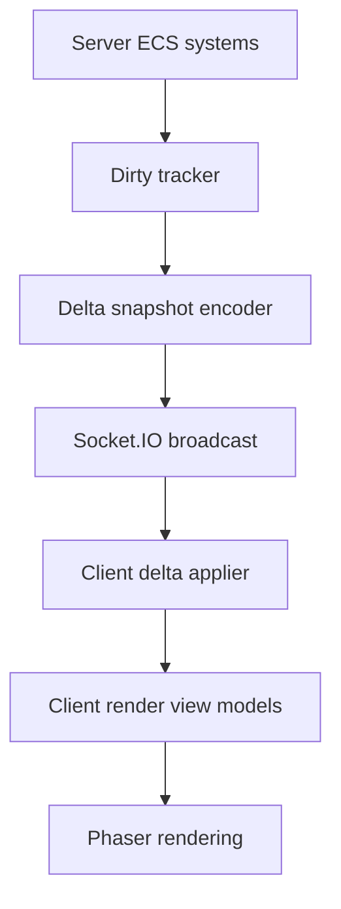

# MMO Idle Netcode PRD

## Summary

Improve the network protocol after the server-side ECS migration is stable. The current refactor keeps Socket.IO and full `NodeSnapshot` broadcasts so architecture work can focus on server authority, miniplex ECS, and mechanic organization. This PRD captures the deferred networking work: component-level deltas, dirty tracking, snapshot compression, and smoother client ingestion.

The server remains authoritative. Netcode improvements must reduce bandwidth and boilerplate without introducing client-side simulation authority.

## Implementation Status

Component-delta transport is now the active protocol: `state:sync` and
`node:delta` carry `DeltaSnapshot` payloads made from allowlisted component
slices. The legacy `PlayerSnapshot`, `MonsterSnapshot`, and `NodeSnapshot` DTOs
have been removed from shared code. Payload-size instrumentation (`NETCODE_PROFILE=1`)
and spatial wire quantization (1px rounding for `hasPosition` / `isMoving`) are
landed. Deeper per-field compression (wire key maps, omit-unchanged scalars) is
deferred — see Baseline Measurements below. Dirty tracking now feeds the delta
encoder directly instead of being discarded at the broadcast boundary.

## Prerequisites Complete

The server-side prep work needed before the protocol cutover is complete:

- Component presence now gates behavior (`isMoving`, `hasAttackTarget`, `hasAggroTarget`, shields, evasion, channeling, empowered attacks, boss engagement, and timed sub-states).
- Stat recalc, archetype-slice sync, player persistence, player hydrate, and monster spawn are component-native and no longer round-trip through `PlayerSnapshot` / `MonsterSnapshot`.
- The `characters` table persists one JSON blob per long-lived player slice (`isPlayer`, `hasPosition`, `hasHealth`, `tracksProgression`, `holdsInventory`, `usesSkills`); runtime-only slices are rebuilt on attach.
- The remaining snapshot surface is the legacy wire boundary: `World.buildSnapshot()` calls `assemblePlayerSnapshot()` / `assembleMonsterSnapshot()` for `state:sync` and `node:state`.

## Baseline Measurements

Captured offline via `server/scripts/netcode-baseline.ts` (reproducible, no live client required). Values are `JSON.stringify(DeltaSnapshot).length` in bytes. Broadcast rate is 5 Hz.

| Scenario | Full resync | Steady delta | Est. bytes/sec @ 5 Hz | Top slice contributors |
| --- | --- | --- | --- | --- |
| Idle solo (12 monsters, node-5-5) | 7,150 B | 7,846 B | ~39 KB/s | `isMonster`, `isMoving`, `hasPosition` |
| Solo combat (1 player + monsters) | 8,163 B | 8,837 B | ~44 KB/s | `isMonster`, `hasPosition`, `isMoving` |
| Contested dungeon (2 players + boss, node-5-7) | 9,785 B | 10,530 B | ~53 KB/s | `isMonster`, `hasPosition`, `performsAttack` |
| Reconnect storm (20 ticks then resync) | 8,779 B | 8,508 B | ~43 KB/s | `isMonster`, `hasPosition`, `performsAttack` |

**Compression landed:** spatial wire quantization in `server/src/ecs/deltaEncoder.ts` — rounds `hasPosition.current` and `isMoving.motion.magnitude` to whole pixels before JSON encode. Saves ~500 B/tick on idle wander (~6% on steady delta).

**Decision — defer deeper compression:** no single slice exceeds 50% of payload; bandwidth is ~40–53 KB/s per client at 5 Hz with ~12–15 entities — acceptable for the ~100-friends LAN target. Next optimization if needed: stop marking `isMoving` dirty when motion vector is unchanged, or introduce a wire-only component key map.

**Live profiling:** set `NETCODE_PROFILE=1` when starting the server; `server/src/net/profiler.ts` logs p50/p95 and top slice contributors every 5 s.

## Problem

The current protocol broadcasts full node snapshots at 5 Hz:

```ts
interface NodeSnapshot {
  players: PlayerSnapshot[];
  monsters: MonsterSnapshot[];
  events: CombatEvent[];
}
```

This is simple and reliable, but it sends many unchanged fields every broadcast. As entity counts, buff states, effect overlays, and archetype-specific snapshot fields grow, the full-snapshot model may create avoidable bandwidth and client diffing work.

Today, `GameScene.applySnapshot()` owns most snapshot reconciliation. It removes missing visuals, upserts players and monsters, processes queued combat events, and updates HUD state. That works, but it is tightly coupled to the current flat `PlayerState` / `MonsterState` payloads.

## Goals

1. Preserve server authority and Socket.IO unless a separate transport decision is made.
2. Reduce repeated bandwidth from unchanged snapshot fields.
3. Introduce a protocol that maps naturally from server ECS entities to client view models.
4. Keep combat events reliable and ordered between broadcast ticks.
5. Make client snapshot application smaller and easier to reason about.
6. Keep the initial server ECS refactor unblocked by deferring this work.

## Non-Goals

- Do not add client-side authoritative prediction.
- Do not implement rollback or reconciliation of client-predicted combat.
- Do not replace Socket.IO as part of this PRD.
- Do not change combat, AI, reward, progression, or persistence authority.
- Do not require miniplex on the client.

## Proposed Direction

After ECS boundaries are stable, evolve the protocol from full entity arrays to component deltas:

```ts
type EntityDelta =
  | { kind: 'add'; netId: string; components: Partial<NetworkedEntity> }
  | { kind: 'patch'; netId: string; components: Partial<NetworkedEntity> }
  | { kind: 'remove'; netId: string };

interface DeltaSnapshot {
  tick: number;
  nodeId: string;
  deltas: EntityDelta[];
  events: CombatEvent[];
}
```

The server projects authoritative ECS entities into networked components, tracks which networked components changed since the last broadcast, and sends only adds, patches, and removals. The client applies deltas to a local render view model keyed by `networkId`.

## Data Flow



Primary flow:

1. Server systems mutate authoritative ECS components.
2. Mutations mark networked components dirty.
3. Broadcast loop encodes dirty components into `DeltaSnapshot`.
4. Server includes queued `CombatEvent[]` as it does today.
5. Client applies adds, patches, and removals to render state.
6. Phaser render modules consume the updated render state.

## Requirements

- Every networked entity must have a stable string `networkId`.
- The server must maintain O(1) lookup from `networkId` to ECS entity.
- The client must maintain O(1) lookup from `networkId` to render view model.
- Component patches must only include network-safe components from `shared/`.
- Server-only components such as AI, combat internals, persistence metadata, and private cooldown state must never be serialized.
- Full snapshot resync must remain available for connect, reconnect, node transition, or recovery from missing deltas.
- Combat event ordering must remain reliable across broadcast boundaries.

## Compatibility Strategy

The protocol cutover is complete. `state:sync` sends a full component resync as
a `DeltaSnapshot` with `full: true`, and regular broadcasts use `node:delta`.
The old `node:state` full-snapshot event has been removed.

## Risks

- Dirty tracking can miss a mutation if systems mutate networked components without marking them dirty.
- Component deltas add protocol complexity and may not be worth it until snapshot size is measured.
- Partial patches can make debugging harder than full snapshots.
- Node transitions and disconnect/reconnect need careful full-resync behavior.
- Client render bugs may be harder to diagnose if local view models drift from server state.

## Validation

- Measure current snapshot payload size by occupied node and entity count before changing the protocol.
- Verify full snapshot and delta snapshot produce equivalent client render state.
- Test connect, disconnect, reconnect, node transition, death/respawn, boss spawn, and monster kill cleanup.
- Test combat events under high attack speed to ensure no animation events are lost.
- Add logging or assertions for unknown entity deltas, missing full sync state, and non-networked component serialization.

## Out of Scope

- Server ECS migration itself; covered by `server.md`.
- Client renderer decomposition except for delta application; covered by `client.md`.
- Transport replacement.
- Client-side prediction.
- Gameplay balance changes.
- Snapshot payload-size measurement.
- Full-vs-delta render-state equivalence testing.
