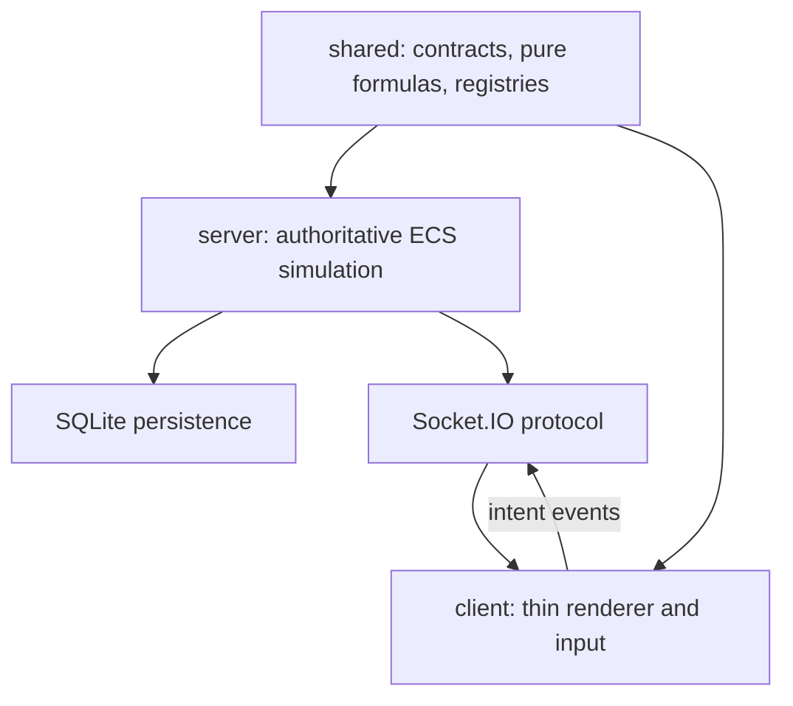
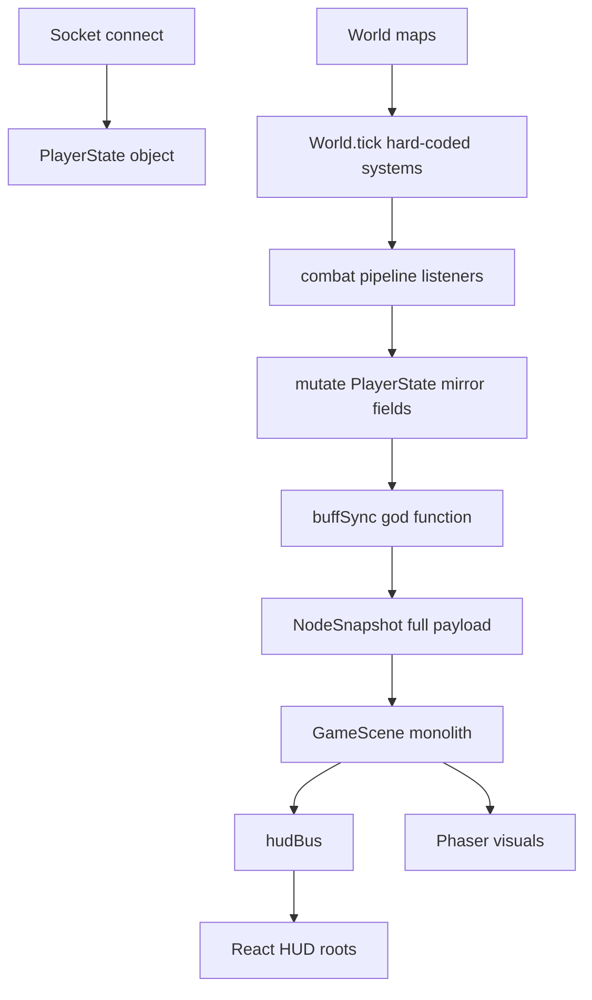
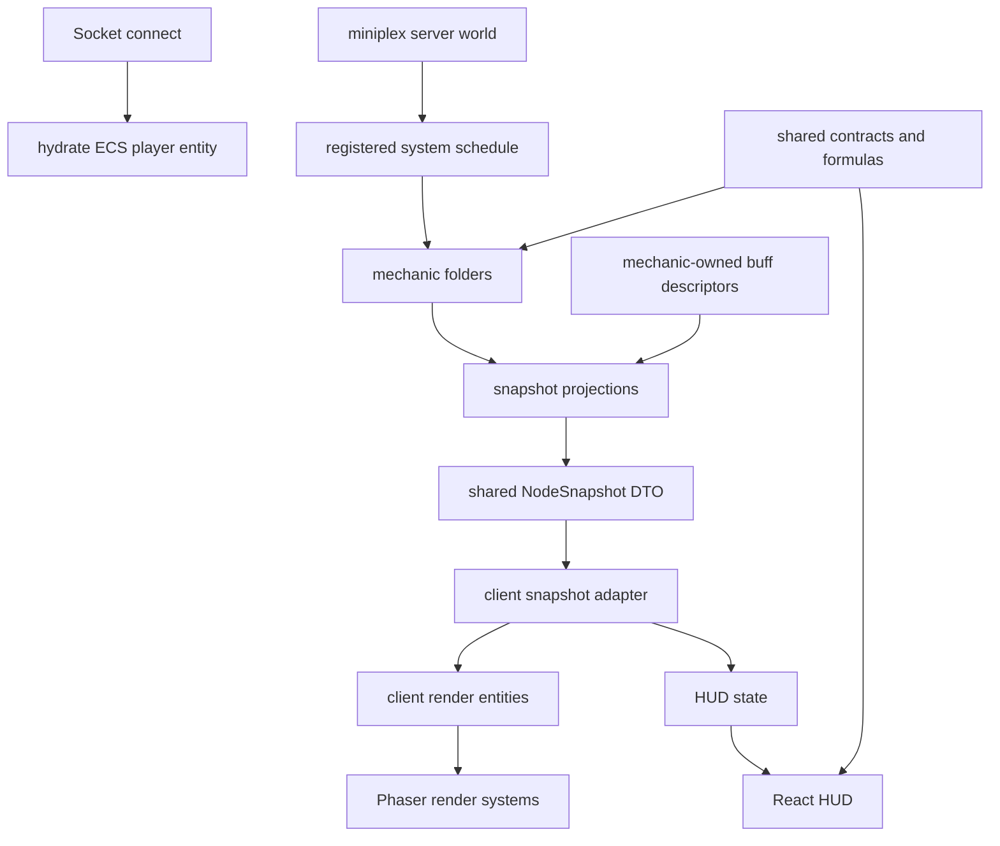

# MMO Idle Server ECS Refactor PRD

## Summary

Reorganize the server-side codebase around a miniplex-backed ECS architecture that makes gameplay systems easier to compose, extend, and reason about. The server remains the only source of truth for simulation, combat, AI, rewards, progression, persistence, and world state. The client stays a thin renderer and input surface that consumes authoritative snapshots and uses shared pure helpers only for fast UI previews such as tooltips.

This refactor should produce a "write once" development experience for game mechanics: adding a new archetype, T3 path, buff, effect, or defensive mechanic should not require coordinated edits across `World.ts`, `PlayerState`, `buffSync.ts`, `GameScene.ts`, and HUD rendering unless the feature genuinely introduces a new visual or UI pattern.

## Companion PRDs

- `client.md` — the parallel client-side refactor (thin renderer, no miniplex, decompose `GameScene.ts`).
- `netcode.md` — deferred protocol/bandwidth work (component deltas, dirty tracking) to be picked up after this refactor lands.

## Problem

The current implementation is functional, but feature work has started to accumulate structural cost:

- Gameplay state is split across `PlayerState`, `MonsterState`, several parallel `World` maps, and `CombatState` string-key buckets.
- Archetype logic repeats the same patterns: loop all players, guard by `combatArchetype`, fetch combat state, mirror runtime values back onto `PlayerState`, then add buff display logic elsewhere.
- `PlayerState` has become a combined persistence model, runtime combat mirror, network payload, and HUD view model.
- `World.tick()` hard-codes an increasingly long ordered list of systems.
- `buffSync.ts` is a central registry by accident, importing helpers from every archetype and encoding all buff display rules in one large function.
- `GameScene.ts` owns socket I/O, snapshot application, entity lifecycle, Phaser objects, status overlays, combat effects, debug rendering, minimap, and HUD bridging in one monolithic class.
- Server and client share types and data tables, but not a clean contract boundary for pure formulas, descriptors, protocol payloads, or display registries.

The result is that adding a mechanic often means editing many unrelated files. This creates boilerplate, raises regression risk, and makes composition harder as the archetype count grows.

## Goals

1. Preserve the server-authoritative architecture.
2. Introduce a single ECS mental model for authoritative game state.
3. Move reusable contracts into `shared/`: types, pure formulas, data registries, effect descriptor types, buff descriptor types, and protocol shapes.
4. Adopt `miniplex` on the server where it provides meaningful ECS ergonomics for authoritative simulation.
5. Make the client thin and dumb: render snapshots, send intents, and use shared pure helpers only for responsive UI previews.
6. Make mechanic development compositional: a new mechanic should live mostly in one server folder plus shared descriptors.
7. Reduce stringly typed runtime state over time by moving archetype state into typed components.
8. Keep migration incremental and testable. Avoid a single big-bang rewrite where possible.

## Non-Goals

- Do not implement client-side authoritative prediction.
- Do not move combat, AI, rewards, spawns, quests, persistence, or progression authority to the client.
- Do not require `shared/` to depend on Phaser, Socket.IO, SQLite, Express, or miniplex.
- Do not redesign game balance as part of the refactor.
- Do not replace Socket.IO unless a later bandwidth or transport requirement appears.
- Do not implement entity-delta networking, dirty tracking, or other netcode optimization as part of this refactor. Keep those as follow-up work after the server ECS migration is stable.

## Architectural Principles



- `shared/` defines what data means.
- `server/` decides what happens.
- `client/` displays what happened and sends player intent.
- The import direction is one-way: `server` and `client` may import from `shared`; `shared` must not import from either.
- Shared logic must be pure and deterministic: no world mutation, no clocks, no random, no I/O.
- Stateful systems belong on the server unless they are purely visual client systems.

## Users and Use Cases

### Developer: Add a New Archetype Path

The developer should be able to add a new T3 path by:

1. Adding the skill/passive descriptor in the shared skill tree.
2. Adding a typed server component or state shape if needed.
3. Adding the server mechanic implementation in the owning archetype folder.
4. Adding any buff/effect descriptor in a shared registry.
5. Adding bespoke client rendering only if the feature introduces a genuinely new presentation pattern.

The developer should not need to touch `World.tick()` directly, add fields to a monolithic `PlayerState` for every runtime detail, or hand-wire buff display logic in multiple places.

### Developer: Add a Buff

The developer should add one buff descriptor in the system or mechanic folder that owns the buff. The descriptor should keep all buff details together:

- `id`
- label
- color/icon metadata
- server-side read logic or projection contract
- optional category metadata

Server snapshot generation should aggregate buff descriptors from mechanic modules and emit the final `PlayerBuff[]` from those descriptors. Client rendering should automatically display the emitted buffs with the existing buff bar pattern and should not need to know the owning mechanic's internal state.

### Player: Open a Tooltip

The client should show stat and skill previews instantly using shared pure formulas. The tooltip may compute "what if I unlock this skill?" locally, but the server still validates and applies the actual unlock.

### Player: Move, Attack, and Watch Combat

The client sends movement and control intents. The server resolves movement, AI, combat, rewards, buffs, and deaths. The client renders authoritative snapshots and queued combat events.

## Target Architecture

### Shared Package

`shared/` becomes the contract layer:

```text
shared/src/
  components/
    position.ts
    health.ts
    combat.ts
    cadence.ts
    cooldown.ts
    energy.ts
    reload.ts
    dot.ts
    buffs.ts
    effects.ts
  protocol/
    snapshot.ts
    events.ts
  registries/
    buffs.ts
    effects.ts
  systems/
    stats.ts
    damage.ts
    skills.ts
    spatial.ts
  index.ts
```

Responsibilities:

- Component interfaces and snapshot payload types.
- Socket event maps and protocol DTOs.
- Pure formula helpers such as stat recalculation, unlock validation, damage formulas, distance helpers, and tooltip math.
- Declarative registries for buffs and visual effect IDs.
- Existing static databases such as skills, items, recipes, monsters, and biomes.

`shared/` should not own runtime scheduling or mutable world state.

### Server Package

`server/` owns all authoritative systems:

```text
server/src/
  ecs/
    entity.ts
    world.ts
    queries.ts
  systems/
    classes/
      cadence/
      cooldown/
      energy/
      reload/
      dot/
    combat/
    ai/
    defense/
    rewards/
    inventory/
    crafting/
    quests/
    movement/
    transitions/
    spawning/
  net/
    snapshots.ts
    socketHandlers.ts
  db/
```

Responsibilities:

- Miniplex authoritative ECS world.
- Server-only components such as `monsterAi`, `combatState`, `passives`, `inventory`, `questProgress`, `knockback`, and persistence metadata.
- System scheduling and tick order.
- Combat pipeline and event emission.
- Snapshot projection from ECS entities to shared protocol types.
- Persistence hydration and save projection.

### Client Package

The client stays a thin renderer and input surface that consumes authoritative snapshots from the protocol DTOs defined here, renders Phaser visuals, and feeds the React HUD via `hudBus`. Client renderer decomposition stays plain TypeScript and Phaser; miniplex is not introduced on the client as part of this refactor.

The detailed client folder layout, render-state model, snapshot-application seam, combat FX dispatcher, and migration phases are owned by `client.md`. From the server side, the only contract obligations are:

- The wire protocol DTOs in `shared/protocol/` (`PlayerSnapshot`, `MonsterSnapshot`, `NodeSnapshot`, `CombatEvent`).
- The shared registries the client reads (effects, buff descriptor types).
- The pure formulas the client uses for tooltips and previews.

The server must not assume or depend on any specific client render module layout.

## ECS Model

### Server Entity Shape

Conceptually, an entity is an identifier plus a set of attached components. Miniplex represents this ergonomically as object properties, but the design should be read as component composition rather than inheritance or a large entity class. Components should be defined in small, owning modules and imported by systems that need them. Avoid a central "all components" god type that becomes the new `PlayerState`.

```ts
type EntityId = string;

// shared/components/position.ts
export interface PositionComponent {
  x: number;
  y: number;
  targetX: number;
  targetY: number;
}

// shared/components/combat.ts
export interface CombatComponent {
  attack: number;
  plating: number;
  damageReduction: number;
  attackRange: number;
  attackCooldown: number;
  lastAttackAt: number;
  attackTargetId: EntityId | null;
}

// server/systems/classes/cadence/component.ts
export interface CadenceComponent {
  count: number;
  threshold: number;
  empoweredArmed: boolean;
  speedStacks: number;
}

// server/ecs/entity.ts
export type ServerEntity = {
  entityId: EntityId;
  // Miniplex permits additional component properties, but no central module
  // should own every possible key. Feature modules own their component shapes.
};
```

Systems define behavior by querying for the component composition they require:

```ts
const cadenceAttackers = world.with('combat', 'combatState', 'passives', 'cadence');

function updateCadence(world: ServerWorld, dt: number, now: number): void {
  for (const entity of cadenceAttackers) {
    // cadence behavior exists because this entity has the cadence component
  }
}
```

The presence of `cadence`, `cooldown`, `energy`, `reload`, or `dot` replaces `combatArchetype` checks internally. The wire snapshot may still expose a compact archetype discriminator for client display compatibility.

The client-side render entity model that consumes these snapshots — small per-concern maps keyed by network id, no miniplex — is specified in `client.md`. The server's only responsibility toward the client is producing well-typed `PlayerSnapshot` / `MonsterSnapshot` payloads.

## Protocol Model

### Current Protocol Retained

Keep the existing full snapshot model during the ECS migration:

```ts
interface NodeSnapshot {
  players: PlayerSnapshot[];
  monsters: MonsterSnapshot[];
  events: CombatEvent[];
}
```

Internally, the server projects ECS entities to `PlayerSnapshot` and `MonsterSnapshot`. The client applies snapshots into its renderer state. This keeps the migration focused on authoritative server architecture and code organization rather than bandwidth.

Detailed netcode improvements are tracked separately in `netcode.md`. They are explicitly out of scope for the initial miniplex/server reorganization.

Protocol naming decision: rename the wire payload types to `PlayerSnapshot` and `MonsterSnapshot` immediately. This is a TypeScript/API boundary change, not a save-file change. SQLite persistence should keep its own projection layer, and any future persisted field or JSON-shape changes must include an explicit migration script.

Passive key decision: migrate `passives` from `Record<string, number>` to typed passive-key unions during the ECS/miniplex refactor. This should not require a save migration because passives are derived runtime state rebuilt from persisted `unlockedSkills`, `equipment`, selected class/path fields, and static skill/item definitions. If a later change persists passive data directly or changes the persisted skill/equipment JSON shape, that later change must include a migration script.

## Functional Requirements

### Shared Contracts

- Define stable protocol DTOs for snapshots and events.
- Define component interfaces for general gameplay and archetype-specific state.
- Move pure formulas into shared modules.
- Move effect IDs and effect metadata into shared registries.
- Define shared buff descriptor types, but colocate concrete buff descriptors with the server system or mechanic that owns the buff.
- Define typed passive-key unions for `defense.*`, `cadence.*`, `cooldown.*`, `reload.*`, `energy.*`, and `dot.*` keys, then use them for skill/item `mechanicEffects` and server passives.
- Keep existing imports working during migration through compatibility exports.

### Server ECS

- Replace `World.players`, `World.monsters`, `World.monsterAI`, `World.playerCombatState`, `World.monsterCombatState`, and `World.monsterKnockback` with miniplex components or compatibility query adapters.
- Preserve existing tick order semantics during migration.
- Preserve the combat pipeline phases.
- Preserve server authority for all gameplay outcomes.
- Preserve persistence fields and hydration behavior.
- Treat protocol renames as separate from save-file migrations: `PlayerSnapshot` / `MonsterSnapshot` are wire DTOs, while database rows are persistence DTOs.
- Treat typed passive keys as a runtime/type-system migration, not a save-file migration, because passives are rebuilt rather than stored.
- Provide projection helpers:
  - ECS entity to `PlayerSnapshot`
  - ECS entity to `MonsterSnapshot`
  - ECS player entity to database character row
  - database character row to ECS player entity

### Server Mechanics

- Group mechanics by feature folder.
- Each mechanic module should own:
  - component/state shape
  - init/listener registration
  - tick function
  - snapshot projection
  - buff descriptors
  - effect emission constants
- Mechanics should register through one central mechanic registry instead of editing `World.tick()` for every feature.

### Client Renderer

The client refactor is owned by `client.md`. From the server's perspective, the requirements are:

- The client must remain render-only and must not gain authoritative gameplay logic.
- The client consumes shared protocol DTOs and shared descriptor registries; it does not import from `server/`.
- Buffs and effects are rendered from shared descriptors.
- Tooltips and previews use shared pure formulas.

### Tooling and Boundaries

- `shared/` must not import from `server/`, `client/`, Phaser, Socket.IO server/client, SQLite, Express, or Node-only APIs.
- Server-only systems must not be imported by the client.
- Client-only render modules must not be imported by the server.
- New mechanics should have a single owning folder and a predictable registration path.

## Data and Control Flow

### Before



Primary flow today:

1. Server loads or creates a `PlayerState`.
2. Server stores players and monsters in separate maps.
3. `World.tick()` calls a hard-coded sequence of systems.
4. Archetype systems update `CombatState` and mirror display fields onto `PlayerState`.
5. `buffSync.ts` reads many scattered state sources and writes `player.activeBuffs`.
6. `World.buildSnapshot()` sends arrays of `PlayerState` and `MonsterState`.
7. `GameScene.applySnapshot()` diffs visuals, updates HUD state, and runs presentation effects.

### After



Primary flow after migration:

1. Server loads persistence data and hydrates a miniplex player entity.
2. Server systems run over miniplex queries.
3. Mechanics mutate typed components and server-only combat state.
4. Snapshot projection maps authoritative ECS entities to shared protocol DTOs.
5. Client applies snapshots into render state.
6. Phaser render modules update visuals.
7. React HUD reads authoritative player snapshot data.
8. Tooltips use shared pure helpers for previews only.

## Success Metrics

- Adding a new buff requires one descriptor change and no client render logic change.
- Adding a new effect ID requires one shared descriptor change and no untyped server string emission.
- Adding a new archetype path no longer requires editing `World.tick()` directly.
- Runtime archetype state is represented as typed components rather than new flat fields on `PlayerState`.
- `GameScene.ts` is reduced from a monolith into orchestration plus extracted modules.
- Server tests or manual verification confirm combat, movement, persistence, quests, crafting, and respawn remain behaviorally stable.
- The client remains incapable of authoritatively changing HP, damage, rewards, progression, buffs, or monster state.

## Migration Strategy

The migration is segmented into 13 testable chunks (S1 – S13). Each chunk should land as a single git commit with a focused smoke test, so any regression points to exactly one chunk that can be reverted cleanly. Chunks build on each other in order.

Recommended sequence: S1 → S13 here, then `client.md` C1 → C7, then `netcode.md`. S1's compatibility aliases keep the unmodified client building during the entire S2 – S13 window.

### S1 — Wire Type Rename + Compatibility Shims

**Changes:**

- Rename `PlayerState` → `PlayerSnapshot` and `MonsterState` → `MonsterSnapshot` in `shared/`.
- Add compatibility aliases (`export type PlayerState = PlayerSnapshot`, `export type MonsterState = MonsterSnapshot`) so the unmodified client keeps building. Aliases are removed in `client.md` C7.

**Smoke test:** Both packages typecheck. Client boots. Snapshot payload over the wire is byte-identical to before.

### S2 — Pure Formula Extraction

**Changes:**

- Move `recalculatePlayerStats` and any other pure formula helpers (skill validation, damage formulas, distance helpers) into `shared/systems/`.
- Server systems and HUD tooltips both import from shared.

**Smoke test:** Stats panel shows identical numbers for the same character before and after equip / skill unlock / class change.

### S3 — Typed Passive Keys

**Changes:**

- Migrate `defense.*`, `cadence.*`, `cooldown.*`, `reload.*`, `energy.*`, `dot.*` passive keys from `Record<string, number>` to typed unions in `shared/`.
- Apply the typed union to `mechanicEffects` definitions and to `player.passives`.

**Smoke test:** Typecheck. Spot-check one passive per archetype: defense in-combat regen ticks, cadence threshold reduced by Rapid Tempo, energy fill rate matches T1, DoT conversion percent matches T1, cooldown duration matches T1.

### S4 — Buff Descriptor Refactor

**Changes:**

- Define shared buff descriptor types in `shared/components/buffs.ts`.
- Convert `buffSync.ts` from a god-function into an aggregator over mechanic-owned descriptors.
- Each mechanic exports its buff descriptors; the aggregator emits `PlayerBuff[]`.

**Smoke test:** Open BuffBar with a character that has buffs from each archetype. Every existing buff icon, color, label, and stack count is identical to before.

### S5 — Mechanic Folder Reorganization

**Changes:**

- File moves only.
- Group all class archetype mechanics under `server/src/systems/classes/<archetype>/`:
  - `cadencePrototype.ts` → `systems/classes/cadence/`
  - `cooldownPrototype.ts` + `cooldownT3.ts` → `systems/classes/cooldown/`
  - `energyPrototype.ts` + `energyT3.ts` → `systems/classes/energy/`
  - `reloadPrototype.ts` + `reloadT3.ts` → `systems/classes/reload/`
  - `dotPrototype.ts` + `dotT3.ts` → `systems/classes/dot/`
- Non-class systems (combat, ai, defense, rewards, inventory, crafting, quests, movement, transitions, spawning) get their own folder directly under `server/src/systems/` — they do not move into `classes/`.
- Introduce a central mechanic registry (init, tick, snapshot projection) so `World.tick()` no longer hard-codes the system list. The class registry can iterate `systems/classes/*` to wire all archetypes uniformly.

**Smoke test:** Boot, fight monsters using a character of each archetype. All five archetypes still trigger their characteristic mechanic.

### S6 — Miniplex Scaffolding

**Changes:**

- Add `miniplex` as a server dependency.
- Create `server/src/ecs/world.ts`, `entity.ts`, `queries.ts`.
- Set up the miniplex world but do not migrate any entities yet; the miniplex world and existing `World.players` / `World.monsters` maps coexist.

**Smoke test:** Typecheck. Server boots. Nothing functionally changed.

### S7 — Migrate Monsters to Miniplex

**Changes:**

- Replace `World.monsters` with miniplex queries.
- Add compatibility query helpers so systems that have not migrated can still iterate monsters.
- Monster snapshot projection goes through the new query layer.
- `monsterAI`, `monsterCombatState`, and `monsterKnockback` move to miniplex components.

**Smoke test:** Monsters spawn, wander, aggro, attack, retaliate, leash, despawn correctly across all biomes and dungeon nodes. Boss persistence still works.

### S8 — Migrate Players to Miniplex

**Changes:**

- Replace `World.players` with miniplex queries.
- `playerCombatState` moves to a miniplex component.
- Persistence projection (DB row ↔ player entity) goes through the new query layer.

**Smoke test:** Connect, full combat loop, equip and unequip items, unlock skills, disconnect and reconnect with persistence intact, change nodes.

### S9 — Cadence Component Migration

**Changes:**

- Cadence runtime state moves from `playerCombatState` strings / counters into a typed `CadenceComponent`.
- Cadence system queries by component presence instead of `combatArchetype === 'cadence'`.

**Smoke test:** Cadence finisher triggers at the correct threshold for Light, Balanced, Heavy. Each T3 path (Accelerando, Cursed Finale, Double Time, Rapid Tempo, Rising Tide, Delayed Verdict, Overwhelming Force, Hemorrhage, Iron Patience) behaves identically.

### S10 — Energy Component Migration

**Changes:** Same shape as S9, applied to Energy.

**Smoke test:** Energy fills on hits, discharges at 100. All 9 T3 paths (Accumulator, Micro-Venting, Polarity Decay, Alternating Currents, Harmonic Equilibrium, Capacitor Shunt, Singularity Execute, Cascading Induction, Superconducting Mass) behave identically.

### S11 — DoT Component Migration

**Changes:** Same shape as S9, applied to DoT.

**Smoke test:** Poison, fire, frost stacks apply, tick, expire correctly. T3 paths (Poison Explosion, Eternal Doom, Invigorating Toxins, Fan the Flames, Smoldering Ember, Conflagration, Permafrost, Freezing Cold, Glacial Fracture) behave identically. Monster-applied DoT from bog enemies still applies and ticks under `damageReduction` and `dot-resistance`.

### S12 — Cooldown Component Migration

**Changes:** Same shape as S9, applied to Cooldown.

**Smoke test:** Cooldown executions fire at the correct interval for Light, Balanced, Heavy. Light + Balanced T3 paths (Overdrive, Eternal Cycle, Temporal Extension, Acceleration, Battery, Alignment) behave identically. Heavy T3 is not yet implemented; preserve current placeholder behavior.

### S13 — Reload Component Migration

**Changes:** Same shape as S9, applied to Reload.

**Smoke test:** Reload baseline magazine system works for Light, Balanced, Heavy (round count, reload window). The `* 0.5` final-layer multiplier on `attack` and `attackCooldown` still applies. Reload T3 paths are not yet implemented; preserve current placeholder behavior.

### Stop-and-Merge Point

After S13, the server is fully on miniplex with all archetypes migrated to typed components. The client is still untouched but functional thanks to S1's compatibility aliases. This is a safe pause point before starting `client.md` C1 – C7.

## Risks

- Large refactor may obscure balance or gameplay regressions if done as a big bang.
- Snapshot compatibility must be preserved while client and server migrate at different speeds.
- Persistence hydration can break if internal ECS components diverge from database projection.
- Combat pipeline listener ordering is currently meaningful; the registry must preserve equivalent ordering.
- Miniplex query membership requires components to be added and removed through world APIs, not direct property assignment.
- Client-side risks (animation timing, lunge offsets, damage number behavior, status overlay behavior) are tracked in `client.md`.

## Validation

- Typecheck all workspaces.
- Verify server starts and maintains the 10 Hz logic tick / 5 Hz broadcast split.
- Manual smoke test:
  - connect client
  - move between nodes
  - fight and kill monsters
  - unlock skills
  - equip and unequip items
  - craft recipes
  - die and respawn
  - enter and leave test room
  - confirm buffs and effects render
  - confirm persistence after disconnect/reconnect
- Regression scenarios:
  - Cadence finisher and T3 paths
  - Energy discharge and T3 paths
  - DoT stacks, freeze, permafrost, glacial fracture
  - Cooldown execution and channeling
  - Reload ammo, laser, snipe, gatling
  - Weapon effects: Chaotic Axe, Sacred Cross, Ashbrand
  - Monster DoT application from swamp enemies
  - Boss spawning and dungeon scaling

## Out of Scope for This PRD

- Changing game balance.
- Adding new T4-T7 mechanics.
- Rewriting persistence schema beyond projection changes required by ECS.
- Replacing Socket.IO.
- Implementing entity-delta networking, dirty tracking, or protocol-level bandwidth optimization.
- Implementing authentication, character select, or deployment.
- Client-side prediction or rollback.
