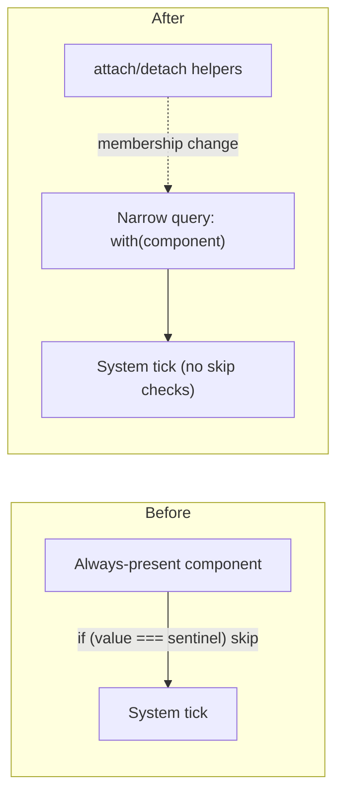

# Component-Presence Behavior Gating Refactor

## Architecture

### Principle

> A component exists on an entity if-and-only-if a system should process that entity for the behavior the component represents.
> Skip is expressed by **non-membership in the system's query**, never by `if (value === sentinel) continue` inside the loop body.

The codebase already follows this for `hasKnockback`, the eight status-effect markers (`hasDot`, `hasChill`, `hasFrozen`, `hasConflagration`, `hasDetonation`, `hasHemorrhage`, `hasEntropy`, `hasAshbrandBurn`), `scriptsBoss`, and the six archetype slices (`usesCadence`, `usesEnergy`, `appliesDots`, `chillsTarget`, `usesCooldown`, `usesReload`). This refactor finishes the pattern in seven more places where "behavior off" is currently a sentinel value on an always-present component.



### Project invariants this plan preserves

- **Server is authoritative** — every change is server-side; client renders snapshots unchanged.
- **Wire DTOs are byte-identical** — `assemble*Snapshot` reconstitutes sentinel values from absent components; `decompose*Snapshot` attaches a component only when the wire field is non-sentinel. `diffPlayerRoundTrip` / `diffMonsterRoundTrip` continue to pass on boot.
- **Marker components own the iteration story** — already the rule for status effects (per [.cursor/design/status.md](/Users/alexandermelton/ammelto/fun/MMOidleProject/.cursor/design/status.md)); now extended to lifecycle/state markers.
- **Component shapes live in `shared/src/components/`** — pure types only, no server imports.
- **Miniplex query membership requires `world.ecs.addComponent` / `removeComponent`** — never assign to or delete the property directly, or queries drift from reality.

### Inventory of sentinel-as-presence sites

| Current sentinel                                                                         | Primary call sites                                                                                                                                                                                                                                                                                                                                                                                                                                                                                                                                                                                                                                                                                             | Replacement component                                         |
| ---------------------------------------------------------------------------------------- | -------------------------------------------------------------------------------------------------------------------------------------------------------------------------------------------------------------------------------------------------------------------------------------------------------------------------------------------------------------------------------------------------------------------------------------------------------------------------------------------------------------------------------------------------------------------------------------------------------------------------------------------------------------------------------------------------------------- | ------------------------------------------------------------- |
| `isMoving.motion.magnitude === 0` (set via `zeroMotion()`)                               | [ai.ts](/Users/alexandermelton/ammelto/fun/MMOidleProject/server/src/systems/ai.ts), [movement.ts](/Users/alexandermelton/ammelto/fun/MMOidleProject/server/src/systems/movement.ts), [autoTarget.ts](/Users/alexandermelton/ammelto/fun/MMOidleProject/server/src/systems/autoTarget.ts), [knockback.ts](/Users/alexandermelton/ammelto/fun/MMOidleProject/server/src/systems/knockback.ts), [transitions.ts](/Users/alexandermelton/ammelto/fun/MMOidleProject/server/src/systems/transitions.ts), [spawning/index.ts](/Users/alexandermelton/ammelto/fun/MMOidleProject/server/src/systems/spawning/index.ts), [server/src/index.ts](/Users/alexandermelton/ammelto/fun/MMOidleProject/server/src/index.ts) | `isMoving` becomes optional; absence = stationary             |
| `controlsMonster.aggroTargetId === null`                                                 | [ai.ts](/Users/alexandermelton/ammelto/fun/MMOidleProject/server/src/systems/ai.ts), [combat.ts](/Users/alexandermelton/ammelto/fun/MMOidleProject/server/src/systems/combat.ts), [bossScripts.ts](/Users/alexandermelton/ammelto/fun/MMOidleProject/server/src/systems/bossScripts.ts), [classes/reload/reloadT3.ts](/Users/alexandermelton/ammelto/fun/MMOidleProject/server/src/systems/classes/reload/reloadT3.ts), [spawning/index.ts](/Users/alexandermelton/ammelto/fun/MMOidleProject/server/src/systems/spawning/index.ts), [server/src/index.ts](/Users/alexandermelton/ammelto/fun/MMOidleProject/server/src/index.ts)                                                                              | New `hasAggroTarget` component                                |
| `performsAttack.attackTargetId === null`                                                 | [combat.ts](/Users/alexandermelton/ammelto/fun/MMOidleProject/server/src/systems/combat.ts), [defenseSystems.ts](/Users/alexandermelton/ammelto/fun/MMOidleProject/server/src/systems/defenseSystems.ts), [classes/cooldown/cooldownT3.ts](/Users/alexandermelton/ammelto/fun/MMOidleProject/server/src/systems/classes/cooldown/cooldownT3.ts), [classes/dot/dotT3.ts](/Users/alexandermelton/ammelto/fun/MMOidleProject/server/src/systems/classes/dot/dotT3.ts), [classes/energy/energyT3.ts](/Users/alexandermelton/ammelto/fun/MMOidleProject/server/src/systems/classes/energy/energyT3.ts), [buffSync.ts](/Users/alexandermelton/ammelto/fun/MMOidleProject/server/src/systems/buffSync.ts)             | New `hasAttackTarget` component                               |
| `hasHealth.shields` length 0 / undefined                                                 | [defenseSystems.ts](/Users/alexandermelton/ammelto/fun/MMOidleProject/server/src/systems/defenseSystems.ts)                                                                                                                                                                                                                                                                                                                                                                                                                                                                                                                                                                                                    | New `holdsShields` component                                  |
| `evadesHits.threshold <= 0`                                                              | [defenseSystems.ts](/Users/alexandermelton/ammelto/fun/MMOidleProject/server/src/systems/defenseSystems.ts)                                                                                                                                                                                                                                                                                                                                                                                                                                                                                                                                                                                                    | `evadesHits` becomes optional                                 |
| `tracksEngagement === 0`                                                                 | [combat.ts](/Users/alexandermelton/ammelto/fun/MMOidleProject/server/src/systems/combat.ts), [defenseSystems.ts](/Users/alexandermelton/ammelto/fun/MMOidleProject/server/src/systems/defenseSystems.ts)                                                                                                                                                                                                                                                                                                                                                                                                                                                                                                       | `tracksEngagement` becomes optional                           |
| `scriptsBoss.engaged === false`                                                          | [bossScripts.ts](/Users/alexandermelton/ammelto/fun/MMOidleProject/server/src/systems/bossScripts.ts)                                                                                                                                                                                                                                                                                                                                                                                                                                                                                                                                                                                                          | New `isBossEngaged` marker                                    |
| `tracksCombat.flags.empoweredAttack === true`                                            | [empoweredAttacks.ts](/Users/alexandermelton/ammelto/fun/MMOidleProject/server/src/systems/empoweredAttacks.ts) + every archetype                                                                                                                                                                                                                                                                                                                                                                                                                                                                                                                                                                              | New `hasEmpoweredAttack` marker                               |
| `usesCooldown.isChanneling` / `odActive` / `alActive`                                    | [classes/cooldown/cooldownT3.ts](/Users/alexandermelton/ammelto/fun/MMOidleProject/server/src/systems/classes/cooldown/cooldownT3.ts), [movement.ts](/Users/alexandermelton/ammelto/fun/MMOidleProject/server/src/systems/movement.ts), [combat.ts](/Users/alexandermelton/ammelto/fun/MMOidleProject/server/src/systems/combat.ts)                                                                                                                                                                                                                                                                                                                                                                            | New `isChanneling`, `hasOverdrive`, `hasAlignment` components |
| `usesEnergy.acChargePhase` / `acSpeedActive` / `acDischargeMs > 0`                       | [classes/energy/energyT3.ts](/Users/alexandermelton/ammelto/fun/MMOidleProject/server/src/systems/classes/energy/energyT3.ts)                                                                                                                                                                                                                                                                                                                                                                                                                                                                                                                                                                                  | New `inAcChargePhase`, `inAcDischarge` components             |
| `usesCadence.empoweredArmed`, `usesCooldown.executionReady`, `usesEnergy.empoweredReady` | wire mirrors only                                                                                                                                                                                                                                                                                                                                                                                                                                                                                                                                                                                                                                                                                              | Derived from `hasEmpoweredAttack` at projection time          |

## Code Architecture (walkthrough)

Read this section top-to-bottom: each step depends on the previous one. The **File index** at the end is the single canonical list of every path this plan touches. Steps map 1:1 to phases in the `todos` frontmatter (Phase N ⇔ Step N+1; Step 1 is Phase 0 foundations).

### Step 1 — Foundations: attach/detach helpers and invariant scaffolding

**Goal:** Provide idempotent helpers used by every subsequent step, and extend the dev-boot invariant check so each new marker has a paired assertion the moment it ships.

| File                                                                                                                       | Symbol                                      | Action | Summary                                                                                                                                                                    |
| -------------------------------------------------------------------------------------------------------------------------- | ------------------------------------------- | ------ | -------------------------------------------------------------------------------------------------------------------------------------------------------------------------- |
| [server/src/ecs/componentHelpers.ts](/Users/alexandermelton/ammelto/fun/MMOidleProject/server/src/ecs/componentHelpers.ts) | `attachComponent`, `detachComponent`        | add    | New file. Idempotent generic wrappers around miniplex `addComponent` / `removeComponent`; used by every later step for any component (markers, slices, lifecycle state).   |
| [server/src/ecs/markerHelpers.ts](/Users/alexandermelton/ammelto/fun/MMOidleProject/server/src/ecs/markerHelpers.ts)       | `MarkerKey`, `attachMarker`, `detachMarker` | modify | Reimplement as thin wrappers around `attachComponent(world, e, key, MARKER)` / `detachComponent`. `MarkerKey` union and existing `detachMarkerIfNoEffect(s)` helpers stay. |
| [server/src/ecs/markerInvariants.ts](/Users/alexandermelton/ammelto/fun/MMOidleProject/server/src/ecs/markerInvariants.ts) | `MarkerCheck`, `assertMarkerInvariants`     | modify | Generalize to accept a `predicate(entity)` check rather than only status-effect parity; existing status checks become predicate instances.                                 |
| [server/src/index.ts](/Users/alexandermelton/ammelto/fun/MMOidleProject/server/src/index.ts)                               | dev-boot block                              | modify | Already calls `assertMarkerInvariants`; no signature change. Confirm the existing log line wording stays the same.                                                         |

**Helper signatures (new file [server/src/ecs/componentHelpers.ts](/Users/alexandermelton/ammelto/fun/MMOidleProject/server/src/ecs/componentHelpers.ts)):**

```ts
import type { ServerEntity } from "./entity";
import type { World } from "../world/World";

/**
 * Attach `value` under `key` on `entity`, or mutate in-place if already present.
 * Idempotent — never throws miniplex "component already exists".
 *
 * Use for ANY component (markers, slice components, lifecycle state). Marker-
 * specific helpers in `./markerHelpers` are thin wrappers over this.
 */
export function attachComponent<K extends keyof ServerEntity>(
  world: World,
  entity: ServerEntity,
  key: K,
  value: NonNullable<ServerEntity[K]>,
): void {
  if (entity[key] !== undefined) {
    entity[key] = value;
  } else {
    world.ecs.addComponent(entity, key, value);
  }
}

/** Detach the component if present; no-op otherwise. */
export function detachComponent<K extends keyof ServerEntity>(
  world: World,
  entity: ServerEntity,
  key: K,
): void {
  if (entity[key] !== undefined) {
    world.ecs.removeComponent(entity, key);
  }
}
```

**Marker helpers rewrite (modifying [server/src/ecs/markerHelpers.ts](/Users/alexandermelton/ammelto/fun/MMOidleProject/server/src/ecs/markerHelpers.ts)):**

```ts
import type { ServerEntity } from "./entity";
import type { World } from "../world/World";
import type { CombatState } from "../systems/combatState";
import { getStatusEffect, getStatusEffects } from "@mmo-idle/shared";
import { attachComponent, detachComponent } from "./componentHelpers";

const MARKER = {};

type MarkerKey =
  | "hasDetonation"
  | "hasHemorrhage"
  | "hasDot"
  | "hasConflagration"
  | "hasChill"
  | "hasFrozen"
  | "hasEntropy"
  | "hasAshbrandBurn";

export function attachMarker(
  world: World,
  entity: ServerEntity,
  key: MarkerKey,
): void {
  attachComponent(world, entity, key, MARKER);
}

export function detachMarker(
  world: World,
  entity: ServerEntity,
  key: MarkerKey,
): void {
  detachComponent(world, entity, key);
}

// detachMarkerIfNoEffect / detachMarkerIfNoEffects unchanged — they call
// detachComponent under the hood via detachMarker.
```

**Generalized invariant check (modifying [server/src/ecs/markerInvariants.ts](/Users/alexandermelton/ammelto/fun/MMOidleProject/server/src/ecs/markerInvariants.ts)):**

```ts
interface MarkerCheck {
  marker: keyof ServerEntity;
  /** Predicate that returns true when the marker's underlying behavior is "on". */
  shouldBePresent: (entity: ServerEntity, world: World) => boolean;
  /** Human label for the violation log. */
  label: string;
}
// Existing status-effect checks become:
//   { marker: 'hasDot', shouldBePresent: (e) => hasEffect(e.tracksCombat, 'dot'), label: 'dot' }
// New behavior-gate checks added in Steps 2–7 plug in the same way.
```

- **Invariants**:
  - `attachComponent` must NOT call `world.ecs.addComponent` when the property is already set — miniplex throws on duplicate add. The `entity[key] !== undefined` guard is load-bearing.
  - All later phases call `attachComponent` / `detachComponent` ONLY through `componentHelpers.ts` so any future change to miniplex membership semantics has one seam.

**Smoke test:** server boots; `[marker-invariants] Marker components OK` log still printed; existing status-marker tests still pass.

---

### Step 2 — `IsMoving` as presence-gated

**Goal:** Implement the canonical case from your example. `isMoving` exists iff `motion.magnitude > 0`. Stationary entities are absent from the movement query entirely; stopping = removing the component; resuming = re-attaching it.

| File                                                                                                                           | Symbol                                                                                                     | Action      | Summary                                                                                                                                          |
| ------------------------------------------------------------------------------------------------------------------------------ | ---------------------------------------------------------------------------------------------------------- | ----------- | ------------------------------------------------------------------------------------------------------------------------------------------------ |
| [server/src/ecs/components/player.ts](/Users/alexandermelton/ammelto/fun/MMOidleProject/server/src/ecs/components/player.ts)   | `PlayerEntity`                                                                                             | modify      | Drop `'isMoving'` from `With<>` union.                                                                                                           |
| [server/src/ecs/components/monster.ts](/Users/alexandermelton/ammelto/fun/MMOidleProject/server/src/ecs/components/monster.ts) | `MonsterEntity`                                                                                            | modify      | Drop `'isMoving'` from `With<>` union.                                                                                                           |
| [server/src/world/World.ts](/Users/alexandermelton/ammelto/fun/MMOidleProject/server/src/world/World.ts)                       | `playerEntities`, `monsterEntities`, `movingPlayers`, `movingMonsters`                                     | modify, add | Drop `'isMoving'` from the two main queries; add two narrow queries.                                                                             |
| [server/src/systems/movement.ts](/Users/alexandermelton/ammelto/fun/MMOidleProject/server/src/systems/movement.ts)             | `setEntityMotion`, `stopEntity`, `updateMovement`                                                          | add, modify | Export the two helpers; `updateMovement` iterates `world.movingPlayers` / `world.movingMonsters` and detaches when `advanceMotion` returns zero. |
| [server/src/systems/ai.ts](/Users/alexandermelton/ammelto/fun/MMOidleProject/server/src/systems/ai.ts)                         | `setMonsterTarget`, `stopMonster`, `updateMonsters`                                                        | modify      | Replace bodies with `setEntityMotion` / `stopEntity`.                                                                                            |
| [server/src/systems/autoTarget.ts](/Users/alexandermelton/ammelto/fun/MMOidleProject/server/src/systems/autoTarget.ts)         | `updateAutoTargets`                                                                                        | modify      | Hold-fire branches call `stopEntity`; chase branches call `setEntityMotion`.                                                                     |
| [server/src/systems/knockback.ts](/Users/alexandermelton/ammelto/fun/MMOidleProject/server/src/systems/knockback.ts)           | `applyKnockback`, `updateKnockback`                                                                        | modify      | Replace `entity.isMoving.motion = zeroMotion()` with `stopEntity(world, entity)`.                                                                |
| [server/src/systems/transitions.ts](/Users/alexandermelton/ammelto/fun/MMOidleProject/server/src/systems/transitions.ts)       | `updateTransitions`                                                                                        | modify      | Wall clamp uses `setEntityMotion`; border crossing uses `stopEntity`.                                                                            |
| [server/src/systems/spawning/index.ts](/Users/alexandermelton/ammelto/fun/MMOidleProject/server/src/systems/spawning/index.ts) | `respawnPlayer`, `createMonster`                                                                           | modify      | `respawnPlayer` calls `stopEntity`; `createMonster` does NOT stamp `isMoving` (decompose handles it).                                            |
| [server/src/index.ts](/Users/alexandermelton/ammelto/fun/MMOidleProject/server/src/index.ts)                                   | `player:move`, `debug:goToTestRoom`                                                                        | modify      | Move handler uses `setEntityMotion`; teleport uses `stopEntity`.                                                                                 |
| [server/src/ecs/projection.ts](/Users/alexandermelton/ammelto/fun/MMOidleProject/server/src/ecs/projection.ts)                 | `decomposePlayerSnapshot`, `decomposeMonsterSnapshot`, `assemblePlayerSnapshot`, `assembleMonsterSnapshot` | modify      | Decompose attaches `isMoving` only when `motion.magnitude > 0`. Assemble emits `targetX = current.x, targetY = current.y` when absent.           |
| [server/src/ecs/markerInvariants.ts](/Users/alexandermelton/ammelto/fun/MMOidleProject/server/src/ecs/markerInvariants.ts)     | `MOVING_CHECK`                                                                                             | add         | `{ marker: 'isMoving', shouldBePresent: (e) => (e.isMoving?.motion.magnitude ?? 0) > 0, label: 'moving' }`.                                      |

**New helpers (signatures in [server/src/systems/movement.ts](/Users/alexandermelton/ammelto/fun/MMOidleProject/server/src/systems/movement.ts)):**

```ts
import { vectorTo, type Vec2 } from "@mmo-idle/shared";
import { attachComponent, detachComponent } from "../ecs/componentHelpers";
import type { ServerEntity } from "../ecs/entity";
import type { World } from "../world/World";

type Movable = ServerEntity & {
  hasPosition: NonNullable<ServerEntity["hasPosition"]>;
};

/** Aim entity toward `target`. Attaches `isMoving` if needed; detaches if magnitude resolves to 0. */
export function setEntityMotion(
  world: World,
  entity: Movable,
  target: Vec2,
): void {
  const motion = vectorTo(entity.hasPosition.current, target);
  if (motion.magnitude > 0) {
    attachComponent(world, entity, "isMoving", { motion });
  } else {
    detachComponent(world, entity, "isMoving");
  }
}

/** Stop the entity in place. Detaches `isMoving` if present. */
export function stopEntity(world: World, entity: ServerEntity): void {
  detachComponent(world, entity, "isMoving");
}
```

**`updateMovement` body shape (replacing the existing implementation in [server/src/systems/movement.ts](/Users/alexandermelton/ammelto/fun/MMOidleProject/server/src/systems/movement.ts)):**

```ts
export function updateMovement(world: World, dt: number): void {
  for (const entity of world.movingPlayers) {
    if (entity.isChanneling !== undefined) {
      // see Step 6
      detachComponent(world, entity, "isMoving");
      continue;
    }
    const next = advanceMotion(
      entity.hasPosition.current,
      entity.isMoving.motion,
      entity.hasPosition.speed * (dt / 1000),
    );
    entity.hasPosition.current = next.position;
    if (next.motion.magnitude > 0) {
      entity.isMoving.motion = next.motion;
    } else {
      detachComponent(world, entity, "isMoving");
    }
  }
  for (const e of world.movingMonsters) {
    const next = advanceMotion(
      e.hasPosition.current,
      e.isMoving.motion,
      e.hasPosition.speed * (dt / 1000),
    );
    e.hasPosition.current = next.position;
    if (next.motion.magnitude > 0) {
      e.isMoving.motion = next.motion;
    } else {
      detachComponent(world, e, "isMoving");
    }
    clampMonsterToNode(e); // existing logic, factored out
  }
}
```

**Wire projection (`assembleMonsterSnapshot` excerpt in [server/src/ecs/projection.ts](/Users/alexandermelton/ammelto/fun/MMOidleProject/server/src/ecs/projection.ts)):**

```ts
const target = entity.isMoving
  ? pointFromMotion(entity.hasPosition.current, entity.isMoving.motion)
  : entity.hasPosition.current;
// ... targetX: target.x, targetY: target.y, ...
```

**Decompose excerpt:**

```ts
const current = { x: snapshot.x, y: snapshot.y };
const target = { x: snapshot.targetX, y: snapshot.targetY };
const motion = vectorTo(current, target);
const stamp: PlayerSliceStamp = {
  /* …other slices… */
};
if (motion.magnitude > 0) stamp.isMoving = { motion };
return stamp;
```

- **Ordering note**: `updateKnockback` must still run BEFORE `updateMovement` (current order is preserved); knockback writes position directly and the entity has no `isMoving` for its duration.
- **Invariant**: after this step, the existence of `isMoving` on a player entity implies movement systems will advance position next tick. No system reads `isMoving.motion.magnitude === 0` anymore.

**Smoke test:** spawn a fresh server — every idle monster appears in `world.monsterEntities` but NOT in `world.movingMonsters`. Walk, fight, knockback, channel beam, respawn. `[wire-parity]` and `[marker-invariants]` both pass.

---

### Step 3 — Optional player feature slices: `holdsShields`, `evadesHits`, `tracksEngagement`

**Goal:** Three independent player slices that disappear when the feature is dormant. `evadesHits` and `tracksEngagement` are already optional on `ServerEntity`; they're only required by the `PlayerEntity` `With<>` union. Shields move out of `HasHealth` into their own component.

| File                                                                                                                                                                                                                                                                                                                                                                                                                                                              | Symbol                                                                  | Action      | Summary                                                                                                                                               |
| ----------------------------------------------------------------------------------------------------------------------------------------------------------------------------------------------------------------------------------------------------------------------------------------------------------------------------------------------------------------------------------------------------------------------------------------------------------------- | ----------------------------------------------------------------------- | ----------- | ----------------------------------------------------------------------------------------------------------------------------------------------------- |
| [shared/src/components/holdsShields.ts](/Users/alexandermelton/ammelto/fun/MMOidleProject/shared/src/components/holdsShields.ts)                                                                                                                                                                                                                                                                                                                                  | `HoldsShields`                                                          | add         | New file: `export interface HoldsShields { shields: ShieldState[]; }`.                                                                                |
| [shared/src/components/index.ts](/Users/alexandermelton/ammelto/fun/MMOidleProject/shared/src/components/index.ts)                                                                                                                                                                                                                                                                                                                                                | barrel                                                                  | modify      | Re-export `holdsShields`.                                                                                                                             |
| [shared/src/components/snapshotSlices.ts](/Users/alexandermelton/ammelto/fun/MMOidleProject/shared/src/components/snapshotSlices.ts)                                                                                                                                                                                                                                                                                                                              | `HasHealth`                                                             | modify      | Remove `shields?: ShieldState[]`.                                                                                                                     |
| [server/src/ecs/entity.ts](/Users/alexandermelton/ammelto/fun/MMOidleProject/server/src/ecs/entity.ts)                                                                                                                                                                                                                                                                                                                                                            | `ServerEntity`                                                          | modify      | Add `holdsShields?: HoldsShields`.                                                                                                                    |
| [server/src/ecs/components/player.ts](/Users/alexandermelton/ammelto/fun/MMOidleProject/server/src/ecs/components/player.ts)                                                                                                                                                                                                                                                                                                                                      | `PlayerEntity`                                                          | modify      | Drop `'evadesHits'` and `'tracksEngagement'` from `With<>`.                                                                                           |
| [server/src/world/World.ts](/Users/alexandermelton/ammelto/fun/MMOidleProject/server/src/world/World.ts)                                                                                                                                                                                                                                                                                                                                                          | `playerEntities`, `shieldedPlayers`, `evasivePlayers`, `engagedPlayers` | modify, add | Drop `'evadesHits'` and `'tracksEngagement'` from the main player query; add three narrow queries.                                                    |
| [server/src/systems/defenseSystems.ts](/Users/alexandermelton/ammelto/fun/MMOidleProject/server/src/systems/defenseSystems.ts)                                                                                                                                                                                                                                                                                                                                    | `applyShield`, `updateShields`, evasion listener, in-combat regen       | modify      | Iterate narrow queries; attach `holdsShields` on apply, detach when empty; remove `threshold <= 0` early-out.                                         |
| [server/src/ecs/playerSnapshotAdapter.ts](/Users/alexandermelton/ammelto/fun/MMOidleProject/server/src/ecs/playerSnapshotAdapter.ts)                                                                                                                                                                                                                                                                                                                              | `recalculatePlayerEntityStats` (post-pass)                              | modify      | After stats recalc: if `passives['defense.evasion-threshold']` resolves to 0, `detachComponent('evadesHits')`; otherwise attach/refresh.              |
| [server/src/ecs/projection.ts](/Users/alexandermelton/ammelto/fun/MMOidleProject/server/src/ecs/projection.ts)                                                                                                                                                                                                                                                                                                                                                    | `decomposePlayerSnapshot`, `assemblePlayerSnapshot`                     | modify      | Attach `holdsShields` / `evadesHits` only when wire value is non-sentinel; assemble emits `shields: []`, `evasion: 0`, `evasionCount: 0` when absent. |
| [server/src/systems/spawning/index.ts](/Users/alexandermelton/ammelto/fun/MMOidleProject/server/src/systems/spawning/index.ts)                                                                                                                                                                                                                                                                                                                                    | `respawnPlayer`                                                         | modify      | `detachComponent('holdsShields')`, `detachComponent('tracksEngagement')` instead of zeroing.                                                          |
| Engagement call sites: [combat.ts](/Users/alexandermelton/ammelto/fun/MMOidleProject/server/src/systems/combat.ts), [defenseSystems.ts](/Users/alexandermelton/ammelto/fun/MMOidleProject/server/src/systems/defenseSystems.ts), [aoeDamage.ts](/Users/alexandermelton/ammelto/fun/MMOidleProject/server/src/systems/aoeDamage.ts), [classes/reload/reloadT3.ts](/Users/alexandermelton/ammelto/fun/MMOidleProject/server/src/systems/classes/reload/reloadT3.ts) | `markEngaged` helper                                                    | modify      | Replace `entity.tracksEngagement = now` with `attachComponent(world, entity, 'tracksEngagement', now)`.                                               |
| [server/src/ecs/markerInvariants.ts](/Users/alexandermelton/ammelto/fun/MMOidleProject/server/src/ecs/markerInvariants.ts)                                                                                                                                                                                                                                                                                                                                        | new checks                                                              | add         | `holdsShields` ⇔ array non-empty; `evadesHits` ⇔ threshold > 0.                                                                                       |

**New shared component (full file [shared/src/components/holdsShields.ts](/Users/alexandermelton/ammelto/fun/MMOidleProject/shared/src/components/holdsShields.ts)):**

```ts
import type { ShieldState } from "../types/combat";

/**
 * Present iff the player has at least one active shield.
 * `updateShields` detaches the component when all shields expire.
 */
export interface HoldsShields {
  shields: ShieldState[];
}
```

**`applyShield` rewrite (in [server/src/systems/defenseSystems.ts](/Users/alexandermelton/ammelto/fun/MMOidleProject/server/src/systems/defenseSystems.ts)):**

```ts
export function applyShield(
  world: World,
  player: PlayerEntity,
  amount: number,
  durationMs: number,
): void {
  if (amount <= 0) return;
  const shield = {
    amount,
    maxAmount: amount,
    remainingMs: durationMs > 0 ? durationMs : -1,
  };
  if (player.holdsShields) {
    player.holdsShields.shields.push(shield);
  } else {
    attachComponent(world, player, "holdsShields", { shields: [shield] });
  }
}
```

**`updateShields` rewrite:**

```ts
export function updateShields(world: World, dt: number): void {
  for (const player of world.shieldedPlayers) {
    const arr = player.holdsShields.shields;
    for (const s of arr) {
      if (s.remainingMs > 0) s.remainingMs = Math.max(0, s.remainingMs - dt);
    }
    const surviving = arr.filter(
      (s) => s.amount > 0 && (s.remainingMs === -1 || s.remainingMs > 0),
    );
    if (surviving.length === 0) detachComponent(world, player, "holdsShields");
    else player.holdsShields.shields = surviving;
  }
}
```

**Engagement helper (in a new [server/src/systems/engagement.ts](/Users/alexandermelton/ammelto/fun/MMOidleProject/server/src/systems/engagement.ts) so call sites share one seam):**

```ts
import { attachComponent } from "../ecs/componentHelpers";
import type { PlayerEntity } from "../ecs/components/player";
import type { World } from "../world/World";

export function markEngaged(
  world: World,
  player: PlayerEntity,
  now: number,
): void {
  attachComponent(world, player, "tracksEngagement", now);
}
```

- **Invariant**: OOC regen in [combat.ts](/Users/alexandermelton/ammelto/fun/MMOidleProject/server/src/systems/combat.ts) becomes `if (player.tracksEngagement === undefined || now - player.tracksEngagement > DELAY) regen()`. Absence and "long enough ago" both mean "regen runs".

**Smoke test:** equip a recovery item that fires periodic shields — observe `world.shieldedPlayers` membership oscillate; unequip → component detaches; equip an evasion-passive node → `world.evasivePlayers` includes the player; remove it → drops out.

---

### Step 4 — Aggro and attack targets as components

**Goal:** Extract two ID fields that gate the most cross-system behavior into their own components, then strip them off the composite slices.

#### A. `hasAggroTarget` (monster-only)

| File                                                                                                                                             | Symbol                                            | Action | Summary                                                                                                                                |
| ------------------------------------------------------------------------------------------------------------------------------------------------ | ------------------------------------------------- | ------ | -------------------------------------------------------------------------------------------------------------------------------------- |
| [shared/src/components/hasAggroTarget.ts](/Users/alexandermelton/ammelto/fun/MMOidleProject/shared/src/components/hasAggroTarget.ts)             | `HasAggroTarget`                                  | add    | New file: `{ playerId: string; lastAggroAt: number; sinceMs: number; }`.                                                               |
| [shared/src/components/index.ts](/Users/alexandermelton/ammelto/fun/MMOidleProject/shared/src/components/index.ts)                               | barrel                                            | modify | Re-export.                                                                                                                             |
| [shared/src/components/controlsMonster.ts](/Users/alexandermelton/ammelto/fun/MMOidleProject/shared/src/components/controlsMonster.ts)           | `ControlsMonster`                                 | modify | Remove `aggroTargetId`, `lastAggroAt`.                                                                                                 |
| [server/src/ecs/entity.ts](/Users/alexandermelton/ammelto/fun/MMOidleProject/server/src/ecs/entity.ts)                                           | `ServerEntity`                                    | modify | Add `hasAggroTarget?: HasAggroTarget`.                                                                                                 |
| [server/src/world/World.ts](/Users/alexandermelton/ammelto/fun/MMOidleProject/server/src/world/World.ts)                                         | `aggroedMonsters`, `idleMonsters`                 | add    | Two narrow queries (`.with('hasAggroTarget')` / `.without('hasAggroTarget')`).                                                         |
| [server/src/systems/ai.ts](/Users/alexandermelton/ammelto/fun/MMOidleProject/server/src/systems/ai.ts)                                           | `updateMonsters`, `findAggro`                     | modify | Aggro acquisition iterates `world.idleMonsters`; aggro retention/leash iterates `world.aggroedMonsters`.                               |
| [server/src/systems/combat.ts](/Users/alexandermelton/ammelto/fun/MMOidleProject/server/src/systems/combat.ts)                                   | retaliation aggro, monster→player loop, OOC regen | modify | Attach `hasAggroTarget` on retaliation; monster→player loop iterates `world.aggroedMonsters`; OOC regen iterates `world.idleMonsters`. |
| [server/src/systems/bossScripts.ts](/Users/alexandermelton/ammelto/fun/MMOidleProject/server/src/systems/bossScripts.ts)                         | `updateBossScripts`                               | modify | Engagement detection reads `entity.hasAggroTarget !== undefined`.                                                                      |
| [server/src/systems/classes/reload/reloadT3.ts](/Users/alexandermelton/ammelto/fun/MMOidleProject/server/src/systems/classes/reload/reloadT3.ts) | death-mark detonation retaliation                 | modify | Attach `hasAggroTarget` via helper, drop direct `ai.aggroTargetId` assignment.                                                         |
| [server/src/systems/spawning/index.ts](/Users/alexandermelton/ammelto/fun/MMOidleProject/server/src/systems/spawning/index.ts)                   | `respawnPlayer` aggro-drop loop                   | modify | `detachComponent` over `aggroedMonsters` whose `playerId === playerId`.                                                                |
| [server/src/index.ts](/Users/alexandermelton/ammelto/fun/MMOidleProject/server/src/index.ts)                                                     | `debug:goToTestRoom` aggro-drop loop              | modify | Same pattern.                                                                                                                          |

#### B. `hasAttackTarget` (players + monsters)

| File                                                                                                                                                     | Symbol                                            | Action | Summary                                                                                                                 |
| -------------------------------------------------------------------------------------------------------------------------------------------------------- | ------------------------------------------------- | ------ | ----------------------------------------------------------------------------------------------------------------------- |
| [shared/src/components/hasAttackTarget.ts](/Users/alexandermelton/ammelto/fun/MMOidleProject/shared/src/components/hasAttackTarget.ts)                   | `HasAttackTarget`                                 | add    | `{ targetId: string; }`.                                                                                                |
| [shared/src/components/snapshotSlices.ts](/Users/alexandermelton/ammelto/fun/MMOidleProject/shared/src/components/snapshotSlices.ts)                     | `PerformsAttack`                                  | modify | Remove `attackTargetId`.                                                                                                |
| [server/src/ecs/entity.ts](/Users/alexandermelton/ammelto/fun/MMOidleProject/server/src/ecs/entity.ts)                                                   | `ServerEntity`                                    | modify | Add `hasAttackTarget?: HasAttackTarget`.                                                                                |
| [server/src/world/World.ts](/Users/alexandermelton/ammelto/fun/MMOidleProject/server/src/world/World.ts)                                                 | `attackingPlayers`, `attackingMonsters`           | add    | Two narrow queries.                                                                                                     |
| [server/src/systems/combat.ts](/Users/alexandermelton/ammelto/fun/MMOidleProject/server/src/systems/combat.ts)                                           | target acquisition (both directions)              | modify | Attach when found / detach when not, using helpers below.                                                               |
| [server/src/systems/defenseSystems.ts](/Users/alexandermelton/ammelto/fun/MMOidleProject/server/src/systems/defenseSystems.ts)                           | in-combat regen, "inCombat" check                 | modify | Read `player.hasAttackTarget !== undefined` instead of `!== null`.                                                      |
| [server/src/systems/classes/cooldown/cooldownT3.ts](/Users/alexandermelton/ammelto/fun/MMOidleProject/server/src/systems/classes/cooldown/cooldownT3.ts) | `updateSingularExtraction`, `updateChanneledBeam` | modify | Singular iterates `world.cooldownPlayers.without('hasAttackTarget')`; beam reacquisition uses `hasAttackTarget` attach. |
| [server/src/systems/classes/dot/dotT3.ts](/Users/alexandermelton/ammelto/fun/MMOidleProject/server/src/systems/classes/dot/dotT3.ts)                     | `mirrorDotT3PlayerSnapshot`                       | modify | Read `entity.hasAttackTarget?.targetId`.                                                                                |
| [server/src/systems/classes/energy/energyT3.ts](/Users/alexandermelton/ammelto/fun/MMOidleProject/server/src/systems/classes/energy/energyT3.ts)         | `updateAlternatingCurrents`                       | modify | Same.                                                                                                                   |
| [server/src/systems/buffSync.ts](/Users/alexandermelton/ammelto/fun/MMOidleProject/server/src/systems/buffSync.ts)                                       | per-player buff projection                        | modify | Same.                                                                                                                   |
| [server/src/systems/knockback.ts](/Users/alexandermelton/ammelto/fun/MMOidleProject/server/src/systems/knockback.ts)                                     | `applyKnockback`                                  | modify | `detachComponent('hasAttackTarget')` instead of `attackTargetId = null`.                                                |
| [server/src/systems/ai.ts](/Users/alexandermelton/ammelto/fun/MMOidleProject/server/src/systems/ai.ts)                                                   | attack target assignment in chase/attack branches | modify | Attach / detach via helpers.                                                                                            |
| [server/src/ecs/projection.ts](/Users/alexandermelton/ammelto/fun/MMOidleProject/server/src/ecs/projection.ts)                                           | assemble/decompose for both player + monster      | modify | Wire `attackTargetId: hasAttackTarget?.targetId ?? null`; decompose attaches when non-null.                             |

#### C. Helpers + ergonomics

**New helpers (in [server/src/systems/targeting.ts](/Users/alexandermelton/ammelto/fun/MMOidleProject/server/src/systems/targeting.ts) — co-located so callers share one seam):**

```ts
import { attachComponent, detachComponent } from "../ecs/componentHelpers";
import type { ServerEntity } from "../ecs/entity";
import type { MonsterEntity } from "../ecs/components/monster";
import type { World } from "../world/World";

/** Idempotently set a monster's aggro target; clears on null. */
export function setAggroTarget(
  world: World,
  monster: MonsterEntity,
  playerId: string | null,
  now: number,
): void {
  if (playerId === null) {
    detachComponent(world, monster, "hasAggroTarget");
    return;
  }
  const existing = monster.hasAggroTarget;
  attachComponent(world, monster, "hasAggroTarget", {
    playerId,
    lastAggroAt: now,
    sinceMs: existing?.sinceMs ?? now,
  });
}

/** Idempotently set any combatant's current attack target. */
export function setAttackTarget(
  world: World,
  entity: ServerEntity,
  targetId: string | null,
): void {
  if (targetId === null) detachComponent(world, entity, "hasAttackTarget");
  else attachComponent(world, entity, "hasAttackTarget", { targetId });
}
```

**Combat acquisition sketch (replacing the assignment in [server/src/systems/combat.ts](/Users/alexandermelton/ammelto/fun/MMOidleProject/server/src/systems/combat.ts)):**

```ts
let target: MonsterEntity | null = null;
let best = Infinity;
for (const m of world.monsterEntitiesInNode(player.hasPosition.nodeId)) {
  const dSq = distanceSq(m.hasPosition.current, player.hasPosition.current);
  if (dSq <= attackRangeSq && dSq < best) {
    best = dSq;
    target = m;
  }
}
setAttackTarget(world, player, target?.isMonster.id ?? null);
```

- **Invariants**:
  - Aggro: `findAggro` is the only thing that _creates_ a `hasAggroTarget`; `combat.ts` retaliation also creates one but only when none exists (preserving existing aggro-not-overwritten rule).
  - The `controlsMonster` slice on every monster keeps `lastAggroAt` semantics by storing it on the new `hasAggroTarget` and reading it from the OOC-regen path (`now - monster.controlsMonster.lastAggroAt < DELAY` → check the most recent detached state). Detail: monster OOC regen needs `lastAggroAt` to persist across the detach. Persist that one timestamp on `controlsMonster.lastAggroAt` (revert the strip for _just_ this field), so detach moves `playerId` only.
  - Updated `ControlsMonster` therefore keeps `lastAggroAt: number` but drops `aggroTargetId: string | null`. (Same shape as before, minus one field.)

**Smoke test:** aggro a monster → it joins `world.aggroedMonsters`; walk to a different node → component detaches; wait for OOC regen → monster heals; Singular Extraction resets the execution cycle after 4 s without a target.

---

### Step 5 — Boss engagement + empowered-attack markers

**Goal:** Two true marker components (no payload) that replace two boolean fields whose only job was "should this tick body run".

| File                                                                                                                                                                                                                                                                                                                                                                                                                                                                                                                                                                                                                                                                                                                                                                                                                                                               | Symbol                                                              | Action | Summary                                                                                                                                                                                                                                                |
| ------------------------------------------------------------------------------------------------------------------------------------------------------------------------------------------------------------------------------------------------------------------------------------------------------------------------------------------------------------------------------------------------------------------------------------------------------------------------------------------------------------------------------------------------------------------------------------------------------------------------------------------------------------------------------------------------------------------------------------------------------------------------------------------------------------------------------------------------------------------ | ------------------------------------------------------------------- | ------ | ------------------------------------------------------------------------------------------------------------------------------------------------------------------------------------------------------------------------------------------------------ |
| [shared/src/components/isBossEngaged.ts](/Users/alexandermelton/ammelto/fun/MMOidleProject/shared/src/components/isBossEngaged.ts)                                                                                                                                                                                                                                                                                                                                                                                                                                                                                                                                                                                                                                                                                                                                 | `IsBossEngaged`                                                     | add    | Empty marker: `export interface IsBossEngaged {}`.                                                                                                                                                                                                     |
| [shared/src/components/hasEmpoweredAttack.ts](/Users/alexandermelton/ammelto/fun/MMOidleProject/shared/src/components/hasEmpoweredAttack.ts)                                                                                                                                                                                                                                                                                                                                                                                                                                                                                                                                                                                                                                                                                                                       | `HasEmpoweredAttack`                                                | add    | Empty marker.                                                                                                                                                                                                                                          |
| [shared/src/components/index.ts](/Users/alexandermelton/ammelto/fun/MMOidleProject/shared/src/components/index.ts)                                                                                                                                                                                                                                                                                                                                                                                                                                                                                                                                                                                                                                                                                                                                                 | barrel                                                              | modify | Re-export both.                                                                                                                                                                                                                                        |
| [shared/src/components/scriptsBoss.ts](/Users/alexandermelton/ammelto/fun/MMOidleProject/shared/src/components/scriptsBoss.ts)                                                                                                                                                                                                                                                                                                                                                                                                                                                                                                                                                                                                                                                                                                                                     | `ScriptsBoss`                                                       | modify | Remove `engaged: boolean`. `initScriptsBoss` drops that init line.                                                                                                                                                                                     |
| [server/src/ecs/entity.ts](/Users/alexandermelton/ammelto/fun/MMOidleProject/server/src/ecs/entity.ts)                                                                                                                                                                                                                                                                                                                                                                                                                                                                                                                                                                                                                                                                                                                                                             | `ServerEntity`                                                      | modify | Add `isBossEngaged?` and `hasEmpoweredAttack?`.                                                                                                                                                                                                        |
| [server/src/world/World.ts](/Users/alexandermelton/ammelto/fun/MMOidleProject/server/src/world/World.ts)                                                                                                                                                                                                                                                                                                                                                                                                                                                                                                                                                                                                                                                                                                                                                           | `engagedBosses`                                                     | add    | `bossScriptedMonsters.with('isBossEngaged')`.                                                                                                                                                                                                          |
| [server/src/systems/bossScripts.ts](/Users/alexandermelton/ammelto/fun/MMOidleProject/server/src/systems/bossScripts.ts)                                                                                                                                                                                                                                                                                                                                                                                                                                                                                                                                                                                                                                                                                                                                           | `updateBossScripts`                                                 | modify | Effects tick over `bossScriptedMonsters`; phase/repeating tick over `engagedBosses`; attach `isBossEngaged` when `hasAggroTarget` first appears.                                                                                                       |
| [server/src/systems/empoweredAttacks.ts](/Users/alexandermelton/ammelto/fun/MMOidleProject/server/src/systems/empoweredAttacks.ts)                                                                                                                                                                                                                                                                                                                                                                                                                                                                                                                                                                                                                                                                                                                                 | `setEmpoweredAttack`, `isEmpoweredAttack`, `consumeEmpoweredAttack` | modify | Signatures change to take `(world, entity)`; replace `state.flags[EMPOWERED_FLAG]` reads/writes with `attachComponent` / `entity.hasEmpoweredAttack !== undefined` / `detachComponent`.                                                                |
| Every archetype caller: [classes/cadence/cadencePrototype.ts](/Users/alexandermelton/ammelto/fun/MMOidleProject/server/src/systems/classes/cadence/cadencePrototype.ts), [classes/cooldown/cooldownPrototype.ts](/Users/alexandermelton/ammelto/fun/MMOidleProject/server/src/systems/classes/cooldown/cooldownPrototype.ts), [classes/cooldown/cooldownT3.ts](/Users/alexandermelton/ammelto/fun/MMOidleProject/server/src/systems/classes/cooldown/cooldownT3.ts), [classes/dot/dotT3.ts](/Users/alexandermelton/ammelto/fun/MMOidleProject/server/src/systems/classes/dot/dotT3.ts), [classes/energy/energyPrototype.ts](/Users/alexandermelton/ammelto/fun/MMOidleProject/server/src/systems/classes/energy/energyPrototype.ts), [classes/energy/energyT3.ts](/Users/alexandermelton/ammelto/fun/MMOidleProject/server/src/systems/classes/energy/energyT3.ts) | `isEmpoweredAttack(state)` callers                                  | modify | Pass `entity` (or `ctx.attacker`) instead of `state`.                                                                                                                                                                                                  |
| [server/src/ecs/projection.ts](/Users/alexandermelton/ammelto/fun/MMOidleProject/server/src/ecs/projection.ts)                                                                                                                                                                                                                                                                                                                                                                                                                                                                                                                                                                                                                                                                                                                                                     | `assemblePlayerSnapshot`                                            | modify | `empoweredReady: entity.hasEmpoweredAttack !== undefined`, `cadenceEmpoweredArmed`: same, `executionReady`: same. Decompose attaches `hasEmpoweredAttack` only when any of the three flags is true (single attach, since they're all the same marker). |
| [shared/src/components/usesCadence.ts](/Users/alexandermelton/ammelto/fun/MMOidleProject/shared/src/components/usesCadence.ts), [shared/src/components/usesCooldown.ts](/Users/alexandermelton/ammelto/fun/MMOidleProject/shared/src/components/usesCooldown.ts), [shared/src/components/usesEnergy.ts](/Users/alexandermelton/ammelto/fun/MMOidleProject/shared/src/components/usesEnergy.ts)                                                                                                                                                                                                                                                                                                                                                                                                                                                                     | `empoweredArmed`, `executionReady`, `empoweredReady`                | remove | These fields are pure wire mirrors; deleted from the slices and computed at projection.                                                                                                                                                                |
| [server/src/systems/classes/cooldown/cooldownPrototype.ts](/Users/alexandermelton/ammelto/fun/MMOidleProject/server/src/systems/classes/cooldown/cooldownPrototype.ts)                                                                                                                                                                                                                                                                                                                                                                                                                                                                                                                                                                                                                                                                                             | `updateCooldownArchetype`                                           | modify | Stop mirroring `executionReady` (now derived); cycle still runs based on `executionCooldownMs`.                                                                                                                                                        |
| [server/src/ecs/markerInvariants.ts](/Users/alexandermelton/ammelto/fun/MMOidleProject/server/src/ecs/markerInvariants.ts)                                                                                                                                                                                                                                                                                                                                                                                                                                                                                                                                                                                                                                                                                                                                         | new checks                                                          | add    | `hasEmpoweredAttack` ⇔ no leftover `tracksCombat.flags.empoweredAttack`; `isBossEngaged` ⇔ `hasAggroTarget` was attached at least once (history bit).                                                                                                  |

**New `empoweredAttacks.ts` surface:**

```ts
import { attachComponent, detachComponent } from "./ecs/componentHelpers"; // adjust import path
import type { ServerEntity } from "./ecs/entity";
import type { World } from "./world/World";

export function setEmpoweredAttack(world: World, entity: ServerEntity): void {
  attachComponent(world, entity, "hasEmpoweredAttack", {});
}

export function isEmpoweredAttack(entity: ServerEntity): boolean {
  return entity.hasEmpoweredAttack !== undefined;
}

export function consumeEmpoweredAttack(
  world: World,
  entity: ServerEntity,
): boolean {
  if (entity.hasEmpoweredAttack === undefined) return false;
  detachComponent(world, entity, "hasEmpoweredAttack");
  return true;
}
```

**`updateBossScripts` rewrite excerpt:**

```ts
export function updateBossScripts(world: World, dt: number): void {
  // Effects tick for every boss (so an enrage from a phase-fire keeps expiring).
  for (const e of world.bossScriptedMonsters) {
    tickActiveEffects(e.scriptsBoss!, e, dt);
    if (e.hasAggroTarget && e.isBossEngaged === undefined) {
      attachComponent(world, e, "isBossEngaged", {});
    }
    e.hasStatus.bossEffects = [
      ...new Set(e.scriptsBoss!.activeEffects.map((fx) => fx.type)),
    ];
  }
  // Phase + repeating run only for engaged bosses.
  for (const e of world.engagedBosses) {
    const def = MONSTER_DATABASE.get(e.isMonster.monsterTypeId);
    if (!def?.bossScript) continue;
    if (def.bossScript.phases)
      checkPhaseTransitions(e.scriptsBoss!, def.bossScript.phases, e, world);
    if (def.bossScript.repeating)
      tickRepeatingActions(
        e.scriptsBoss!,
        def.bossScript.repeating,
        e,
        world,
        dt,
      );
  }
}
```

- **Invariants**:
  - `hasEmpoweredAttack` is single-instance per entity (attaching while present is idempotent — `attachComponent` handles it). Multiple archetypes setting it from different sources still produces one component.
  - `tracksCombat.flags.empoweredAttack` is fully removed; no string-flag fallback path remains.
  - `isBossEngaged` is never detached during a boss's life — bosses don't disengage. Despawn removes the entity (and all its components) via `removeMonsterEntity`.

**Smoke test:** boss engages on first aggro → phases/repeating begin firing; each archetype's empowered hit fires correctly; cadence finisher bar still displays armed state; cooldown bar lights up; energy bar empties on discharge.

---

### Step 6 — Timed cooldown/energy buffs as components

**Goal:** Active timed buffs come out of `usesCooldown` / `usesEnergy` and become their own components, each driven by its own narrow query.

| File                                                                                                                                                     | Symbol                                                                                                  | Action | Summary                                                                                                                                                                                                                                                                                                       |
| -------------------------------------------------------------------------------------------------------------------------------------------------------- | ------------------------------------------------------------------------------------------------------- | ------ | ------------------------------------------------------------------------------------------------------------------------------------------------------------------------------------------------------------------------------------------------------------------------------------------------------------- |
| [shared/src/components/isChanneling.ts](/Users/alexandermelton/ammelto/fun/MMOidleProject/shared/src/components/isChanneling.ts)                         | `IsChanneling`                                                                                          | add    | `{ remainingMs; nextTickMs; targetId; pct; }`.                                                                                                                                                                                                                                                                |
| [shared/src/components/hasOverdrive.ts](/Users/alexandermelton/ammelto/fun/MMOidleProject/shared/src/components/hasOverdrive.ts)                         | `HasOverdrive`                                                                                          | add    | `{ remainingMs; baseCd; }`.                                                                                                                                                                                                                                                                                   |
| [shared/src/components/hasAlignment.ts](/Users/alexandermelton/ammelto/fun/MMOidleProject/shared/src/components/hasAlignment.ts)                         | `HasAlignment`                                                                                          | add    | `{ remainingMs; baseCd; }`.                                                                                                                                                                                                                                                                                   |
| [shared/src/components/inAcChargePhase.ts](/Users/alexandermelton/ammelto/fun/MMOidleProject/shared/src/components/inAcChargePhase.ts)                   | `InAcChargePhase`                                                                                       | add    | Empty marker.                                                                                                                                                                                                                                                                                                 |
| [shared/src/components/inAcDischarge.ts](/Users/alexandermelton/ammelto/fun/MMOidleProject/shared/src/components/inAcDischarge.ts)                       | `InAcDischarge`                                                                                         | add    | `{ remainingMs; tickNext; baseCd; }`.                                                                                                                                                                                                                                                                         |
| [shared/src/components/index.ts](/Users/alexandermelton/ammelto/fun/MMOidleProject/shared/src/components/index.ts)                                       | barrel                                                                                                  | modify | Re-export all five.                                                                                                                                                                                                                                                                                           |
| [shared/src/components/usesCooldown.ts](/Users/alexandermelton/ammelto/fun/MMOidleProject/shared/src/components/usesCooldown.ts)                         | `UsesCooldown`                                                                                          | modify | Remove `isChanneling`, `channelingPct`, `beamRemainingMs`, `beamNextTickMs`, `beamTargetId`, `odActive`, `odRemainingMs`, `odBaseCd`, `alActive`, `alRemainingMs`, `alBaseCd`. Keep persistent state (`executionCooldownMs`, `batteryTimerAcc`, `singularNoTargetMs`, `initialized`, `executionCooldownPct`). |
| [shared/src/components/usesEnergy.ts](/Users/alexandermelton/ammelto/fun/MMOidleProject/shared/src/components/usesEnergy.ts)                             | `UsesEnergy`                                                                                            | modify | Remove `acChargePhase`, `acDischargeMs`, `acTickNext`, `acSpeedBase`, `acSpeedActive`. Keep `energy`, `energyMax`, `csReservoir`, `smChargePool`, `seInitialized`.                                                                                                                                            |
| [server/src/ecs/entity.ts](/Users/alexandermelton/ammelto/fun/MMOidleProject/server/src/ecs/entity.ts)                                                   | `ServerEntity`                                                                                          | modify | Add five optional keys.                                                                                                                                                                                                                                                                                       |
| [server/src/world/World.ts](/Users/alexandermelton/ammelto/fun/MMOidleProject/server/src/world/World.ts)                                                 | `channelingPlayers`, `overdrivenPlayers`, `alignedPlayers`, `acChargingPlayers`, `acDischargingPlayers` | add    | Five narrow queries.                                                                                                                                                                                                                                                                                          |
| [server/src/systems/classes/cooldown/cooldownT3.ts](/Users/alexandermelton/ammelto/fun/MMOidleProject/server/src/systems/classes/cooldown/cooldownT3.ts) | `updateOverdrive`, `updateAlignment`, `updateChanneledBeam`, beam start in `onHit`                      | modify | Each tick iterates its narrow query; expiry detaches the component (restoring `baseCd` first); beam start attaches `isChanneling`.                                                                                                                                                                            |
| [server/src/systems/classes/energy/energyT3.ts](/Users/alexandermelton/ammelto/fun/MMOidleProject/server/src/systems/classes/energy/energyT3.ts)         | `updateAlternatingCurrents`, `endACDischarge`, `afterHit` listener                                      | modify | Attach `inAcChargePhase` / `inAcDischarge` on phase transitions; detach on phase end.                                                                                                                                                                                                                         |
| [server/src/systems/movement.ts](/Users/alexandermelton/ammelto/fun/MMOidleProject/server/src/systems/movement.ts)                                       | channel lock                                                                                            | modify | Check `entity.isChanneling !== undefined` (Step 2 already references this).                                                                                                                                                                                                                                   |
| [server/src/systems/combat.ts](/Users/alexandermelton/ammelto/fun/MMOidleProject/server/src/systems/combat.ts)                                           | "skip while channeling"                                                                                 | modify | Same.                                                                                                                                                                                                                                                                                                         |
| [server/src/index.ts](/Users/alexandermelton/ammelto/fun/MMOidleProject/server/src/index.ts)                                                             | `player:move` move guard                                                                                | modify | Same.                                                                                                                                                                                                                                                                                                         |
| [server/src/systems/spawning/index.ts](/Users/alexandermelton/ammelto/fun/MMOidleProject/server/src/systems/spawning/index.ts)                           | `respawnPlayer`                                                                                         | modify | Detach all five components on respawn.                                                                                                                                                                                                                                                                        |
| [server/src/ecs/projection.ts](/Users/alexandermelton/ammelto/fun/MMOidleProject/server/src/ecs/projection.ts)                                           | `assemblePlayerSnapshot`                                                                                | modify | `isChanneling: entity.isChanneling !== undefined`, `channelingPct: entity.isChanneling?.pct ?? 0`. Decompose attaches only when non-sentinel.                                                                                                                                                                 |
| [server/src/systems/buffSync.ts](/Users/alexandermelton/ammelto/fun/MMOidleProject/server/src/systems/buffSync.ts)                                       | descriptor reads                                                                                        | modify | `getOverdrivePct`, `getAlignmentPct`, `getACPhase` etc. read from the new components instead of `usesCooldown` / `usesEnergy` fields.                                                                                                                                                                         |
| [server/src/ecs/markerInvariants.ts](/Users/alexandermelton/ammelto/fun/MMOidleProject/server/src/ecs/markerInvariants.ts)                               | new checks                                                                                              | add    | Each timed-buff marker ⇔ paired `baseCd` (or duration) consistent with the recorded value.                                                                                                                                                                                                                    |

**Sample new shared component (full file [shared/src/components/isChanneling.ts](/Users/alexandermelton/ammelto/fun/MMOidleProject/shared/src/components/isChanneling.ts)):**

```ts
/**
 * Present iff the player is actively channeling a beam (Channeled Beam T3).
 * The cooldown slice (`usesCooldown`) no longer carries channel state.
 */
export interface IsChanneling {
  /** Remaining channel time in ms. */
  remainingMs: number;
  /** Countdown to the next damage tick in ms. */
  nextTickMs: number;
  /** Current target monster id. Beam may reacquire when target dies. */
  targetId: string;
  /** Wire-only mirror of progress percentage (0–100). */
  pct: number;
}
```

**`updateOverdrive` rewrite excerpt:**

```ts
function updateOverdrive(world: World, dt: number): void {
  for (const entity of world.overdrivenPlayers) {
    const od = entity.hasOverdrive;
    od.remainingMs = Math.max(0, od.remainingMs - dt);
    if (od.remainingMs <= 0) {
      entity.performsAttack.attackCooldown = od.baseCd;
      detachComponent(world, entity, "hasOverdrive");
      console.log(
        `[Overdrive] ${entity.isPlayer.id}: buff expired — speed restored`,
      );
    }
  }
}
```

**Beam-start excerpt (Channeled Beam empowered hit in [server/src/systems/classes/cooldown/cooldownT3.ts](/Users/alexandermelton/ammelto/fun/MMOidleProject/server/src/systems/classes/cooldown/cooldownT3.ts)):**

```ts
if (
  hasPassive(player, "cooldown.channeled-beam") &&
  ctx.defenderType === "monster"
) {
  attachComponent(world, player, "isChanneling", {
    remainingMs: BEAM_DURATION_MS,
    nextTickMs: BEAM_TICK_MS,
    targetId: ctx.defender.isMonster.id,
    pct: 0,
  });
  setAttackTarget(world, player, ctx.defender.isMonster.id); // Step 4 helper
  ctx.damage = 0;
  return;
}
```

- **Invariants**:
  - Each timed-buff component is the sole owner of its `baseCd` value; when present, the player's `attackCooldown` reflects the modified value. Detach restores `baseCd` BEFORE the component is removed (so the restoration mutation is on a still-present slice if needed).
  - Phase transitions in Alternating Currents must be atomic: `endACDischarge` detaches `inAcDischarge` and attaches `inAcChargePhase` in one helper, never both nor neither.

**Smoke test:** Channeled Beam locks movement, ticks damage, ends cleanly with target reacquisition; Overdrive/Alignment apply and cleanly restore base cooldown on expiry; Alternating Currents alternates correctly (`acChargingPlayers` ⇔ `acDischargingPlayers` membership flips).

---

### Step 7 — Dev-time invariants and dead-field cleanup

**Goal:** Prove the migration is complete via expanded invariants + wire-parity, then delete the now-unreachable slice fields.

| File                                                                                                                                                                                                                                                                                                                                               | Symbol                        | Action | Summary                                                                                                                                                                                                                                                   |
| -------------------------------------------------------------------------------------------------------------------------------------------------------------------------------------------------------------------------------------------------------------------------------------------------------------------------------------------------- | ----------------------------- | ------ | --------------------------------------------------------------------------------------------------------------------------------------------------------------------------------------------------------------------------------------------------------- |
| [server/src/ecs/markerInvariants.ts](/Users/alexandermelton/ammelto/fun/MMOidleProject/server/src/ecs/markerInvariants.ts)                                                                                                                                                                                                                         | `assertMarkerInvariants`      | verify | All checks added in Steps 2–6 are present; no marker is missing a paired predicate.                                                                                                                                                                       |
| [server/src/index.ts](/Users/alexandermelton/ammelto/fun/MMOidleProject/server/src/index.ts)                                                                                                                                                                                                                                                       | dev-boot block                | verify | `[wire-parity]` and `[marker-invariants]` both log OK after every step.                                                                                                                                                                                   |
| [shared/src/components/snapshotSlices.ts](/Users/alexandermelton/ammelto/fun/MMOidleProject/shared/src/components/snapshotSlices.ts)                                                                                                                                                                                                               | `HasHealth`, `PerformsAttack` | remove | Confirm `shields?` and `attackTargetId` are gone.                                                                                                                                                                                                         |
| [shared/src/components/controlsMonster.ts](/Users/alexandermelton/ammelto/fun/MMOidleProject/shared/src/components/controlsMonster.ts)                                                                                                                                                                                                             | `ControlsMonster`             | remove | Confirm `aggroTargetId` removed (kept `lastAggroAt` per Step 4 invariant).                                                                                                                                                                                |
| [shared/src/components/scriptsBoss.ts](/Users/alexandermelton/ammelto/fun/MMOidleProject/shared/src/components/scriptsBoss.ts)                                                                                                                                                                                                                     | `ScriptsBoss`                 | remove | Confirm `engaged` removed.                                                                                                                                                                                                                                |
| [shared/src/components/usesCadence.ts](/Users/alexandermelton/ammelto/fun/MMOidleProject/shared/src/components/usesCadence.ts), [usesCooldown.ts](/Users/alexandermelton/ammelto/fun/MMOidleProject/shared/src/components/usesCooldown.ts), [usesEnergy.ts](/Users/alexandermelton/ammelto/fun/MMOidleProject/shared/src/components/usesEnergy.ts) | various wire-mirror fields    | remove | Confirm fields listed in Step 5 / Step 6 removal columns are gone.                                                                                                                                                                                        |
| [server/src/systems/empoweredAttacks.ts](/Users/alexandermelton/ammelto/fun/MMOidleProject/server/src/systems/empoweredAttacks.ts)                                                                                                                                                                                                                 | `EMPOWERED_FLAG` constant     | remove | No callers remain.                                                                                                                                                                                                                                        |
| [CLAUDE.md](/Users/alexandermelton/ammelto/fun/MMOidleProject/CLAUDE.md)                                                                                                                                                                                                                                                                           | "ECS conventions" bullet      | modify | Expand "Component presence gates archetypes" → "Component presence gates ALL behavior; no sentinel-value gates." Update the corresponding line in [.cursor/design/server.md](/Users/alexandermelton/ammelto/fun/MMOidleProject/.cursor/design/server.md). |

- **Invariants**:
  - `tsc --noEmit` from repo root passes (no dangling references to deleted fields).
  - `[wire-parity] MonsterSnapshot round-trip OK` and `[wire-parity] PlayerSnapshot round-trip failed` (when expected NOT to fail) log lines unchanged on boot.

**Smoke test:** full validation list from [CLAUDE.md](/Users/alexandermelton/ammelto/fun/MMOidleProject/CLAUDE.md) ("Validation" / Phase 3 smoke tests): connect, move between nodes, fight, unlock skill, equip/unequip, craft, die/respawn, enter/leave test room, persistence across disconnect/reconnect.

---

### File index (alphabetical)

| File                                                                                                                                                                   | Purpose                                                                                                                                                                                                                                                                                                                                                                                              |
| ---------------------------------------------------------------------------------------------------------------------------------------------------------------------- | ---------------------------------------------------------------------------------------------------------------------------------------------------------------------------------------------------------------------------------------------------------------------------------------------------------------------------------------------------------------------------------------------------- |
| [CLAUDE.md](/Users/alexandermelton/ammelto/fun/MMOidleProject/CLAUDE.md)                                                                                               | Update "ECS conventions" to reflect the universal presence-gated rule.                                                                                                                                                                                                                                                                                                                               |
| [.cursor/design/server.md](/Users/alexandermelton/ammelto/fun/MMOidleProject/.cursor/design/server.md)                                                                 | Mirror the convention update.                                                                                                                                                                                                                                                                                                                                                                        |
| [server/src/ecs/components/monster.ts](/Users/alexandermelton/ammelto/fun/MMOidleProject/server/src/ecs/components/monster.ts)                                         | Drop `'isMoving'` from `MonsterEntity` `With<>`.                                                                                                                                                                                                                                                                                                                                                     |
| [server/src/ecs/components/player.ts](/Users/alexandermelton/ammelto/fun/MMOidleProject/server/src/ecs/components/player.ts)                                           | Drop `'isMoving'`, `'evadesHits'`, `'tracksEngagement'` from `PlayerEntity` `With<>`.                                                                                                                                                                                                                                                                                                                |
| [server/src/ecs/entity.ts](/Users/alexandermelton/ammelto/fun/MMOidleProject/server/src/ecs/entity.ts)                                                                 | Register new optional component keys: `holdsShields`, `hasAggroTarget`, `hasAttackTarget`, `isBossEngaged`, `hasEmpoweredAttack`, `isChanneling`, `hasOverdrive`, `hasAlignment`, `inAcChargePhase`, `inAcDischarge`.                                                                                                                                                                                |
| [server/src/ecs/componentHelpers.ts](/Users/alexandermelton/ammelto/fun/MMOidleProject/server/src/ecs/componentHelpers.ts)                                             | New file. Generic `attachComponent` / `detachComponent` idempotent wrappers — used for every component (markers, slices, lifecycle state).                                                                                                                                                                                                                                                           |
| [server/src/ecs/markerHelpers.ts](/Users/alexandermelton/ammelto/fun/MMOidleProject/server/src/ecs/markerHelpers.ts)                                                   | Reimplement `attachMarker` / `detachMarker` as wrappers over `componentHelpers.attachComponent(MARKER)` / `detachComponent`. `MarkerKey` union + `detachMarkerIfNoEffect(s)` stay.                                                                                                                                                                                                                   |
| [server/src/ecs/markerInvariants.ts](/Users/alexandermelton/ammelto/fun/MMOidleProject/server/src/ecs/markerInvariants.ts)                                             | Generalize to predicate-based checks; add a check for every new marker.                                                                                                                                                                                                                                                                                                                              |
| [server/src/ecs/playerSnapshotAdapter.ts](/Users/alexandermelton/ammelto/fun/MMOidleProject/server/src/ecs/playerSnapshotAdapter.ts)                                   | Post-recalc pass attaches/detaches `evadesHits` based on computed threshold.                                                                                                                                                                                                                                                                                                                         |
| [server/src/ecs/projection.ts](/Users/alexandermelton/ammelto/fun/MMOidleProject/server/src/ecs/projection.ts)                                                         | Decompose/assemble for every newly-optional slice; wire DTOs stay byte-identical.                                                                                                                                                                                                                                                                                                                    |
| [server/src/index.ts](/Users/alexandermelton/ammelto/fun/MMOidleProject/server/src/index.ts)                                                                           | `player:move` uses `setEntityMotion`; teleport uses `stopEntity` + `setAttackTarget(null)` + `setAggroTarget(null)`.                                                                                                                                                                                                                                                                                 |
| [server/src/systems/ai.ts](/Users/alexandermelton/ammelto/fun/MMOidleProject/server/src/systems/ai.ts)                                                                 | Use `setEntityMotion`/`stopEntity`/`setAggroTarget`/`setAttackTarget`; iterate `idleMonsters` for `findAggro`.                                                                                                                                                                                                                                                                                       |
| [server/src/systems/aoeDamage.ts](/Users/alexandermelton/ammelto/fun/MMOidleProject/server/src/systems/aoeDamage.ts)                                                   | `markEngaged` helper instead of direct `tracksEngagement` assignment.                                                                                                                                                                                                                                                                                                                                |
| [server/src/systems/buffSync.ts](/Users/alexandermelton/ammelto/fun/MMOidleProject/server/src/systems/buffSync.ts)                                                     | Read `hasAttackTarget?.targetId`; read new component fields for buff descriptors.                                                                                                                                                                                                                                                                                                                    |
| [server/src/systems/classes/cadence/cadencePrototype.ts](/Users/alexandermelton/ammelto/fun/MMOidleProject/server/src/systems/classes/cadence/cadencePrototype.ts)     | `setEmpoweredAttack`/`consumeEmpoweredAttack` take `(world, entity)`.                                                                                                                                                                                                                                                                                                                                |
| [server/src/systems/classes/cooldown/cooldownPrototype.ts](/Users/alexandermelton/ammelto/fun/MMOidleProject/server/src/systems/classes/cooldown/cooldownPrototype.ts) | Same; stop mirroring `executionReady` (derived at projection).                                                                                                                                                                                                                                                                                                                                       |
| [server/src/systems/classes/cooldown/cooldownT3.ts](/Users/alexandermelton/ammelto/fun/MMOidleProject/server/src/systems/classes/cooldown/cooldownT3.ts)               | Move Overdrive/Alignment/Channeled-Beam state into their own components; iterate narrow queries.                                                                                                                                                                                                                                                                                                     |
| [server/src/systems/classes/dot/dotT3.ts](/Users/alexandermelton/ammelto/fun/MMOidleProject/server/src/systems/classes/dot/dotT3.ts)                                   | Read `hasAttackTarget?.targetId`.                                                                                                                                                                                                                                                                                                                                                                    |
| [server/src/systems/classes/energy/energyPrototype.ts](/Users/alexandermelton/ammelto/fun/MMOidleProject/server/src/systems/classes/energy/energyPrototype.ts)         | Empowered-flag API change.                                                                                                                                                                                                                                                                                                                                                                           |
| [server/src/systems/classes/energy/energyT3.ts](/Users/alexandermelton/ammelto/fun/MMOidleProject/server/src/systems/classes/energy/energyT3.ts)                       | Alternating Currents uses `inAcChargePhase` / `inAcDischarge` components.                                                                                                                                                                                                                                                                                                                            |
| [server/src/systems/classes/reload/reloadT3.ts](/Users/alexandermelton/ammelto/fun/MMOidleProject/server/src/systems/classes/reload/reloadT3.ts)                       | `setAggroTarget` / `markEngaged` instead of direct field writes.                                                                                                                                                                                                                                                                                                                                     |
| [server/src/systems/combat.ts](/Users/alexandermelton/ammelto/fun/MMOidleProject/server/src/systems/combat.ts)                                                         | Target acquisition uses `setAttackTarget`; retaliation uses `setAggroTarget`; iterate `attackingPlayers` / `aggroedMonsters` / `idleMonsters`.                                                                                                                                                                                                                                                       |
| [server/src/systems/defenseSystems.ts](/Users/alexandermelton/ammelto/fun/MMOidleProject/server/src/systems/defenseSystems.ts)                                         | Iterate `shieldedPlayers` / `evasivePlayers`; in-combat regen uses `hasAttackTarget !== undefined`.                                                                                                                                                                                                                                                                                                  |
| [server/src/systems/empoweredAttacks.ts](/Users/alexandermelton/ammelto/fun/MMOidleProject/server/src/systems/empoweredAttacks.ts)                                     | API shift to `(world, entity)` over `(state)`; remove `EMPOWERED_FLAG` string.                                                                                                                                                                                                                                                                                                                       |
| [server/src/systems/engagement.ts](/Users/alexandermelton/ammelto/fun/MMOidleProject/server/src/systems/engagement.ts)                                                 | NEW: `markEngaged(world, player, now)` seam.                                                                                                                                                                                                                                                                                                                                                         |
| [server/src/systems/knockback.ts](/Users/alexandermelton/ammelto/fun/MMOidleProject/server/src/systems/knockback.ts)                                                   | `stopEntity` + `setAttackTarget(null)` instead of zero-motion + null-assignment.                                                                                                                                                                                                                                                                                                                     |
| [server/src/systems/movement.ts](/Users/alexandermelton/ammelto/fun/MMOidleProject/server/src/systems/movement.ts)                                                     | NEW exports: `setEntityMotion`, `stopEntity`. `updateMovement` iterates `movingPlayers` / `movingMonsters`.                                                                                                                                                                                                                                                                                          |
| [server/src/systems/spawning/index.ts](/Users/alexandermelton/ammelto/fun/MMOidleProject/server/src/systems/spawning/index.ts)                                         | `respawnPlayer` detaches the player's per-entity behavior components.                                                                                                                                                                                                                                                                                                                                |
| [server/src/systems/targeting.ts](/Users/alexandermelton/ammelto/fun/MMOidleProject/server/src/systems/targeting.ts)                                                   | NEW: `setAggroTarget`, `setAttackTarget` seams.                                                                                                                                                                                                                                                                                                                                                      |
| [server/src/systems/transitions.ts](/Users/alexandermelton/ammelto/fun/MMOidleProject/server/src/systems/transitions.ts)                                               | `setEntityMotion` on wall clamp; `stopEntity` on border crossing.                                                                                                                                                                                                                                                                                                                                    |
| [server/src/world/World.ts](/Users/alexandermelton/ammelto/fun/MMOidleProject/server/src/world/World.ts)                                                               | Drop `'isMoving'` / `'evadesHits'` / `'tracksEngagement'` from main queries; add 13 narrow queries (`movingPlayers`, `movingMonsters`, `shieldedPlayers`, `evasivePlayers`, `engagedPlayers`, `aggroedMonsters`, `idleMonsters`, `attackingPlayers`, `attackingMonsters`, `engagedBosses`, `channelingPlayers`, `overdrivenPlayers`, `alignedPlayers`, `acChargingPlayers`, `acDischargingPlayers`). |
| [shared/src/components/controlsMonster.ts](/Users/alexandermelton/ammelto/fun/MMOidleProject/shared/src/components/controlsMonster.ts)                                 | Drop `aggroTargetId`.                                                                                                                                                                                                                                                                                                                                                                                |
| [shared/src/components/hasAggroTarget.ts](/Users/alexandermelton/ammelto/fun/MMOidleProject/shared/src/components/hasAggroTarget.ts)                                   | NEW component.                                                                                                                                                                                                                                                                                                                                                                                       |
| [shared/src/components/hasAlignment.ts](/Users/alexandermelton/ammelto/fun/MMOidleProject/shared/src/components/hasAlignment.ts)                                       | NEW component.                                                                                                                                                                                                                                                                                                                                                                                       |
| [shared/src/components/hasAttackTarget.ts](/Users/alexandermelton/ammelto/fun/MMOidleProject/shared/src/components/hasAttackTarget.ts)                                 | NEW component.                                                                                                                                                                                                                                                                                                                                                                                       |
| [shared/src/components/hasEmpoweredAttack.ts](/Users/alexandermelton/ammelto/fun/MMOidleProject/shared/src/components/hasEmpoweredAttack.ts)                           | NEW marker.                                                                                                                                                                                                                                                                                                                                                                                          |
| [shared/src/components/hasOverdrive.ts](/Users/alexandermelton/ammelto/fun/MMOidleProject/shared/src/components/hasOverdrive.ts)                                       | NEW component.                                                                                                                                                                                                                                                                                                                                                                                       |
| [shared/src/components/holdsShields.ts](/Users/alexandermelton/ammelto/fun/MMOidleProject/shared/src/components/holdsShields.ts)                                       | NEW component.                                                                                                                                                                                                                                                                                                                                                                                       |
| [shared/src/components/inAcChargePhase.ts](/Users/alexandermelton/ammelto/fun/MMOidleProject/shared/src/components/inAcChargePhase.ts)                                 | NEW marker.                                                                                                                                                                                                                                                                                                                                                                                          |
| [shared/src/components/inAcDischarge.ts](/Users/alexandermelton/ammelto/fun/MMOidleProject/shared/src/components/inAcDischarge.ts)                                     | NEW component.                                                                                                                                                                                                                                                                                                                                                                                       |
| [shared/src/components/index.ts](/Users/alexandermelton/ammelto/fun/MMOidleProject/shared/src/components/index.ts)                                                     | Re-export ten new components.                                                                                                                                                                                                                                                                                                                                                                        |
| [shared/src/components/isBossEngaged.ts](/Users/alexandermelton/ammelto/fun/MMOidleProject/shared/src/components/isBossEngaged.ts)                                     | NEW marker.                                                                                                                                                                                                                                                                                                                                                                                          |
| [shared/src/components/isChanneling.ts](/Users/alexandermelton/ammelto/fun/MMOidleProject/shared/src/components/isChanneling.ts)                                       | NEW component.                                                                                                                                                                                                                                                                                                                                                                                       |
| [shared/src/components/scriptsBoss.ts](/Users/alexandermelton/ammelto/fun/MMOidleProject/shared/src/components/scriptsBoss.ts)                                         | Drop `engaged: boolean`.                                                                                                                                                                                                                                                                                                                                                                             |
| [shared/src/components/snapshotSlices.ts](/Users/alexandermelton/ammelto/fun/MMOidleProject/shared/src/components/snapshotSlices.ts)                                   | Drop `HasHealth.shields`, `PerformsAttack.attackTargetId`.                                                                                                                                                                                                                                                                                                                                           |
| [shared/src/components/usesCadence.ts](/Users/alexandermelton/ammelto/fun/MMOidleProject/shared/src/components/usesCadence.ts)                                         | Drop `empoweredArmed` (derived from `hasEmpoweredAttack` at projection).                                                                                                                                                                                                                                                                                                                             |
| [shared/src/components/usesCooldown.ts](/Users/alexandermelton/ammelto/fun/MMOidleProject/shared/src/components/usesCooldown.ts)                                       | Drop channel/Overdrive/Alignment state fields + `executionReady` mirror.                                                                                                                                                                                                                                                                                                                             |
| [shared/src/components/usesEnergy.ts](/Users/alexandermelton/ammelto/fun/MMOidleProject/shared/src/components/usesEnergy.ts)                                           | Drop AC charge/discharge state fields + `empoweredReady` mirror.                                                                                                                                                                                                                                                                                                                                     |

## Data and Control Flow

### Before changes

```mermaid
sequenceDiagram
  participant T as world.tick
  participant Move as updateMovement
  participant AI as updateMonsters
  participant Cmb as updateCombat
  participant Def as updateDefensiveSystems
  T->>Move: iterate ALL playerEntities + monsterEntities
  Note over Move: skip if motion.magnitude===0\nskip if usesCooldown?.isChanneling
  T->>AI: iterate ALL monsterEntities
  Note over AI: skip if isMonsterFrozen(id)\nskip if isMonsterKnockedBack(id)\nguard aggroTargetId === null
  T->>Cmb: iterate ALL playerEntities
  Note over Cmb: target=null sentinel; mutate attackTargetId
  T->>Def: iterate ALL playerEntities
  Note over Def: skip if threshold<=0; skip if shields.length===0\nskip if tracksEngagement===0
```

### After changes

```mermaid
sequenceDiagram
  participant T as world.tick
  participant Move as updateMovement
  participant AI as updateMonsters
  participant Cmb as updateCombat
  participant Def as updateDefensiveSystems
  T->>Move: world.movingPlayers + world.movingMonsters
  Note over Move: no skip checks; advance + detach on zero
  T->>AI: world.idleMonsters (acquisition) + world.aggroedMonsters (retention)
  Note over AI: aggro is presence; no sentinel guards
  T->>Cmb: world.playerEntities (acquisition) + world.attackingMonsters (mon->player)
  Note over Cmb: attach hasAttackTarget on found / detach on lost
  T->>Def: world.shieldedPlayers, world.evasivePlayers, world.attackingPlayers, world.engagedPlayers
  Note over Def: each system iterates its own narrow query
```

### Call paths

#### 1. Primary world tick (post-refactor)

1. `setInterval(..., LOGIC_MS)` in [server/src/index.ts](/Users/alexandermelton/ammelto/fun/MMOidleProject/server/src/index.ts) calls `world.tick(dt, now)`.
2. `updateCombatState(this, dt)` — unchanged.
3. `updateShields(this, dt)` iterates `world.shieldedPlayers`; if a player's `holdsShields.shields` empties, `detachComponent('holdsShields')`.
4. `tickAllMechanics(this, dt, now)` — archetype ticks; each archetype's per-tick driver iterates its existing narrow query (`world.cadencePlayers`, etc.). Cooldown drivers now also drive `world.overdrivenPlayers`, `world.alignedPlayers`, `world.channelingPlayers`. Energy drivers also drive `world.acChargingPlayers` and `world.acDischargingPlayers`.
5. `updateWeaponEffects(this, dt)` — reads/writes `hasEmpoweredAttack` via the new API.
6. `updateBossScripts(this, dt)` — effects tick over `world.bossScriptedMonsters`; phases/repeating tick over `world.engagedBosses`; attach `isBossEngaged` when the boss first has `hasAggroTarget`.
7. `updateAutoTargets(this)` — `setEntityMotion` / `stopEntity` rewrite movement intents (membership of `world.movingPlayers` reflects the new motion).
8. `updateKnockback(this, dt)` — iterates `world.knockbackedMonsters`; on each tick writes position directly, ensures `isMoving` stays detached; on finish, `clearMonsterKnockback` removes the knockback component and leaves the monster stationary (next tick `updateMonsters` re-attaches `isMoving` if it chooses to chase).
9. `updateMovement(this, dt)` — iterates `world.movingPlayers` then `world.movingMonsters`. Each entity that finishes its motion this tick has `isMoving` detached. Channeled players never appear in `movingPlayers` because the move handler / autoTarget detaches `isMoving` whenever `isChanneling` is present.
10. `updateTransitions(this)` — iterates `world.playerEntities`; on border crossing, `detachComponent('isMoving')` and reposition.
11. `updateTestRoomInteract(this, now)` (dev) — unchanged shape.
12. `updateMonsters(this, dt, now)` — aggro acquisition over `world.idleMonsters` (no aggro target); aggro retention/leash over `world.aggroedMonsters`; movement intents via `setEntityMotion` / `stopEntity`; attack-target state via `setAttackTarget`.
13. `updateCombat(this, dt, now)` — player→monster loop iterates `world.playerEntities` and uses `setAttackTarget` to maintain `hasAttackTarget`; retaliation aggro calls `setAggroTarget`. Monster→player loop iterates `world.attackingMonsters`. OOC regen iterates `world.idleMonsters` for monsters, and uses `tracksEngagement` absence as "no recent combat" for players.
14. `updateDefensiveSystems(this, dt, now)` — each defensive sub-system iterates its dedicated narrow query (shields, evasion, in-combat regen via `attackingPlayers`, OOC pool drain via `tracksEngagement` presence).
15. `syncPlayerBuffs(this)` — descriptors read from the new components (e.g. `hasOverdrive?.remainingMs`).
16. Broadcast tick `setInterval(..., BROADCAST_MS)` calls `world.buildSnapshot(nodeId)` per occupied node. `assemblePlayerSnapshot` / `assembleMonsterSnapshot` reconstitute wire sentinels from absent components so the wire output is byte-identical to today.

#### 2. Player connect / disconnect

1. Socket connect: `world.attachPlayerEntity(player)` decomposes the wire DTO. `isMoving` is attached only if `target !== current`; `evadesHits` only if evasion > 0; `holdsShields` only if shields array is non-empty; `tracksEngagement` only if `combatAt > 0` (effectively always absent on first connect).
2. Socket disconnect: `world.detachPlayerEntity(id)` calls `ecs.remove(entity)` which removes all attached components atomically — no per-component teardown needed.

#### 3. Death and respawn

1. Player hits 0 HP in `updateCombat`. `respawnPlayer(world, playerId)` runs.
2. Helper detaches `isMoving`, `hasAttackTarget`, `holdsShields`, `tracksEngagement`, `hasEmpoweredAttack`, `isChanneling`, `hasOverdrive`, `hasAlignment`, `inAcChargePhase`, `inAcDischarge` from the player (most are simply no-ops if not present).
3. Helper iterates `world.aggroedMonsters` and detaches `hasAggroTarget` from any monster whose `playerId === respawningPlayerId`.

## Rule Alignment

- **[CLAUDE.md](/Users/alexandermelton/ammelto/fun/MMOidleProject/CLAUDE.md) — ECS conventions, "Component presence gates archetypes"**: this refactor generalizes that rule from archetypes to all behavior. The convention bullet is updated in Step 7.
- **[CLAUDE.md](/Users/alexandermelton/ammelto/fun/MMOidleProject/CLAUDE.md) — "Component shapes live in `shared/src/components/`"**: all new component interfaces land in [shared/src/components/](/Users/alexandermelton/ammelto/fun/MMOidleProject/shared/src/components) with re-exports through the barrel; no server import in shared.
- **[CLAUDE.md](/Users/alexandermelton/ammelto/fun/MMOidleProject/CLAUDE.md) — "Server owns miniplex wiring"**: all `world.ecs.addComponent` / `removeComponent` calls remain on the server, and are funneled through the new `attachComponent` / `detachComponent` helpers so the miniplex seam stays narrow.
- **[CLAUDE.md](/Users/alexandermelton/ammelto/fun/MMOidleProject/CLAUDE.md) — "Lookup-only status effects stay in tracksCombat.statusEffects"** and **[.cursor/design/status.md](/Users/alexandermelton/ammelto/fun/MMOidleProject/.cursor/design/status.md) heuristic**: the new lifecycle markers (`isMoving`, `hasAttackTarget`, etc.) are precisely the kind of "iteration-driven" markers the heuristic recommends promoting — the iteration is whatever system queries the narrow miniplex query.
- **[.cursor/design/server.md](/Users/alexandermelton/ammelto/fun/MMOidleProject/.cursor/design/server.md) — "Wire DTOs stay byte-identical during migration"**: every assemble/decompose change preserves the wire field's value for absent-component cases. `diffPlayerRoundTrip` / `diffMonsterRoundTrip` gate the dev boot.
- **[.cursor/design/cleanup.md](/Users/alexandermelton/ammelto/fun/MMOidleProject/.cursor/design/cleanup.md) — "Movement representation invariant"** ("To stop an entity in place, assign `zeroMotion()` to `isMoving.motion`"): this plan supersedes that invariant. The doc bullet is updated in Step 7 to read "To stop an entity in place, detach the `isMoving` component."

## Risks and validation

- **Risk: miniplex query type narrowing**. `PlayerEntity` / `MonsterEntity` currently include several keys in their `With<>` union that this plan removes. Every consumer of those types will see new optionals — code that does `entity.isMoving.motion` becomes a type error. Mitigation: per-step, fix the type errors as part of the same commit; rely on `tsc --noEmit` between steps.
- **Risk: miniplex onEntityAdded/Removed subscriptions**. `World.wireEntityIndex` subscribes once at construction; adding/removing components on an existing entity does NOT re-fire those hooks (miniplex semantics). Verify no code path depended on a re-fire (it doesn't today — `entityIndex` is keyed off `entityId`, not component presence).
- **Risk: monster `lastAggroAt` semantics**. OOC regen needs `lastAggroAt` to persist across aggro detach (otherwise instant regen on aggro drop). Mitigation: `lastAggroAt` stays on `controlsMonster` (always present); `hasAggroTarget` only carries `playerId` + a `sinceMs` accumulator + a redundant `lastAggroAt` mirror used while attached.
- **Risk: empowered-attack ordering**. `hasEmpoweredAttack` is consumed inside the combat pipeline (`registerEmpoweredMultiplier`). The marker must be checked, then detached, then any post-listener that re-reads it sees the consumed state. Today the same ordering is enforced via `state.flags.empoweredAttack`; the refactor preserves it. Mitigation: keep the existing listener registration order in `initAllMechanics()`.
- **Risk: alternating Currents phase atomicity**. A bug where neither or both phase components are attached would silently break Energy-balanced. Mitigation: a single helper (e.g. `setAcPhase(world, entity, 'charge' | 'discharge' | null)`) is the only writer for both components; `assertMarkerInvariants` asserts mutual exclusion.
- **Risk: wire-parity regression**. Any decompose/assemble bug that produces a non-byte-identical wire payload is a silent bug that breaks the client. Mitigation: the `[wire-parity]` dev-boot check + the `diffPlayerRoundTrip` reconnection-time check in [server/src/index.ts](/Users/alexandermelton/ammelto/fun/MMOidleProject/server/src/index.ts) already log any regression; no step is "done" until both log OK.

### Validation per step

- After **each** step, run `pnpm dev:server` and confirm:
  - Server boots without crashing.
  - `[wire-parity] MonsterSnapshot round-trip OK` logged.
  - `[marker-invariants] Marker components OK` logged (with the step's new checks active).
- After **Step 2** (movement): walk in every direction; collide with map borders; transition between nodes; verify `world.movingPlayers` shrinks when player stops.
- After **Step 3** (player feature slices): equip a recovery item, watch shield cycle; equip an evasion node, verify hits get nullified at the configured threshold; respawn and confirm `tracksEngagement` is absent on the fresh entity.
- After **Step 4** (target components): aggro a monster, walk to another node (aggro drops); fight to confirm retaliation aggro; let a monster idle for `MONSTER_REGEN_DELAY` and confirm it heals; cooldown Singular Extraction resets the timer after 4 s with no target.
- After **Step 5** (boss + empowered markers): trigger every archetype's empowered hit and confirm correct multiplier; engage a boss and watch phases/repeating fire.
- After **Step 6** (timed buffs): trigger Channeled Beam (no movement, ticks correctly, ends + reacquires target on kill); trigger Overdrive/Alignment buffs (speed change + restore on expiry); trigger Alternating Currents (phase oscillation in `world.acChargingPlayers` ⇔ `world.acDischargingPlayers`).
- After **Step 7**: full validation list from [CLAUDE.md](/Users/alexandermelton/ammelto/fun/MMOidleProject/CLAUDE.md): connect, fight, equip/unequip, unlock skill, craft, die/respawn, enter/leave test room, disconnect/reconnect.

## Out of scope (follow-ups)

- **Passive-keyed sub-mechanic gates** (`hasPassive(player, 'cooldown.battery')` inside the cooldown tick). The `usesCooldown` component already gates the whole loop; the per-T3-path passive check is "which sub-mechanic" not "should this entity tick at all." Converting to per-T3-path marker components would be a separate UX/balance question.
- **Client-side `combatArchetype === 'X'` checks** in [client/src/scenes/GameScene.ts](/Users/alexandermelton/ammelto/fun/MMOidleProject/client/src/scenes/GameScene.ts), [client/src/hud/StatPanel.tsx](/Users/alexandermelton/ammelto/fun/MMOidleProject/client/src/hud/StatPanel.tsx), [client/src/hud/DebugPanel.tsx](/Users/alexandermelton/ammelto/fun/MMOidleProject/client/src/hud/DebugPanel.tsx). Per [.cursor/design/server.md](/Users/alexandermelton/ammelto/fun/MMOidleProject/.cursor/design/server.md), client is read-only and uses the wire DTO discriminator. The client refactor is tracked in [.cursor/design/client.md](/Users/alexandermelton/ammelto/fun/MMOidleProject/.cursor/design/client.md).
- **Wire DTO shape changes** (component deltas, presence-based wire encoding). Tracked in [.cursor/design/netcode.md](/Users/alexandermelton/ammelto/fun/MMOidleProject/.cursor/design/netcode.md).
- **Renaming `controlsMonster.lastAggroAt`** now that `aggroTargetId` is gone. The field stays on the slice for OOC-regen `now - lastAggroAt` semantics; renaming/splitting it further is unnecessary churn.
- **Map-backed entity indexes** (deferred from [.cursor/design/cleanup.md](/Users/alexandermelton/ammelto/fun/MMOidleProject/.cursor/design/cleanup.md)). Independent perf concern — `getPlayerEntity` / `getMonsterEntity` remain O(N) linear scans.
