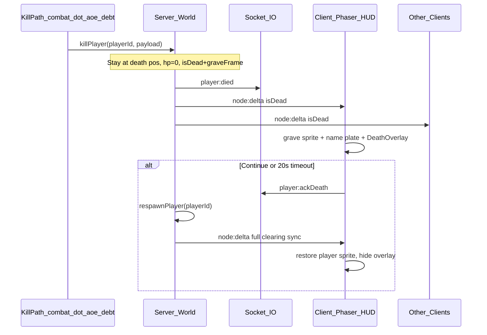
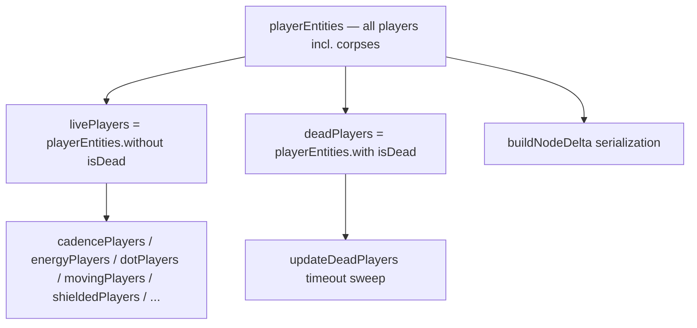

# Death Grave + Delayed Respawn

## Architecture

Today, all four kill paths call [`respawnPlayer`](server/src/systems/world/spawning/index.ts) in one step — teleport to clearing **and** queue `player:died`. The client [`DeathOverlay`](client/src/hud/DeathOverlay.tsx) is cosmetic; dismissing it does not affect server state.

The new design introduces two server phases:

1. **`killPlayer`** — incapacitate at death site, attach networked `isDead`, emit `player:died`
2. **`respawnPlayer`** — only runs on `player:ackDeath` (or server safety timeout / disconnect cleanup)



**Assumptions**

- Grave sheet [`client/public/assets/environment/graves.png`](client/public/assets/environment/graves.png) is 1254×1254 px, uniform 5×5 grid → **250×250** frame cells (4 px unused margin on right/bottom edge).
- `isDead` is **runtime-only** (like `tracksCombat`) — never persisted to SQLite.
- **Disconnect while dead** → auto-`respawnPlayer` before `saveCharacter` so DB never stores `hp=0` at a foreign node.
- **Do not reuse `cannotAttack`** — it only blocks direct strikes, is server-only, and summoners still path/fight through minions ([`cannotAttack.ts`](shared/src/components/combat/cannotAttack.ts)).

**Project invariants honored**

- Server authoritative; client renders networked `isDead` + `graveFrame`.
- Presence-gated ECS: attach `isDead` on death, detach on respawn; miniplex query membership excludes corpses from gameplay automatically.
- **Query tier discipline:** `playerEntities` = serialization + lookup; `livePlayers` = all gameplay ticks; `deadPlayers` = timeout sweep only.
- Shared → server → client rollout order.



When `killPlayer` attaches `isDead`, miniplex drops the entity from `livePlayers` and every archetype query derived from it. No per-loop dead checks required in archetype ticks.

---

## Code Architecture (walkthrough)

Read **top to bottom**. Each step depends on the previous. See **File index** at the end for alphabetical path lookup.

### Step 1 — Shared contracts: `IsDead`, protocol, views

**Goal:** Define the cross-boundary death state and extend existing death payload / socket maps so server and client agree on grave frame and ack intent.

| File                                                                               | Symbol                                         | Action | Summary                                                           |
| ---------------------------------------------------------------------------------- | ---------------------------------------------- | ------ | ----------------------------------------------------------------- |
| [`shared/src/components/combat/isDead.ts`](shared/src/components/combat/isDead.ts) | `IsDead`                                       | add    | Networked marker: `{ graveFrame: number; diedAtMs: number }`      |
| [`shared/src/components/index.ts`](shared/src/components/index.ts)                 | export                                         | modify | Re-export `IsDead`                                                |
| [`shared/src/protocol/networkedEntity.ts`](shared/src/protocol/networkedEntity.ts) | `NETWORKED_PLAYER_KEYS`                        | modify | Add `'isDead'`                                                    |
| [`shared/src/protocol/death.ts`](shared/src/protocol/death.ts)                     | `PlayerDeathPayload`, `GRAVE_FRAME_COUNT`      | modify | Add `graveFrame`, `deathPos`; export frame count constant `25`    |
| [`shared/src/protocol/socketEvents.ts`](shared/src/protocol/socketEvents.ts)       | `ServerToClientEvents`, `ClientToServerEvents` | modify | Update `player:died` comment; add `'player:ackDeath': () => void` |
| [`shared/src/protocol/views.ts`](shared/src/protocol/views.ts)                     | `PlayerView`, `composePlayerView`              | modify | Add `isDead: boolean`, `graveFrame: number \| null`               |
| [`shared/src/index.ts`](shared/src/index.ts)                                       | exports                                        | modify | Export new types/constants if not re-exported via barrels         |
| [`server/src/ecs/entity.ts`](server/src/ecs/entity.ts)                             | `ServerEntity`                                 | modify | Add `isDead?: IsDead`                                             |

```typescript
// shared/src/components/combat/isDead.ts
export interface IsDead {
  /** 0–24 index into the 5×5 graves sheet */
  graveFrame: number;
  diedAtMs: number;
}

export const GRAVE_FRAME_COUNT = 25;
```

```typescript
// shared/src/protocol/death.ts — extend payload
export interface PlayerDeathPayload {
  cause: DeathCause;
  diedAtNodeId: string;
  graveFrame: number;
  deathPos: Vec2;
}
```

```typescript
// shared/src/protocol/views.ts — PlayerView additions
isDead: boolean;
graveFrame: number | null;

// composePlayerView projection
isDead: entity.isDead !== undefined,
graveFrame: entity.isDead?.graveFrame ?? null,
```

**Ordering note:** Must land before any server/client code references `isDead`.

---

### Step 2 — Server: split kill from respawn + query tiers

**Goal:** Replace immediate teleport-on-death with `killPlayer`; keep `respawnPlayer` as the clearing-restore path; introduce **`livePlayers` / `deadPlayers`** query tiers so corpses are excluded from gameplay by miniplex membership, not per-loop guards.

| File                                                                                                   | Symbol                                                           | Action | Summary                                                         |
| ------------------------------------------------------------------------------------------------------ | ---------------------------------------------------------------- | ------ | --------------------------------------------------------------- |
| [`server/src/systems/world/playerIncapacitation.ts`](server/src/systems/world/playerIncapacitation.ts) | `killPlayer`, `updateDeadPlayers`, `SERVER_DEATH_ACK_TIMEOUT_MS` | add    | Death/respawn logic + timeout sweep over `deadPlayers`          |
| [`server/src/systems/world/spawning/index.ts`](server/src/systems/world/spawning/index.ts)             | `killPlayer`, `respawnPlayer`                                    | modify | Split; respawn drops `isDead`, no longer queues `pendingDeaths` |
| [`server/src/world/World.ts`](server/src/world/World.ts)                                               | `livePlayers`, `deadPlayers`, derived queries, `tick`            | modify | Query tiers; delegate kill; call `updateDeadPlayers`            |
| [`server/src/systems/world/deathCause.ts`](server/src/systems/world/deathCause.ts)                     | `buildPlayerDeathPayload`                                        | modify | Include `graveFrame` + `deathPos` from entity at build time     |

**A. Query tiers in `World.ts`**

Rebase all gameplay-derived player queries from `playerEntities` → `livePlayers`. Keep `playerEntities` for serialization and id-indexed lookup.

```typescript
// server/src/world/World.ts — after playerEntities definition
readonly livePlayers = this.playerEntities.without("isDead");
readonly deadPlayers = this.playerEntities.with("isDead");

// Rebase every gameplay query (archetype ticks inherit exclusion automatically)
readonly cadencePlayers   = this.livePlayers.with("usesCadence");
readonly energyPlayers    = this.livePlayers.with("usesEnergy");
readonly dotPlayers       = this.livePlayers.with("appliesDots");
readonly chillingPlayers  = this.livePlayers.with("chillsTarget");
readonly cooldownPlayers  = this.livePlayers.with("usesCooldown");
readonly summonerPlayers  = this.livePlayers.with("summonsMinions");
readonly reloadPlayers    = this.livePlayers.with("usesReload");
readonly dottedPlayers    = this.livePlayers.with("hasDot");
readonly movingPlayers    = this.livePlayers.with("isMoving");
readonly shieldedPlayers  = this.livePlayers.with("holdsShields");
readonly channelingPlayers = this.cooldownPlayers.with("isChanneling");
readonly overdrivenPlayers = this.cooldownPlayers.with("hasOverdrive");
readonly alignedPlayers   = this.cooldownPlayers.with("hasAlignment");
```

**Keep `playerEntities` (not `livePlayers`) for:**

- [`buildNodeDelta`](server/src/world/nodeDelta.ts) — corpses must serialize as graves
- [`markerInvariants`](server/src/ecs/markerInvariants.ts) — dev checks on full player set
- [`getPlayerEntity`](server/src/world/playerLifecycle.ts) / `playerById` — id lookup finds corpses for ack/disconnect
- Broadcast occupancy / node membership scans that count all connected players regardless of state

**B. `killPlayer` — death phase**

```typescript
// server/src/systems/world/playerIncapacitation.ts
export const SERVER_DEATH_ACK_TIMEOUT_MS = 25_000;

export function killPlayer(
  world: World,
  playerId: string,
  cause: DeathCause,
): void {
  const entity = world.getPlayerEntity(playerId);
  if (!entity || entity.isDead) return; // idempotent

  const graveFrame = Math.floor(Math.random() * GRAVE_FRAME_COUNT);
  const payload = buildPlayerDeathPayload(entity, cause, graveFrame);

  entity.hasHealth.hp = 0;
  stopEntity(world, entity);
  setAttackTarget(world, entity, null);
  clearAutoTraversePath(world, entity);
  entity.usesAutocombat.auto = false;
  entity.usesAutocombat.autoTraverse = false;
  despawnMinionsForOwner(world, entity);
  resetTracksCombat(entity.tracksCombat);
  // detach shields, channeling, empowered, engagement markers (mirror respawn cleanup)
  // drop monster aggro targeting this player
  attachComponent(world, entity, "isDead", {
    graveFrame,
    diedAtMs: Date.now(),
  });
  // miniplex: entity leaves livePlayers + all derived queries; enters deadPlayers

  world.pendingDeaths.push({ playerId, payload });
}
```

**Inputs:** `playerId`, `DeathCause` from kill path  
**Outputs:** Entity frozen at death position; `isDead` networked; entity excluded from `livePlayers`; `pendingDeaths` queued  
**Error handling:** Idempotent if `entity.isDead` already set  
**Dependencies:** Does **not** call `recalculatePlayerEntityStats` (avoids `Math.max(1, hp)` clamp in [`stats.ts`](shared/src/systems/stats.ts))

**C. `respawnPlayer` — respawn phase (existing body, adjusted)**

- Remove `payload` parameter and `pendingDeaths` push.
- First line: `detachComponent(world, entity, 'isDead')` — entity re-enters `livePlayers`.
- Then existing teleport-to-clearing, HP restore, `resetNodeDeltaState('node-5-5')`, stat recalc via `recalculatePlayerEntityStats`.

**D. Kill-path call-site renames**

| File                                                                                                                     | Change                                                      |
| ------------------------------------------------------------------------------------------------------------------------ | ----------------------------------------------------------- |
| [`server/src/systems/combat/engine/combat.ts`](server/src/systems/combat/engine/combat.ts)                               | `world.respawnPlayer(...)` → `world.killPlayer(..., cause)` |
| [`server/src/systems/combat/damage/aoeDamage.ts`](server/src/systems/combat/damage/aoeDamage.ts)                         | same                                                        |
| [`server/src/systems/classes/archetypes/dot/dotPrototype.ts`](server/src/systems/classes/archetypes/dot/dotPrototype.ts) | same                                                        |
| [`server/src/systems/defense/mitigation/hitToDot.ts`](server/src/systems/defense/mitigation/hitToDot.ts)                 | same                                                        |

**E. Death timeout sweep — iterate `deadPlayers` only**

```typescript
export function updateDeadPlayers(world: World, now: number): void {
  for (const player of world.deadPlayers) {
    if (now - player.isDead!.diedAtMs >= SERVER_DEATH_ACK_TIMEOUT_MS) {
      respawnPlayer(world, player.isPlayer.id);
    }
  }
}
```

Called from `World.tick` after combat/defense (same placement as before).

---

### Step 3 — Server: rebase gameplay loops + three chokepoints

**Goal:** Swap `world.playerEntities` → `world.livePlayers` in all **gameplay** tick loops so corpses are excluded by query membership. Archetype ticks need **no edits** — they already iterate `world.dotPlayers`, `world.cadencePlayers`, etc., which will be rebased in Step 2. Only three localized chokepoints handle cases queries cannot cover.

**A. Mechanical rebase — change loop source only (no `isPlayerDead` guards)**

| File                                                                                                     | Loop change                                             |
| -------------------------------------------------------------------------------------------------------- | ------------------------------------------------------- |
| [`server/src/systems/combat/engine/combat.ts`](server/src/systems/combat/engine/combat.ts)               | Player→monster loop: `livePlayers`; kill path unchanged |
| [`server/src/systems/combat/engine/combatState.ts`](server/src/systems/combat/engine/combatState.ts)     | Player half: `livePlayers`                              |
| [`server/src/systems/combat/buffs/buffSync.ts`](server/src/systems/combat/buffs/buffSync.ts)             | `livePlayers`                                           |
| [`server/src/systems/combat/damage/weaponEffects.ts`](server/src/systems/combat/damage/weaponEffects.ts) | Player loops: `livePlayers`                             |
| [`server/src/systems/combat/ai/autoTarget.ts`](server/src/systems/combat/ai/autoTarget.ts)               | `livePlayers`                                           |
| [`server/src/systems/world/autoTraverse.ts`](server/src/systems/world/autoTraverse.ts)                   | `livePlayers`                                           |
| [`server/src/systems/world/partyFollow.ts`](server/src/systems/world/partyFollow.ts)                     | `livePlayers`                                           |
| [`server/src/systems/world/transitions.ts`](server/src/systems/world/transitions.ts)                     | `livePlayers`                                           |
| [`server/src/systems/defense/index.ts`](server/src/systems/defense/index.ts)                             | `livePlayers`                                           |
| [`server/src/systems/defense/shields/shields.ts`](server/src/systems/defense/shields/shields.ts)         | Already uses `shieldedPlayers` — rebased via Step 2     |
| [`server/src/systems/world/testRoomInteract.ts`](server/src/systems/world/testRoomInteract.ts)           | `livePlayers`                                           |
| [`server/src/world/testRoom.ts`](server/src/world/testRoom.ts)                                           | `livePlayers` (if gameplay-facing)                      |

**B. Node-scoped live iterator**

Add alongside existing `playerEntitiesInNode` in [`server/src/world/playerLifecycle.ts`](server/src/world/playerLifecycle.ts):

```typescript
export function* livePlayersInNode(
  world: World,
  nodeId: string,
): IterableIterator<PlayerEntity> {
  for (const e of world.livePlayers) {
    if (e.hasPosition.nodeId === nodeId) yield e;
  }
}
```

Use in combat pull/AoE paths that must not target corpses:

| File                                                                                             | Change                                      |
| ------------------------------------------------------------------------------------------------ | ------------------------------------------- |
| [`server/src/systems/combat/ai/ai.ts`](server/src/systems/combat/ai/ai.ts)                       | `findAggro` pull scan: `livePlayersInNode`  |
| [`server/src/systems/combat/damage/aoeDamage.ts`](server/src/systems/combat/damage/aoeDamage.ts) | Player hit scan: `livePlayersInNode`        |
| [`server/src/systems/world/queries.ts`](server/src/systems/world/queries.ts)                     | Spatial player queries: `livePlayersInNode` |

**C. Three chokepoints queries cannot replace**

| #   | File                                                                                                       | Symbol                   | Logic                                                                                                               |
| --- | ---------------------------------------------------------------------------------------------------------- | ------------------------ | ------------------------------------------------------------------------------------------------------------------- |
| 1   | [`server/src/index.ts`](server/src/index.ts)                                                               | `liveSelf(socketId)`     | Single intent gate: `getPlayerEntity` + reject if `isDead`. Used by all C→S handlers except `player:ackDeath`.      |
| 2   | [`server/src/systems/combat/ai/ai.ts`](server/src/systems/combat/ai/ai.ts)                                 | `resolveAggroTarget`     | Target resolved **by id** — add `if (player.isDead) return null` + drop aggro (retained aggro on corpse edge case). |
| 3   | [`server/src/systems/combat/engine/combatPipeline.ts`](server/src/systems/combat/engine/combatPipeline.ts) | `registerCombatListener` | One `beforeAttack`/`onDamageTaken` backstop: cancel if `ctx.defenderType === 'player' && ctx.defender.isDead`.      |

**Intent pattern** ([`server/src/index.ts`](server/src/index.ts)):

```typescript
function liveSelf(world: World, socketId: string): PlayerEntity | null {
  const p = world.getPlayerEntity(socketId);
  return p && !p.isDead ? p : null;
}

socket.on("player:move", (pos) => {
  const p = liveSelf(world, socket.id);
  if (!p) return;
  // ...
});

socket.on("player:ackDeath", () => {
  const p = world.getPlayerEntity(socket.id);
  if (!p?.isDead) return;
  world.respawnPlayer(socket.id);
});

socket.on("disconnect", () => {
  const p = world.getPlayerEntity(socket.id);
  if (p?.isDead) world.respawnPlayer(socket.id);
  if (p) saveCharacter(db, accId, p);
});
```

**Explicitly NOT needed:**

- Per-archetype `isPlayerDead` guards — queries handle it
- `recalculatePlayerEntityStats` early-return — intents blocked via `liveSelf`; recalc only runs on respawn/equip while alive
- `updateMovement` dead skip — `stopEntity` on kill detaches `isMoving`; corpses won't be in `movingPlayers`
- `cannotAttack` on death — wrong semantic; query exclusion is sufficient

**Party roster note:** [`partySystem.ts`](server/src/systems/player/party/partySystem.ts) may keep scanning `playerEntities` for roster membership (dead members still appear in party UI as "away") — only **follow/assist movement** uses `livePlayers` via `partyFollow`.

**Ordering note:** Step 2 query rebase must land before Step 3 loop swaps; both can ship in one commit.

---

### Step 4 — Client: load graves atlas, tombstone sprite, and name plate

**Goal:** Preload the 5×5 sheet; swap player sprite to a random grave frame when `PlayerView.isDead`; **keep the player name plate visible above the grave** for self and other clients; restore live sprite + normal label styling on respawn.

| File                                                                           | Symbol                                              | Action | Summary                                           |
| ------------------------------------------------------------------------------ | --------------------------------------------------- | ------ | ------------------------------------------------- |
| [`client/src/sprites.ts`](client/src/sprites.ts)                               | `GRAVES_KEY`, `GRAVE_FRAME_SIZE`, `GRAVE_DISPLAY_*` | add    | Texture constants                                 |
| [`client/src/scenes/game/sceneSetup.ts`](client/src/scenes/game/sceneSetup.ts) | `preloadGameAssets`                                 | modify | Load graves spritesheet                           |
| [`client/src/render/sprites.ts`](client/src/render/sprites.ts)                 | `tryMakeGraveImage`, `updateSpriteFrame`            | modify | Cross-texture swap support                        |
| [`client/src/render/labels.ts`](client/src/render/labels.ts)                   | `updateLabelForGrave`, `updateLabelForLivePlayer`   | modify | Grave name-plate styling + Y offset hook          |
| [`client/src/render/players.ts`](client/src/render/players.ts)                 | `upsertPlayer`                                      | modify | Branch on `player.isDead`; keep label, hide HP/CD |

```typescript
// client/src/scenes/game/sceneSetup.ts — preload
const GRAVE_FRAME_SIZE = 250;
scene.load.spritesheet(GRAVES_KEY, "/assets/environment/graves.png", {
  frameWidth: GRAVE_FRAME_SIZE,
  frameHeight: GRAVE_FRAME_SIZE,
});
```

```typescript
// client/src/render/players.ts — render branch
if (player.isDead) {
  applyGraveSprite(state, player.id, player, scene);
  ensureLabel(state, player.id, player, scene); // name plate stays visible
  updateLabelForGrave(state, player.id, player, scene);
  destroyHpBar(state, player.id);   // or hide — no HP bar on corpse
  destroyCdBar(state, player.id);
  // bump barOffsetY so drawLabels places name above grave crown
  meta.barOffsetY = GRAVE_LABEL_OFFSET_Y; // e.g. displayH * 0.55 + 8
  // snap interpolation base to pos; skip combat FX / damage numbers
  return early from movement-sensitive updates;
}
// existing live-player path — restore default barOffsetY + live label color
updateLabelForLivePlayer(state, player.id, player, scene);
```

```typescript
// client/src/render/labels.ts — grave name plate
export function updateLabelForGrave(
  state: RenderState,
  id: string,
  player: PlayerView,
  scene: GameScene,
): void {
  const label = state.label.get(id);
  if (!label) return;
  label.setText(player.name);
  label.setColor(player.id === scene.myId ? '#88ccaa' : '#cccccc'); // muted; own slightly greener
  label.setFontStyle('normal');
  label.setVisible(true);
}

export function updateLabelForLivePlayer(/* restore white / own-player tint */): void { ... }
```

**Name plate positioning:** [`drawLabels`](client/src/render/labels.ts) already positions labels at `sprite.y - meta.barOffsetY - 12`. Graves render taller than the 64×64 player box (~80–96 px display height), so on death set `spriteMeta.barOffsetY` to a grave-specific constant (derived from `GRAVE_DISPLAY_H`) so the monospace name sits **above the tombstone**, not over the player foot point. Label depth stays `DEPTH.UI + sprite.y` (Y-sorted with entities).

**Grave display tuning:** Use display size ~80–96 px wide (taller graves scale proportionally). Set depth via existing `DEPTH.SPRITE + pos.y`. When swapping atlas → graves texture, use destroy/recreate path in [`sprites.ts`](client/src/render/sprites.ts) (cannot `setTexture` across keys in-place). **Do not** destroy or hide the label on death — party members and zone players must see whose grave it is.

**Inputs:** `PlayerView.name`, `PlayerView.graveFrame`, `PlayerView.pos`, `PlayerView.isDead`  
**Outputs:** Phaser `Image` (grave) + existing Phaser `Text` name plate above it  
**Error handling:** Fallback colored rectangle if texture missing (same as live sprites); label falls back to `player.name` string from view

---

### Step 5 — Client: wire DeathOverlay ack, input block, and HUD economy lockout

**Goal:** CONTINUE and 20s timeout trigger `player:ackDeath`; overlay copy reflects delayed respawn; block local movement input while dead; **block client-side equip/craft/upgrade UI** (server intent rejection remains the authority backstop).

| File                                                                           | Symbol                                                                                   | Action | Summary                                                        |
| ------------------------------------------------------------------------------ | ---------------------------------------------------------------------------------------- | ------ | -------------------------------------------------------------- |
| [`client/src/hud/atoms.ts`](client/src/hud/atoms.ts)                           | `isDeathOverlayActive`, `closeEconomyPanels`, `clearDeathOverlay`, `triggerDeathOverlay` | modify | Death helper + auto-close inv/craft on death                   |
| [`client/src/net/intents.ts`](client/src/net/intents.ts)                       | `sendAckDeath`                                                                           | add    | Emit `player:ackDeath`                                         |
| [`client/src/hud/DeathOverlay.tsx`](client/src/hud/DeathOverlay.tsx)           | footer copy                                                                              | modify | "Press CONTINUE to return to the Clearing"                     |
| [`client/src/scenes/game/sceneSetup.ts`](client/src/scenes/game/sceneSetup.ts) | socket wiring                                                                            | verify | `onPlayerDied` unchanged except payload shape                  |
| [`client/src/input/clickToMove.ts`](client/src/input/clickToMove.ts)           | click handler                                                                            | modify | No-op when death overlay active                                |
| [`client/src/input/keyboard.ts`](client/src/input/keyboard.ts)                 | movement + panel hotkeys                                                                 | modify | No-op move keys; block bag (`I`) / forge (`C`) while dead      |
| [`client/src/input/gamepad.ts`](client/src/input/gamepad.ts)                   | panel toggles                                                                            | modify | Block inventory/craft toggles while dead                       |
| [`client/src/input/hudEvents.ts`](client/src/input/hudEvents.ts)               | economy intent handlers                                                                  | modify | Guard `equipItem`, `unequipItem`, `craftRecipe`, `upgradeItem` |
| [`client/src/hud/MenuButtons.tsx`](client/src/hud/MenuButtons.tsx)             | RightSidebar buttons                                                                     | modify | Disable bag/craft/upgrade buttons; prevent open while dead     |
| [`client/src/hud/MobileHUD.tsx`](client/src/hud/MobileHUD.tsx)                 | drawer buttons                                                                           | modify | Disable BAG / CRAFTING drawer entries while dead               |

```typescript
// client/src/hud/atoms.ts
export function isDeathOverlayActive(): boolean {
  return getDefaultStore().get(deathOverlayAtom).active;
}

/** Close inventory + crafting panels when death starts. */
export function closeEconomyPanels(): void {
  const store = getDefaultStore();
  store.set(inventoryOpenAtom, false);
  store.set(craftTabAtom, null);
}

export function triggerDeathOverlay(payload: PlayerDeathPayload): void {
  closeEconomyPanels();
  getDefaultStore().set(deathOverlayAtom, {
    active: true,
    payload,
    startedAt: Date.now(),
  });
}

export function clearDeathOverlay(): void {
  getDefaultStore().set(deathOverlayAtom, {
    active: false,
    payload: null,
    startedAt: null,
  });
  sendAckDeath(getGameSocket());
}
```

```typescript
// client/src/input/hudEvents.ts — guard economy intents
intents.on("equipItem", (definitionId) => {
  if (isDeathOverlayActive()) return;
  sendEquipItem(scene.socket, definitionId);
});
// same pattern for unequipItem, craftRecipe, upgradeItem
```

```typescript
// client/src/hud/MenuButtons.tsx — example button guard
const dead = useAtomValue(deathOverlayAtom).active;

<button
  className={`auto-btn${invOpen ? ' active' : ''}${dead ? ' auto-btn--disabled' : ''}`}
  disabled={dead}
  onClick={() => { if (!dead) setInvOpen(v => !v); }}
>
  {invOpen ? 'CLOSE BAG' : 'OPEN BAG'}
</button>
// Repeat for BIOME PROGRESS, OPEN FORGE, UPGRADE ITEMS (craftTab toggles)
```

**Behavior summary**

1. **On death** — `triggerDeathOverlay` calls `closeEconomyPanels()` so any open bag/forge/upgrade UI dismisses immediately.
2. **While dead** — sidebar/drawer buttons for bag + crafting are `disabled`; keyboard/gamepad hotkeys for those panels no-op.
3. **Intent bus** — `hudEvents.ts` refuses equip/unequip/craft/upgrade emits even if a panel were somehow still open.
4. **Server** — `liveSelf` intent gate from Step 3 remains authoritative; client lockout is UX-only.

**Out of scope for this step:** skill tree, map, quest, settings panels remain usable while dead (user asked equip/craft only).

**Inputs:** User click CONTINUE or 20s timeout (`AUTO_MS` in DeathOverlay); HUD button/hotkey attempts while dead  
**Outputs:** Socket emit on ack; panels stay closed/disabled until respawn  
**Error handling:** If socket disconnected, overlay still clears; reconnect gets live state via `state:sync`

---

### Step 6 — Docs and dev invariants

**Goal:** Keep project docs accurate; document query-tier discipline; dev boot checks aware of new marker.

| File                                                                       | Symbol                    | Action | Summary                                                         |
| -------------------------------------------------------------------------- | ------------------------- | ------ | --------------------------------------------------------------- |
| [`CLAUDE.md`](CLAUDE.md)                                                   | Socket events, death flow | modify | Document split kill/respawn, `player:ackDeath`, grave rendering |
| [`design_docs/architecture.md`](design_docs/architecture.md)               | Component categories      | modify | Add `livePlayers` / `deadPlayers` / `playerEntities` usage note |
| [`server/src/ecs/markerInvariants.ts`](server/src/ecs/markerInvariants.ts) | player checks             | modify | Verify `isDead` ⇒ hp=0, no `isMoving`/`hasAttackTarget`         |

---

### File index (alphabetical)

| File                                                                                                                     | Purpose                                                     |
| ------------------------------------------------------------------------------------------------------------------------ | ----------------------------------------------------------- |
| [`CLAUDE.md`](CLAUDE.md)                                                                                                 | Document death/grave/ack flow                               |
| [`client/src/hud/atoms.ts`](client/src/hud/atoms.ts)                                                                     | Ack death, economy panel close, death helper                |
| [`client/src/hud/DeathOverlay.tsx`](client/src/hud/DeathOverlay.tsx)                                                     | Updated respawn copy                                        |
| [`client/src/hud/MenuButtons.tsx`](client/src/hud/MenuButtons.tsx)                                                       | Disable bag/craft/upgrade while dead                        |
| [`client/src/hud/MobileHUD.tsx`](client/src/hud/MobileHUD.tsx)                                                           | Disable mobile bag/craft drawer while dead                  |
| [`client/src/input/clickToMove.ts`](client/src/input/clickToMove.ts)                                                     | Block input while dead                                      |
| [`client/src/input/gamepad.ts`](client/src/input/gamepad.ts)                                                             | Block panel hotkeys while dead                              |
| [`client/src/input/hudEvents.ts`](client/src/input/hudEvents.ts)                                                         | Guard equip/craft/upgrade intents                           |
| [`client/src/input/keyboard.ts`](client/src/input/keyboard.ts)                                                           | Block move + economy hotkeys while dead                     |
| [`client/src/net/intents.ts`](client/src/net/intents.ts)                                                                 | `sendAckDeath`                                              |
| [`client/src/render/labels.ts`](client/src/render/labels.ts)                                                             | Grave name plate styling + offset hook                      |
| [`client/src/render/players.ts`](client/src/render/players.ts)                                                           | Grave sprite branch + keep label                            |
| [`client/src/render/sprites.ts`](client/src/render/sprites.ts)                                                           | Cross-texture grave swap                                    |
| [`client/src/scenes/game/sceneSetup.ts`](client/src/scenes/game/sceneSetup.ts)                                           | Preload graves; verify death handler                        |
| [`client/src/sprites.ts`](client/src/sprites.ts)                                                                         | Grave texture constants                                     |
| [`client/public/assets/environment/graves.png`](client/public/assets/environment/graves.png)                             | 5×5 grave art (already present)                             |
| [`design_docs/architecture.md`](design_docs/architecture.md)                                                             | livePlayers query-tier docs                                 |
| [`server/src/ecs/entity.ts`](server/src/ecs/entity.ts)                                                                   | `isDead` on ServerEntity                                    |
| [`server/src/ecs/markerInvariants.ts`](server/src/ecs/markerInvariants.ts)                                               | Dev invariant for dead state                                |
| [`server/src/index.ts`](server/src/index.ts)                                                                             | `liveSelf` intent gate, ack handler, disconnect             |
| [`server/src/systems/classes/archetypes/dot/dotPrototype.ts`](server/src/systems/classes/archetypes/dot/dotPrototype.ts) | Kill path → `killPlayer`                                    |
| [`server/src/systems/combat/ai/ai.ts`](server/src/systems/combat/ai/ai.ts)                                               | `livePlayersInNode` aggro + resolveAggroTarget corpse check |
| [`server/src/systems/combat/ai/autoTarget.ts`](server/src/systems/combat/ai/autoTarget.ts)                               | Loop rebase → `livePlayers`                                 |
| [`server/src/systems/combat/buffs/buffSync.ts`](server/src/systems/combat/buffs/buffSync.ts)                             | Loop rebase → `livePlayers`                                 |
| [`server/src/systems/combat/damage/aoeDamage.ts`](server/src/systems/combat/damage/aoeDamage.ts)                         | Kill path + `livePlayersInNode`                             |
| [`server/src/systems/combat/damage/weaponEffects.ts`](server/src/systems/combat/damage/weaponEffects.ts)                 | Loop rebase → `livePlayers`                                 |
| [`server/src/systems/combat/engine/combat.ts`](server/src/systems/combat/engine/combat.ts)                               | Loop rebase + kill path                                     |
| [`server/src/systems/combat/engine/combatPipeline.ts`](server/src/systems/combat/engine/combatPipeline.ts)               | Pipeline backstop for dead defender                         |
| [`server/src/systems/combat/engine/combatState.ts`](server/src/systems/combat/engine/combatState.ts)                     | Loop rebase → `livePlayers`                                 |
| [`server/src/systems/defense/index.ts`](server/src/systems/defense/index.ts)                                             | Loop rebase → `livePlayers`                                 |
| [`server/src/systems/defense/mitigation/hitToDot.ts`](server/src/systems/defense/mitigation/hitToDot.ts)                 | Kill path → `killPlayer`                                    |
| [`server/src/systems/world/autoTraverse.ts`](server/src/systems/world/autoTraverse.ts)                                   | Loop rebase → `livePlayers`                                 |
| [`server/src/systems/world/deathCause.ts`](server/src/systems/world/deathCause.ts)                                       | Extended death payload                                      |
| [`server/src/systems/world/partyFollow.ts`](server/src/systems/world/partyFollow.ts)                                     | Loop rebase → `livePlayers`                                 |
| [`server/src/systems/world/playerIncapacitation.ts`](server/src/systems/world/playerIncapacitation.ts)                   | **New** — kill/respawn + deadPlayers sweep                  |
| [`server/src/systems/world/queries.ts`](server/src/systems/world/queries.ts)                                             | `livePlayersInNode` for spatial queries                     |
| [`server/src/systems/world/spawning/index.ts`](server/src/systems/world/spawning/index.ts)                               | Refactored respawn; export kill                             |
| [`server/src/systems/world/testRoomInteract.ts`](server/src/systems/world/testRoomInteract.ts)                           | Loop rebase → `livePlayers`                                 |
| [`server/src/systems/world/transitions.ts`](server/src/systems/world/transitions.ts)                                     | Loop rebase → `livePlayers`                                 |
| [`server/src/world/World.ts`](server/src/world/World.ts)                                                                 | `livePlayers`/`deadPlayers` + query rebase                  |
| [`server/src/world/playerLifecycle.ts`](server/src/world/playerLifecycle.ts)                                             | Add `livePlayersInNode` helper                              |
| [`server/src/world/testRoom.ts`](server/src/world/testRoom.ts)                                                           | Loop rebase → `livePlayers` (if applicable)                 |
| [`shared/src/components/combat/isDead.ts`](shared/src/components/combat/isDead.ts)                                       | **New** — marker interface                                  |
| [`shared/src/components/index.ts`](shared/src/components/index.ts)                                                       | Export `IsDead`                                             |
| [`shared/src/index.ts`](shared/src/index.ts)                                                                             | Barrel exports                                              |
| [`shared/src/protocol/death.ts`](shared/src/protocol/death.ts)                                                           | Extended payload                                            |
| [`shared/src/protocol/networkedEntity.ts`](shared/src/protocol/networkedEntity.ts)                                       | Network allowlist                                           |
| [`shared/src/protocol/socketEvents.ts`](shared/src/protocol/socketEvents.ts)                                             | `player:ackDeath`                                           |
| [`shared/src/protocol/views.ts`](shared/src/protocol/views.ts)                                                           | `PlayerView` grave fields                                   |

**No archetype tick file edits** — cadence/cooldown/energy/reload/dot/summoner modules inherit exclusion via rebased derived queries in `World.ts`.

---

## Data and Control Flow

### Before changes

1. Player HP → 0 in combat/DoT/AoE/debt path
2. `respawnPlayer(id, payload)` — immediate teleport to `node-5-5`, full HP, cleanup
3. End of tick: `player:died` emitted
4. Client shows DeathOverlay; CONTINUE only hides UI

### After changes

1. Player HP → 0
2. `killPlayer(id, cause)` — stay at position, `hp=0`, attach `isDead`, queue `player:died`
3. End of tick: `player:died` → client overlay + grave via next `node:delta`
4. Corpse excluded from `livePlayers` — all gameplay systems skip automatically via query membership
5. Client CONTINUE/timeout → `player:ackDeath`
6. Server `respawnPlayer(id)` → clearing, detach `isDead`, full HP, full node delta reset
7. Client receives clearing sync → live sprite restored

### Call path: death

1. Kill path (`combat.ts` / `aoeDamage.ts` / `dotPrototype.ts` / `hitToDot.ts`) detects `hp <= 0`
2. `world.killPlayer(playerId, cause)`
3. `killPlayer` attaches `isDead`, pushes `pendingDeaths`
4. Server loop drains `pendingDeaths` → `socket.emit('player:died', payload)`
5. Broadcast tick serializes `isDead` in `node:delta`
6. Client `onPlayerDied` → `triggerDeathOverlay`; `deltaApplier` → grave sprite

### Call path: respawn ack

1. User clicks CONTINUE or 20s timer fires → `clearDeathOverlay()`
2. `sendAckDeath()` → `player:ackDeath`
3. Server validates `isDead` → `respawnPlayer(playerId)`
4. Next `node:delta` / full sync at clearing with `isDead` absent, `hp = maxHp`
5. Client `upsertPlayer` restores player atlas frame and live name-plate styling

### Call path: disconnect while dead

1. `disconnect` handler sees `p.isDead`
2. `respawnPlayer` before `saveCharacter`
3. Character saved alive at clearing

---

## Rule Alignment

- **Server authoritative:** Death position and grave frame chosen server-side; client only renders.
- **ECS presence gating:** `isDead` marker attach/detach; miniplex query tiers exclude corpses from gameplay loops.
- **Query tier discipline:** `livePlayers` for ticks, `playerEntities` for serialization, `deadPlayers` for timeout sweep — documented in `architecture.md`.
- **Networked slice allowlist:** `isDead` added to `NETWORKED_PLAYER_KEYS`.
- **Shared → server → client:** Step order follows package boundaries.
- **Do not persist runtime markers:** `isDead` omitted from DB; disconnect respawns first.
- **Split-tick:** `player:died` still emitted immediately post-logic-tick; grave state via delta broadcast.

---

## Risks and validation

| Risk                                              | Mitigation                                                               |
| ------------------------------------------------- | ------------------------------------------------------------------------ |
| OOC regen heals corpse                            | Player combat loop iterates `livePlayers` — corpses never enter loop     |
| `recalculatePlayerStats` clamps hp to ≥1          | Recalc only on respawn; `liveSelf` blocks equip/skill intents while dead |
| New system iterates `playerEntities` for gameplay | Document tier discipline in `architecture.md`; code review convention    |
| Retained monster aggro on corpse                  | `resolveAggroTarget` corpse check + combat pipeline backstop             |
| Cross-texture sprite swap glitch                  | Destroy/recreate sprite; snap interpolation on death                     |
| Double death events                               | Idempotent `killPlayer` (`entity.isDead` early return)                   |
| Client ack without server                         | Server timeout at 25s auto-respawns via `deadPlayers` sweep              |
| Party follower trails dead leader                 | `partyFollow` iterates `livePlayers`                                     |

**Manual validation checklist**

- Die to melee, DoT, AoE, debt — grave appears at death site, overlay shows killer info
- **Player name plate visible above grave** (own + other clients in zone)
- Other player in same node sees your grave (random frame matches) and your name above it
- CONTINUE respawns at clearing with full HP and live sprite
- Wait 20s — auto-ack respawns
- Tab away 25s+ — server timeout respawns even without client ack
- Disconnect while dead — reconnect alive at clearing
- Summoner death — minions despawn, no orphan attacks; archetype ticks stop via query exclusion
- Auto-combat off during grave; no movement intents accepted
- **Bag / forge / upgrade panels auto-close on death and cannot reopen until respawn**
- Corpse does not regen, path, or receive defensive ticks (verify via `livePlayers` membership)

---

## Out of scope (follow-ups)

- Grave foot-offset / per-frame Y anchor tuning for uneven tombstone heights (name plate uses single `GRAVE_LABEL_OFFSET_Y` constant in v1)
- Fade-in tombstone tween or screen vignette on death
- Persist death state across disconnect (intentionally excluded)
- Party UI messaging when leader is a corpse
- Mobile-specific death overlay layout pass
