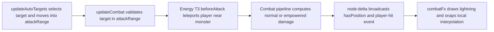
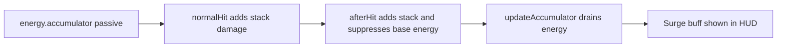
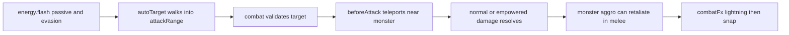

## Architecture

Flash stays inside the existing Energy T3 pipeline. The server remains authoritative for all gameplay-relevant movement, damage, targeting, and aggro. The client only renders the server-broadcast position and the queued combat event.



Design constraints and assumptions:

- `attackRange` remains the engage/teleport distance. Flash does not reduce the stat; it changes what being "in range" means.
- Every actual attack hop happens on the server in `beforeAttack`, before damage and retaliation aggro are evaluated.
- The hop lands at a random melee offset around the monster, so repeated attacks against the same monster flicker around it.
- Energy empowered behavior stays unchanged: Light Frame still gains 20 energy per basic hit, arms empowered at max energy, and uses the existing 1.5x empowered hit plus empowered AoE.
- Current client cleanup moved Energy fx from `client/src/fx/energy.ts` into [`client/src/fx/lightning.ts`](client/src/fx/lightning.ts), and consolidated attack fx orchestration into [`client/src/render/combatFx.ts`](client/src/render/combatFx.ts). This plan targets that current structure.

## Code Architecture (walkthrough)

Read this section top to bottom. Steps are ordered by dependency: shared passive/type changes first, then server behavior, then current client renderer integration. The **File index** at the end is the quick lookup table for every path touched.

### Step 1 — Replace Accumulator's public contract with Flash

**Goal:** Make the shared skill/passive database describe the new mechanic before server code depends on it. This keeps stat recalculation and skill unlocks type-safe because `usesSkills.passives` is rebuilt from these shared declarations.

| File | Symbol | Action | Inputs | Outputs | Logic | Error handling | Dependencies |
| --- | --- | --- | --- | --- | --- | --- | --- |
| [`shared/src/passives.ts`](shared/src/passives.ts) | `ENERGY_KEYS` | modify | `mechanicEffects` from skill nodes | `EnergyPassiveKey` includes `'energy.flash'` | Replace `'energy.accumulator'` with `'energy.flash'` | n/a | Used by `MechanicEffects`, `PassiveMap`, server `hasPassive` |
| [`shared/src/data/skillTree/t3CombatB.ts`](shared/src/data/skillTree/t3CombatB.ts) | `energy-light-t3-a` | modify | Skill unlock of existing T3 node | Same node id now grants Flash and evasion | Rename node, rewrite description, swap mechanic passive, add evasion | n/a | Depends on `PassiveKey` including `'energy.flash'` |

Intended shared code shape:

```ts
// shared/src/passives.ts
export const ENERGY_KEYS = [
  'energy.per-hit',
  'energy.empowered-mult',
  'energy.flash',
  'energy.micro-venting',
  'energy.polarity-decay',
  'energy.alternating-currents',
  'energy.harmonic-equilibrium',
  'energy.capacitor-shunt',
  'energy.singularity-execute',
  'energy.cascading-induction',
  'energy.superconducting-mass',
] as const;
```

```ts
// shared/src/data/skillTree/t3CombatB.ts
['energy-light-t3-a', {
  id: 'energy-light-t3-a',
  name: 'Flash',
  tier: 3,
  classId: 'energy-root',
  subVariantId: 'light',
  parent: 'energy-light',
  children: [],
  description: 'Your lightning condenses into daggers. Each attack rides a lightning bolt to your target, teleporting into melee range and flickering to a new nearby point on every strike. Trades safe range for fast melee pressure and extra evasion.',
  cost: 1,
  statEffects: { evasion: 4 },
  mechanicEffects: { 'energy.flash': 1 },
}],
```

Compatibility note:

- Existing characters with `energy-light-t3-a` unlocked do not need persistence migration. Persisted skills store skill ids, not passive maps; passives rebuild on attach/recalc and will now produce `energy.flash`.

### Step 2 — Remove Accumulator runtime state and HUD buff hooks

**Goal:** Delete the old drain-and-stack implementation so no stale `energy.accumulator` behavior, constants, or buff descriptors remain. This step must happen after Step 1 so TypeScript points all remaining references at the new passive key.

| File | Symbol | Action | Inputs | Outputs | Logic | Error handling | Dependencies |
| --- | --- | --- | --- | --- | --- | --- | --- |
| [`server/src/systems/classes/archetypes/energy/t3/ticks/accumulator.ts`](server/src/systems/classes/archetypes/energy/t3/ticks/accumulator.ts) | `updateAccumulator` | remove | world tick | n/a | Delete Accumulator drain loop | n/a | Remove import/call from T3 index |
| [`server/src/systems/classes/archetypes/energy/t3/index.ts`](server/src/systems/classes/archetypes/energy/t3/index.ts) | `updateEnergyT3` | modify | `World`, `dt` | No accumulator tick | Keep `updateAlternatingCurrents`; remove `updateAccumulator` | n/a | Depends on deleting accumulator file |
| [`server/src/systems/classes/archetypes/energy/t3/index.ts`](server/src/systems/classes/archetypes/energy/t3/index.ts) | public re-exports | modify | n/a | No `getAccumulatorStacks` export | Remove stale export | n/a | Depends on selectors cleanup |
| [`server/src/systems/classes/archetypes/energy/t3/core/constants.ts`](server/src/systems/classes/archetypes/energy/t3/core/constants.ts) | `ACC_*`, `FLASH_*` | modify | n/a | Flash offset constants | Delete `ACC_*`; add `FLASH_OFFSET_MIN_PX`, `FLASH_OFFSET_MAX_PX` | n/a | Used by Flash beforeAttack |
| [`server/src/systems/classes/archetypes/energy/t3/core/selectors.ts`](server/src/systems/classes/archetypes/energy/t3/core/selectors.ts) | `getAccumulatorStacks` | remove | `TracksCombat` | n/a | Delete selector and `ACC_BUFF_FX` import | n/a | Used only by old buff descriptor |
| [`server/src/systems/classes/archetypes/energy/t3/core/buffs.ts`](server/src/systems/classes/archetypes/energy/t3/core/buffs.ts) | `ENERGY_T3_BUFFS` | modify | `BuffProjectionContext` | No `energy-acc` buff | Remove "Surge" descriptor and `getAccumulatorStacks` import | n/a | Flash has no persistent buff |
| [`server/src/systems/classes/archetypes/energy/t3/pipeline/normalHit.ts`](server/src/systems/classes/archetypes/energy/t3/pipeline/normalHit.ts) | `registerNormalHit` | modify | `onHit` `CombatContext` | No stack damage bonus | Remove Accumulator bonus branch/imports | n/a | Other Energy T3 branches unchanged |
| [`server/src/systems/classes/archetypes/energy/t3/pipeline/afterHit.ts`](server/src/systems/classes/archetypes/energy/t3/pipeline/afterHit.ts) | `registerAfterHit` | modify | `afterHit` `CombatContext` | Flash falls through to base energy gain | Remove Accumulator custom gain/stack branch/imports | n/a | Base `energyPrototype` handles energy fill |

Intended server code shape:

```ts
// server/src/systems/classes/archetypes/energy/t3/core/constants.ts
export const FLASH_OFFSET_MIN_PX = 25;
export const FLASH_OFFSET_MAX_PX = 35;
```

```ts
// server/src/systems/classes/archetypes/energy/t3/index.ts
import type { World } from '../../../../../world/World';
import { registerBeforeAttack } from './pipeline/beforeAttack';
import { registerEmpoweredHit } from './pipeline/empoweredHit';
import { registerNormalHit } from './pipeline/normalHit';
import { registerAfterHit } from './pipeline/afterHit';
import { updateAlternatingCurrents } from './ticks/alternatingCurrents';

export function initEnergyT3(): void {
  registerBeforeAttack();
  registerEmpoweredHit();
  registerNormalHit();
  registerAfterHit();
}

export function updateEnergyT3(world: World, dt: number): void {
  updateAlternatingCurrents(world, dt);
}
```

Invariant:

- Flash does not write `tracksCombat.statusEffects`, so no status effect descriptor or HUD buff is needed.
- The base Energy afterHit handler must continue to run for Flash. Do not set `ctx.metadata['energyHandled']` for Flash.

### Step 3 — Add server-authoritative Flash teleport

**Goal:** Implement the actual hop in `beforeAttack` so the server position changes before hit damage, empowered AoE, and retaliation aggro. This makes melee exposure authoritative instead of a client-only animation.

| File | Symbol | Action | Inputs | Outputs | Logic | Error handling | Dependencies |
| --- | --- | --- | --- | --- | --- | --- | --- |
| [`server/src/systems/classes/archetypes/energy/t3/pipeline/beforeAttack.ts`](server/src/systems/classes/archetypes/energy/t3/pipeline/beforeAttack.ts) | `clampToNode` | add | `nodeId`, `Vec2` | Bounded `Vec2` | Clamp Flash landing point inside current node with same 40px margin used by auto-target | If node missing, return input position | `NODE_REGISTRY`, `Vec2` |
| [`server/src/systems/classes/archetypes/energy/t3/pipeline/beforeAttack.ts`](server/src/systems/classes/archetypes/energy/t3/pipeline/beforeAttack.ts) | `pushClientEffect` | add | `ctx.metadata`, effect id | `clientEffects` array updated | Append reserved event effect id without clobbering other effects | Ignores non-array previous values by replacing with one-element array | `CombatContext` metadata |
| [`server/src/systems/classes/archetypes/energy/t3/pipeline/beforeAttack.ts`](server/src/systems/classes/archetypes/energy/t3/pipeline/beforeAttack.ts) | `tryFlashTeleport` | add | `world`, `player`, `monster`, `ctx` | Mutated `hasPosition.current`, dirty `hasPosition`, stopped motion, `flash-teleport` effect | Pick random angle/radius around monster, clamp, teleport, mark dirty, detach motion | Missing node falls back unclamped; only called for monster defenders | Step 2 Flash constants, `markSliceDirty`, `stopEntity` |
| [`server/src/systems/classes/archetypes/energy/t3/pipeline/beforeAttack.ts`](server/src/systems/classes/archetypes/energy/t3/pipeline/beforeAttack.ts) | `registerBeforeAttack` | modify | `beforeAttack` event | Flash teleport before hit | Invoke `tryFlashTeleport` when `hasPassive(player, 'energy.flash')` and defender is monster | Existing cancellation behavior unchanged | Must run before damage application in `combat.ts` |

Intended code shape:

```ts
// server/src/systems/classes/archetypes/energy/t3/pipeline/beforeAttack.ts
import { type Vec2 } from '@mmo-idle/shared';
import { markSliceDirty } from '../../../../../../ecs/dirtyHelpers';
import { stopEntity } from '../../../../../world/movement';
import { NODE_REGISTRY } from '../../../../../../world/nodeRegistry';
import type { World } from '../../../../../../world/World';
import type { PlayerEntity } from '../../../../../../ecs/components/player';
import type { MonsterEntity } from '../../../../../../ecs/components/monster';
import type { CombatContext } from '../../../../../combat/engine/combatPipeline';
import { FLASH_OFFSET_MAX_PX, FLASH_OFFSET_MIN_PX } from '../core/constants';

const NODE_MARGIN = 40;
const FLASH_CLIENT_EFFECT = 'flash-teleport';

function clampToNode(nodeId: string, pos: Vec2): Vec2 {
  const node = NODE_REGISTRY.get(nodeId);
  if (!node) return pos;
  return {
    x: Math.max(NODE_MARGIN, Math.min(node.width - NODE_MARGIN, pos.x)),
    y: Math.max(NODE_MARGIN, Math.min(node.height - NODE_MARGIN, pos.y)),
  };
}

function pushClientEffect(ctx: CombatContext, effectId: string): void {
  const effects = ctx.metadata['clientEffects'];
  if (Array.isArray(effects)) {
    effects.push(effectId);
    return;
  }
  ctx.metadata['clientEffects'] = [effectId];
}

function tryFlashTeleport(
  world: World,
  player: PlayerEntity,
  monster: MonsterEntity,
  ctx: CombatContext,
): void {
  const angle = Math.random() * Math.PI * 2;
  const radius =
    FLASH_OFFSET_MIN_PX +
    Math.random() * (FLASH_OFFSET_MAX_PX - FLASH_OFFSET_MIN_PX);
  const landing = clampToNode(player.hasPosition.nodeId, {
    x: monster.hasPosition.current.x + Math.cos(angle) * radius,
    y: monster.hasPosition.current.y + Math.sin(angle) * radius,
  });

  player.hasPosition.current = landing;
  markSliceDirty(world, player, 'hasPosition');
  stopEntity(world, player);
  pushClientEffect(ctx, FLASH_CLIENT_EFFECT);
}
```

Then wire it into the existing listener:

```ts
// server/src/systems/classes/archetypes/energy/t3/pipeline/beforeAttack.ts
export function registerBeforeAttack(): void {
  registerCombatListener('beforeAttack', (ctx, world) => {
    if (ctx.attackerType !== 'player') return;

    const entity = ctx.attacker;
    if (!entity?.usesEnergy) return;

    const player = entity;
    const passives = player.usesSkills.passives;

    // Existing suppressEmpoweredMult and Singularity Execute logic stays here.

    if (
      hasPassive(player, 'energy.flash') &&
      ctx.defenderType === 'monster'
    ) {
      tryFlashTeleport(world, player, ctx.defender, ctx);
    }
  });
}
```

Ordering note:

- The teleport should happen in `beforeAttack`, after the target has already been selected by `updateCombat` using `attackRange`, and before `combat.ts` computes damage / empowered AoE / retaliation aggro.
- `stopEntity` detaches `isMoving`, which is a presence component and marks dirty through `detachComponent`. `markSliceDirty(world, player, 'hasPosition')` is still required because `hasPosition.current` is mutated in place.

### Step 4 — Make auto-target treat Flash as melee-style movement

**Goal:** Keep `attackRange` as the distance at which Flash can start attacking, but stop the generic ranged Energy kiting logic from backing away. Flash should walk into engage range, stop, and let attacks teleport it into melee.

| File | Symbol | Action | Inputs | Outputs | Logic | Error handling | Dependencies |
| --- | --- | --- | --- | --- | --- | --- | --- |
| [`server/src/systems/combat/ai/autoTarget.ts`](server/src/systems/combat/ai/autoTarget.ts) | `isRangedAutoPlayer` | modify | Player movement/skill slices | `false` for Flash users | Check `usesSkills.passives['energy.flash']` before existing ranged checks | n/a | `PassiveMap` type or inline indexed passive access |

Intended code shape:

```ts
// server/src/systems/combat/ai/autoTarget.ts
function isRangedAutoPlayer(player: {
  performsAttack: { attackRange: number };
  usesSkills: {
    selectedRange: string | null;
    passives: { 'energy.flash'?: number };
  };
  usesReload?: unknown;
  usesEnergy?: unknown;
}): boolean {
  if ((player.usesSkills.passives['energy.flash'] ?? 0) > 0) return false;
  return player.performsAttack.attackRange > 100 ||
    player.usesSkills.selectedRange === 'range-mid' ||
    player.usesSkills.selectedRange === 'range-far' ||
    player.usesReload !== undefined ||
    player.usesEnergy !== undefined;
}
```

What stays stable:

- Non-Flash Energy remains ranged and uses existing safe-distance logic.
- Reload and far/mid range nodes remain ranged.
- Target selection priority (aggroed monster first, then nearest monster) is unchanged.

### Step 5 — Integrate Flash with the current client renderer structure

**Goal:** Update the plan for the current client cleanup: there is no `client/src/fx/energy.ts` or `client/src/fx/attackEffects.ts` anymore. Energy lightning lives in `client/src/fx/lightning.ts`, and attack fx dispatch lives in `client/src/render/combatFx.ts`.

| File | Symbol | Action | Inputs | Outputs | Logic | Error handling | Dependencies |
| --- | --- | --- | --- | --- | --- | --- | --- |
| [`client/src/render/combatFx.ts`](client/src/render/combatFx.ts) | `FLASH_CLIENT_EFFECT` | add | `CombatEvent.effects` | Reserved effect id | Centralize `'flash-teleport'` so filter/snap share the same string | n/a | Matches server `FLASH_CLIENT_EFFECT` literal |
| [`client/src/render/combatFx.ts`](client/src/render/combatFx.ts) | `snapOwnPlayerToServerTarget` | add | `RenderState` | Mutated `interp.base` and sprite position | Snap local own-player interpolation to `transform.target` after lightning fx | No-op if own id, transform, interp, or sprite missing | Current render state maps |
| [`client/src/render/combatFx.ts`](client/src/render/combatFx.ts) | `runFxForAttackStyle` | modify | `player-hit` event | Lightning drawn from old sprite pos, then local sprite snaps to server target | Detect `ev.effects?.includes('flash-teleport')`; skip generic one-shot for that id | Existing early-return behavior unchanged | `fxLightning` already in `ATTACK_FX_BY_ARCHETYPE.energy` |

Intended code shape:

```ts
// client/src/render/combatFx.ts
const FLASH_CLIENT_EFFECT = 'flash-teleport';

function snapOwnPlayerToServerTarget(state: RenderState): void {
  if (!state.ownId) return;
  const transform = state.transform.get(state.ownId);
  const interp = state.interpolation.get(state.ownId);
  const sprite = state.sprite.get(state.ownId);
  if (!transform || !interp || !sprite) return;

  interp.base = { ...transform.target };
  sprite.setPosition(
    interp.base.x + interp.lungeOffset.x,
    interp.base.y + interp.lungeOffset.y,
  );
}
```

Modify the existing `runFxForAttackStyle` body around the current effect loop:

```ts
// client/src/render/combatFx.ts
const isFlashTeleport = ev.effects?.includes(FLASH_CLIENT_EFFECT) ?? false;

if (isLaser) {
  activateLaserBeam(state, scene, ev.targetId);
} else {
  playEmpoweredRing(args);
  const archetype = player.combatArchetype;
  if (archetype && ATTACK_FX_BY_ARCHETYPE[archetype]) {
    ATTACK_FX_BY_ARCHETYPE[archetype](args);
  } else {
    const styleFn = ATTACK_FX_BY_STYLE[player.attackStyle] ?? ATTACK_FX_BY_STYLE.impact;
    styleFn(args);
  }
}

if (isFlashTeleport) {
  snapOwnPlayerToServerTarget(state);
}

for (const effectId of ev.effects ?? []) {
  if (effectId === FLASH_CLIENT_EFFECT) continue;
  playOneShotEffect(scene, effectId, to, { scale: targetEffectScale });
}
```

Ordering note:

- Compute `from` before snapping. The existing code already does this:

```ts
// client/src/render/combatFx.ts
const from = { x: ownSprite.x, y: ownSprite.y };
const to = { x: targetSprite.x, y: targetSprite.y };
```

- This means `fxLightning` draws from the pre-snap location to the monster, then `snapOwnPlayerToServerTarget` makes the authoritative teleport visible immediately.
- Keep the existing `applyLunge` call. Because Flash Energy's `attackRange` can be ≤ 150, the lunge gives the final dagger-strike punch after the teleport snap.

### Step 6 — Verify and update docs that name Accumulator

**Goal:** Catch stale references and validate behavior in the most likely failure points: type safety, server dirty tracking, current client fx path, and balance visibility.

| File | Symbol | Action | Inputs | Outputs | Logic | Error handling | Dependencies |
| --- | --- | --- | --- | --- | --- | --- | --- |
| [`CLAUDE.md`](CLAUDE.md) | Energy T3 docs | modify | n/a | Docs say Flash, not Accumulator | Replace Energy Light T3 bullet from Accumulator to Flash | n/a | Keep project context accurate |
| [`BALANCE_REFERENCE.md`](BALANCE_REFERENCE.md) | Energy Light T3 docs | verify/modify if needed | n/a | Balance docs match Flash | Search for Accumulator and update if it is active balance reference | n/a | Avoid stale tuning notes |
| Repository | Typecheck/build | verify | `pnpm` scripts | No TS errors | Run suitable typecheck/build smoke checks | Fix introduced errors only | All previous steps |

Suggested verification commands:

```bash
pnpm typecheck
pnpm dev:server
pnpm dev:client
```

Manual verification:

1. Unlock Energy → Light Frame → `energy-light-t3-a`.
2. Confirm HUD/skill tree shows `Flash` and evasion increases by 4.
3. Enable auto combat near monsters.
4. Confirm player walks into `attackRange`, then each attack teleports to a new near-monster point.
5. Confirm repeated attacks against one monster flicker around it.
6. Confirm monsters can retaliate because the player is now in melee range.
7. Confirm every 5th Light Frame hit still produces empowered visual/AoE behavior.

### File index

| File | Purpose |
| --- | --- |
| [`BALANCE_REFERENCE.md`](BALANCE_REFERENCE.md) | Verify/update active balance notes that still mention Accumulator |
| [`CLAUDE.md`](CLAUDE.md) | Update project context Energy T3 description from Accumulator to Flash |
| [`client/src/fx/lightning.ts`](client/src/fx/lightning.ts) | Existing lightning animation reused for Flash teleport; no code change expected |
| [`client/src/render/combatFx.ts`](client/src/render/combatFx.ts) | Current attack-fx dispatcher; add Flash reserved effect handling and local interpolation snap |
| [`server/src/systems/classes/archetypes/energy/t3/core/buffs.ts`](server/src/systems/classes/archetypes/energy/t3/core/buffs.ts) | Remove Accumulator "Surge" HUD buff descriptor |
| [`server/src/systems/classes/archetypes/energy/t3/core/constants.ts`](server/src/systems/classes/archetypes/energy/t3/core/constants.ts) | Remove `ACC_*`; add Flash landing offset constants |
| [`server/src/systems/classes/archetypes/energy/t3/core/selectors.ts`](server/src/systems/classes/archetypes/energy/t3/core/selectors.ts) | Remove `getAccumulatorStacks` |
| [`server/src/systems/classes/archetypes/energy/t3/index.ts`](server/src/systems/classes/archetypes/energy/t3/index.ts) | Remove accumulator tick import/call and stale re-export |
| [`server/src/systems/classes/archetypes/energy/t3/pipeline/afterHit.ts`](server/src/systems/classes/archetypes/energy/t3/pipeline/afterHit.ts) | Remove Accumulator energy-handled branch so Flash uses base Energy fill |
| [`server/src/systems/classes/archetypes/energy/t3/pipeline/beforeAttack.ts`](server/src/systems/classes/archetypes/energy/t3/pipeline/beforeAttack.ts) | Add authoritative Flash teleport and queued client effect |
| [`server/src/systems/classes/archetypes/energy/t3/pipeline/normalHit.ts`](server/src/systems/classes/archetypes/energy/t3/pipeline/normalHit.ts) | Remove Accumulator stack damage bonus |
| [`server/src/systems/classes/archetypes/energy/t3/ticks/accumulator.ts`](server/src/systems/classes/archetypes/energy/t3/ticks/accumulator.ts) | Delete old Accumulator tick file |
| [`server/src/systems/combat/ai/autoTarget.ts`](server/src/systems/combat/ai/autoTarget.ts) | Treat Flash as melee-style movement while preserving `attackRange` engage distance |
| [`shared/src/data/skillTree/t3CombatB.ts`](shared/src/data/skillTree/t3CombatB.ts) | Rewrite `energy-light-t3-a` from The Accumulator to Flash |
| [`shared/src/passives.ts`](shared/src/passives.ts) | Replace typed passive key `'energy.accumulator'` with `'energy.flash'` |

## Data and Control Flow

### Before changes

Current Accumulator behavior:

1. `energy-light-t3-a` grants `energy.accumulator`.
2. `normalHit.ts` reads Accumulator stacks and adds flat damage.
3. `afterHit.ts` handles energy manually, applies an `energy-acc-buff` status stack, sets `ctx.metadata['energyHandled']`, and prevents the base Energy empowered flow from firing.
4. `ticks/accumulator.ts` drains energy over time and clears stacks at zero.
5. `buffs.ts` projects Accumulator stacks to the HUD as `energy-acc` / `Surge`.
6. The client renders ordinary Energy lightning from the player position to the target; no authoritative teleport occurs.



### After changes

Flash behavior:

1. `energy-light-t3-a` grants `energy.flash` and +4 evasion.
2. `updateAutoTargets` treats Flash as melee-style movement: walk into `attackRange`, then hold position.
3. `updateCombat` selects a target if it is within `attackRange`.
4. Energy T3 `beforeAttack` sees `energy.flash`, teleports the player to a random melee offset near the monster, marks `hasPosition` dirty, stops existing motion, and queues `flash-teleport` on the combat event.
5. The normal combat pipeline computes damage, including existing empowered behavior when armed.
6. Retaliation aggro sees the player at the new near-monster position, so the monster can hit back.
7. Broadcast sends both updated `hasPosition` and the `player-hit` event.
8. Current client `combatFx.ts` draws `fxLightning` from the old sprite position to the target, snaps interpolation to the broadcast target, skips generic particle playback for `flash-teleport`, and keeps the existing melee lunge if applicable.



### Primary call path

1. Player unlocks `energy-light-t3-a`.
2. Server stat recalc rebuilds `usesSkills.passives` and includes `energy.flash`; `statEffects.evasion` increases `evadesHits.threshold` by 4.
3. `World.tick()` calls `updateAutoTargets(world)` before movement/combat.
4. `isRangedAutoPlayer(player)` returns `false` for Flash, so movement uses the melee-style branch.
5. `World.tick()` calls `updateCombat(world, dt, now)`.
6. Player target selection uses `player.performsAttack.attackRange` as the valid engage radius.
7. `emitCombatEvent('beforeAttack', ctx, world)` runs Energy T3 `registerBeforeAttack`.
8. Flash branch mutates `player.hasPosition.current`, calls `markSliceDirty(world, player, 'hasPosition')`, calls `stopEntity(world, player)`, and adds `flash-teleport` to `ctx.metadata.clientEffects`.
9. Combat computes and applies damage, queues the `player-hit` event with `effects: ['flash-teleport']`, and runs base Energy afterHit because Flash did not mark `energyHandled`.
10. Broadcast sends the dirty player position and the queued event.
11. `applyDelta` upserts the new player view, then dispatches combat events.
12. `runFxForAttackStyle` in `client/src/render/combatFx.ts` uses the pre-snap sprite position as `from`, calls existing `fxLightning`, snaps own interpolation to `transform.target`, filters `flash-teleport` from one-shot particle effects, and applies lunge where applicable.

### Cleanup call path

1. `updateEnergyT3` no longer imports or calls `updateAccumulator`.
2. No system applies or removes `energy-acc-buff`.
3. `syncPlayerBuffs` no longer projects `energy-acc`.
4. No client changes are required for `BuffBar` because removing the descriptor removes the buff from `hasStatus.activeBuffs`.

## Rule Alignment

- **Server authoritative:** Teleport changes `hasPosition.current` server-side; client only renders broadcast state.
- **Split-tick event queue:** The teleport visual uses `ctx.metadata.clientEffects` on the existing `player-hit` combat event, avoiding per-tick booleans or client prediction.
- **Component presence gates behavior:** Flash remains a passive-driven Energy T3 path; it does not introduce disabled sentinel state or always-present slices.
- **Networked slice mutations mark dirty:** Direct mutation of `hasPosition.current` is paired with `markSliceDirty`.
- **Passives rebuilt on recalc:** The skill node writes `mechanicEffects`; no imperative unlock behavior is added.
- **Simplicity over cleverness:** Flash reuses existing Energy pipeline, existing lightning fx, existing evasion stat, and existing attack event path.
- **Current client structure:** Plan targets `client/src/fx/lightning.ts` and `client/src/render/combatFx.ts`; it intentionally avoids the now-removed `client/src/fx/energy.ts` and `client/src/fx/attackEffects.ts`.

## Risks and validation

Risks:

- **Dirty tracking miss:** If `markSliceDirty(world, player, 'hasPosition')` is omitted, the client may draw lightning but not receive the authoritative teleport position.
- **Ordering bug in client snap:** If the sprite snaps before `from` is captured, lightning will appear as a tiny local burst instead of a travel arc.
- **Retaliation timing:** Teleport happens before retaliation aggro, so monsters should reliably acquire aggro in melee. This is intended but should be playtested for survivability.
- **Node-edge clamping:** Landing near a monster close to a node edge can clamp the player to a less-random point. This is acceptable for now.
- **Effect id mismatch:** Server and client both need the exact `'flash-teleport'` string. Consider extracting to shared only if more reserved combat effect ids appear later.

Validation:

- Search for stale `energy.accumulator`, `Accumulator`, `ACC_`, `energy-acc`, and `getAccumulatorStacks` references after implementation.
- Run TypeScript checks/builds available in the repo.
- Manual playtest Energy Light Flash against a monster and a boss:
  - player approaches to engage range;
  - each attack creates a lightning arc;
  - player lands near the monster at a different point each hit;
  - monster can hit the player back;
  - evasion count/threshold appears in HUD stats if already supported;
  - every 5th Light Frame attack still triggers empowered hit/AoE.

## Out of scope (follow-ups)

- No new sprite sheet, dagger asset, or bespoke Flash VFX beyond reusing `fxLightning`.
- No chain lightning, multi-target teleporting, strongest-target selection, or execute logic.
- No new shared combat-event discriminant; `effects: string[]` is sufficient for this reserved render hint.
- No persistence migration because the existing skill id is reused.
- No rebalance of Energy root, Light Frame, other Energy T3 paths, or monster stats beyond the planned +4 evasion on Flash.
- No multiplayer prediction/interpolation overhaul; Flash only snaps the local player's render state when the authoritative event arrives.
