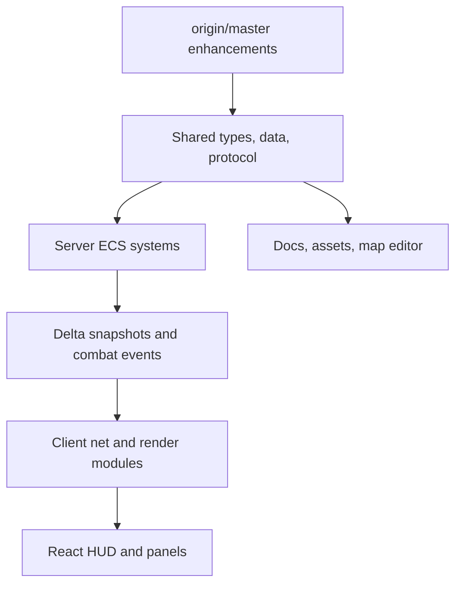
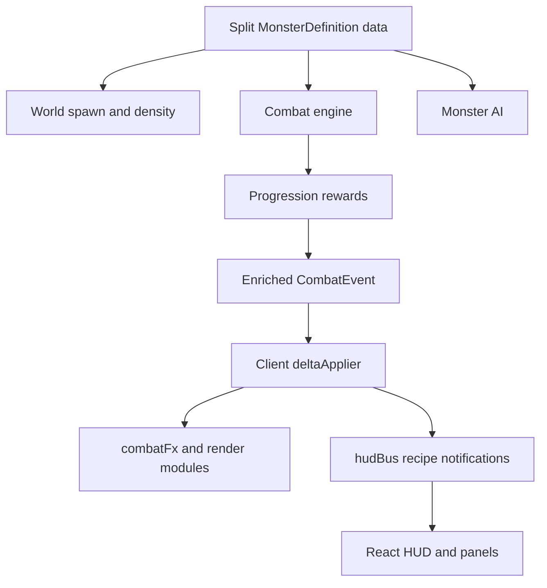

## Architecture

This merge resolves `origin/master` into `optimization/cleanup` as a single merge commit. The merge must preserve master-side gameplay, balance, asset, and UI enhancements while keeping the refactor's architecture authoritative.



Assumptions:

- Current branch is `optimization/cleanup`; upstream target is `origin/master`; merge base is `de8411b`.
- Preferred history is a normal merge commit (`git merge origin/master --no-commit --no-ff`, resolve, then `git merge --continue`).
- Refactor wins on structure: split shared data, ECS component slices, server systems under `combat/`, `defense/`, `player/`, `world/`, thin `GameScene`, and render modules stay intact.
- Master wins on product behavior: charge/slow/evade monsters, per-monster biome XP, recipe toasts, UI QoL, new assets, map editor, attack-speed percent tuning, weapon families, and balance changes are folded into the new homes.
- No runtime gameplay logic should move back into `client/src/scenes/GameScene.ts`; client additions go through `net`, `render`, `fx`, `input`, `hud`, and `ui` boundaries.

## Code Architecture (walkthrough)

Read this section top to bottom; steps are ordered by dependency. Use the **File index** at the end of this section as the quick lookup table for every path touched by the plan.

### Step 1 — Start the merge and preserve refactor ownership

**Goal:** Create the conflict state in a clean working tree and immediately classify each conflict by old master path versus refactor destination. This step exists first because every later edit depends on knowing which files are true content conflicts and which are moved-file modify/delete conflicts.

| File | Symbol | Action | Inputs | Outputs | Logic | Error handling | Dependencies |
| --- | --- | --- | --- | --- | --- | --- | --- |
| repository root | merge operation | verify | `origin/master` | merge conflict state | Run the merge without committing so conflicts can be resolved in-place. | If tree is dirty, stop and ask before stashing or moving user changes. | `git status`, `git fetch origin master` |
| `server/src/systems/*.ts` deleted master leftovers | old flat systems | remove | modify/delete conflicts | no restored flat files | Port behavior into refactor destinations, then remove old files from index. | If a flat file has no mapped destination, pause and inspect before removing. | Step 3 mapping |

Concrete command shape:

```bash
git fetch origin master
git status
git merge origin/master --no-commit --no-ff
git status --short
```

Modify/delete conflict rule:

```bash
# After the replacement behavior exists in refactor paths:
git rm server/src/systems/ai.ts
git rm server/src/systems/combat.ts
git rm server/src/systems/movement.ts
git rm server/src/systems/defenseSystems.ts
git rm server/src/systems/dotT3.ts
git rm server/src/systems/reloadPrototype.ts
git rm server/src/systems/rewards.ts
git rm server/src/systems/stats.ts
git rm server/src/systems/questSystem.ts
git rm server/src/systems/buffSync.ts
```

**Invariant:** No old flat `server/src/systems/*.ts` file should be resurrected when a refactor destination already exists.

### Step 2 — Shared types, protocol, and tuning constants

**Goal:** Make the shared package understand all master-side data before server or client code consumes it. This step creates the type and protocol foundation for every later port.

| File | Symbol | Action | Inputs | Outputs | Logic | Error handling | Dependencies |
| --- | --- | --- | --- | --- | --- | --- | --- |
| [`shared/src/data/monsters/types.ts`](shared/src/data/monsters/types.ts) | `MonsterDefinition` | modify | master monster fields | typed monster behavior fields | Add `biomeXp`, `chargeOnAggro`, `slowEffect`, `evadeEvery`. | TypeScript catches malformed data entries. | none |
| [`shared/src/protocol/combatEvents.ts`](shared/src/protocol/combatEvents.ts) | `CombatEvent` | modify | kill/dodge events | enriched combat event union | Add reward payload to `player-kill`; add `monster-dodge`. | Unknown event kinds should remain exhaustively handled by client dispatch. | monster and rewards data |
| [`shared/src/config/gameConfig.ts`](shared/src/config/gameConfig.ts) | `biomeLevelCap`, `BIOME_XP_ESSENCE_MULT`, `BIOME_TIER_BY_GROUP` | add/modify | player tier, biome group, node map | biome XP cap and fallback XP helpers | Move master tuning into config module and export via barrel. | Default to existing formula only where master lacks per-monster XP. | `NODE_BIOMES` |
| [`shared/src/biomeDatabase.ts`](shared/src/biomeDatabase.ts) | `BiomeDefinition.mobDensity` | modify | biome definitions | spawn density per biome | Add optional `mobDensity` and master pool updates. | Missing density falls back to existing default spawn count. | monster IDs from Step 3 |
| [`shared/src/items.ts`](shared/src/items.ts) | `ItemStats.onHitDamage`, cave essence | modify | item stats | new stat field and cave red essence | Add optional stat, change cave essence blue to red. | Optional field preserves existing items. | recipes |
| [`shared/src/components/combat/buffs.ts`](shared/src/components/combat/buffs.ts) | `BUFF_IDS` | modify | slow/root descriptors | `debuff-slow`, `debuff-root` IDs | Add HUD-safe buff IDs for monster slows. | Compile-time union catches missing descriptor IDs. | server buff descriptors |
| [`shared/src/index.ts`](shared/src/index.ts) | barrel exports | modify | new shared symbols | stable `@mmo-idle/shared` imports | Keep refactor barrel and add exports for new config/protocol symbols. | Avoid restoring monolithic master file. | all shared modules |

Concrete type shape:

```typescript
// shared/src/data/monsters/types.ts
export interface MonsterDefinition {
  rewards: { essence: number; essenceType: EssenceType; level: number; biomeXp?: number };
  chargeOnAggro?: { speedMult: number; durationMs: number };
  slowEffect?: { speedMult: number; durationMs: number };
  evadeEvery?: number;
  // ... existing fields stay unchanged
}
```

```typescript
// shared/src/protocol/combatEvents.ts
export type CombatEvent =
  | {
      kind: 'player-kill';
      attackerId: string;
      targetId: string;
      x: number;
      y: number;
      biomeXpGained?: number;
      essenceGained?: number;
      essenceType?: EssenceType;
    }
  | {
      kind: 'monster-dodge';
      attackerId: string;
      targetId: string;
      x: number;
      y: number;
    }
  // ... existing events
```

```typescript
// shared/src/config/gameConfig.ts
export const BIOME_XP_ESSENCE_MULT = [1.0, 2.0, 1.1, 1.0, 1.0, 1.0] as const;

export function biomeLevelCap(playerTier: number, biomeGroup: string): number {
  if (biomeGroup === 'clearing') return 4;
  return Math.max(4, playerTier * 4);
}
```

**Ordering note:** Do not edit server or client consumers until these types compile in isolation; otherwise conflict resolution will produce cascading false errors.

### Step 3 — Shared data modules

**Goal:** Move master's data and balance work into the refactor's split data modules instead of restoring monolithic database files. This step unlocks server spawn/combat behavior and client recipe/UI behavior.

| File | Symbol | Action | Inputs | Outputs | Logic | Error handling | Dependencies |
| --- | --- | --- | --- | --- | --- | --- | --- |
| [`shared/src/data/monsters/earlyBiomes.ts`](shared/src/data/monsters/earlyBiomes.ts) | monster entries | modify | master monster DB diff | T0/T1/T2 monster balance | Port stat changes, biome XP, charge/slow/evade fields, and new early biome monsters. | Missing monster IDs are caught by biome pools only at runtime, so cross-check pool IDs. | Step 2 monster types |
| [`shared/src/data/monsters/advancedBiomesA.ts`](shared/src/data/monsters/advancedBiomesA.ts) | monster entries | modify | master monster DB diff | jungle/tundra/desert updates | Port new ranged/dot/evade monsters and stat tuning. | Same as above. | Step 2 monster types |
| [`shared/src/data/monsters/advancedBiomesB.ts`](shared/src/data/monsters/advancedBiomesB.ts) | monster entries | modify | master monster DB diff | volcanic/necropolis/abyss updates | Port high-tier tuning and comments. | Same as above. | Step 2 monster types |
| [`shared/src/data/monsters/bossesT1T2.ts`](shared/src/data/monsters/bossesT1T2.ts) | boss entries | modify | master boss stat diff | boss balance and scripts preserved | Port boss HP/attack/rewards updates. | Preserve existing `bossScript` shapes. | Step 2 monster types |
| [`shared/src/data/monsters/bossesT3.ts`](shared/src/data/monsters/bossesT3.ts) | boss entries | modify | master boss stat diff | boss balance preserved | Port master tuning where applicable. | Preserve script stat save/restore semantics. | Step 2 monster types |
| [`shared/src/data/monsters/bossesT4.ts`](shared/src/data/monsters/bossesT4.ts) | boss entries | modify | master boss stat diff | boss balance preserved | Port master tuning where applicable. | Preserve script stat save/restore semantics. | Step 2 monster types |
| [`shared/src/monsterDatabase.ts`](shared/src/monsterDatabase.ts) | shim | modify | content conflict | re-export only | Keep refactor shim; do not restore monolith. | n/a | split monster data |
| [`shared/src/data/recipes/clearingForestMountain.ts`](shared/src/data/recipes/clearingForestMountain.ts) | recipe entries | modify | master recipe diff | unlock order and new forest/mountain recipes | Port boots/charm/armor/weapon order, `forest-pulse-t1`, `gale-needle`, `quake-hammer`. | TypeScript catches malformed `Recipe`. | Step 2 item stats |
| [`shared/src/data/recipes/plainsSwampCave.ts`](shared/src/data/recipes/plainsSwampCave.ts) | recipe entries | modify | master recipe diff | plains/swamp/cave recipes | Port new sacred/burn family item IDs and costs. | TypeScript catches malformed `Recipe`. | weapon effects Step 5 |
| [`shared/src/data/recipes/jungleTundraDesertVolcanic.ts`](shared/src/data/recipes/jungleTundraDesertVolcanic.ts) | recipe entries | modify | master recipe diff | advanced biome recipes | Port `stinger-fang`, `jungle-hunter-t2`, and unlock tuning. | TypeScript catches malformed `Recipe`. | Step 2 biome cap |
| [`shared/src/recipeDatabase.ts`](shared/src/recipeDatabase.ts) | shim | modify | content conflict | re-export only | Keep refactor shim. | n/a | split recipe data |
| [`shared/src/data/skillTree/rootsAndFrames.ts`](shared/src/data/skillTree/rootsAndFrames.ts) | roots/range nodes | modify | master skill diff | `attackSpeedPct` tuning | Replace additive `attackCooldown` deltas with percent APS. | Compile fails if passive key is misspelled. | Step 2 passives |
| [`shared/src/data/skillTree/t3CombatA.ts`](shared/src/data/skillTree/t3CombatA.ts) | T3 nodes | modify | master skill diff | T3 attack-speed tuning | Port relevant `attackSpeedPct` updates. | Compile fails if passive key is misspelled. | Step 2 passives |
| [`shared/src/data/skillTree/t3CombatB.ts`](shared/src/data/skillTree/t3CombatB.ts) | T3 nodes | modify | master skill diff | T3 attack-speed tuning | Port relevant `attackSpeedPct` updates. | Compile fails if passive key is misspelled. | Step 2 passives |
| [`shared/src/skillTree.ts`](shared/src/skillTree.ts) | shim | modify | content conflict | re-export only | Keep refactor shim. | n/a | split skill tree data |
| [`shared/src/skillTree.ts.bak`](shared/src/skillTree.ts.bak) | backup | remove | orphan file | no backup file | Delete refactor backup as bycatch cleanup. | n/a | none |
| [`shared/src/systems/stats.ts`](shared/src/systems/stats.ts) | `recalculatePlayerStats` | modify | `attackSpeedPct` passives | computed cooldown | Calculate cooldown as `baseCooldown / (1 + attackSpeedPct)`, then apply reload final layer. | Clamp to 200ms minimum; preserve current reload multiplier. | skill data |
| [`shared/src/world/nodeBiomes.ts`](shared/src/world/nodeBiomes.ts) | `NODE_BIOMES` | modify | master encoding/comments | same geography | Merge text-only master updates without changing node semantics unless master did. | Compare node count and center node. | biome DB |

Concrete data shapes:

```typescript
// shared/src/data/monsters/earlyBiomes.ts
['boar', {
  id: 'boar',
  // ... existing stats plus master balance
  rewards: { essence: 6, essenceType: 'green', level: 1, biomeXp: 25 },
  chargeOnAggro: { speedMult: 3.5, durationMs: 1200 },
}]

['sand-scorpion', {
  // ... existing fields
  slowEffect: { speedMult: 0.5, durationMs: 2500 },
}]

['giant-spider', {
  // ... existing fields
  evadeEvery: 5,
}]
```

```typescript
// shared/src/systems/stats.ts
const attackSpeedPct = getPassiveTotal(p, 'attackSpeedPct');
p.performsAttack.attackCooldown = Math.max(
  200,
  Math.round(p.performsAttack.attackCooldown / Math.max(0.1, 1 + attackSpeedPct)),
);

if (p.usesSkills.combatArchetype === 'reload') {
  p.dealsDamage.attack = Math.max(1, Math.floor(p.dealsDamage.attack * 0.5));
  p.performsAttack.attackCooldown = Math.max(200, Math.round(p.performsAttack.attackCooldown * 0.5));
}
```

**Invariant:** The old `shared/src/monsterDatabase.ts`, `shared/src/recipeDatabase.ts`, and `shared/src/skillTree.ts` files remain compatibility shims. The canonical data lives under `shared/src/data/`.

### Step 4 — Server combat, movement, progression, and world state

**Goal:** Recreate master's server behavior in ECS-native systems. This step consumes shared data from Steps 2 and 3 and writes authoritative state/events for the client.

| File | Symbol | Action | Inputs | Outputs | Logic | Error handling | Dependencies |
| --- | --- | --- | --- | --- | --- | --- | --- |
| [`shared/src/components/targeting/controlsMonster.ts`](shared/src/components/targeting/controlsMonster.ts) | `ControlsMonster.chargeRemainingMs` | modify | charge data | per-monster charge timer | Store remaining charge duration on the monster AI slice. | Missing field defaults to no charge. | `MonsterDefinition.chargeOnAggro` |
| [`server/src/systems/combat/ai/ai.ts`](server/src/systems/combat/ai/ai.ts) | `updateMonsters`, aggro acquisition branch | modify | monster aggro, `chargeOnAggro` | burst movement speed | On initial aggro, set `chargeRemainingMs`; while positive, multiply speed and do not let kite ramp override charge. | If monster def missing, existing speed path stays unchanged. | `setAggroTarget`, `setEntityMotion` |
| [`server/src/systems/combat/ai/targeting.ts`](server/src/systems/combat/ai/targeting.ts) | `setAggroTarget` | modify | monster, player ID, time | aggro component + charge timer | Trigger charge when aggro target transitions from absent/null to present. | Do not retrigger while same aggro is retained. | `controlsMonster` |
| [`server/src/systems/combat/engine/combatPipeline.ts`](server/src/systems/combat/engine/combatPipeline.ts) | `CombatContext.platingMult`, `makeCombatContext` | modify | attack context | default multiplier 1 | Add field initialized to 1 for all attacks. | Compile catches missing initializer. | combat engine |
| [`server/src/systems/combat/engine/combat.ts`](server/src/systems/combat/engine/combat.ts) | player attack processing | modify | monster `evadeEvery`, `ctx.platingMult`, kill info | dodge, modified damage, enriched kill event | Apply deterministic dodge before damage; multiply plating; push enriched events. | Dodge cancels damage but still consumes attack CD. | rewards, combat events |
| [`server/src/systems/world/movement.ts`](server/src/systems/world/movement.ts) | `updateMovement` speed calculation | modify | `slow` status effect | slowed/rooted movement | Multiply player speed by `status.data.speedMult`; 0 roots. | Missing status means multiplier 1. | status effects |
| [`server/src/systems/classes/archetypes/reload/reloadPrototype.ts`](server/src/systems/classes/archetypes/reload/reloadPrototype.ts) | reload `beforeAttack` listener | modify | reload player attack | `ctx.platingMult = 0.5` | Master reload anti-plating tuning. | Applies only to reload attacks. | combat pipeline |
| [`server/src/systems/classes/archetypes/dot/dotPrototype.ts`](server/src/systems/classes/archetypes/dot/dotPrototype.ts) | max-stack hit handling | modify | hit at max stacks | no tick timer reset | Remove master-fixed max-stack refresh bug. | Preserve duration refresh behavior where intended. | dot status effects |
| [`server/src/systems/classes/archetypes/dot/t3/paths/*`](server/src/systems/classes/archetypes/dot/t3/paths/) | dot T3 path handlers | modify | max-stack hit | no tick timer reset | Apply same bugfix to Fan the Flames, Smoldering, Freezing Cold, etc. | Preserve special Permafrost permanent handling. | dot prototype |
| [`server/src/systems/defense/regen/regenBurst.ts`](server/src/systems/defense/regen/regenBurst.ts) | burst pool deposit/drain | modify | timer and kill events | shorter burst drain, kill burst | Add `defense.kill-burst-pct`; use `BURST_DRAIN_MS = 2000`; timer deposits only in combat. | Clamp HP to max; skip negative pools. | passives, combat listeners |
| [`server/src/systems/defense/shields/damageAbsorb.ts`](server/src/systems/defense/shields/damageAbsorb.ts) | absorb heal drain | modify | absorb pool | no 0.5 gate | Remove master-deleted small-heal gate. | Existing pool zeroing prevents asymptotic trickle. | defense pools |
| [`server/src/systems/player/progression/questSystem.ts`](server/src/systems/player/progression/questSystem.ts) | `registerKillForQuests` | modify | player, monster type | boolean tier advanced | Return whether quest completion advanced tier. | Existing quest state remains authoritative. | rewards |
| [`server/src/systems/player/progression/rewards.ts`](server/src/systems/player/progression/rewards.ts) | `grantMonsterRewards`, `applyBiomeXP`, `checkRecipeUnlocks` | modify | player entity, node, monster | `KillRewardInfo`, recipe unlocks, ascension queue | Use per-monster biome XP; export recipe refresh helper; queue ascensions. | Fallback XP uses essence multiplier if no `biomeXp`. | monster data, quest system |
| [`server/src/systems/combat/buffs/buffSync.ts`](server/src/systems/combat/buffs/buffSync.ts) | slow/root descriptor | modify | player `slow` status | active buff icon | Project `debuff-slow`/`debuff-root` from status effect data. | If missing `totalMs`, omit durationPct. | buff IDs |
| [`server/src/systems/combat/damage/weaponEffects.ts`](server/src/systems/combat/damage/weaponEffects.ts) | weapon families | modify | equipped weapon IDs | chaotic/sacred/burn behavior | Port master family definitions and `updateBurnEffects`. | Unknown weapon IDs do nothing. | recipe item IDs |
| [`server/src/world/World.ts`](server/src/world/World.ts) | `getMobDensity`, `bossRespawnAt`, `pendingAscensions` | modify | node ID, now | spawn density, boss cooldown, ascension queue | Add master world state while preserving ECS queries. | Boss respawn fallback is immediate if no cooldown entry. | biome DB, rewards |
| [`server/src/index.ts`](server/src/index.ts) | debug sockets and logic tick drain | modify | socket events, pending ascensions | reset/refresh behavior, deferred ascension emit | Add debug handlers; drain `world.pendingAscensions` during logic tick. | Confirm destructive reset requires client confirm before emit. | rewards, player lifecycle |

Concrete server shapes:

```typescript
// server/src/systems/combat/engine/combatPipeline.ts
export interface CombatContext {
  attacker: ServerEntity;
  target: ServerEntity;
  damage: number;
  cancelled: boolean;
  platingMult: number;
  metadata: Record<string, unknown>;
}

export function makeCombatContext(/* existing args */): CombatContext {
  return {
    // ... existing fields
    platingMult: 1,
  };
}
```

```typescript
// server/src/systems/combat/engine/combat.ts
function shouldMonsterDodge(monster: MonsterEntity): boolean {
  const evadeEvery = MONSTER_DATABASE.get(monster.controlsMonster.monsterTypeId)?.evadeEvery;
  if (!evadeEvery || evadeEvery < 5) return false;
  const hitsTaken = addCounter(monster.tracksCombat, 'hitsTaken', 1);
  return hitsTaken % evadeEvery === 0;
}

// On dodge:
world.pushEvent(monster.hasPosition.nodeId, {
  kind: 'monster-dodge',
  attackerId: entityNetworkId(player),
  targetId: entityNetworkId(monster),
  x: monster.hasPosition.current.x,
  y: monster.hasPosition.current.y,
});
```

```typescript
// server/src/systems/player/progression/rewards.ts
export interface KillRewardInfo {
  essenceGained: number;
  essenceType: EssenceType;
  biomeXpGained: number;
  tierAdvanced: boolean;
  unlockedRecipes: string[];
}

export function grantMonsterRewards(world: World, player: PlayerEntity, monster: MonsterEntity): KillRewardInfo {
  const def = MONSTER_DATABASE.get(monster.controlsMonster.monsterTypeId);
  const biomeXpGained = def?.rewards.biomeXp ?? fallbackBiomeXp(def, monster.hasPosition.nodeId);
  // ... mutate tracksProgression, quests, recipes
}
```

```typescript
// server/src/index.ts
socket.on('debug:refreshRecipes', () => {
  const player = world.getPlayerBySocket(socket.id);
  if (!player) return;
  checkRecipeUnlocks(player);
  world.markPlayerProgressionDirty(player);
});
```

**Invariant:** Direct mutations to networked slices must call `markSliceDirty`/`mutateSlice`, or go through helpers that already dirty the entity. Lookup-only counters stay in `tracksCombat`.

### Step 5 — Client networking and Phaser render modules

**Goal:** Consume the enriched server protocol without rebuilding the pre-refactor monolithic `GameScene`. This step ports master visual behavior into render modules and scene setup hooks.

| File | Symbol | Action | Inputs | Outputs | Logic | Error handling | Dependencies |
| --- | --- | --- | --- | --- | --- | --- | --- |
| [`client/src/net/deltaApplier.ts`](client/src/net/deltaApplier.ts) | `applyDelta` | modify | `player-kill`, `monster-dodge`, player views | recipe notifications and render events | Diff `unlockedRecipes` for local player; pass enriched combat events to renderer. | Ignore unknown remote recipe deltas for non-local players. | shared protocol |
| [`client/src/render/combatFx.ts`](client/src/render/combatFx.ts) | `dispatchCombatEvent` | modify | enriched events | hit/kill/dodge visuals | Spawn reward floaters for local kill events; optionally show dodge text. | Unknown event kind no-ops or exhaustive compile error. | `killFloaters` |
| [`client/src/render/killFloaters.ts`](client/src/render/killFloaters.ts) | `spawnKillRewardFloaters` | add | scene, event, local player ID | XP/essence text tweens | Render `+N XP` and essence gain above kill position. | Skip if no reward payload. | combat events |
| [`client/src/render/biomeXpBar.ts`](client/src/render/biomeXpBar.ts) | `drawBiomeXpBar` | add | scene state, local player view | screen-space biome XP widget | Draw mastered/capped/progress states above minimap. | Hide when local player missing. | `biomeLevelCap` |
| [`client/src/scenes/game/depth.ts`](client/src/scenes/game/depth.ts) | `DEPTH` | add | n/a | shared layer constants | Centralize master Y-sort/screen depths. | n/a | render modules |
| [`client/src/scenes/game/sceneSetup.ts`](client/src/scenes/game/sceneSetup.ts) | `updateGameScene`, visibility handlers | modify | frame dt, document visibility | capped dt, stable tweens | Cap dt at 100ms; snap interpolation on tab visibility changes; call XP bar render. | Browser without visibility API falls back to normal update. | render modules |
| [`client/src/scenes/game/overlays.ts`](client/src/scenes/game/overlays.ts) | `updateBiomeBackground` | modify | node biome | tiled biome background | Use `BIOME_TEXTURES` where atlas has texture. | Fall back to existing solid background. | sprites |
| [`client/src/input/autoPath.ts`](client/src/input/autoPath.ts) | map navigation start | modify | path request | auto-combat disabled | Send `setAuto(false)` when map navigation starts. | Existing movement path still sends. | intents |
| [`client/src/sprites.ts`](client/src/sprites.ts) | `BIOME_TEXTURES`, `getPlayerFrame` | modify | biome IDs, player class/variant | sprite keys | Add master atlas keys and variant player sprite resolution. | Fall back to existing frame if variant key missing. | assets |

Concrete client shapes:

```typescript
// client/src/render/killFloaters.ts
export function spawnKillRewardFloaters(
  scene: Phaser.Scene,
  event: Extract<CombatEvent, { kind: 'player-kill' }>,
  isLocalKill: boolean,
): void {
  if (!isLocalKill) return;
  if (event.biomeXpGained) {
    // create +XP text at event.x/event.y and tween upward
  }
  if (event.essenceGained && event.essenceType) {
    // create essence text with type color and tween upward
  }
}
```

```typescript
// client/src/render/biomeXpBar.ts
export function drawBiomeXpBar(
  scene: Phaser.Scene,
  state: RenderState,
  localPlayerId: string | null,
): void {
  const view = localPlayerId ? state.playerViews.get(localPlayerId) : undefined;
  if (!view) return;
  // read biome XP/level from view.tracksProgression and render fixed-screen bar
}
```

```typescript
// client/src/scenes/game/sceneSetup.ts
const cappedDt = Math.min(dt, 100);
stepInterpolation(state, cappedDt);
drawBiomeXpBar(scene, state, scene.localPlayerId);
```

**Ordering note:** Network handling stays in `deltaApplier`; per-frame drawing stays in `sceneSetup` and `render/*`; background/chrome stays in `overlays`.

### Step 6 — React HUD, panels, debug intents, and toast layer

**Goal:** Port master UI QoL into React/HUD boundaries and outbound intent helpers instead of Phaser scene event spaghetti.

| File | Symbol | Action | Inputs | Outputs | Logic | Error handling | Dependencies |
| --- | --- | --- | --- | --- | --- | --- | --- |
| [`client/index.html`](client/index.html) | `#toast-overlay` | modify | HTML document | toast mount point | Add sibling div for recipe toasts. | If missing, React mount should fail visibly in dev. | main.ts |
| [`client/src/main.ts`](client/src/main.ts) | React roots | modify | DOM node | mounted `RecipeToastLayer` | Mount toast layer separately from HUD root. | Guard missing node in dev. | RecipeToastLayer |
| [`client/src/hud/RecipeToastLayer.tsx`](client/src/hud/RecipeToastLayer.tsx) | component | add | recipe unlock notifications | transient toasts | Subscribe to hudBus, render 5s top-center unlock toasts. | Unsubscribe on unmount. | hudBus |
| [`client/src/hudBus.ts`](client/src/hudBus.ts) | notification/debug APIs | modify | recipe IDs, debug requests | subscribers and CustomEvents | Add `subscribeRecipeUnlock`, `notifyRecipeUnlock`, `requestResetProgress`, `requestRefreshRecipes`. | Subscriber errors should not break all listeners. | HUD components |
| [`client/src/input/hudEvents.ts`](client/src/input/hudEvents.ts) | debug event bridge | modify | HUD CustomEvents | socket intents | Route reset/refresh requests to `intents.ts`. | No socket means no-op/log. | intents |
| [`client/src/net/intents.ts`](client/src/net/intents.ts) | `sendDebugResetProgress`, `sendDebugRefreshRecipes` | add | none | socket emits | Wrap debug socket emits. | No socket means existing guard behavior. | server index |
| [`client/src/hud/DebugPanel.tsx`](client/src/hud/DebugPanel.tsx) | reset/refresh buttons | modify | clicks | debug requests | Confirm reset, then request progress reset; refresh recipes directly. | User can cancel reset confirm. | hudBus |
| [`client/src/hud/EssencePanel.tsx`](client/src/hud/EssencePanel.tsx) | essence flash | modify | essence gained event | row animation | Flash matching essence row on gain. | Missing row no-ops. | hudBus/window event |
| [`client/src/hud/MenuButtons.tsx`](client/src/hud/MenuButtons.tsx) | badges/highlights | modify | player view, unlocks, quest action | forge badge, skill pulse, dungeon finder | Add master visual states and map focus request. | Missing dungeon list shows existing behavior. | MapPanel |
| [`client/src/hud/MobileHUD.tsx`](client/src/hud/MobileHUD.tsx) | skill highlight | modify | skill points | drawer highlight | Mirror desktop skill-point highlight. | n/a | HUD state |
| [`client/src/hud/hud.css`](client/src/hud/hud.css) | CSS classes | modify | class names | badge/pulse styles | Add master UI styles. | n/a | HUD components |
| [`client/src/hud/essence.css`](client/src/hud/essence.css) | CSS classes | modify | flash class | essence flash animation | Add row flash animation. | n/a | EssencePanel |
| [`client/src/ui/InventoryPanel.tsx`](client/src/ui/InventoryPanel.tsx) | filters/detail pane | modify | inventory/equipment | filtered grid and item detail | Add biome/slot/tier filters, detail pane, tier pips. | Empty filter state is user-visible. | inventory CSS |
| [`client/src/ui/inventory.css`](client/src/ui/inventory.css) | styles | modify | class names | filter/detail styling | Add master styles. | n/a | InventoryPanel |
| [`client/src/ui/CraftingPanel.tsx`](client/src/ui/CraftingPanel.tsx) | forge filters | modify | recipes/player progress | tier filter, owned/equipped badges | Use `biomeLevelCap`, sort owned last, disable owned craft. | Craft button remains disabled on invalid craft. | shared config |
| [`client/src/ui/crafting.css`](client/src/ui/crafting.css) | styles | modify | class names | forge filter styles | Add master styles. | n/a | CraftingPanel |
| [`client/src/ui/MapPanel.tsx`](client/src/ui/MapPanel.tsx) | focus/highlights | modify | `highlightNodes`, `focusNodeId` | highlighted dungeon nodes | Add map focus support and biome cap display. | Invalid focus falls back to player node. | QuestPanel |
| [`client/src/ui/map.css`](client/src/ui/map.css) | styles | modify | highlight class | highlighted tile CSS | Add master highlight styles. | n/a | MapPanel |
| [`client/src/ui/QuestPanel.tsx`](client/src/ui/QuestPanel.tsx) | dungeon finder | modify | current tier quests | clickable locate action | Sort dungeons by Manhattan distance and request map focus. | If no dungeons, show existing quest UI. | MapPanel |

Concrete HUD shapes:

```typescript
// client/src/hudBus.ts
type RecipeUnlockListener = (recipeId: string) => void;

export function subscribeRecipeUnlock(listener: RecipeUnlockListener): () => void {
  recipeUnlockListeners.add(listener);
  return () => recipeUnlockListeners.delete(listener);
}

export function notifyRecipeUnlock(recipeId: string): void {
  for (const listener of recipeUnlockListeners) listener(recipeId);
}

export function requestResetProgress(): void {
  window.dispatchEvent(new CustomEvent('hud:resetProgress'));
}
```

```tsx
// client/src/hud/RecipeToastLayer.tsx
export function RecipeToastLayer() {
  const [toasts, setToasts] = useState<RecipeToast[]>([]);

  useEffect(() => subscribeRecipeUnlock((recipeId) => {
    const id = `${recipeId}:${Date.now()}`;
    setToasts((prev) => [...prev, { id, recipeId }]);
    window.setTimeout(() => setToasts((prev) => prev.filter((toast) => toast.id !== id)), 5000);
  }), []);

  return <div className="recipe-toast-layer">{/* toast cards */}</div>;
}
```

**Invariant:** React emits intents through `hudBus`/CustomEvents and `client/src/net/intents.ts`; Phaser does not import React components.

### Step 7 — Assets, docs, and cleanup

**Goal:** Complete non-code merge outputs, keep documentation aligned with the final architecture, and remove known bycatch from the refactor branch.

| File | Symbol | Action | Inputs | Outputs | Logic | Error handling | Dependencies |
| --- | --- | --- | --- | --- | --- | --- | --- |
| [`client/public/assets/biome_abyss.png`](client/public/assets/biome_abyss.png) | binary asset | add | master asset | biome texture | Take master verbatim. | n/a | sprites |
| [`client/public/assets/biome_desert.png`](client/public/assets/biome_desert.png) | binary asset | add | master asset | biome texture | Take master verbatim. | n/a | sprites |
| [`client/public/assets/biome_jungle.png`](client/public/assets/biome_jungle.png) | binary asset | add | master asset | biome texture | Take master verbatim. | n/a | sprites |
| [`client/public/assets/biome_necropolis.png`](client/public/assets/biome_necropolis.png) | binary asset | add | master asset | biome texture | Take master verbatim. | n/a | sprites |
| [`client/public/assets/biome_tundra.png`](client/public/assets/biome_tundra.png) | binary asset | add | master asset | biome texture | Take master verbatim. | n/a | sprites |
| [`client/public/assets/biome_volcano.png`](client/public/assets/biome_volcano.png) | binary asset | add | master asset | biome texture | Take master verbatim. | n/a | sprites |
| [`client/public/assets/sprites.json`](client/public/assets/sprites.json) | atlas metadata | modify | master atlas | expanded frames | Take master atlas metadata, then confirm frame names match `sprites.ts`. | Missing frame fails visually; spot-check in dev. | sprites |
| [`client/public/assets/sprites.png`](client/public/assets/sprites.png) | atlas image | modify | master atlas | expanded sprites | Take master binary. | n/a | sprites |
| [`map-editor.html`](map-editor.html) | map editor | modify | master rewrite | brush editor | Take master brush-based editor verbatim unless refactor docs require text changes. | Open locally if syntax issues suspected. | `NODE_BIOMES` |
| [`.claude/settings.local.json`](.claude/settings.local.json) | allowed tools | modify | master settings | merged allowlist | Keep existing local settings, add sqlite3 query allowance. | Avoid deleting user-local entries. | none |
| [`CLAUDE.md`](CLAUDE.md) | project docs | modify | both branches | merged architecture docs | Keep refactor ECS sections, add master notes: mob density, boss respawn, charge/slow/evade, Y-sort depths, tab fix, biome cap, `monster-dodge`, attack-speed %, weapon families, DoT max-stack fix. | Avoid documenting unbuilt features. | final code behavior |
| [`BALANCE_REFERENCE.md`](BALANCE_REFERENCE.md) | balance docs | modify | master docs | current formulas | Take master attack-speed/plating formulas and class/range tables, then adjust if final code differs. | Docs must match final `stats.ts`. | shared stats |
| `server/src/systems/classes/dot/` | orphan tree | remove | stale refactor copies | no duplicate dot tree | Delete stale non-archetype dot files if present. | Confirm registry imports `archetypes/dot`. | classes registry |
| `server/src/systems/classes/cooldown/` | orphan tree | remove | stale refactor copies | no duplicate cooldown tree | Delete stale non-archetype cooldown files if present. | Confirm registry imports `archetypes/cooldown`. | classes registry |

Concrete cleanup commands:

```bash
git rm -r server/src/systems/classes/dot server/src/systems/classes/cooldown
git rm shared/src/skillTree.ts.bak
```

**Note:** If either orphan path is already absent after conflict resolution, do not recreate it.

### Step 8 — Verification and merge finalization

**Goal:** Prove the resolved tree compiles, boots, and preserves the master enhancements before finalizing the merge commit.

| File | Symbol | Action | Inputs | Outputs | Logic | Error handling | Dependencies |
| --- | --- | --- | --- | --- | --- | --- | --- |
| repository root | TypeScript validation | verify | full workspace | compile result | Run workspace typecheck. | Fix introduced errors before finalizing. | Steps 2-7 |
| server runtime | dev boot | verify | `pnpm dev:server` | marker/network invariant logs | Confirm ECS marker and network invariants pass. | Stop and inspect invariant failure. | server steps |
| client runtime | dev boot | verify | `pnpm dev:client` | playable client | Smoke test kill reward, slow/root buff, recipe toast, map focus, inventory filters. | Record missing visual as follow-up only if not protocol-breaking. | client steps |
| repository root | merge commit | verify | staged resolved files | merge commit | `git status`, `git add -A`, `git merge --continue`. | Do not push unless separately requested. | verification pass |

Concrete verification commands:

```bash
pnpm install
pnpm -r exec tsc --noEmit
pnpm dev:server
pnpm dev:client
git status
git add -A
git merge --continue
```

Manual smoke checklist:

- Kill a monster and see `player-kill` still animate, plus XP/essence payload in client behavior.
- Unlock a recipe and see `RecipeToastLayer` toast.
- Fight `sand-scorpion` or `stone-basilisk` and see slow/root buff plus movement effect.
- Fight an `evadeEvery` monster and confirm every Nth player hit dodges without damage.
- Start map navigation and confirm auto-combat turns off.
- Enter a dungeon node, kill boss, confirm boss respawn cooldown behavior.

### File index

| File | Purpose |
| --- | --- |
| [`.claude/settings.local.json`](.claude/settings.local.json) | Merge local tooling allowlist from master without deleting existing entries. |
| [`BALANCE_REFERENCE.md`](BALANCE_REFERENCE.md) | Document final attack-speed, plating multiplier, and class/range balance formulas. |
| [`CLAUDE.md`](CLAUDE.md) | Keep refactor architecture docs plus master behavior notes. |
| [`client/index.html`](client/index.html) | Add `#toast-overlay` mount point. |
| [`client/public/assets/biome_abyss.png`](client/public/assets/biome_abyss.png) | New biome texture asset from master. |
| [`client/public/assets/biome_desert.png`](client/public/assets/biome_desert.png) | New biome texture asset from master. |
| [`client/public/assets/biome_jungle.png`](client/public/assets/biome_jungle.png) | New biome texture asset from master. |
| [`client/public/assets/biome_necropolis.png`](client/public/assets/biome_necropolis.png) | New biome texture asset from master. |
| [`client/public/assets/biome_tundra.png`](client/public/assets/biome_tundra.png) | New biome texture asset from master. |
| [`client/public/assets/biome_volcano.png`](client/public/assets/biome_volcano.png) | New biome texture asset from master. |
| [`client/public/assets/sprites.json`](client/public/assets/sprites.json) | Expanded sprite atlas metadata from master. |
| [`client/public/assets/sprites.png`](client/public/assets/sprites.png) | Expanded sprite atlas image from master. |
| [`client/src/hud/DebugPanel.tsx`](client/src/hud/DebugPanel.tsx) | Add reset progress and refresh recipes UI. |
| [`client/src/hud/EssencePanel.tsx`](client/src/hud/EssencePanel.tsx) | Add essence-gain row flash. |
| [`client/src/hud/MenuButtons.tsx`](client/src/hud/MenuButtons.tsx) | Add forge badge, skill pulse, quest-map integration. |
| [`client/src/hud/MobileHUD.tsx`](client/src/hud/MobileHUD.tsx) | Mirror skill-point highlight on mobile drawer. |
| [`client/src/hud/RecipeToastLayer.tsx`](client/src/hud/RecipeToastLayer.tsx) | New recipe unlock toast component. |
| [`client/src/hud/essence.css`](client/src/hud/essence.css) | Essence flash animation styles. |
| [`client/src/hud/hud.css`](client/src/hud/hud.css) | HUD badge/pulse/clickable quest styles. |
| [`client/src/hudBus.ts`](client/src/hudBus.ts) | Recipe unlock and debug request pub/sub APIs. |
| [`client/src/input/autoPath.ts`](client/src/input/autoPath.ts) | Disable auto-combat when map navigation begins. |
| [`client/src/input/hudEvents.ts`](client/src/input/hudEvents.ts) | Bridge debug HUD CustomEvents to socket intents. |
| [`client/src/main.ts`](client/src/main.ts) | Mount recipe toast React root. |
| [`client/src/net/deltaApplier.ts`](client/src/net/deltaApplier.ts) | Consume enriched combat events and detect recipe unlocks. |
| [`client/src/net/intents.ts`](client/src/net/intents.ts) | Add debug reset/refresh socket wrappers. |
| [`client/src/render/biomeXpBar.ts`](client/src/render/biomeXpBar.ts) | New fixed-screen biome XP widget renderer. |
| [`client/src/render/combatFx.ts`](client/src/render/combatFx.ts) | Dispatch enriched kill/dodge events and reward floaters. |
| [`client/src/render/killFloaters.ts`](client/src/render/killFloaters.ts) | New XP/essence floater renderer. |
| [`client/src/scenes/game/depth.ts`](client/src/scenes/game/depth.ts) | Shared Phaser depth constants. |
| [`client/src/scenes/game/overlays.ts`](client/src/scenes/game/overlays.ts) | Render biome texture backgrounds. |
| [`client/src/scenes/game/sceneSetup.ts`](client/src/scenes/game/sceneSetup.ts) | Add dt cap, visibility handling, and XP bar call. |
| [`client/src/sprites.ts`](client/src/sprites.ts) | Add atlas frame mappings and biome texture keys. |
| [`client/src/ui/CraftingPanel.tsx`](client/src/ui/CraftingPanel.tsx) | Add tier filters, owned/equipped badges, biome cap usage. |
| [`client/src/ui/InventoryPanel.tsx`](client/src/ui/InventoryPanel.tsx) | Add item details, filters, and tier pips. |
| [`client/src/ui/MapPanel.tsx`](client/src/ui/MapPanel.tsx) | Add dungeon highlight/focus props and biome cap display. |
| [`client/src/ui/QuestPanel.tsx`](client/src/ui/QuestPanel.tsx) | Add clickable dungeon finder. |
| [`client/src/ui/crafting.css`](client/src/ui/crafting.css) | Forge filter and badge styles. |
| [`client/src/ui/inventory.css`](client/src/ui/inventory.css) | Inventory filter/detail styles. |
| [`client/src/ui/map.css`](client/src/ui/map.css) | Map highlight styles. |
| [`map-editor.html`](map-editor.html) | Take master brush-based map editor rewrite. |
| [`server/src/index.ts`](server/src/index.ts) | Add debug sockets and pending ascension drain. |
| [`server/src/systems/ai.ts`](server/src/systems/ai.ts) | Remove old flat system after porting behavior. |
| [`server/src/systems/buffSync.ts`](server/src/systems/buffSync.ts) | Remove old flat system after porting behavior. |
| [`server/src/systems/classes/archetypes/dot/dotPrototype.ts`](server/src/systems/classes/archetypes/dot/dotPrototype.ts) | Apply DoT max-stack tick bugfix. |
| [`server/src/systems/classes/archetypes/dot/t3/paths/`](server/src/systems/classes/archetypes/dot/t3/paths/) | Apply DoT T3 max-stack bugfixes. |
| [`server/src/systems/classes/archetypes/dot/t3/ticks/`](server/src/systems/classes/archetypes/dot/t3/ticks/) | Preserve T3 tick semantics while applying bugfixes. |
| [`server/src/systems/classes/archetypes/reload/reloadPrototype.ts`](server/src/systems/classes/archetypes/reload/reloadPrototype.ts) | Add reload plating multiplier behavior. |
| [`server/src/systems/classes/cooldown/`](server/src/systems/classes/cooldown/) | Remove stale orphan tree. |
| [`server/src/systems/classes/dot/`](server/src/systems/classes/dot/) | Remove stale orphan tree. |
| [`server/src/systems/combat.ts`](server/src/systems/combat.ts) | Remove old flat system after porting behavior. |
| [`server/src/systems/combat/ai/ai.ts`](server/src/systems/combat/ai/ai.ts) | Add charge-on-aggro movement behavior. |
| [`server/src/systems/combat/ai/targeting.ts`](server/src/systems/combat/ai/targeting.ts) | Trigger charge on new aggro acquisition. |
| [`server/src/systems/combat/buffs/buffSync.ts`](server/src/systems/combat/buffs/buffSync.ts) | Project slow/root status as active buffs. |
| [`server/src/systems/combat/damage/weaponEffects.ts`](server/src/systems/combat/damage/weaponEffects.ts) | Port master weapon families. |
| [`server/src/systems/combat/engine/combat.ts`](server/src/systems/combat/engine/combat.ts) | Add evasion, slow application, plating multiplier, enriched kill events. |
| [`server/src/systems/combat/engine/combatPipeline.ts`](server/src/systems/combat/engine/combatPipeline.ts) | Add `CombatContext.platingMult`. |
| [`server/src/systems/defense/regen/regenBurst.ts`](server/src/systems/defense/regen/regenBurst.ts) | Port kill burst and shorter burst drain. |
| [`server/src/systems/defense/shields/damageAbsorb.ts`](server/src/systems/defense/shields/damageAbsorb.ts) | Remove small-heal gate. |
| [`server/src/systems/defenseSystems.ts`](server/src/systems/defenseSystems.ts) | Remove old flat system after porting behavior. |
| [`server/src/systems/dotT3.ts`](server/src/systems/dotT3.ts) | Remove old flat system after porting behavior. |
| [`server/src/systems/movement.ts`](server/src/systems/movement.ts) | Remove old flat system after porting behavior. |
| [`server/src/systems/player/progression/questSystem.ts`](server/src/systems/player/progression/questSystem.ts) | Return quest tier advancement state. |
| [`server/src/systems/player/progression/rewards.ts`](server/src/systems/player/progression/rewards.ts) | Port per-monster biome XP, kill reward info, recipe refresh export. |
| [`server/src/systems/questSystem.ts`](server/src/systems/questSystem.ts) | Remove old flat system after porting behavior. |
| [`server/src/systems/reloadPrototype.ts`](server/src/systems/reloadPrototype.ts) | Remove old flat system after porting behavior. |
| [`server/src/systems/rewards.ts`](server/src/systems/rewards.ts) | Remove old flat system after porting behavior. |
| [`server/src/systems/stats.ts`](server/src/systems/stats.ts) | Remove old flat system after confirming shared stats replacement. |
| [`server/src/systems/world/movement.ts`](server/src/systems/world/movement.ts) | Apply slow/root movement multiplier. |
| [`server/src/world/World.ts`](server/src/world/World.ts) | Add mob density, boss respawn cooldown, pending ascensions. |
| [`shared/src/biomeDatabase.ts`](shared/src/biomeDatabase.ts) | Add mob density and master monster pool changes. |
| [`shared/src/components/combat/buffs.ts`](shared/src/components/combat/buffs.ts) | Add slow/root buff IDs. |
| [`shared/src/components/targeting/controlsMonster.ts`](shared/src/components/targeting/controlsMonster.ts) | Store charge timer in AI slice. |
| [`shared/src/config/gameConfig.ts`](shared/src/config/gameConfig.ts) | Add biome cap and XP multiplier helpers. |
| [`shared/src/data/monsters/advancedBiomesA.ts`](shared/src/data/monsters/advancedBiomesA.ts) | Port advanced monster changes. |
| [`shared/src/data/monsters/advancedBiomesB.ts`](shared/src/data/monsters/advancedBiomesB.ts) | Port high-tier monster changes. |
| [`shared/src/data/monsters/bossesT1T2.ts`](shared/src/data/monsters/bossesT1T2.ts) | Port boss balance changes. |
| [`shared/src/data/monsters/bossesT3.ts`](shared/src/data/monsters/bossesT3.ts) | Port boss balance changes. |
| [`shared/src/data/monsters/bossesT4.ts`](shared/src/data/monsters/bossesT4.ts) | Port boss balance changes. |
| [`shared/src/data/monsters/earlyBiomes.ts`](shared/src/data/monsters/earlyBiomes.ts) | Port early biome monster changes. |
| [`shared/src/data/monsters/types.ts`](shared/src/data/monsters/types.ts) | Add master monster behavior fields. |
| [`shared/src/data/recipes/clearingForestMountain.ts`](shared/src/data/recipes/clearingForestMountain.ts) | Port clearing/forest/mountain recipes. |
| [`shared/src/data/recipes/jungleTundraDesertVolcanic.ts`](shared/src/data/recipes/jungleTundraDesertVolcanic.ts) | Port advanced biome recipes. |
| [`shared/src/data/recipes/plainsSwampCave.ts`](shared/src/data/recipes/plainsSwampCave.ts) | Port plains/swamp/cave recipes. |
| [`shared/src/data/skillTree/rootsAndFrames.ts`](shared/src/data/skillTree/rootsAndFrames.ts) | Port `attackSpeedPct` root/range tuning. |
| [`shared/src/data/skillTree/t3CombatA.ts`](shared/src/data/skillTree/t3CombatA.ts) | Port `attackSpeedPct` T3 tuning. |
| [`shared/src/data/skillTree/t3CombatB.ts`](shared/src/data/skillTree/t3CombatB.ts) | Port `attackSpeedPct` T3 tuning. |
| [`shared/src/index.ts`](shared/src/index.ts) | Keep barrel exports current. |
| [`shared/src/items.ts`](shared/src/items.ts) | Add `onHitDamage` and cave red essence. |
| [`shared/src/monsterDatabase.ts`](shared/src/monsterDatabase.ts) | Keep re-export shim. |
| [`shared/src/protocol/combatEvents.ts`](shared/src/protocol/combatEvents.ts) | Add enriched kill and dodge event payloads. |
| [`shared/src/recipeDatabase.ts`](shared/src/recipeDatabase.ts) | Keep re-export shim. |
| [`shared/src/skillTree.ts`](shared/src/skillTree.ts) | Keep re-export shim. |
| [`shared/src/skillTree.ts.bak`](shared/src/skillTree.ts.bak) | Remove orphan backup. |
| [`shared/src/systems/stats.ts`](shared/src/systems/stats.ts) | Consume `attackSpeedPct` and preserve reload final multiplier. |
| [`shared/src/world/nodeBiomes.ts`](shared/src/world/nodeBiomes.ts) | Merge master text updates without semantic drift. |

## Data and Control Flow

### Before changes

The refactor branch already has the desired structure: shared data is split, server behavior is ECS-native, combat events flow through deltas, and the client renders through per-concern modules. It does not yet include the latest master enhancements: monster charge/slow/evade behavior, per-monster biome XP rewards, recipe toasts, several UI quality-of-life additions, new assets, and attack-speed percent balancing.

Master has those product changes, but many are implemented in old flat files (`server/src/systems/combat.ts`, monolithic `GameScene.ts`, monolithic shared DB files). Directly accepting master would regress the architecture.

### After changes

The refactor structure remains the only architecture. Master behavior is folded into the correct new homes:



### Primary call path — kill rewards and recipe unlocks

1. Server combat resolves a player hit in [`server/src/systems/combat/engine/combat.ts`](server/src/systems/combat/engine/combat.ts).
2. If the hit kills the monster, combat calls `grantMonsterRewards(world, player, monster)` in [`server/src/systems/player/progression/rewards.ts`](server/src/systems/player/progression/rewards.ts).
3. Rewards read `MonsterDefinition.rewards.biomeXp` or fallback to `BIOME_XP_ESSENCE_MULT`; they mutate `tracksProgression`, unlock recipes, and return `KillRewardInfo`.
4. Combat pushes `player-kill` with `biomeXpGained`, `essenceGained`, and `essenceType`.
5. `World.buildNodeDelta()` drains events into the next `node:delta`.
6. [`client/src/net/deltaApplier.ts`](client/src/net/deltaApplier.ts) applies player state, diffs local `unlockedRecipes`, calls `hudBus.notifyRecipeUnlock`, and dispatches combat events.
7. [`client/src/render/combatFx.ts`](client/src/render/combatFx.ts) triggers kill FX and [`client/src/render/killFloaters.ts`](client/src/render/killFloaters.ts).
8. [`client/src/hud/RecipeToastLayer.tsx`](client/src/hud/RecipeToastLayer.tsx) renders unlock toasts through the `hudBus` subscription.

### Primary call path — monster charge, slow, and evade

1. Monster data in `shared/src/data/monsters/*.ts` declares `chargeOnAggro`, `slowEffect`, or `evadeEvery`.
2. [`server/src/systems/combat/ai/targeting.ts`](server/src/systems/combat/ai/targeting.ts) sets aggro; when aggro begins, it initializes the monster's charge timer.
3. [`server/src/systems/combat/ai/ai.ts`](server/src/systems/combat/ai/ai.ts) applies charge speed while the timer remains.
4. [`server/src/systems/combat/engine/combat.ts`](server/src/systems/combat/engine/combat.ts) checks `evadeEvery` before player damage and pushes `monster-dodge` on dodge.
5. On monster hit against player, combat applies the `slow` status effect with numeric `speedMult` and duration data.
6. [`server/src/systems/world/movement.ts`](server/src/systems/world/movement.ts) reads `slow` status and applies movement multiplier.
7. [`server/src/systems/combat/buffs/buffSync.ts`](server/src/systems/combat/buffs/buffSync.ts) projects slow/root into `hasStatus.activeBuffs`.
8. Client `BuffBar` renders the status without bespoke slow UI code.

### Alternate path — debug reset and recipe refresh

1. [`client/src/hud/DebugPanel.tsx`](client/src/hud/DebugPanel.tsx) emits a confirmed reset or refresh request through [`client/src/hudBus.ts`](client/src/hudBus.ts).
2. [`client/src/input/hudEvents.ts`](client/src/input/hudEvents.ts) routes the request to [`client/src/net/intents.ts`](client/src/net/intents.ts).
3. [`server/src/index.ts`](server/src/index.ts) receives `debug:resetProgress` or `debug:refreshRecipes`.
4. Reset clears progress/equipment/archetype runtime state and recalculates stats; refresh runs exported `checkRecipeUnlocks`.
5. Server marks mutated networked slices dirty so the next delta refreshes HUD state.

### Cleanup path

1. After behavior is ported, remove old modify/delete conflict files from the merge index.
2. Remove stale orphan directories `server/src/systems/classes/dot/` and `server/src/systems/classes/cooldown/`.
3. Remove `shared/src/skillTree.ts.bak`.
4. Run typecheck to ensure no imports still point at deleted paths.

## Rule Alignment

- Server authority is preserved: charge, slow, evade, rewards, boss respawn, and debug resets all run on the server; the client only renders state and sends intents.
- ECS component presence stays authoritative: aggro, motion, archetype behavior, buffs, and status projection use existing slices/helpers instead of flat nullable fields.
- Networked slice mutations must dirty state: progression, status, health, inventory, and skill changes go through existing dirty helpers or world lifecycle helpers.
- Combat animation remains event-driven: kill rewards and dodges use `world.pushEvent` and `CombatEvent`; no per-tick animation booleans are introduced.
- Shared data remains modular: `monsterDatabase.ts`, `recipeDatabase.ts`, and `skillTree.ts` stay compatibility shims over `shared/src/data/*`.
- React HUD and Phaser stay separated: HUD uses `hudBus` and outbound intents; Phaser render additions live under `client/src/render` and scene setup.
- TypeScript strictness stays intact: new status effect data uses numeric fields; no `any` or stringly status data is introduced.

## Risks and validation

Risks:

- `attackSpeedPct` migration can silently skew combat pacing if any skill node keeps old `attackCooldown` deltas.
- `platingMult` must default to `1` in every combat context; missing initialization would produce `NaN` damage math.
- `chargeOnAggro` should not retrigger every tick while aggro is retained.
- `evadeEvery` must count incoming player hits on the monster, not outgoing attacks.
- Slow/root uses `tracksCombat.statusEffects`; movement and buff projection must agree on `data.speedMult` and duration data.
- Recipe unlock toasts depend on diffing local player state only; diffing all players would create false toasts.
- Binary atlas changes can compile but fail visually if `sprites.ts` references stale frame names.

Validation:

```bash
pnpm install
pnpm -r exec tsc --noEmit
pnpm dev:server
pnpm dev:client
```

Manual checks:

- Dev server prints marker and network invariant success.
- Kill reward event includes XP/essence payload and client shows floaters.
- Recipe unlock creates one toast and does not repeat every delta.
- Slow/root monster visibly affects movement and shows a BuffBar tile.
- `evadeEvery` monster dodges every Nth incoming player hit and takes no damage for that hit.
- Reload attacks apply half plating through `ctx.platingMult`.
- Boss kill starts the respawn cooldown.
- Inventory filters, crafting tier filter, map dungeon focus, quest locate action, and mobile skill-point highlight still work.
- `git status` has no unmerged paths before `git merge --continue`.

## Out of scope (follow-ups)

- Do not redesign the conflict strategy into a rebase; final history remains one merge commit.
- Do not implement new client dodge VFX beyond a minimal `monster-dodge` dispatch/floater if convenient; master had no full dodge VFX.
- Do not implement Reload T3 or Cooldown heavy T3 as part of this merge.
- Do not change deployment, auth, persistence schema, or node routing beyond what the merge requires.
- Do not rebalance beyond preserving master tuning unless validation finds an obvious broken value caused by the merge.
