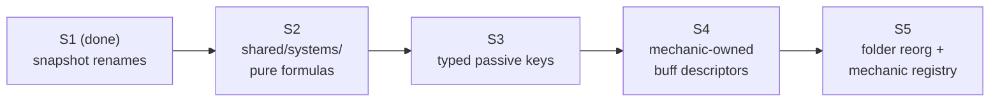
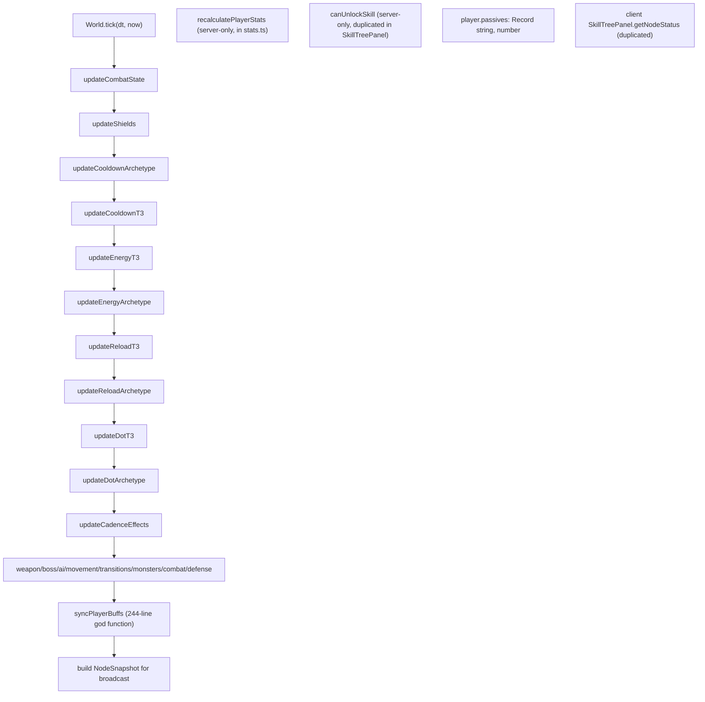
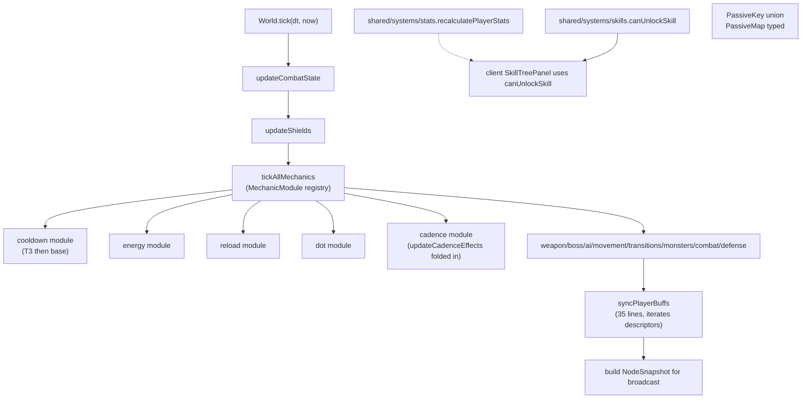

# Server Phase 2 — Pure Formulas, Typed Passives, Buff Descriptors, Folder Reorg

Implements [.cursor/design/server.md](.cursor/design/server.md) chunks **S2 → S3 → S4 → S5**. S1 is already complete (`PlayerSnapshot`/`MonsterSnapshot` are live with `PlayerState`/`MonsterState` aliases in [shared/src/index.ts](shared/src/index.ts) lines 79, 269, 330, 337). Each chunk lands as one focused commit so any regression points to exactly one revertable change.

---

## Architecture



**Invariants preserved across all four steps:**

- Server remains the only source of truth for simulation; `shared/` stays import-clean (no Phaser, Socket.IO, SQLite, Express, miniplex).
- Wire snapshot shape (`PlayerSnapshot`, `MonsterSnapshot`, `PlayerBuff`, `NodeSnapshot`) is byte-identical end-to-end so the client builds and runs unmodified during all four commits. S1's `PlayerState`/`MonsterState` aliases stay until client refactor C7.
- Split-tick loop (10 Hz logic, 5 Hz broadcast) is untouched.
- Combat pipeline phases (`beforeAttack` → `onAttack` → `onHit` → `onDamageTaken` → `afterHit` → `onKill`) and per-listener ordering remain stable.
- Persistence schema and hydration in [server/src/db/playerRepo.ts](server/src/db/playerRepo.ts) are untouched; passives are runtime-only (`{}` on hydrate).
- `recalculatePlayerStats` continues to mutate a passed-in `PlayerSnapshot` draft — this satisfies the PRD purity rule ("no world mutation, no clocks, no random, no I/O") because the draft is an explicit input, not external state.

---

## Code Architecture (walkthrough)

Read this section top to bottom. Each step depends on the previous one. The **File index** at the end is the canonical list of every path touched.

### Step 1 — S2: Pure Formula Extraction

**Goal:** Create the `shared/src/systems/` folder and move pure helpers off the server so the client can share them. Server files become one-line re-exports so call sites do not move. This unblocks S3 (which retypes those helpers' inputs) and the eventual client tooltip work.

#### A. New shared modules

| File                                                                 | Symbol                                                              | Action | Logic                                                                                                                                                                                                       | Dependencies                                                                               |
| -------------------------------------------------------------------- | ------------------------------------------------------------------- | ------ | ----------------------------------------------------------------------------------------------------------------------------------------------------------------------------------------------------------- | ------------------------------------------------------------------------------------------ |
| [shared/src/components/effects.ts](shared/src/components/effects.ts) | `StatusEffect` (re-export shape)                                    | add    | Minimal shared type for `{ id, stacks, maxStacks, data, remainingMs, refreshable, nextTickIn? }`. Mirrors current `StatusEffect` in [server/src/systems/combatState.ts](server/src/systems/combatState.ts). | None                                                                                       |
| [shared/src/systems/stats.ts](shared/src/systems/stats.ts)           | `recalculatePlayerStats`, `applyStatMod`, `CLOSE_RANGE_CLASS_BONUS` | add    | Full move of [server/src/systems/stats.ts](server/src/systems/stats.ts) lines 1–133, body unchanged.                                                                                                        | `@mmo-idle/shared` types + `SKILL_TREE`, `ITEM_DATABASE`, `GAME_CONFIG`, `EQUIPMENT_SLOTS` |
| [shared/src/systems/skills.ts](shared/src/systems/skills.ts)         | `canUnlockSkill`, `UnlockResult`                                    | add    | Move from [server/src/systems/skills.ts](server/src/systems/skills.ts) lines 31–51. Pure validation: returns `{ ok, reason? }`.                                                                             | `SKILL_TREE`                                                                               |
| [shared/src/systems/damage.ts](shared/src/systems/damage.ts)         | `computeScaledDotDamage`, `computeEternalDoomDamage`                | add    | Move from [server/src/systems/dotPrototype.ts](server/src/systems/dotPrototype.ts) line 31 and [server/src/systems/dotT3.ts](server/src/systems/dotT3.ts) line 91.                                          | `StatusEffect` from `shared/src/components/effects.ts`                                     |
| [shared/src/systems/spatial.ts](shared/src/systems/spatial.ts)       | `distanceSq`, `isWithinRange`                                       | add    | New: `distanceSq(a, b) = (a.x-b.x)² + (a.y-b.y)²`; `isWithinRange(a, b, r) = distanceSq(a, b) <= r*r`. Replaces inline pattern in 4 server files.                                                           | None                                                                                       |
| [shared/src/index.ts](shared/src/index.ts)                           | barrel exports                                                      | modify | Append `export * from './systems/stats'; export * from './systems/skills'; export * from './systems/damage'; export * from './systems/spatial'; export * from './components/effects';`.                     | n/a                                                                                        |

#### B. Server thin re-exports (zero call-site changes)

| File                                                                     | Symbol                     | Action | Logic                                                                                                                                                                                                         |
| ------------------------------------------------------------------------ | -------------------------- | ------ | ------------------------------------------------------------------------------------------------------------------------------------------------------------------------------------------------------------- |
| [server/src/systems/stats.ts](server/src/systems/stats.ts)               | `recalculatePlayerStats`   | modify | Replace entire file body with `export { recalculatePlayerStats } from '@mmo-idle/shared';`. Existing 5 importers (`skills.ts`, `inventory.ts`, `World.ts`, `playerRepo.ts`, `testRoomInteract.ts`) unchanged. |
| [server/src/systems/skills.ts](server/src/systems/skills.ts)             | `canUnlockSkill`           | modify | Delete inline `canUnlockSkill` (lines 31–51), add `export { canUnlockSkill } from '@mmo-idle/shared';`. `unlockSkill` (lines 58+) stays — it mutates the player.                                              |
| [server/src/systems/dotPrototype.ts](server/src/systems/dotPrototype.ts) | `computeScaledDotDamage`   | modify | Delete local function (line 31), re-export from shared.                                                                                                                                                       |
| [server/src/systems/dotT3.ts](server/src/systems/dotT3.ts)               | `computeEternalDoomDamage` | modify | Delete local function (line 91), re-export from shared.                                                                                                                                                       |
| [server/src/systems/combatState.ts](server/src/systems/combatState.ts)   | `StatusEffect`             | modify | Re-export the shared interface: `export type { StatusEffect } from '@mmo-idle/shared';`. Keep the rest of `CombatState` server-only.                                                                          |

#### C. Spatial helper adoption (inline cleanup)

Replace 4 inline `dx²+dy²` patterns with `distanceSq` / `isWithinRange`. Behavior unchanged.

| File                                                                 | Lines  | Change                                                      |
| -------------------------------------------------------------------- | ------ | ----------------------------------------------------------- |
| [server/src/systems/combat.ts](server/src/systems/combat.ts)         | 27–31  | `isWithinRange(attacker, target, attacker.attackRange)`     |
| [server/src/systems/autoTarget.ts](server/src/systems/autoTarget.ts) | 62–63  | `distanceSq` for nearest-monster search                     |
| [server/src/systems/ai.ts](server/src/systems/ai.ts)                 | 96–119 | `isWithinRange` for attack range and `distanceSq` for leash |
| [server/src/systems/aoeDamage.ts](server/src/systems/aoeDamage.ts)   | 29–37  | `distanceSq(point, center) <= radius*radius`                |

#### D. Client dedupe

[client/src/ui/SkillTreePanel.tsx](client/src/ui/SkillTreePanel.tsx) `getNodeStatus` (lines 42–59) currently re-implements the unlock check. Replace it with the shared helper:

```ts
// client/src/ui/SkillTreePanel.tsx
import { canUnlockSkill } from "@mmo-idle/shared";

function getNodeStatus(
  player: PlayerSnapshot,
  nodeId: string,
): "unlocked" | "available" | "locked" {
  if (player.unlockedSkills.includes(nodeId)) return "unlocked";
  return canUnlockSkill(player, nodeId).ok ? "available" : "locked";
}
```

**Invariant:** `recalculatePlayerStats` still mutates the input draft. It performs no I/O, reads no globals beyond the static `SKILL_TREE` / `ITEM_DATABASE` / `GAME_CONFIG` constants, and is deterministic — it is "pure" in the PRD sense even though it writes to its argument.

**Ordering note:** Step 1 must land before Step 2 because Step 2 retypes `recalculatePlayerStats`'s `Object.entries` accumulation loop, which only exists in the shared file after this step.

---

### Step 2 — S3: Typed Passive Keys

**Goal:** Replace `Record<string, number>` for `player.passives` and all `mechanicEffects` declarations with a typed union covering all 83 keys across 6 namespaces. Passives are not persisted (always rebuilt by `recalculatePlayerStats`), so this is a compile-time-only migration with no schema migration required.

#### A. New shared passive-keys module (declare-once pattern)

Keys are declared **once** as `as const` arrays. Type unions are _derived_ via `typeof KEYS[number]`. Adding a new passive = one new array entry; the union, autocomplete, and `DebugPanel`'s namespace iteration all update from that single edit.

```ts
// shared/src/passives.ts

// ── Source of truth: one const array per namespace ────────────────────────────
export const DEFENSE_KEYS = [
  "defense.in-combat-regen-pct",
  "defense.regen-burst-pct",
  "defense.regen-burst-interval-ms",
  "defense.shield-pct",
  "defense.shield-interval-ms",
  "defense.shield-duration-ms",
  "defense.dot-resistance",
  "defense.hit-to-dot-pct",
  "defense.absorb-pct",
  "defense.debuff-resistance",
  "defense.cleanse-stacks",
  "defense.cleanse-interval-ms",
  "defense.max-hit-pct",
] as const;

export const CADENCE_KEYS = [
  "cadence.empowered-threshold",
  "cadence.empowered-mult",
  "cadence.threshold-mod",
  "cadence.damage-mult-add",
  "cadence.speed-stack",
  "cadence.trigger-count",
  "cadence.debuff-vuln-pct",
  "cadence.debuff-vuln-ms",
  "cadence.debuff-plating-shred",
  "cadence.momentum-buildup",
  "cadence.momentum-echo",
  "cadence.detonation",
  "cadence.hemorrhage",
  "cadence.charge-buildup",
] as const;

export const COOLDOWN_KEYS = [
  "cooldown.empowered-cd-ms",
  "cooldown.empowered-mult",
  "cooldown.overdrive",
  "cooldown.eternal-cycle",
  "cooldown.temporal-extension",
  "cooldown.acceleration-ms",
  "cooldown.battery",
  "cooldown.alignment",
  "cooldown.entropy-collapse",
  "cooldown.singular-extraction",
  "cooldown.channeled-beam",
  // Read-only tuning keys — no producer today, included for forward compat
  "cooldown.temporal-buff-init-ms",
  "cooldown.temporal-buff-max-ms",
  "cooldown.temporal-flat-dmg",
  "cooldown.entropy-base-damage",
] as const;

export const RELOAD_KEYS = [
  "reload.max-ammo",
  "reload.reload-time-ms",
  "reload.laser",
  "reload.laser-damage-per-tick-pct",
  "reload.laser-heat-per-tick",
  "reload.laser-cool-per-tick",
  "reload.snipe",
  "reload.snipe-cooldown-ms",
  "reload.snipe-baseline-cd-ms",
  "reload.snipe-fullhp-mult",
  "reload.gatling",
  // Designed but not implemented (write-only in skill tree today)
  "reload.exploding-clip",
  "reload.preemptive-strike",
  "reload.high-powered",
  "reload.death-mark",
  "reload.cont-firing",
  "reload.finishing-strike",
] as const;

export const ENERGY_KEYS = [
  "energy.per-hit",
  "energy.empowered-mult",
  "energy.accumulator",
  "energy.micro-venting",
  "energy.polarity-decay",
  "energy.alternating-currents",
  "energy.harmonic-equilibrium",
  "energy.capacitor-shunt",
  "energy.singularity-execute",
  "energy.cascading-induction",
  "energy.superconducting-mass",
] as const;

export const DOT_KEYS = [
  "dot.max-stacks",
  "dot.conversion-pct",
  "dot.tick-interval-ms",
  "dot.duration-ms",
  "dot.poison-explosion",
  "dot.eternal-doom",
  "dot.invigorating-toxins",
  "dot.fan-the-flames",
  "dot.smoldering-ember",
  "dot.conflagration",
  "dot.permafrost",
  "dot.freezing-cold",
  "dot.glacial-fracture",
] as const;

// ── Derived types (zero duplication) ──────────────────────────────────────────
export type DefensePassiveKey = (typeof DEFENSE_KEYS)[number];
export type CadencePassiveKey = (typeof CADENCE_KEYS)[number];
export type CooldownPassiveKey = (typeof COOLDOWN_KEYS)[number];
export type ReloadPassiveKey = (typeof RELOAD_KEYS)[number];
export type EnergyPassiveKey = (typeof ENERGY_KEYS)[number];
export type DotPassiveKey = (typeof DOT_KEYS)[number];

export type PassiveKey =
  | DefensePassiveKey
  | CadencePassiveKey
  | CooldownPassiveKey
  | ReloadPassiveKey
  | EnergyPassiveKey
  | DotPassiveKey;

export type PassiveMap = Partial<Record<PassiveKey, number>>;
export type MechanicEffects = Partial<Record<PassiveKey, number>>;

// Useful for client code that wants to iterate one namespace
export const ALL_PASSIVE_KEYS = [
  ...DEFENSE_KEYS,
  ...CADENCE_KEYS,
  ...COOLDOWN_KEYS,
  ...RELOAD_KEYS,
  ...ENERGY_KEYS,
  ...DOT_KEYS,
] as const;

export function getPassive(map: PassiveMap, key: PassiveKey): number {
  return map[key] ?? 0;
}
export function hasPassive(map: PassiveMap, key: PassiveKey): boolean {
  return (map[key] ?? 0) > 0;
}
export function mergePassives(
  target: PassiveMap,
  source: MechanicEffects | undefined,
): void {
  if (!source) return;
  for (const [key, val] of Object.entries(source) as [PassiveKey, number][]) {
    target[key] = (target[key] ?? 0) + val;
  }
}
```

**Why this shape:**

- One source of truth — each key string appears exactly once in the codebase.
- `typeof DEFENSE_KEYS[number]` gives the same literal union as a hand-typed `'defense.in-combat-regen-pct' | ...`, with full autocomplete and exhaustiveness checking.
- The namespace arrays are also runtime values, so [client/src/hud/DebugPanel.tsx](client/src/hud/DebugPanel.tsx) can iterate them directly without `startsWith('cadence.')` heuristics.
- Adding a passive = append to one array. Removing a passive = delete one line; TypeScript will flag every consumer that referenced the removed key.

#### B. Type sites updated

| File                                                         | Symbol                                     | Action | Before                                                                 | After                                                       |
| ------------------------------------------------------------ | ------------------------------------------ | ------ | ---------------------------------------------------------------------- | ----------------------------------------------------------- |
| [shared/src/index.ts](shared/src/index.ts)                   | `PlayerSnapshot.passives` (line 130)       | modify | `passives: Record<string, number>`                                     | `passives: PassiveMap`                                      |
| [shared/src/skillTree.ts](shared/src/skillTree.ts)           | `SkillNode.mechanicEffects` (line 60)      | modify | `mechanicEffects?: Record<string, number>`                             | `mechanicEffects?: MechanicEffects`                         |
| [shared/src/items.ts](shared/src/items.ts)                   | `ItemDefinition.mechanicEffects` (line 91) | modify | `Record<string, number>`                                               | `MechanicEffects`                                           |
| [shared/src/recipeDatabase.ts](shared/src/recipeDatabase.ts) | `Recipe.mechanicEffects` (line 23)         | modify | `Record<string, number>`                                               | `MechanicEffects`                                           |
| [shared/src/skillTree.ts](shared/src/skillTree.ts)           | 64 hand-authored nodes                     | modify | `mechanicEffects: { ... } as Record<string, number>`                   | `mechanicEffects: { ... }` — drop the cast (typed by union) |
| [shared/src/recipeDatabase.ts](shared/src/recipeDatabase.ts) | 24 recipes                                 | verify | Already use `defense.*` keys; should typecheck with `MechanicEffects`. | n/a                                                         |

#### C. Server consumer updates

| File                                                                             | Symbol                                  | Action | Logic                                                                                                                                                                                                                                                                                           |
| -------------------------------------------------------------------------------- | --------------------------------------- | ------ | ----------------------------------------------------------------------------------------------------------------------------------------------------------------------------------------------------------------------------------------------------------------------------------------------- |
| [shared/src/systems/stats.ts](shared/src/systems/stats.ts) (S2 move)             | `recalculatePlayerStats`                | modify | Replace the two `Object.entries(node.mechanicEffects)` loops (lines 71–74, 114–117) with `mergePassives(player.passives, node.mechanicEffects)` and `mergePassives(player.passives, def.mechanicEffects)`. Also retype `player.passives['cadence.empowered-threshold']` reads via `getPassive`. |
| [server/src/systems/cooldownT3.ts](server/src/systems/cooldownT3.ts)             | `hasPassive` (line ~94)                 | remove | Delete local helper; import from `@mmo-idle/shared`.                                                                                                                                                                                                                                            |
| [server/src/systems/energyT3.ts](server/src/systems/energyT3.ts)                 | `hasPassive` (line ~83)                 | remove | Delete local helper; import from shared.                                                                                                                                                                                                                                                        |
| [server/src/systems/dotT3.ts](server/src/systems/dotT3.ts)                       | `hasPassive` (line ~84)                 | remove | Delete local helper; import from shared.                                                                                                                                                                                                                                                        |
| [server/src/systems/empoweredAttacks.ts](server/src/systems/empoweredAttacks.ts) | `EmpoweredOptions` (lines 50, 56)       | modify | Tighten `passiveKey?: string` and `passiveAddKey?: string` to `PassiveKey \| undefined`. All 4 literal call sites already use valid keys.                                                                                                                                                       |
| 12 archetype files                                                               | all `player.passives['some.key']` reads | verify | Should typecheck without changes since keys are literal strings the union accepts. Spot-fix any narrowing issues.                                                                                                                                                                               |

#### D. Client consumer updates

| File                                                             | Symbol                                 | Action | Change                                                                                                                                                                         |
| ---------------------------------------------------------------- | -------------------------------------- | ------ | ------------------------------------------------------------------------------------------------------------------------------------------------------------------------------ |
| [client/src/hud/StatPanel.tsx](client/src/hud/StatPanel.tsx)     | `DefensePassivesSection` prop type     | modify | `passives: PassiveMap` (was `Record<string, number>`).                                                                                                                         |
| [client/src/hud/DebugPanel.tsx](client/src/hud/DebugPanel.tsx)   | cadence-prefix iteration (lines 52–56) | modify | Replace `Object.entries(p.passives).filter(([k]) => k.startsWith('cadence.'))` with `CADENCE_KEYS.map(k => [k, getPassive(p.passives, k)] as const).filter(([, v]) => v > 0)`. |
| [client/src/scenes/GameScene.ts](client/src/scenes/GameScene.ts) | all DoT path-key reads                 | verify | Literal keys; should typecheck cleanly.                                                                                                                                        |

**Invariant:** Two read-only key groups must remain in the union for forward compatibility even though no producer exists today:

- `dot.tick-interval-ms`, `dot.duration-ms`, plus four `cooldown.temporal-*` / `cooldown.entropy-*` tuning keys (consumed with hardcoded defaults).
- Six designed-but-not-implemented `reload.*` light/balanced T3 keys (write-only in skillTree).

**Ordering note:** Step 2 must land after Step 1 because the only `Object.entries(mechanicEffects)` loop lives in `shared/src/systems/stats.ts` after S2.

---

### Step 3 — S4: Buff Descriptor Refactor

**Goal:** Decentralize the 244-line god-function in [server/src/systems/buffSync.ts](server/src/systems/buffSync.ts) into per-mechanic descriptor arrays exported from each owning system file. Aggregator becomes ~30 lines that iterates descriptors. Wire `PlayerBuff` shape stays byte-identical so the client renders unchanged.

#### A. New shared descriptor type (id-generic, declare-once)

`BuffDescriptor<TId>` is generic over the literal id string. The `defineBuff(id, build, opts?)` helper writes the id **exactly once** per buff and closes over it for the `project` body, so the descriptor object and the emitted `PlayerBuff` can never drift.

```ts
// shared/src/components/buffs.ts
import type { PlayerBuff, PlayerSnapshot, CombatArchetype } from "..";
import type { PassiveKey } from "../passives";
import type { StatusEffect } from "./effects";

// Narrow read-only contract the server World implements.
// Avoids a shared → server import.
export interface BuffWorldView {
  getPlayerCombatState(playerId: string): CombatStateView | undefined;
  getMonsterCombatState(monsterId: string): CombatStateView | undefined;
  // monster lookup only needed by snipe (full-HP check)
  getMonsterHp(monsterId: string): { hp: number; maxHp: number } | undefined;
}

export interface CombatStateView {
  getCounter(key: string): number;
  getResource(key: string): number;
  getStatusEffect(id: string): StatusEffect | undefined;
  hasFlag(key: string): boolean;
}

export interface BuffProjectionContext {
  player: PlayerSnapshot;
  playerCs: CombatStateView | undefined;
  targetCs: CombatStateView | undefined;
  world: BuffWorldView;
}

/** Build function returns the runtime body (stacks, durationPct, label, color)
 *  WITHOUT `id` — the descriptor owns the id and stamps it onto the result. */
export type BuffBuild = (
  ctx: BuffProjectionContext,
) => Omit<PlayerBuff, "id"> | null;

export interface BuffDescriptor<TId extends string = string> {
  readonly id: TId;
  readonly archetypeGate?: CombatArchetype;
  readonly passiveGate?: PassiveKey;
  /** Returns a PlayerBuff with `id` already populated, or null to omit. */
  readonly project: (ctx: BuffProjectionContext) => PlayerBuff | null;
}

export interface BuffOptions {
  archetypeGate?: CombatArchetype;
  passiveGate?: PassiveKey;
}

/**
 * Factory that writes the id once and closes over it for the project body.
 * The `const Id` generic preserves the literal id type, so
 * `typeof defineBuff('foo', ...).id === 'foo'` (not widened to `string`).
 */
export function defineBuff<const Id extends string>(
  id: Id,
  build: BuffBuild,
  opts: BuffOptions = {},
): BuffDescriptor<Id> {
  return {
    id,
    archetypeGate: opts.archetypeGate,
    passiveGate: opts.passiveGate,
    project: (ctx) => {
      const body = build(ctx);
      return body ? { id, ...body } : null;
    },
  };
}
```

**Why this shape:**

- `defineBuff` removes the only remaining duplicate string in the original S4 sketch (`id: 'cadence-accelerando'` _and_ `{ id: 'cadence-accelerando', ... }` inside `project`).
- The `const Id extends string` generic means `defineBuff('cadence-accelerando', ...)` has return type `BuffDescriptor<'cadence-accelerando'>`, not `BuffDescriptor<string>`. Literal ids survive into the aggregator.
- `BuffOptions` keeps the call site short for the common case (no archetype/passive gate).

#### B. Per-mechanic descriptor exports (colocated with the owning system file)

Each file uses `defineBuff` per entry and declares the array with `as const satisfies readonly BuffDescriptor[]`. This combo:

1. Verifies each entry matches `BuffDescriptor` (catches missing/misnamed fields).
2. Preserves the literal `id` types on the array (`typeof CADENCE_BUFFS[number]['id']` is `'cadence-accelerando' | 'cadence-echo'`, not `string`).
3. Marks the array `readonly` so accidental mutation is a type error.

| File                                                                             | Export           | Buff IDs (in insertion order)                                                                                                            |
| -------------------------------------------------------------------------------- | ---------------- | ---------------------------------------------------------------------------------------------------------------------------------------- |
| [server/src/systems/cadencePrototype.ts](server/src/systems/cadencePrototype.ts) | `CADENCE_BUFFS`  | `cadence-accelerando`, `cadence-echo`                                                                                                    |
| [server/src/systems/cooldownT3.ts](server/src/systems/cooldownT3.ts)             | `COOLDOWN_BUFFS` | `cooldown-overdrive`, `cooldown-eternal-charge`, `cooldown-temporal-ext`, `cooldown-battery`, `cooldown-alignment`, `cooldown-channel`   |
| [server/src/systems/energyT3.ts](server/src/systems/energyT3.ts)                 | `ENERGY_BUFFS`   | `energy-acc`, `energy-overcharge`, `energy-ac-charge`, `energy-ac-discharge`, `energy-reservoir`, `energy-equilibrium`, `energy-sm-pool` |
| [server/src/systems/dotT3.ts](server/src/systems/dotT3.ts)                       | `DOT_BUFFS`      | `dot-vigor`, `dot-conflag`, `dot-chill`, `dot-frozen`                                                                                    |
| [server/src/systems/reloadT3.ts](server/src/systems/reloadT3.ts)                 | `RELOAD_BUFFS`   | `reload-snipe-ready`                                                                                                                     |
| [server/src/systems/defenseSystems.ts](server/src/systems/defenseSystems.ts)     | `DEFENSE_BUFFS`  | `defense-absorb`, `defense-burst`, `defense-debt`                                                                                        |
| [server/src/systems/weaponEffects.ts](server/src/systems/weaponEffects.ts)       | `WEAPON_BUFFS`   | `sacred-burst`                                                                                                                           |

Example descriptor file (Cadence — id written once per buff, no duplication):

```ts
// server/src/systems/cadencePrototype.ts
import { defineBuff, type BuffDescriptor } from "@mmo-idle/shared";

export const CADENCE_ECHO_KEY = "cadenceEcho";

export const CADENCE_BUFFS = [
  defineBuff("cadence-accelerando", ({ player }) =>
    player.cadenceSpeedStacks > 0
      ? {
          label: "Accel",
          stacks: player.cadenceSpeedStacks,
          durationPct: -1,
          color: "#00ffaa",
        }
      : null,
  ),
  defineBuff("cadence-echo", ({ playerCs }) => {
    if (!playerCs) return null;
    const echo = playerCs.getCounter(CADENCE_ECHO_KEY);
    return echo > 0
      ? { label: "Echo", stacks: echo, durationPct: -1, color: "#4488ff" }
      : null;
  }),
] as const satisfies readonly BuffDescriptor[];
```

Example with archetype + passive gates (Energy Equilibrium):

```ts
// server/src/systems/energyT3.ts
import { defineBuff, type BuffDescriptor } from "@mmo-idle/shared";

export const ENERGY_BUFFS = [
  // ...
  defineBuff(
    "energy-equilibrium",
    ({ player }) => {
      const pct = player.energyCount / 100;
      return pct > 0.4 && pct < 0.6
        ? { label: "Equil", stacks: 1, durationPct: -1, color: "#aaffcc" }
        : null;
    },
    { archetypeGate: "energy", passiveGate: "energy.harmonic-equilibrium" },
  ),
  // ...
] as const satisfies readonly BuffDescriptor[];
```

#### C. `World` implements `BuffWorldView`

| File                                                                   | Symbol        | Action | Logic                                                                                                                                                                                                                                                                                                |
| ---------------------------------------------------------------------- | ------------- | ------ | ---------------------------------------------------------------------------------------------------------------------------------------------------------------------------------------------------------------------------------------------------------------------------------------------------- |
| [server/src/world/World.ts](server/src/world/World.ts)                 | `World` class | modify | Add `implements BuffWorldView`. Add 3 thin methods (`getPlayerCombatState`, `getMonsterCombatState`, `getMonsterHp`) that wrap existing maps. `CombatState` already exposes the four `CombatStateView` methods via [server/src/systems/combatState.ts](server/src/systems/combatState.ts) accessors. |
| [server/src/systems/combatState.ts](server/src/systems/combatState.ts) | `CombatState` | verify | Confirm `getCounter`, `getResource`, `getStatusEffect`, `hasFlag` accessor exports exist (or add tiny thin wrappers if not — verify during implementation).                                                                                                                                          |

#### D. New thin aggregator + derived `BuffId` union

```ts
// server/src/systems/buffSync.ts (after refactor, ~40 lines)
import type { PlayerBuff, BuffDescriptor } from "@mmo-idle/shared";
import type { World } from "../world/World";
import { CADENCE_BUFFS } from "./cadencePrototype";
import { COOLDOWN_BUFFS } from "./cooldownT3";
import { ENERGY_BUFFS } from "./energyT3";
import { DOT_BUFFS } from "./dotT3";
import { RELOAD_BUFFS } from "./reloadT3";
import { DEFENSE_BUFFS } from "./defenseSystems";
import { WEAPON_BUFFS } from "./weaponEffects";

// Order matches the original syncPlayerBuffs sequence so BuffBar layout is identical.
// (`cadence-echo` is naturally interleaved into CADENCE_BUFFS; if the legacy
//  Accelerando → Sacred → Echo ordering must be preserved exactly, split
//  CADENCE_BUFFS into two arrays so Sacred can sit between them.)
export const ALL_BUFFS = [
  ...CADENCE_BUFFS,
  ...WEAPON_BUFFS,
  ...COOLDOWN_BUFFS,
  ...ENERGY_BUFFS,
  ...DOT_BUFFS,
  ...DEFENSE_BUFFS,
  ...RELOAD_BUFFS,
] as const satisfies readonly BuffDescriptor[];

// Single source of truth for every buff id that can appear on the wire.
// Derived from the descriptors above — never declared twice.
export type BuffId = (typeof ALL_BUFFS)[number]["id"];

export function syncPlayerBuffs(world: World): void {
  for (const player of world.players.values()) {
    const ctx = {
      player,
      playerCs: world.getPlayerCombatState(player.id),
      targetCs: player.attackTargetId
        ? world.getMonsterCombatState(player.attackTargetId)
        : undefined,
      world,
    };
    const out: PlayerBuff[] = [];
    for (const d of ALL_BUFFS) {
      if (d.archetypeGate && d.archetypeGate !== player.combatArchetype)
        continue;
      if (d.passiveGate && (player.passives[d.passiveGate] ?? 0) <= 0) continue;
      const b = d.project(ctx);
      if (b) out.push(b);
    }
    player.activeBuffs = out;
  }
}
```

**Client benefit:** `BuffId` is exported from `@mmo-idle/shared` (re-export from `server/src/systems/buffSync.ts`'s registry is server-only, so the cleaner location is to derive `BuffId` inside `shared/src/components/buffs.ts` once the descriptor arrays are mirrored there — but during S4 the simplest move is to keep `BuffId` server-side and import it across in S5 alongside the mechanic registry consolidation).

For S4, [client/src/hud/BuffBar.tsx](client/src/hud/BuffBar.tsx) `getBuffCategory(id: string)` stays as-is. **In S5**, we move `BuffId` into `shared/` (via the registry re-export) so `getBuffCategory` can switch to `getBuffCategory(id: BuffId)` and become exhaustively type-checked — flagged in this step's "Out of scope follow-ups" so it doesn't sneak into S4's smoke-test surface.

#### E. Cleanup

- Remove the 2 dead imports from current `buffSync.ts` (`getResource`, `getTotalStacks`).
- Move the duplicated `CADENCE_ECHO_KEY` constant (currently mirrored in `buffSync.ts:30–31`) so it lives only in [server/src/systems/cadencePrototype.ts](server/src/systems/cadencePrototype.ts) and the descriptor imports it.

**Invariant:** Per-buff insertion order in `ALL_BUFFS` must match the existing 8-section order in `buffSync.ts` lines 45–239 (Accelerando → Sacred → Echo → Cooldown T3 → Energy T3 → DoT T3 → Defense → Snipe). Validate by diff-capturing `player.activeBuffs` JSON before and after the commit on a fully decked character.

**Ordering note:** Step 3 must land after Step 2 because the descriptor type uses `PassiveKey` for `passiveGate`.

---

### Step 4 — S5: Mechanic Folder Reorg + Registry

**Goal:** Move archetype and non-class system files into PRD-named folders. Introduce a small `MechanicModule` registry so `World.tick()` no longer hard-codes the 10-line archetype block, and `index.ts` startup is uniform across archetypes. Step 4 contains the largest line count of import-path edits, all mechanical.

#### A. Class archetype folder moves

```
server/src/systems/classes/
├── registry.ts            # MechanicModule + initAllMechanics + tickAllMechanics + collectMechanicBuffs
├── cadence/
│   ├── index.ts           # exports MechanicModule + CADENCE_BUFFS
│   └── cadencePrototype.ts
├── cooldown/
│   ├── index.ts
│   ├── cooldownPrototype.ts
│   └── cooldownT3.ts
├── energy/
│   ├── index.ts
│   ├── energyPrototype.ts
│   └── energyT3.ts
├── reload/
│   ├── index.ts
│   ├── reloadPrototype.ts
│   └── reloadT3.ts
└── dot/
    ├── index.ts
    ├── dotPrototype.ts
    └── dotT3.ts
```

| File                                                        | Action                                       | Notes                                                                                                                                |
| ----------------------------------------------------------- | -------------------------------------------- | ------------------------------------------------------------------------------------------------------------------------------------ |
| `server/src/systems/cadencePrototype.ts`                    | move → `classes/cadence/cadencePrototype.ts` | Intra-folder relative imports adjust.                                                                                                |
| `server/src/systems/cooldownPrototype.ts` + `cooldownT3.ts` | move → `classes/cooldown/`                   | T3 keeps `initCooldownT3` exported for the module's `init()` body.                                                                   |
| `server/src/systems/energyPrototype.ts` + `energyT3.ts`     | move → `classes/energy/`                     | Same shape.                                                                                                                          |
| `server/src/systems/reloadPrototype.ts` + `reloadT3.ts`     | move → `classes/reload/`                     | Same shape.                                                                                                                          |
| `server/src/systems/dotPrototype.ts` + `dotT3.ts`           | move → `classes/dot/`                        | Same shape.                                                                                                                          |
| `server/src/systems/classMechanics.ts`                      | remove or shrink                             | Two-phase pattern superseded by `classes/registry.ts`. Keep `isClassActive` helper if still used (check call sites before deletion). |

#### B. Non-class sibling folder moves (file moves only, no logic changes)

```
server/src/systems/
├── combat/         # combat.ts, combatPipeline.ts, combatState.ts, attackCounter.ts,
│                   # aoeDamage.ts, empoweredAttacks.ts, statusEffects.ts,
│                   # weaponEffects.ts, debuffMechanics.ts, bossScripts.ts
├── ai/             # ai.ts, autoTarget.ts
├── defense/        # defenseSystems.ts, resourceMechanics.ts
├── rewards/        # rewards.ts
├── inventory/      # inventory.ts
├── crafting/       # crafting.ts
├── quests/         # questSystem.ts
├── movement/       # movement.ts, knockback.ts
├── transitions/    # transitions.ts
├── progression/    # skills.ts, stats.ts (server thin re-export shells from S2)
├── projection/     # buffSync.ts (thin aggregator from S4)
└── dev/            # testRoomInteract.ts
```

#### C. MechanicModule registry (id-generic, declare-once)

Same `defineXxx` + `as const satisfies` pattern as buffs. Module ids are written **once** per module and derived into a single `MechanicId` union for cross-module type checks.

```ts
// shared/src/components/mechanics.ts  (new — colocated with buffs.ts)
import type { BuffDescriptor } from "./buffs";

// Server-supplied opaque world handle. The registry contract doesn't care
// what's inside — only the module's tick body does.
export interface MechanicTickWorld {}

export interface MechanicModule<TId extends string = string> {
  readonly id: TId;
  readonly init: () => void;
  readonly tick: (world: MechanicTickWorld, dt: number, now: number) => void;
  readonly buffs: readonly BuffDescriptor[];
}

export function defineMechanic<const Id extends string>(
  m: MechanicModule<Id>,
): MechanicModule<Id> {
  return m;
}
```

```ts
// server/src/systems/classes/registry.ts
import type { BuffDescriptor, MechanicModule } from "@mmo-idle/shared";
import type { World } from "../../world/World";
import cadenceModule from "./cadence";
import cooldownModule from "./cooldown";
import energyModule from "./energy";
import reloadModule from "./reload";
import dotModule from "./dot";

// Order matches current World.tick() ordering — preserves T3-before-base
// semantics inside each module.tick.
export const MODULES = [
  cooldownModule,
  energyModule,
  reloadModule,
  dotModule,
  cadenceModule,
] as const;

// Derived id union — every place that needs to name a mechanic uses this.
// Adding a new archetype in this array updates the union automatically.
export type MechanicId = (typeof MODULES)[number]["id"];

export function initAllMechanics(): void {
  for (const m of MODULES) m.init();
}
export function tickAllMechanics(world: World, dt: number, now: number): void {
  for (const m of MODULES) m.tick(world, dt, now);
}
export function collectMechanicBuffs(): readonly BuffDescriptor[] {
  return MODULES.flatMap((m) => m.buffs);
}
```

Each `classes/<archetype>/index.ts` declares its module via `defineMechanic` so the literal `id` survives:

```ts
// server/src/systems/classes/cooldown/index.ts
import { defineMechanic } from "@mmo-idle/shared";
import {
  initCooldownArchetype,
  updateCooldownArchetype,
} from "./cooldownPrototype";
import { initCooldownT3, updateCooldownT3, COOLDOWN_BUFFS } from "./cooldownT3";

const cooldownModule = defineMechanic({
  id: "cooldown", // ← typed as 'cooldown', not string
  init: () => {
    initCooldownArchetype();
    initCooldownT3();
  },
  tick: (world, dt /* now */) => {
    updateCooldownArchetype(world as any); // World cast — see invariant note
    updateCooldownT3(world as any, dt);
  },
  buffs: COOLDOWN_BUFFS,
});
export default cooldownModule;
```

(`cadenceModule.tick` calls `updateCadenceEffects(world, dt)`. The `updateCadenceEffects` call currently in `World.tick()` line 133 is removed.)

**Invariant — world typing:** The `MechanicTickWorld` placeholder interface in `shared/` is intentionally empty (no methods). Modules cast to the server's concrete `World` inside their `tick` body. This keeps `shared/` free of server imports while still letting modules use the full `World` API. Future S6+ work can replace the `as any` with a typed `WorldView` interface as the ECS layer matures.

**Bonus — derived `BuffId` lives in shared:** Once the registry exists, we can lift the `BuffId` union out of `server/src/systems/buffSync.ts` and into `shared/src/components/buffs.ts` via a small mirror:

```ts
// shared/src/components/buffs.ts (S5 addition)
import type { MechanicModule } from "./mechanics";

export type DescriptorIdsOf<M extends MechanicModule> =
  M["buffs"][number]["id"];

// Server's registry re-exports the concrete union as part of S5:
//   export type BuffId = DescriptorIdsOf<typeof MODULES[number]>
//                      | (typeof DEFENSE_BUFFS)[number]['id']
//                      | (typeof WEAPON_BUFFS)[number]['id'];
```

This enables [client/src/hud/BuffBar.tsx](client/src/hud/BuffBar.tsx) `getBuffCategory(id: BuffId)` to use an exhaustive switch in a future client refactor — type-flagged when a new buff is added.

#### D. `World.tick()` collapses

| File                                                   | Lines   | Before                                                           | After                                      |
| ------------------------------------------------------ | ------- | ---------------------------------------------------------------- | ------------------------------------------ |
| [server/src/world/World.ts](server/src/world/World.ts) | 122–155 | 10 individual archetype `update*` calls + `updateCadenceEffects` | One `tickAllMechanics(this, dt, now)` call |

```ts
// server/src/world/World.ts (after refactor)
tick(dt: number, now: number) {
  updateCombatState(this, dt);
  updateShields(this, dt);
  tickAllMechanics(this, dt, now);     // replaces lines 125–133
  updateWeaponEffects(this, dt);
  updateBossScripts(this, dt);
  updateAutoTargets(this);
  updateKnockback(this, dt);
  updateMovement(this, dt);
  updateTransitions(this);
  if (IS_DEV) updateTestRoomInteract(this, now);
  updateMonsters(this, dt, now);
  updateCombat(this, dt, now);
  updateDefensiveSystems(this, dt, now);
  syncPlayerBuffs(this);

  if (IS_DEV) {
    this.ensureCurrentTestRoomBoss();
    this.ensureTrainingDummies();
  }
  for (const nodeId of NODE_REGISTRY.keys()) {
    if (nodeId === TEST_ROOM_NODE_ID) continue;
    this.ensurePopulation(nodeId);
    this.ensureBoss(nodeId);
  }
}
```

#### E. `index.ts` startup collapses

| File                                       | Lines | Before                                                       | After                                                                                                              |
| ------------------------------------------ | ----- | ------------------------------------------------------------ | ------------------------------------------------------------------------------------------------------------------ |
| [server/src/index.ts](server/src/index.ts) | 52–67 | 5 `registerClassMechanic` + 5 `activateClassMechanics` calls | One `initAllMechanics()` call. `initWeaponEffects()`, `initDefenseSystems()`, `initDebuffMechanics()` stay manual. |

#### F. `buffSync.ts` swaps to registry collection

```ts
// server/src/systems/projection/buffSync.ts (final form)
import { collectMechanicBuffs } from "../classes/registry";
import { DEFENSE_BUFFS } from "../defense/defenseSystems";
import { WEAPON_BUFFS } from "../combat/weaponEffects";

const ALL_BUFFS = [
  ...collectMechanicBuffs(),
  ...DEFENSE_BUFFS,
  ...WEAPON_BUFFS,
];
// ... loop body from S4 unchanged
```

#### G. External importer updates (~20 lines across 6 files)

| File                                                                                     | Imports to update                                                                           |
| ---------------------------------------------------------------------------------------- | ------------------------------------------------------------------------------------------- |
| [server/src/index.ts](server/src/index.ts)                                               | All 5 `init*Archetype` imports → `initAllMechanics` from `./systems/classes/registry`.      |
| [server/src/world/World.ts](server/src/world/World.ts)                                   | All 10 `update*` imports → `tickAllMechanics` from `./systems/classes/registry`.            |
| [server/src/systems/projection/buffSync.ts](server/src/systems/projection/buffSync.ts)   | Imports flip from per-T3 getters to `collectMechanicBuffs` + 2 non-class descriptor arrays. |
| [server/src/systems/combat/weaponEffects.ts](server/src/systems/combat/weaponEffects.ts) | `computeScaledDotDamage` import path → `@mmo-idle/shared` (already re-exported in S2).      |
| [server/src/systems/ai/ai.ts](server/src/systems/ai/ai.ts)                               | `isMonsterFrozen` import → `../classes/dot/dotT3`.                                          |
| [server/src/systems/combat/combat.ts](server/src/systems/combat/combat.ts)               | `isMonsterFrozen` import → `../classes/dot/dotT3`.                                          |

**Invariant:** Tick order **inside** each module's `tick()` body must preserve "T3-before-base" sequencing (e.g., `updateCooldownT3` before `updateCooldownArchetype`), matching the current `World.tick()` order. The registry's outer loop preserves cross-archetype ordering.

**Invariant:** `spawning/` extraction is **deferred** — `World.createMonster`, `ensurePopulation`, `ensureBoss`, `respawnPlayer` stay in [server/src/world/World.ts](server/src/world/World.ts) for this commit. PRD's `spawning/` folder is added later as its own commit so S5 stays "file moves only" per the PRD's S5 description.

---

### File index (alphabetical)

| File                                                                                                                 | Purpose                                                                                                                                                                                                                       |
| -------------------------------------------------------------------------------------------------------------------- | ----------------------------------------------------------------------------------------------------------------------------------------------------------------------------------------------------------------------------- |
| [client/src/hud/DebugPanel.tsx](client/src/hud/DebugPanel.tsx)                                                       | S3: replace `startsWith('cadence.')` filter with typed `CADENCE_KEYS` iteration.                                                                                                                                              |
| [client/src/hud/StatPanel.tsx](client/src/hud/StatPanel.tsx)                                                         | S3: retype `DefensePassivesSection` prop to `PassiveMap`.                                                                                                                                                                     |
| [client/src/scenes/GameScene.ts](client/src/scenes/GameScene.ts)                                                     | S3: verify literal `dot.*` and `reload.laser` reads still typecheck.                                                                                                                                                          |
| [client/src/ui/SkillTreePanel.tsx](client/src/ui/SkillTreePanel.tsx)                                                 | S2: replace `getNodeStatus` with shared `canUnlockSkill`.                                                                                                                                                                     |
| [server/src/index.ts](server/src/index.ts)                                                                           | S5: collapse 10 register/activate calls to one `initAllMechanics()`.                                                                                                                                                          |
| [server/src/systems/ai/ai.ts](server/src/systems/ai/ai.ts)                                                           | S2: adopt `isWithinRange`/`distanceSq`. S5: moved into `ai/` folder; update `isMonsterFrozen` import path.                                                                                                                    |
| [server/src/systems/ai/autoTarget.ts](server/src/systems/ai/autoTarget.ts)                                           | S2: adopt `distanceSq`. S5: moved into `ai/` folder.                                                                                                                                                                          |
| [server/src/systems/classes/cadence/cadencePrototype.ts](server/src/systems/classes/cadence/cadencePrototype.ts)     | S4: export `CADENCE_BUFFS` via `defineBuff` + `as const satisfies readonly BuffDescriptor[]`; move `CADENCE_ECHO_KEY` constant here from buffSync. S5: moved into `classes/cadence/` folder.                                  |
| [server/src/systems/classes/cadence/index.ts](server/src/systems/classes/cadence/index.ts)                           | S5: new — `defineMechanic({ id: 'cadence', ... })` default export.                                                                                                                                                            |
| [server/src/systems/classes/cooldown/cooldownPrototype.ts](server/src/systems/classes/cooldown/cooldownPrototype.ts) | S5: moved into `classes/cooldown/` folder.                                                                                                                                                                                    |
| [server/src/systems/classes/cooldown/cooldownT3.ts](server/src/systems/classes/cooldown/cooldownT3.ts)               | S3: remove local `hasPassive`. S4: export `COOLDOWN_BUFFS`. S5: moved into `classes/cooldown/` folder.                                                                                                                        |
| [server/src/systems/classes/cooldown/index.ts](server/src/systems/classes/cooldown/index.ts)                         | S5: new — `defineMechanic({ id: 'cooldown', ... })` default export.                                                                                                                                                           |
| [server/src/systems/classes/dot/dotPrototype.ts](server/src/systems/classes/dot/dotPrototype.ts)                     | S2: re-export `computeScaledDotDamage` from shared. S5: moved into `classes/dot/`.                                                                                                                                            |
| [server/src/systems/classes/dot/dotT3.ts](server/src/systems/classes/dot/dotT3.ts)                                   | S2: re-export `computeEternalDoomDamage` from shared. S3: remove local `hasPassive`. S4: export `DOT_BUFFS`. S5: moved into `classes/dot/`.                                                                                   |
| [server/src/systems/classes/dot/index.ts](server/src/systems/classes/dot/index.ts)                                   | S5: new — `defineMechanic({ id: 'dot', ... })` default export.                                                                                                                                                                |
| [server/src/systems/classes/energy/energyPrototype.ts](server/src/systems/classes/energy/energyPrototype.ts)         | S5: moved into `classes/energy/`.                                                                                                                                                                                             |
| [server/src/systems/classes/energy/energyT3.ts](server/src/systems/classes/energy/energyT3.ts)                       | S3: remove local `hasPassive`. S4: export `ENERGY_BUFFS`. S5: moved into `classes/energy/`.                                                                                                                                   |
| [server/src/systems/classes/energy/index.ts](server/src/systems/classes/energy/index.ts)                             | S5: new — `defineMechanic({ id: 'energy', ... })` default export.                                                                                                                                                             |
| [server/src/systems/classes/registry.ts](server/src/systems/classes/registry.ts)                                     | S5: new — concrete `MODULES` array (`as const`), derived `MechanicId` union, `initAllMechanics` / `tickAllMechanics` / `collectMechanicBuffs`.                                                                                |
| [server/src/systems/classes/reload/index.ts](server/src/systems/classes/reload/index.ts)                             | S5: new — `defineMechanic({ id: 'reload', ... })` default export.                                                                                                                                                             |
| [server/src/systems/classes/reload/reloadPrototype.ts](server/src/systems/classes/reload/reloadPrototype.ts)         | S5: moved into `classes/reload/`.                                                                                                                                                                                             |
| [server/src/systems/classes/reload/reloadT3.ts](server/src/systems/classes/reload/reloadT3.ts)                       | S4: export `RELOAD_BUFFS`. S5: moved into `classes/reload/`.                                                                                                                                                                  |
| [server/src/systems/classMechanics.ts](server/src/systems/classMechanics.ts)                                         | S5: superseded by `classes/registry.ts`; remove (or shrink to `isClassActive` only after verifying call sites).                                                                                                               |
| [server/src/systems/combat/aoeDamage.ts](server/src/systems/combat/aoeDamage.ts)                                     | S2: adopt `distanceSq`. S5: moved into `combat/`.                                                                                                                                                                             |
| [server/src/systems/combat/combat.ts](server/src/systems/combat/combat.ts)                                           | S2: adopt `isWithinRange`. S5: moved into `combat/`; update `isMonsterFrozen` import path.                                                                                                                                    |
| [server/src/systems/combat/combatPipeline.ts](server/src/systems/combat/combatPipeline.ts)                           | S5: moved into `combat/`.                                                                                                                                                                                                     |
| [server/src/systems/combat/combatState.ts](server/src/systems/combat/combatState.ts)                                 | S2: re-export `StatusEffect` type from shared. S4: verify `getCounter`/`getResource`/`getStatusEffect`/`hasFlag` accessors expose `CombatStateView` shape. S5: moved into `combat/`.                                          |
| [server/src/systems/combat/empoweredAttacks.ts](server/src/systems/combat/empoweredAttacks.ts)                       | S3: tighten `passiveKey`/`passiveAddKey` to `PassiveKey \| undefined`. S5: moved into `combat/`.                                                                                                                              |
| [server/src/systems/combat/weaponEffects.ts](server/src/systems/combat/weaponEffects.ts)                             | S4: export `WEAPON_BUFFS`. S5: moved into `combat/`; update `computeScaledDotDamage` import path.                                                                                                                             |
| [server/src/systems/defense/defenseSystems.ts](server/src/systems/defense/defenseSystems.ts)                         | S4: export `DEFENSE_BUFFS`. S5: moved into `defense/`.                                                                                                                                                                        |
| [server/src/systems/progression/skills.ts](server/src/systems/progression/skills.ts)                                 | S2: delete local `canUnlockSkill`, re-export from shared. S5: moved into `progression/`.                                                                                                                                      |
| [server/src/systems/progression/stats.ts](server/src/systems/progression/stats.ts)                                   | S2: shrink to `export { recalculatePlayerStats } from '@mmo-idle/shared';`. S5: moved into `progression/`.                                                                                                                    |
| [server/src/systems/projection/buffSync.ts](server/src/systems/projection/buffSync.ts)                               | S4: collapse to thin aggregator. S5: moved into `projection/`.                                                                                                                                                                |
| [server/src/world/World.ts](server/src/world/World.ts)                                                               | S4: implement `BuffWorldView` interface + 3 accessor methods. S5: replace 10-line archetype block with `tickAllMechanics`.                                                                                                    |
| [shared/src/components/buffs.ts](shared/src/components/buffs.ts)                                                     | S4: new — id-generic `BuffDescriptor<TId>`, `defineBuff<const Id>` factory, `BuffProjectionContext`, `BuffWorldView`, `CombatStateView`. S5: add `DescriptorIdsOf` helper for cross-mechanic `BuffId` derivation.             |
| [shared/src/components/effects.ts](shared/src/components/effects.ts)                                                 | S2: new — shared `StatusEffect` type for DoT damage formulas.                                                                                                                                                                 |
| [shared/src/components/mechanics.ts](shared/src/components/mechanics.ts)                                             | S5: new — id-generic `MechanicModule<TId>` interface and `defineMechanic<const Id>` factory.                                                                                                                                  |
| [shared/src/index.ts](shared/src/index.ts)                                                                           | S2: append barrel exports for new shared/systems/ + components/ modules. S3: retype `PlayerSnapshot.passives` to `PassiveMap`.                                                                                                |
| [shared/src/items.ts](shared/src/items.ts)                                                                           | S3: retype `ItemDefinition.mechanicEffects` to `MechanicEffects`.                                                                                                                                                             |
| [shared/src/passives.ts](shared/src/passives.ts)                                                                     | S3: new — `DEFENSE_KEYS`/`CADENCE_KEYS`/`COOLDOWN_KEYS`/`RELOAD_KEYS`/`ENERGY_KEYS`/`DOT_KEYS` `as const` arrays + derived `PassiveKey` union + `PassiveMap` + `MechanicEffects` + `getPassive`/`hasPassive`/`mergePassives`. |
| [shared/src/recipeDatabase.ts](shared/src/recipeDatabase.ts)                                                         | S3: retype `Recipe.mechanicEffects` to `MechanicEffects`.                                                                                                                                                                     |
| [shared/src/skillTree.ts](shared/src/skillTree.ts)                                                                   | S3: retype `SkillNode.mechanicEffects` to `MechanicEffects`; remove 64 `as Record<string, number>` casts.                                                                                                                     |
| [shared/src/systems/damage.ts](shared/src/systems/damage.ts)                                                         | S2: new — `computeScaledDotDamage`, `computeEternalDoomDamage`.                                                                                                                                                               |
| [shared/src/systems/skills.ts](shared/src/systems/skills.ts)                                                         | S2: new — `canUnlockSkill`, `UnlockResult`.                                                                                                                                                                                   |
| [shared/src/systems/spatial.ts](shared/src/systems/spatial.ts)                                                       | S2: new — `distanceSq`, `isWithinRange`.                                                                                                                                                                                      |
| [shared/src/systems/stats.ts](shared/src/systems/stats.ts)                                                           | S2: new — `recalculatePlayerStats`, `applyStatMod`, `CLOSE_RANGE_CLASS_BONUS`. S3: replace `Object.entries` with `mergePassives`.                                                                                             |

---

## Data and Control Flow

### Before changes



### After changes



### Call path — buff projection (after changes)

1. `World.tick(dt, now)` runs at 10 Hz.
2. Logic systems finalize all mirror fields and combat state.
3. `syncPlayerBuffs(world)` iterates `world.players`.
4. For each player it builds `BuffProjectionContext { player, playerCs, targetCs, world }`.
5. For each descriptor in `ALL_BUFFS` (in stable insertion order):
   - Skip if `archetypeGate` set and doesn't match `player.combatArchetype`.
   - Skip if `passiveGate` set and the corresponding passive is ≤ 0.
   - Call `descriptor.project(ctx)`; push the result if non-null.
6. Assign the resulting array to `player.activeBuffs`.
7. `World.buildSnapshot(nodeId)` (5 Hz) reads `player.activeBuffs` into the wire `PlayerSnapshot`.
8. Client `BuffBar.tsx` renders each `PlayerBuff` using id-derived category styling (unchanged).

### Call path — skill unlock + stat recalc (after changes)

1. Client emits `player:unlockSkill` socket event.
2. Server `socketHandlers` route to `unlockSkill(player, nodeId)` in `server/src/systems/progression/skills.ts`.
3. `unlockSkill` calls `canUnlockSkill(player, nodeId)` (imported from `@mmo-idle/shared`).
4. On success, `player.unlockedSkills.push(nodeId)`, `player.skillPoints -= 1`.
5. `recalculatePlayerStats(player)` (imported from `@mmo-idle/shared`) rebuilds all derived stats; loops invoke `mergePassives(player.passives, node.mechanicEffects)` (S3 typed merge).
6. Next 5 Hz broadcast includes refreshed stats in the `PlayerSnapshot`.
7. Client tooltip for the _next_ hoverable node calls the same `canUnlockSkill` for instant unlock-eligibility feedback — no server round-trip.

### Call path — startup mechanic init (after S5)

1. `server/src/index.ts` imports `initAllMechanics` from `systems/classes/registry`.
2. `initAllMechanics()` iterates the 5 `MechanicModule` entries and calls each `init()`.
3. Each module's `init()` registers combat pipeline listeners (`registerCombatListener`, `registerEmpoweredMultiplier`) and any startup state.
4. Non-class inits (`initWeaponEffects`, `initDefenseSystems`, `initDebuffMechanics`) follow.
5. `new World()` is constructed; first `world.tick()` begins.

---

## Rule Alignment

Mapped to [CLAUDE.md](CLAUDE.md):

- **Server is authoritative** — preserved. All `recalculatePlayerStats`/`canUnlockSkill` writes still happen server-side; shared helpers are read-only validators used by both server logic and client previews.
- **Split-tick architecture** — untouched. Logic tick stays at 10 Hz, broadcast at 5 Hz.
- **Simplicity over cleverness** — registry replaces hand-maintained tick list and decentralized buff descriptors replace the god-function.
- **TypeScript strict mode, no `any`** — S3 explicitly removes 64 `as Record<string, number>` casts and 3 ad-hoc `hasPassive(_, key: string)` helpers.
- **No build step for shared** — preserved; only new `.ts` files added under `shared/src/`, no tooling changes.
- **One feature at a time — shared → server → client** — each step follows this order: define shared contract, adopt on server, adopt on client.
- **Passives are rebuilt on every stat recalc** — preserved. Typed migration is compile-time only, no DB migration.
- **`StatusEffect data is Record<string, number>`** — preserved; only the surrounding `StatusEffect` interface moves to shared.
- **T3 listener ordering** — preserved. Inside `cooldown` module's `init()`, `initCooldownArchetype()` still calls `initCooldownT3()` (or the module calls T3 first explicitly), so T3 handlers fire before base prototype handlers per CLAUDE.md guidance.
- **Reload multiplier is a final layer** — untouched; `recalculatePlayerStats` body is moved verbatim.
- **`biomeXpForLevel` is the only XP threshold function** — untouched.

---

## Risks and validation

### Per-step risks

- **S2:** `recalculatePlayerStats` indirectly relies on `Object.entries` ordering of `node.mechanicEffects` being stable. JS guarantees insertion order for string-keyed objects; preserved by the verbatim move.
- **S2:** `StatusEffect` type move could surface latent uses of `CombatState`-only fields. Mitigation: keep all `CombatState` machinery server-only; only move the lightweight `StatusEffect` shape that DoT formulas need.
- **S3:** Two read-only namespace groups (4 cooldown tuning keys + 2 dot keys + 6 designed reload keys) must be present in the namespace arrays even though no producer exists — listed explicitly in `COOLDOWN_KEYS`/`DOT_KEYS`/`RELOAD_KEYS` so the derived union includes them.
- **S3:** The `as const` arrays preserve **insertion order** of keys, which matters for the `ALL_PASSIVE_KEYS` flat array consumed by debug iteration. Keep namespaces grouped contiguously.
- **S4:** Buff insertion order in `ALL_BUFFS` must match the current 8-section order in `buffSync.ts` for visual parity (BuffBar layout). Mitigation: diff-test `JSON.stringify(player.activeBuffs)` on a fully decked test character before/after.
- **S4:** Four buffs use `durationPct` as "elapsed" rather than "remaining" (`channelingPct`, `getACDischargePct`, `getTargetFrozenPct`, `getConflagrationPct`). Preserve that semantic in each descriptor — do **not** normalize as part of S4.
- **S4:** `defineBuff<const Id>` requires TypeScript ≥ 5.0 for the `const` modifier on type parameters. Verify both packages' `tsconfig.json` target compatible TS versions.
- **S4:** `as const satisfies readonly BuffDescriptor[]` only preserves literal `id` types when descriptors are defined inline. If a refactor pulls a descriptor into a helper (`const accelerando = defineBuff('cadence-accelerando', ...)`), the helper itself returns `BuffDescriptor<'cadence-accelerando'>` because of `const Id`, so spreading into the array still preserves the literal. Verify via `typeof CADENCE_BUFFS[number]['id']` showing a literal union, not `string`, during implementation.
- **S5:** Tick order inside `tickAllMechanics` must match the current cross-archetype + intra-archetype order. Inside each module's `tick()`, T3 runs before base. Across modules, the order is `cooldown → energy → reload → dot → cadence`, matching current `World.tick()` lines 125–133.
- **S5:** `classMechanics.ts` exports `isClassActive` (referenced by some listener registrations). Verify and either keep the helper or replace with direct `player.selectedClass` checks before deleting the file.
- **S5:** Sibling-folder moves change ~70 import lines across archetype files. Use IDE refactor where possible to avoid hand-edits.

### Validation per step

| Step   | Smoke test                                                                                                                                                                                                                                       | Pass criteria                                                                                                                     |
| ------ | ------------------------------------------------------------------------------------------------------------------------------------------------------------------------------------------------------------------------------------------------ | --------------------------------------------------------------------------------------------------------------------------------- |
| **S2** | Typecheck both packages. Boot server. Load a save, equip an item, unlock a skill, change class. Diff Stat Panel numbers before/after. Hover an unhoverable T3 skill node in the client.                                                          | Stats identical. Lock/unlock states identical. DoT tick numbers for Permafrost and Eternal Doom unchanged.                        |
| **S3** | Typecheck. Spot-check: defense in-combat regen ticks; Rapid Tempo reduces cadence threshold by 2; energy fill rate matches T1 (20/14/10); DoT T1 conversion matches (0.30/0.50/0.70); cooldown T1 duration (5/7/9 s); reload T1 ammo (5/8/12).   | All passive-driven values match pre-commit.                                                                                       |
| **S4** | Open BuffBar with a character that has buffs from each archetype (cadence accelerando + sacred + cooldown overdrive + energy reservoir + dot vigor + defense absorb + reload snipe). Capture `player.activeBuffs` JSON pre/post commit and diff. | Every buff icon, label, color, stack count, sweep direction, and order is identical.                                              |
| **S5** | Boot, fight monsters using a character of each archetype. Walk between nodes; respawn; disconnect/reconnect (persistence). Check that the 5-Hz broadcast cadence is unchanged.                                                                   | All 5 archetypes still trigger their characteristic mechanic. No tick-order regressions (T3 effects still apply after base hits). |

### Cross-cutting regression tests after Step 4 lands

- Cadence finisher and all T3 paths (Accelerando, Cursed Finale, Double Time, Rapid Tempo, Rising Tide, Delayed Verdict, Overwhelming Force, Hemorrhage, Iron Patience).
- Energy discharge and all 9 T3 paths.
- DoT stacks, freeze, permafrost, glacial fracture; monster-applied DoT from bog enemies still ticks under `damageReduction` and `dot-resistance`.
- Cooldown execution and Channeled Beam channeling.
- Reload ammo, laser, snipe, gatling.
- Weapon effects: Chaotic Axe, Sacred Cross, Ashbrand.
- Boss spawning and dungeon scaling.

---

## Out of scope (follow-ups)

- **S6–S13** of the server PRD (miniplex scaffolding + per-archetype component migrations). These start after Phase 2 lands.
- **Client refactor** ([client.md](.cursor/design/client.md) C1–C7), including removing the `PlayerState`/`MonsterState` aliases from `shared/src/index.ts`.
- **Netcode work** ([netcode.md](.cursor/design/netcode.md)) — component deltas, dirty tracking. Explicit PRD non-goal for this phase.
- **`spawning/` extraction** from [server/src/world/World.ts](server/src/world/World.ts) (`createMonster`, `ensurePopulation`, `ensureBoss`, `respawnPlayer`). PRD names a `spawning/` folder; deferred to its own commit so S5 stays "file moves only".
- **Adding `category` / `iconKey` / `shape` to wire `PlayerBuff`** — S4 keeps the wire DTO unchanged for client parity. Lifting the client's id-prefix `getBuffCategory` heuristic into a server-sent descriptor field is a later improvement.
- **Switching `BuffBar.getBuffCategory(id: string)` to `getBuffCategory(id: BuffId)` with an exhaustive switch** — the derived `BuffId` union exists after S4/S5, but the client refactor lives in [client.md](.cursor/design/client.md). Until then, `BuffBar` keeps its current id-prefix heuristic.
- **Normalizing `durationPct` semantics** across the 4 "elapsed" buffs vs the rest. Preserve current behavior in S4; revisit during HUD polish.
- **New mechanics, T4–7, balance changes, persistence schema changes, deployment, auth, character select** — all explicit PRD non-goals.
