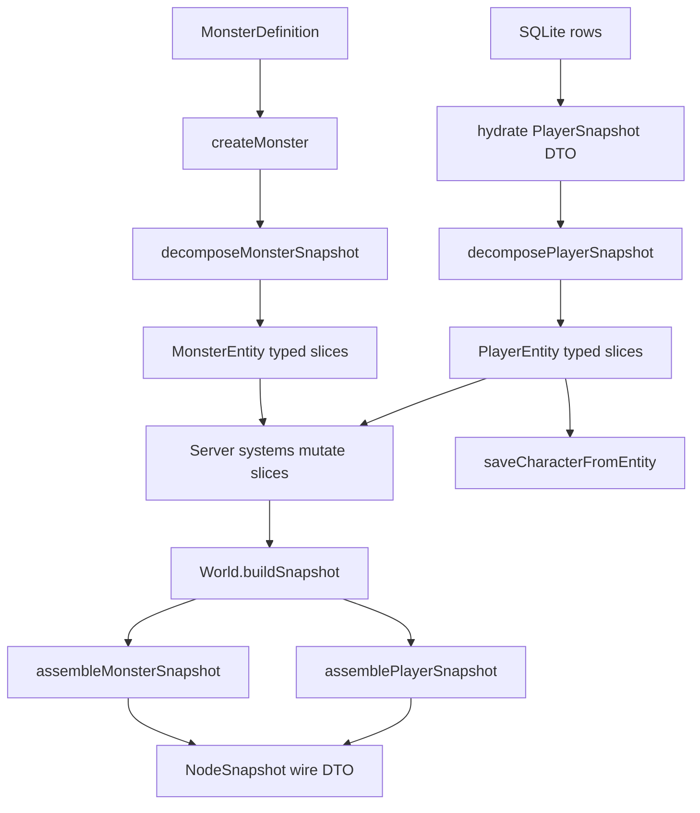
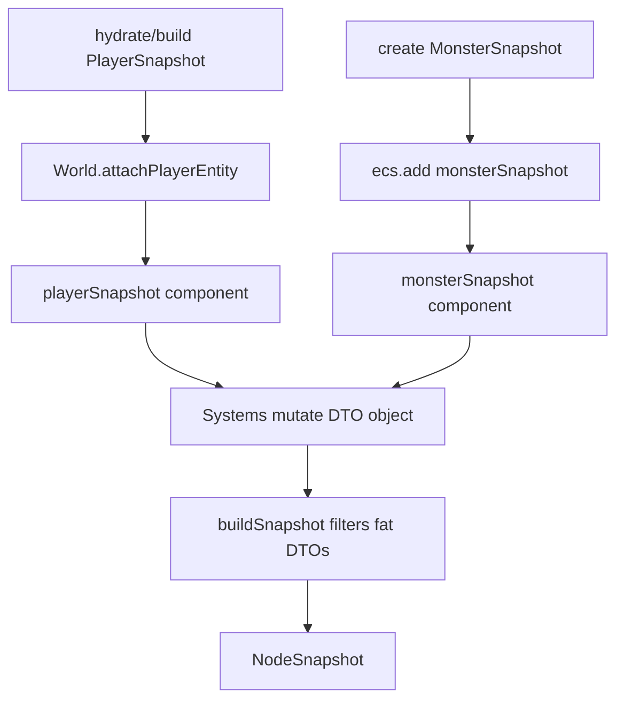
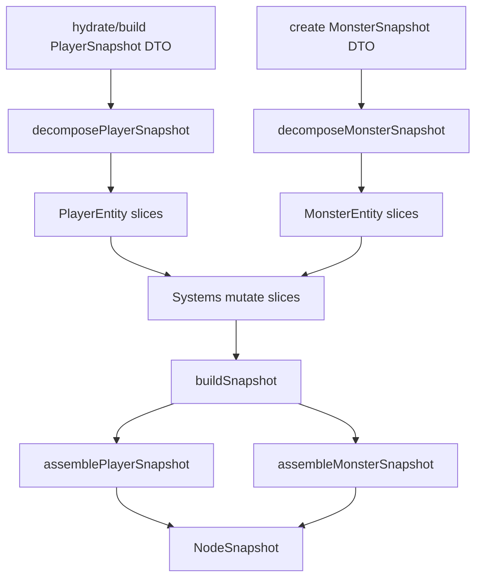

# Server Phase 4 - Snapshot Slice Decomposition

Implements the cleanup item from [.cursor/design/cleanup.md](../design/cleanup.md): split the "snapshot-as-fat-component + per-archetype typed components" end state into typed ECS slices. The selected scope is the full decomposition for both players and monsters. The selected strategy is projection at broadcast and persistence boundaries: typed components become the entity-side source of truth, and `PlayerSnapshot` / `MonsterSnapshot` remain byte-identical wire DTOs.

---

## Architecture



Core invariants:

- `shared/src/index.ts` wire DTO interfaces stay byte-identical. The client, Socket.IO event maps, and `NodeSnapshot` shape do not change.
- The server remains authoritative. Client messages still express intent; server systems mutate ECS slices.
- `PlayerSnapshot` and `MonsterSnapshot` stop being ECS components in the final state. They remain boundary DTOs for hydrate, broadcast, and compatibility aliases.
- Existing archetype components (`cadence`, `energy`, `dot`, `cooldown`, `reload`) remain runtime sources of truth for their internal state. Their projection helpers will write to a player archetype wire slice instead of a stored fat snapshot.
- `targetX` / `targetY` become wire-only fields. ECS storage uses `hasPosition.current` plus `isMoving.motion` (`direction` + remaining `magnitude`), and projection computes the wire target from that vector.
- Combat fields are split by owning system. Attack output, attack timing/targeting, damage mitigation, and evasion are separate components so systems do not query unrelated combat data.
- Final ECS component type names use two-word UpperCamelCase verb phrases without a `Component` suffix: `HasPosition`, `IsMoving`, `DealsDamage`, `PerformsAttack`, `MitigatesDamage`, etc. Entity keys use the same phrase in lower camel case.
- No persistence schema migration is required. DB columns already match a subset of player identity, position, progression, inventory, and skill slices.

---

## Code Architecture (walkthrough)

Read this section top to bottom. Steps are ordered by dependency: define slices first, stamp and project them, migrate systems, move boundary adapters, then remove the fat components. The file index at the end is the canonical lookup table for every path touched by this plan.

### Step 1 - Define Vector Primitives, Slice Components, and Projection Helpers

**Goal:** Introduce the vector primitive and server-side typed component model without changing behavior. This step defines motion in terms of current position plus direction/magnitude, defines the slice boundaries, adds `decompose*Snapshot` helpers that convert existing DTO construction into ECS stamps, and adds `assemble*Snapshot` helpers that rebuild the unchanged wire payload.

#### A. Add shared vector primitives and server-side slice types

| File                                                                                             | Symbol                                                                                                                                                        | Action | Summary                                                                                                                                                                                                            |
| ------------------------------------------------------------------------------------------------ | ------------------------------------------------------------------------------------------------------------------------------------------------------------- | ------ | ------------------------------------------------------------------------------------------------------------------------------------------------------------------------------------------------------------------ |
| [shared/src/systems/spatial.ts](../../shared/src/systems/spatial.ts)                             | `Vec2`, `MotionVector`, `normalize`, `vectorTo`, `pointFromMotion`, `advanceMotion`                                                                           | modify | Extend the existing shared spatial helper module with a small vector primitive used by server ECS and any future client-side prediction/interpolation helpers.                                                     |
| [server/src/ecs/components/snapshotSlices.ts](../../server/src/ecs/components/snapshotSlices.ts) | `HasPosition`, `IsMoving`, `HasHealth`, `DealsDamage`, `PerformsAttack`, `MitigatesDamage`, `EvadesHits`, plus player/monster-specific verb-phrase components | add    | Own all non-archetype fields currently stored directly on `PlayerSnapshot` / `MonsterSnapshot`; store movement as a vector instead of target coordinates and keep unrelated combat systems in separate components. |
| [server/src/ecs/projection.ts](../../server/src/ecs/projection.ts)                               | `decomposePlayerSnapshot`, `assemblePlayerSnapshot`, `decomposeMonsterSnapshot`, `assembleMonsterSnapshot`                                                    | add    | Boundary-only conversion between wire DTOs and typed ECS slices.                                                                                                                                                   |
| [server/src/ecs/entity.ts](../../server/src/ecs/entity.ts)                                       | `ServerEntity`                                                                                                                                                | modify | Add optional slice component keys while keeping `playerSnapshot` / `monsterSnapshot` temporarily for staged migration.                                                                                             |
| [server/src/ecs/components/player.ts](../../server/src/ecs/components/player.ts)                 | `PlayerEntity`                                                                                                                                                | modify | Retype player entities around slices plus `tracksCombat` / `tracksEngagement`; snapshot key remains only during bridge steps.                                                                                      |
| [server/src/ecs/components/monster.ts](../../server/src/ecs/components/monster.ts)               | `MonsterEntity`                                                                                                                                               | modify | Retype monster entities around slices plus `controlsMonster` / `tracksCombat`; snapshot key remains only during bridge steps.                                                                                      |

Component naming table:

| Current / old name                                 | Planned component type | Planned entity key  | Meaning                                                                  |
| -------------------------------------------------- | ---------------------- | ------------------- | ------------------------------------------------------------------------ |
| `PositionComponent`                                | `HasPosition`          | `hasPosition`       | Current point, node, and speed.                                          |
| `MovementVectorComponent`                          | `IsMoving`             | `isMoving`          | Remaining motion vector.                                                 |
| `HealthComponent`                                  | `HasHealth`            | `hasHealth`         | HP, max HP, regen, and shields.                                          |
| `AttackOutputComponent`                            | `DealsDamage`          | `dealsDamage`       | Outgoing damage values and visual attack style.                          |
| `AttackTimingComponent`                            | `PerformsAttack`       | `performsAttack`    | Range, cooldown, last attack time, and target id.                        |
| `DamageMitigationComponent`                        | `MitigatesDamage`      | `mitigatesDamage`   | Plating and percentage damage reduction.                                 |
| `EvasionComponent`                                 | `EvadesHits`           | `evadesHits`        | Evasion threshold and current hit count.                                 |
| `PlayerIdentityComponent`                          | `IsPlayer`             | `isPlayer`          | Runtime player id and display name.                                      |
| `MonsterIdentityComponent`                         | `IsMonster`            | `isMonster`         | Monster id, type, name, behavior, and boss identity.                     |
| `PlayerMovementIntentComponent`                    | `UsesAutocombat`       | `usesAutocombat`    | Server-side auto-combat toggle.                                          |
| `PlayerProgressionComponent`                       | `TracksProgression`    | `tracksProgression` | Level, skill points, biome XP, recipes, quests, and tier.                |
| `PlayerInventoryComponent`                         | `HoldsInventory`       | `holdsInventory`    | Inventory and equipped items.                                            |
| `PlayerSkillComponent`                             | `UsesSkills`           | `usesSkills`        | Skill unlocks, passives, and class/range choices.                        |
| `PlayerStatusComponent` / `MonsterStatusComponent` | `HasStatus`            | `hasStatus`         | Client-visible effect overlays, player buffs, and boss effect names.     |
| `MonsterAwarenessComponent`                        | `HasAwareness`         | `hasAwareness`      | AI state plus pull/leash ranges.                                         |
| `combatState`                                      | `TracksCombat`         | `tracksCombat`      | Runtime counters, resources, flags, stacks, strings, and status effects. |
| `combatAt`                                         | `TracksEngagement`     | `tracksEngagement`  | Last combat timestamp for out-of-combat logic.                           |
| `monsterAi`                                        | `ControlsMonster`      | `controlsMonster`   | Spawn, aggro, wander, kite, and leash runtime data.                      |
| `knockback`                                        | `HasKnockback`         | `hasKnockback`      | Ephemeral knockback state.                                               |
| `bossState`                                        | `ScriptsBoss`          | `scriptsBoss`       | Boss script runtime state.                                               |
| `cadence` + cadence mirrors                        | `UsesCadence`          | `usesCadence`       | Cadence archetype runtime state plus cadence wire mirrors.               |
| `energy` + energy mirrors                          | `UsesEnergy`           | `usesEnergy`        | Energy archetype runtime state plus energy wire mirrors.                 |
| `dot` + DoT mirrors                                | `AppliesDots`          | `appliesDots`       | DoT archetype runtime state plus DoT stack wire mirrors.                 |
| Chill mirrors                                      | `ChillsTarget`         | `chillsTarget`      | Freezing Cold chill stack wire mirror, separate from generic DoT state.  |
| `cooldown` + cooldown/channel mirrors              | `UsesCooldown`         | `usesCooldown`      | Cooldown archetype runtime state plus cooldown/channel wire mirrors.     |
| `reload` + reload mirrors                          | `UsesReload`           | `usesReload`        | Reload archetype runtime state plus ammo/heat wire mirrors.              |
| Sacred Cross mirrors                               | `ShowsSacred`          | `showsSacred`       | Weapon-effect wire mirrors for Sacred Cross.                             |

Inputs, outputs, and error handling:

- `decomposePlayerSnapshot(snapshot)` accepts a valid `PlayerSnapshot` and returns an object suitable for spreading into a miniplex entity. It converts `x`/`y` plus `targetX`/`targetY` into `hasPosition.current` plus `isMoving.motion`.
- `assemblePlayerSnapshot(entity)` accepts a fully stamped `PlayerEntity` and returns a fresh `PlayerSnapshot`. It should not mutate the entity.
- Monster equivalents follow the same contract.
- Projection helpers are server-only; no `shared/` imports from server are introduced.

Concrete vector primitive shape:

```ts
// shared/src/systems/spatial.ts
export interface Vec2 {
  x: number;
  y: number;
}

export interface MotionVector {
  /** Normalized movement direction. `{ x: 0, y: 0 }` means stationary. */
  direction: Vec2;
  /** Remaining distance in pixels along `direction`. */
  magnitude: number;
}

export function normalize(v: Vec2): Vec2 {
  const mag = Math.hypot(v.x, v.y);
  return mag > 0 ? { x: v.x / mag, y: v.y / mag } : { x: 0, y: 0 };
}

export function vectorTo(from: Vec2, to: Vec2): MotionVector {
  const dx = to.x - from.x;
  const dy = to.y - from.y;
  const magnitude = Math.hypot(dx, dy);
  return {
    direction:
      magnitude > 0 ? { x: dx / magnitude, y: dy / magnitude } : { x: 0, y: 0 },
    magnitude,
  };
}

export function pointFromMotion(origin: Vec2, motion: MotionVector): Vec2 {
  return {
    x: origin.x + motion.direction.x * motion.magnitude,
    y: origin.y + motion.direction.y * motion.magnitude,
  };
}

export function advanceMotion(
  position: Vec2,
  motion: MotionVector,
  distance: number,
): { position: Vec2; motion: MotionVector } {
  const step = Math.min(distance, motion.magnitude);
  const nextPosition = {
    x: position.x + motion.direction.x * step,
    y: position.y + motion.direction.y * step,
  };
  const nextMagnitude = Math.max(0, motion.magnitude - step);
  return {
    position: nextPosition,
    motion:
      nextMagnitude > 0
        ? { direction: motion.direction, magnitude: nextMagnitude }
        : { direction: { x: 0, y: 0 }, magnitude: 0 },
  };
}
```

Concrete slice shape:

```ts
// server/src/ecs/components/snapshotSlices.ts
import type {
  CombatArchetype,
  EquipmentMap,
  EssenceType,
  MonsterAIState,
  PlayerBuff,
  ShieldState,
  SubVariant,
  MotionVector,
  Vec2,
} from "@mmo-idle/shared";
import type { PassiveMap } from "@mmo-idle/shared";

export interface HasPosition {
  current: Vec2;
  nodeId: string;
  speed: number;
}

export interface IsMoving {
  motion: MotionVector;
}

export interface HasHealth {
  hp: number;
  maxHp: number;
  hpRegen?: number;
  shields?: ShieldState[];
}

export interface DealsDamage {
  attack: number;
  onHitDamage: number;
  attackStyle: string;
}

export interface PerformsAttack {
  attackRange: number;
  attackCooldown: number;
  lastAttackAt: number;
  attackTargetId: string | null;
}

export interface MitigatesDamage {
  plating: number;
  damageReduction: number;
}

export interface EvadesHits {
  threshold: number;
  count: number;
}

export interface IsPlayer {
  id: string;
  name: string;
}

export interface UsesAutocombat {
  auto: boolean;
}

export interface TracksProgression {
  level: number;
  skillPoints: number;
  essences: Record<EssenceType, number>;
  biomeXP: Record<string, number>;
  biomeLevel: Record<string, number>;
  unlockedRecipes: string[];
  questProgress: Record<string, number>;
  playerTier: number;
  currentSkillTier: number;
}

export interface HoldsInventory {
  inventory: string[];
  equipment: EquipmentMap;
}

export interface UsesSkills {
  unlockedSkills: string[];
  passives: PassiveMap;
  selectedClass: string | null;
  selectedSubVariant: SubVariant | null;
  selectedRange: string | null;
  combatArchetype: CombatArchetype;
}

export interface HasStatus {
  activeEffects?: Record<string, number>;
  activeEffectFrames?: Record<string, number>;
  activeBuffs?: PlayerBuff[];
  bossEffects?: string[];
}

export interface ShowsSacred {
  sacredBuffActive: boolean;
  sacredBuffPct: number;
}

export interface UsesCadence {
  // ... existing cadence runtime fields
  cadenceSpeedStacks: number;
  cadenceCount: number;
  cadenceThreshold: number;
  cadenceEmpoweredArmed: boolean;
}

export interface UsesEnergy {
  // ... existing energy runtime fields
  energyCount: number;
  empoweredReady: boolean;
}

export interface AppliesDots {
  // ... existing DoT runtime fields
  targetDotStacks: number;
}

export interface ChillsTarget {
  targetChillStacks: number;
}

export interface UsesCooldown {
  // ... existing cooldown runtime fields
  executionReady: boolean;
  executionCooldownPct: number;
  isChanneling: boolean;
  channelingPct: number;
}

export interface UsesReload {
  // ... existing reload runtime fields
  ammoCount: number;
  ammoMax: number;
  heatPct: number;
  laserOverheated: boolean;
}

export interface IsMonster {
  id: string;
  monsterTypeId: string;
  color: number;
  name: string;
  isBoss: boolean;
  behavior: string;
  combatArchetype?: CombatArchetype;
}

export interface HasAwareness {
  state: MonsterAIState;
  pullRange: number;
  leashRange: number;
}
```

Concrete projection shape:

```ts
// server/src/ecs/projection.ts
import type { MonsterSnapshot, PlayerSnapshot } from "@mmo-idle/shared";
import type { MonsterEntity } from "./components/monster";
import type { PlayerEntity } from "./components/player";

export type PlayerSliceStamp = Pick<
  PlayerEntity,
  | "isPlayer"
  | "hasPosition"
  | "isMoving"
  | "hasHealth"
  | "dealsDamage"
  | "performsAttack"
  | "mitigatesDamage"
  | "evadesHits"
  | "usesAutocombat"
  | "tracksProgression"
  | "holdsInventory"
  | "usesSkills"
  | "hasStatus"
  | "showsSacred"
>;

export function decomposePlayerSnapshot(
  snapshot: PlayerSnapshot,
): PlayerSliceStamp {
  return {
    isPlayer: { id: snapshot.id, name: snapshot.name },
    hasPosition: {
      current: { x: snapshot.x, y: snapshot.y },
      nodeId: snapshot.nodeId,
      speed: snapshot.speed,
    },
    isMoving: {
      motion: vectorTo(
        { x: snapshot.x, y: snapshot.y },
        { x: snapshot.targetX, y: snapshot.targetY },
      ),
    },
    showsSacred: {
      sacredBuffActive: snapshot.sacredBuffActive,
      sacredBuffPct: snapshot.sacredBuffPct,
    },
    // ... copy every PlayerSnapshot field into exactly one slice
  };
}

export function assemblePlayerSnapshot(entity: PlayerEntity): PlayerSnapshot {
  const identity = entity.isPlayer;
  const position = entity.hasPosition;
  const target = pointFromMotion(position.current, entity.isMoving.motion);
  const health = entity.hasHealth;
  const attackOutput = entity.dealsDamage;
  const attackTiming = entity.performsAttack;
  const mitigation = entity.mitigatesDamage;
  const evasion = entity.evadesHits;
  // ... read all slices and return a fresh byte-identical DTO
  return {
    id: identity.id,
    name: identity.name,
    x: position.current.x,
    y: position.current.y,
    targetX: target.x,
    targetY: target.y,
    hp: health.hp,
    maxHp: health.maxHp,
    attack: attackOutput.attack,
    onHitDamage: attackOutput.onHitDamage,
    plating: mitigation.plating,
    damageReduction: mitigation.damageReduction,
    evasion: evasion.threshold,
    evasionCount: evasion.count,
    attackRange: attackTiming.attackRange,
    attackCooldown: attackTiming.attackCooldown,
    lastAttackAt: attackTiming.lastAttackAt,
    attackTargetId: attackTiming.attackTargetId,
    attackStyle: attackOutput.attackStyle,
    // ... every remaining PlayerSnapshot field
  };
}

export function decomposeMonsterSnapshot(
  snapshot: MonsterSnapshot,
): MonsterSliceStamp {
  return {
    isMonster: {
      id: snapshot.id,
      monsterTypeId: snapshot.monsterTypeId,
      color: snapshot.color,
      name: snapshot.name,
      isBoss: snapshot.isBoss,
      behavior: snapshot.behavior,
      combatArchetype: snapshot.combatArchetype,
    },
    hasPosition: {
      current: { x: snapshot.x, y: snapshot.y },
      nodeId: snapshot.nodeId,
      speed: snapshot.speed,
    },
    isMoving: {
      motion: vectorTo(
        { x: snapshot.x, y: snapshot.y },
        { x: snapshot.targetX, y: snapshot.targetY },
      ),
    },
    // ... copy every MonsterSnapshot field into exactly one slice
  };
}

export function assembleMonsterSnapshot(
  entity: MonsterEntity,
): MonsterSnapshot {
  // ... read slices and return a fresh MonsterSnapshot
}
```

#### B. Add entity component keys

```ts
// server/src/ecs/entity.ts
export interface ServerEntity {
  entityId: EntityId;

  // Bridge-only during migration; removed in Step 5.
  playerSnapshot?: PlayerSnapshot;
  monsterSnapshot?: MonsterSnapshot;

  isPlayer?: IsPlayer;
  isMonster?: IsMonster;
  hasPosition?: HasPosition;
  isMoving?: IsMoving;
  hasHealth?: HasHealth;
  dealsDamage?: DealsDamage;
  performsAttack?: PerformsAttack;
  mitigatesDamage?: MitigatesDamage;
  evadesHits?: EvadesHits;
  usesAutocombat?: UsesAutocombat;
  tracksProgression?: TracksProgression;
  holdsInventory?: HoldsInventory;
  usesSkills?: UsesSkills;
  hasStatus?: HasStatus;
  showsSacred?: ShowsSacred;
  hasAwareness?: HasAwareness;

  controlsMonster?: ControlsMonster;
  hasKnockback?: HasKnockback;
  scriptsBoss?: ScriptsBoss;
  tracksEngagement?: TracksEngagement;
  tracksCombat?: TracksCombat;

  usesCadence?: UsesCadence;
  usesEnergy?: UsesEnergy;
  appliesDots?: AppliesDots;
  chillsTarget?: ChillsTarget;
  usesCooldown?: UsesCooldown;
  usesReload?: UsesReload;
}
```

Invariant: every wire DTO field must appear in exactly one slice except fields that are intentionally runtime-only outside the wire (`controlsMonster`, `tracksEngagement`, `tracksCombat`, `hasKnockback`, `scriptsBoss`, and the archetype runtime components).

Ordering note: keep the temporary `playerSnapshot` / `monsterSnapshot` keys in this step so later commits can migrate callers by subsystem while typechecking after each slice.

### Step 2 - Stamp Slices and Switch Broadcast Projection

**Goal:** Make all newly created entities carry typed slices immediately, then route `World.buildSnapshot` through `assemble*Snapshot`. This creates the projection boundary early while fat components are still present as a bridge.

| File                                                                               | Symbol                                                 | Action | Summary                                                                                                                                                                         |
| ---------------------------------------------------------------------------------- | ------------------------------------------------------ | ------ | ------------------------------------------------------------------------------------------------------------------------------------------------------------------------------- |
| [server/src/world/World.ts](../../server/src/world/World.ts)                       | `attachPlayerEntity`                                   | modify | Spread `decomposePlayerSnapshot(player)` into the entity alongside `tracksCombat` and `tracksEngagement`.                                                                       |
| [server/src/systems/spawning/index.ts](../../server/src/systems/spawning/index.ts) | `createMonster`                                        | modify | Create the current `MonsterSnapshot` DTO as a local, decompose it into slices, and add the sliced monster entity.                                                               |
| [server/src/world/World.ts](../../server/src/world/World.ts)                       | `buildSnapshot`                                        | modify | Filter entities by `hasPosition.nodeId`; push `assembleMonsterSnapshot(e)` / `assemblePlayerSnapshot(e)` fresh DTOs with `targetX` / `targetY` computed from `isMoving.motion`. |
| [server/src/world/World.ts](../../server/src/world/World.ts)                       | `getPlayerSnapshot`, `getMonsterSnapshot`, `players()` | modify | Bridge helpers assemble DTOs when called, then are removed in Step 5 after system migration.                                                                                    |

Concrete `attachPlayerEntity` shape:

```ts
// server/src/world/World.ts
attachPlayerEntity(player: PlayerSnapshot): PlayerEntity {
  const entity: PlayerEntity = {
    entityId: player.id,
    ...decomposePlayerSnapshot(player),
    playerSnapshot: player, // bridge-only until Step 5
    tracksCombat: makeCombatState(),
    tracksEngagement: 0,
  };
  this.ecs.add(entity);
  this.refreshArchetypeComponents(entity.entityId);
  return entity;
}
```

Concrete `buildSnapshot` shape:

```ts
// server/src/world/World.ts
buildSnapshot(nodeId: string): NodeSnapshot {
  const events = this.nodeEvents.get(nodeId) ?? [];
  this.nodeEvents.set(nodeId, []);

  const monsters: MonsterSnapshot[] = [];
  for (const e of this.monsterEntities) {
    if (e.hasPosition.nodeId === nodeId) monsters.push(assembleMonsterSnapshot(e));
  }

  const players: PlayerSnapshot[] = [];
  for (const e of this.playerEntities) {
    if (e.hasPosition.nodeId === nodeId) players.push(assemblePlayerSnapshot(e));
  }

  return { players, monsters, events };
}
```

Inputs, outputs, and error handling:

- `buildSnapshot(nodeId)` retains the same input and `NodeSnapshot` output. It still drains queued combat events exactly once per node.
- Projection creates new DTO objects per broadcast. Systems must not rely on mutating the returned DTO after projection.
- Unknown node handling remains in the `World` constructor and spawning helpers; projection helpers do not validate node ids.

Invariant: the first implementation checkpoint should diff one `NodeSnapshot` before and after this step and show identical JSON for players, monsters, and events.

### Step 3 - Migrate System Reads and Writes to Slices

**Goal:** Move runtime logic off the fat snapshot bridge by subsystem. This is the largest step. It should be implemented as a sequence of small commits that keep typecheck passing and preserve behavior after each subsystem group.

#### A. Add ergonomic slice accessors

| File                                                         | Symbol                                                                                                                        | Action | Summary                                                                                       |
| ------------------------------------------------------------ | ----------------------------------------------------------------------------------------------------------------------------- | ------ | --------------------------------------------------------------------------------------------- |
| [server/src/world/World.ts](../../server/src/world/World.ts) | `getPlayerPosition`, `getPlayerMovementVector`, `getPlayerHealth`, `getPlayerAttackTiming`, `getPlayerDamageMitigation`, etc. | add    | Thin lookup helpers for common call sites that currently use snapshot fields after id lookup. |
| [server/src/world/World.ts](../../server/src/world/World.ts) | `players()` / `monstersInNode()` replacements                                                                                 | add    | Iterator helpers yielding entities or typed slice views, not DTOs.                            |

Concrete accessor shape:

```ts
// server/src/world/World.ts
getPlayerHealth(playerId: string): HasHealth | undefined {
  return this.getPlayerEntity(playerId)?.hasHealth;
}

getPlayerMotion(playerId: string): IsMoving | undefined {
  return this.getPlayerEntity(playerId)?.isMoving;
}

getMonsterAttack(monsterId: string): PerformsAttack | undefined {
  return this.getMonsterEntity(monsterId)?.performsAttack;
}

getMonsterMitigation(monsterId: string): MitigatesDamage | undefined {
  return this.getMonsterEntity(monsterId)?.mitigatesDamage;
}

*playerEntitiesInNode(nodeId: string): IterableIterator<PlayerEntity> {
  for (const e of this.playerEntities) {
    if (e.hasPosition.nodeId === nodeId) yield e;
  }
}
```

Inputs, outputs, and error handling:

- Accessors return `undefined` for missing entities, matching current `getPlayerSnapshot` / `getMonsterSnapshot` behavior.
- Iterators yield live entities. Mutations are intentional and server-authoritative.

#### B. Migrate subsystem groups

| File group                                                                                                                                                                                                                                                                                                                                                                                                                                                                                                                                                                                                                                                                                                                                                                                                                                                                                                                                                                                                             | Action        | Main slice targets                                                                                                                                                                                         | Summary                                                                                                                                                                                                                          |
| ---------------------------------------------------------------------------------------------------------------------------------------------------------------------------------------------------------------------------------------------------------------------------------------------------------------------------------------------------------------------------------------------------------------------------------------------------------------------------------------------------------------------------------------------------------------------------------------------------------------------------------------------------------------------------------------------------------------------------------------------------------------------------------------------------------------------------------------------------------------------------------------------------------------------------------------------------------------------------------------------------------------------- | ------------- | ---------------------------------------------------------------------------------------------------------------------------------------------------------------------------------------------------------- | -------------------------------------------------------------------------------------------------------------------------------------------------------------------------------------------------------------------------------- |
| [server/src/systems/movement.ts](../../server/src/systems/movement.ts), [server/src/systems/transitions.ts](../../server/src/systems/transitions.ts), [server/src/systems/autoTarget.ts](../../server/src/systems/autoTarget.ts), [server/src/systems/ai.ts](../../server/src/systems/ai.ts), [server/src/systems/knockback.ts](../../server/src/systems/knockback.ts)                                                                                                                                                                                                                                                                                                                                                                                                                                                                                                                                                                                                                                                 | modify        | `hasPosition`, `isMoving`, `usesAutocombat`, `performsAttack`, `hasAwareness`, `controlsMonster`                                                                                                           | Move all `x`, `y`, `targetX`, `targetY`, `nodeId`, `speed`, `auto`, AI state reads/writes onto slices. Destination-style decisions now call `vectorTo(hasPosition.current, desiredPoint)` and store the resulting motion vector. |
| [server/src/systems/combat.ts](../../server/src/systems/combat.ts), [server/src/systems/combatPipeline.ts](../../server/src/systems/combatPipeline.ts), [server/src/systems/aoeDamage.ts](../../server/src/systems/aoeDamage.ts), [server/src/systems/defenseSystems.ts](../../server/src/systems/defenseSystems.ts), [server/src/systems/weaponEffects.ts](../../server/src/systems/weaponEffects.ts), [server/src/systems/debuffMechanics.ts](../../server/src/systems/debuffMechanics.ts), [server/src/systems/bossScripts.ts](../../server/src/systems/bossScripts.ts)                                                                                                                                                                                                                                                                                                                                                                                                                                             | modify        | `hasHealth`, `dealsDamage`, `performsAttack`, `mitigatesDamage`, `evadesHits`, `hasStatus`, `isMonster`, `showsSacred`                                                                                     | Move damage, attack timing, cooldown mutation, evasion, shields, mitigation, boss effect projection, and weapon buffs onto narrowly owned slices.                                                                                |
| [server/src/systems/rewards.ts](../../server/src/systems/rewards.ts), [server/src/systems/questSystem.ts](../../server/src/systems/questSystem.ts), [server/src/systems/crafting.ts](../../server/src/systems/crafting.ts), [server/src/systems/inventory.ts](../../server/src/systems/inventory.ts), [server/src/systems/skills.ts](../../server/src/systems/skills.ts), [server/src/systems/stats.ts](../../server/src/systems/stats.ts), [server/src/systems/testRoomInteract.ts](../../server/src/systems/testRoomInteract.ts)                                                                                                                                                                                                                                                                                                                                                                                                                                                                                     | modify        | `tracksProgression`, `holdsInventory`, `usesSkills`, `hasHealth`, `dealsDamage`, `performsAttack`, `mitigatesDamage`, `evadesHits`, `hasPosition`                                                          | Move progression, recipes, skill unlocks, stat recalculation adapters, and test-room mutations onto slices.                                                                                                                      |
| [server/src/systems/classes/cadence/cadencePrototype.ts](../../server/src/systems/classes/cadence/cadencePrototype.ts), [server/src/systems/classes/cooldown/cooldownPrototype.ts](../../server/src/systems/classes/cooldown/cooldownPrototype.ts), [server/src/systems/classes/cooldown/cooldownT3.ts](../../server/src/systems/classes/cooldown/cooldownT3.ts), [server/src/systems/classes/dot/dotPrototype.ts](../../server/src/systems/classes/dot/dotPrototype.ts), [server/src/systems/classes/dot/dotT3.ts](../../server/src/systems/classes/dot/dotT3.ts), [server/src/systems/classes/energy/energyPrototype.ts](../../server/src/systems/classes/energy/energyPrototype.ts), [server/src/systems/classes/energy/energyT3.ts](../../server/src/systems/classes/energy/energyT3.ts), [server/src/systems/classes/reload/reloadPrototype.ts](../../server/src/systems/classes/reload/reloadPrototype.ts), [server/src/systems/classes/reload/reloadT3.ts](../../server/src/systems/classes/reload/reloadT3.ts) | modify        | `usesSkills`, `dealsDamage`, `performsAttack`, `mitigatesDamage`, and the relevant optional archetype component (`usesCadence`, `usesCooldown`, `appliesDots`, `chillsTarget`, `usesEnergy`, `usesReload`) | Replace snapshot mirror writes with writes to the owning archetype/chill component and the specific combat slices each mechanic actually changes.                                                                                |
| [server/src/systems/buffSync.ts](../../server/src/systems/buffSync.ts), [server/src/systems/resourceMechanics.ts](../../server/src/systems/resourceMechanics.ts), [server/src/systems/statusEffects.ts](../../server/src/systems/statusEffects.ts), [server/src/systems/empoweredAttacks.ts](../../server/src/systems/empoweredAttacks.ts), [server/src/systems/attackCounter.ts](../../server/src/systems/attackCounter.ts), [server/src/systems/classMechanics.ts](../../server/src/systems/classMechanics.ts)                                                                                                                                                                                                                                                                                                                                                                                                                                                                                                       | modify/verify | `hasStatus`, `tracksCombat`, `usesSkills`, optional archetype components                                                                                                                                   | Update utility and registry code to accept entity/slice views instead of snapshot DTOs where needed.                                                                                                                             |

Example migration target:

```ts
// Before: server/src/systems/combat.ts
// player.hp -= finalDamage;
// monster.lastAttackAt = now;

// After:
const playerHealth = playerEntity.hasHealth;
const monsterAttack = monsterEntity.performsAttack;
playerHealth.hp -= finalDamage;
monsterAttack.lastAttackAt = now;
```

Inputs, outputs, and error handling:

- Existing public system entry points keep their current names where practical, but accept `World` and resolve entities/slices internally.
- Combat functions that currently accept `PlayerSnapshot` / `MonsterSnapshot` should be renamed or overloaded only if necessary. Prefer one explicit entity/slice signature over compatibility overloads in the final state.
- Missing targets still short-circuit as today. For example, if `attackTargetId` points to a despawned monster, clear `performsAttack.attackTargetId` and continue.

Invariant: do not introduce broad DTO mutation shims such as `const p = assemblePlayerSnapshot(entity); mutate(p); writeBack(p)` inside tick systems. Temporary adapters are allowed only at boundary-like formula calls in Step 4.

Movement note: `targetX` / `targetY` should not be stored on any entity slice. Systems that previously set `targetX` / `targetY` should compute a desired point, clamp it if needed, then assign `entity.isMoving.motion = vectorTo(entity.hasPosition.current, desiredPoint)`. To stop movement, assign the zero motion vector.

### Step 4 - Move Stat Recalc, Skills, Inventory, and Persistence to Boundary Adapters

**Goal:** Handle the hard boundary cases explicitly. `recalculatePlayerStats`, `canUnlockSkill`, and DB persistence currently operate on `PlayerSnapshot`. Rather than rewriting shared formulas in this PR, create server adapters that assemble a temporary DTO, invoke the shared function, and write the changed fields back to slices.

| File                                                                                     | Symbol                                                                                                        | Action | Summary                                                                                                                           |
| ---------------------------------------------------------------------------------------- | ------------------------------------------------------------------------------------------------------------- | ------ | --------------------------------------------------------------------------------------------------------------------------------- |
| [server/src/ecs/playerSnapshotAdapter.ts](../../server/src/ecs/playerSnapshotAdapter.ts) | `withPlayerSnapshotDraft`, `applyPlayerSnapshotDraft`, `recalculatePlayerEntityStats`, `canUnlockEntitySkill` | add    | Boundary adapter for shared formula helpers that still consume `PlayerSnapshot`.                                                  |
| [server/src/systems/stats.ts](../../server/src/systems/stats.ts)                         | `recalculatePlayerStats` imports/callers                                                                      | modify | Keep shared re-export intact for clients/legacy imports, but server callers move to `recalculatePlayerEntityStats`.               |
| [server/src/systems/skills.ts](../../server/src/systems/skills.ts)                       | `unlockSkill`                                                                                                 | modify | Accept player entity or id, mutate skill/progression slices, call stat adapter, refresh archetype components.                     |
| [server/src/systems/inventory.ts](../../server/src/systems/inventory.ts)                 | `equipItem`, `unequipItem`                                                                                    | modify | Mutate `holdsInventory`; call stat adapter; no direct DTO writes.                                                                 |
| [server/src/db/playerRepo.ts](../../server/src/db/playerRepo.ts)                         | `getOrCreateCharacter`, `hydratePlayer`, `saveCharacter`                                                      | modify | Hydrate through the DTO-to-slices path on attach; add `saveCharacterFromEntity` or change save call sites to pass `PlayerEntity`. |
| [server/src/index.ts](../../server/src/index.ts)                                         | socket connect/disconnect/autosave handlers                                                                   | modify | Store and save player entities instead of assembled snapshots except when sending wire snapshots.                                 |

Concrete adapter shape:

```ts
// server/src/ecs/playerSnapshotAdapter.ts
import { canUnlockSkill, recalculatePlayerStats } from "@mmo-idle/shared";
import type { PlayerSnapshot } from "@mmo-idle/shared";
import { vectorTo } from "@mmo-idle/shared";
import type { PlayerEntity } from "./components/player";
import { assemblePlayerSnapshot } from "./projection";

export function applyPlayerSnapshotDraft(
  entity: PlayerEntity,
  draft: PlayerSnapshot,
): void {
  entity.isPlayer.name = draft.name;
  entity.hasPosition.current = { x: draft.x, y: draft.y };
  entity.hasPosition.nodeId = draft.nodeId;
  entity.hasPosition.speed = draft.speed;
  entity.isMoving.motion = vectorTo(
    { x: draft.x, y: draft.y },
    { x: draft.targetX, y: draft.targetY },
  );
  entity.hasHealth.hp = draft.hp;
  entity.hasHealth.maxHp = draft.maxHp;
  entity.hasHealth.hpRegen = draft.hpRegen;
  entity.hasHealth.shields = draft.shields;
  entity.dealsDamage.attack = draft.attack;
  entity.dealsDamage.onHitDamage = draft.onHitDamage;
  entity.dealsDamage.attackStyle = draft.attackStyle;
  entity.performsAttack.attackRange = draft.attackRange;
  entity.performsAttack.attackCooldown = draft.attackCooldown;
  entity.performsAttack.lastAttackAt = draft.lastAttackAt;
  entity.performsAttack.attackTargetId = draft.attackTargetId;
  entity.mitigatesDamage.plating = draft.plating;
  entity.mitigatesDamage.damageReduction = draft.damageReduction;
  entity.evadesHits.threshold = draft.evasion;
  entity.evadesHits.count = draft.evasionCount;
  // ... write every PlayerSnapshot field back to its owning slice
}

export function withPlayerSnapshotDraft<T>(
  entity: PlayerEntity,
  fn: (draft: PlayerSnapshot) => T,
): T {
  const draft = assemblePlayerSnapshot(entity);
  const result = fn(draft);
  applyPlayerSnapshotDraft(entity, draft);
  return result;
}

export function recalculatePlayerEntityStats(entity: PlayerEntity): void {
  withPlayerSnapshotDraft(entity, recalculatePlayerStats);
}

export function canUnlockEntitySkill(
  entity: PlayerEntity,
  nodeId: string,
): ReturnType<typeof canUnlockSkill> {
  return canUnlockSkill(assemblePlayerSnapshot(entity), nodeId);
}
```

Inputs, outputs, and error handling:

- `withPlayerSnapshotDraft` is for low-frequency boundary operations only: hydrate, skill unlock, equip/unequip, respawn, and test-room progression reset.
- It must not be called from per-tick hot paths or combat pipeline listeners.
- The adapter writes back every field because shared stat recalculation can reset attack output, attack timing, mitigation, evasion, passives, HP, optional archetype component fields, weapon mirror fields, and selected class fields.

Ordering note: this step lands after the main system migration so the adapter does not become a generic escape hatch for tick logic.

### Step 5 - Remove Fat Snapshot Components and Tighten Queries

**Goal:** Complete the selected strategy. Remove `playerSnapshot` and `monsterSnapshot` from ECS entity storage, update queries and helpers to require slices, and make any accidental snapshot component access a TypeScript error.

| File                                                                               | Symbol                                                 | Action         | Summary                                                                                                                                                                                                                          |
| ---------------------------------------------------------------------------------- | ------------------------------------------------------ | -------------- | -------------------------------------------------------------------------------------------------------------------------------------------------------------------------------------------------------------------------------- |
| [server/src/ecs/entity.ts](../../server/src/ecs/entity.ts)                         | `playerSnapshot`, `monsterSnapshot`                    | remove         | Delete optional fat component keys from `ServerEntity`.                                                                                                                                                                          |
| [server/src/ecs/components/player.ts](../../server/src/ecs/components/player.ts)   | `PlayerEntity`                                         | modify         | Require all player slices, including `isMoving`, `dealsDamage`, `performsAttack`, `mitigatesDamage`, and `evadesHits`, plus `tracksCombat` and `tracksEngagement`.                                                               |
| [server/src/ecs/components/monster.ts](../../server/src/ecs/components/monster.ts) | `MonsterEntity`                                        | modify         | Require all monster slices, including `isMoving`, `dealsDamage`, `performsAttack`, and `mitigatesDamage`, plus `controlsMonster` and `tracksCombat`. Monsters do not need `evadesHits` unless a future monster mechanic adds it. |
| [server/src/world/World.ts](../../server/src/world/World.ts)                       | `playerEntities`, `monsterEntities`                    | modify         | Query by slice keys rather than fat snapshot keys.                                                                                                                                                                               |
| [server/src/world/World.ts](../../server/src/world/World.ts)                       | `getPlayerSnapshot`, `getMonsterSnapshot`, `players()` | remove/replace | Remove bridge helpers or keep only explicitly named projection helpers if external boundary call sites need them.                                                                                                                |
| [server/src/ecs/queries.ts](../../server/src/ecs/queries.ts)                       | typed query helpers                                    | add/modify     | Optional: centralize the long `with(...)` key lists for player and monster queries.                                                                                                                                              |

Final query shape:

```ts
// server/src/world/World.ts
readonly monsterEntities = this.ecs.with(
  'isMonster',
  'hasPosition',
  'isMoving',
  'hasHealth',
  'dealsDamage',
  'performsAttack',
  'mitigatesDamage',
  'hasAwareness',
  'hasStatus',
  'controlsMonster',
  'tracksCombat',
);

readonly playerEntities = this.ecs.with(
  'isPlayer',
  'hasPosition',
  'isMoving',
  'hasHealth',
  'dealsDamage',
  'performsAttack',
  'mitigatesDamage',
  'evadesHits',
  'usesAutocombat',
  'tracksProgression',
  'holdsInventory',
  'usesSkills',
  'hasStatus',
  'showsSacred',
  'tracksCombat',
  'tracksEngagement',
);
```

Inputs, outputs, and error handling:

- Entity lookup remains O(N), preserving the cleanup note's decision not to add Map indexes unless profiling justifies them.
- `getPlayerEntity(id)` compares `e.isPlayer.id`; `getMonsterEntity(id)` compares `e.isMonster.id`.
- Any remaining `e.playerSnapshot` / `e.monsterSnapshot` access should fail typecheck.

Invariant: after this step, `PlayerSnapshot` and `MonsterSnapshot` should appear in server code only in projection, DB hydrate/save boundaries, socket emission types, and compatibility type imports where unavoidable.

### Step 6 - Validation and Cleanup Documentation

**Goal:** Prove wire parity and remove the cleanup item once the implementation is merged.

| File                                                               | Symbol                                            | Action | Summary                                                                                          |
| ------------------------------------------------------------------ | ------------------------------------------------- | ------ | ------------------------------------------------------------------------------------------------ |
| [server/src/ecs/projection.ts](../../server/src/ecs/projection.ts) | projection parity tests or inline assertions      | verify | Confirm assemble(decompose(snapshot)) returns an equivalent DTO for player and monster fixtures. |
| [.cursor/design/cleanup.md](../design/cleanup.md)                  | `Split fat snapshot components into typed slices` | modify | Move the item to Completed after implementation lands, with links to projection and slice files. |
| [server/src/world/World.ts](../../server/src/world/World.ts)       | `buildSnapshot`                                   | verify | Snapshot shape and event draining stay unchanged.                                                |

Suggested parity harness:

```ts
// test helper or temporary script shape
const playerRoundTrip = assemblePlayerSnapshot({
  entityId: sourcePlayer.id,
  ...decomposePlayerSnapshot(sourcePlayer),
  tracksCombat: makeCombatState(),
  tracksEngagement: 0,
});
expect(playerRoundTrip).toEqual(sourcePlayer);
```

Validation commands:

```bash
pnpm --filter @mmo-idle/server typecheck
pnpm --filter @mmo-idle/client typecheck
pnpm dev:server
```

Manual smoke tests:

- Connect a fresh player, verify `state:sync` and `node:state` render unchanged on the client.
- Move across a node boundary, then disconnect/reconnect and verify saved position, node, equipment, skill state, biome XP, and quest progress.
- Fight with each archetype: cadence, cooldown, energy, reload, and dot.
- Verify boss script effects, monster status overlays, player buffs, shields, and DoT overlays still display.

### File Index (Alphabetical)

| File                                                                                                                       | Purpose                                                                                                                                                                                                                     |
| -------------------------------------------------------------------------------------------------------------------------- | --------------------------------------------------------------------------------------------------------------------------------------------------------------------------------------------------------------------------- |
| [.cursor/design/cleanup.md](../design/cleanup.md)                                                                          | Mark the cleanup item completed after implementation, not before.                                                                                                                                                           |
| [server/src/db/playerRepo.ts](../../server/src/db/playerRepo.ts)                                                           | Persist player slices instead of reading a stored fat `PlayerSnapshot`; hydrate through DTO-to-slice decomposition.                                                                                                         |
| [server/src/ecs/components/monster.ts](../../server/src/ecs/components/monster.ts)                                         | Retype `MonsterEntity` around required slices.                                                                                                                                                                              |
| [server/src/ecs/components/player.ts](../../server/src/ecs/components/player.ts)                                           | Retype `PlayerEntity` around required slices.                                                                                                                                                                               |
| [server/src/ecs/components/snapshotSlices.ts](../../server/src/ecs/components/snapshotSlices.ts)                           | New server-only component interfaces for current position, movement vector, health, attack output, attack timing, damage mitigation, evasion, identity, progression, inventory, skills, status, and archetype wire mirrors. |
| [server/src/ecs/entity.ts](../../server/src/ecs/entity.ts)                                                                 | Add slice component keys, then remove `playerSnapshot` / `monsterSnapshot` in the final step.                                                                                                                               |
| [server/src/ecs/playerSnapshotAdapter.ts](../../server/src/ecs/playerSnapshotAdapter.ts)                                   | Low-frequency adapter for shared helpers that still operate on `PlayerSnapshot`.                                                                                                                                            |
| [server/src/ecs/projection.ts](../../server/src/ecs/projection.ts)                                                         | Decompose DTOs into slices and assemble slices into byte-identical wire DTOs.                                                                                                                                               |
| [server/src/ecs/queries.ts](../../server/src/ecs/queries.ts)                                                               | Optional central place for long typed query key lists after fat components are removed.                                                                                                                                     |
| [server/src/index.ts](../../server/src/index.ts)                                                                           | Save and socket handlers use entities/slices; wire sends still use `buildSnapshot`.                                                                                                                                         |
| [server/src/systems/ai.ts](../../server/src/systems/ai.ts)                                                                 | Monster movement/aggro state reads and writes move to `hasPosition`, `isMoving`, `hasAwareness`, `performsAttack`, and AI slices.                                                                                           |
| [server/src/systems/aoeDamage.ts](../../server/src/systems/aoeDamage.ts)                                                   | AoE damage uses `hasPosition`, `hasHealth`, `dealsDamage`, and `mitigatesDamage` slices.                                                                                                                                    |
| [server/src/systems/attackCounter.ts](../../server/src/systems/attackCounter.ts)                                           | Verify listener helpers accept entity/slice views as needed.                                                                                                                                                                |
| [server/src/systems/autoTarget.ts](../../server/src/systems/autoTarget.ts)                                                 | Auto targeting uses `usesAutocombat`, `hasPosition`, `isMoving`, and `performsAttack` slices.                                                                                                                               |
| [server/src/systems/bossScripts.ts](../../server/src/systems/bossScripts.ts)                                               | Boss runtime effects mutate monster `hasHealth`, `dealsDamage`, `performsAttack`, `mitigatesDamage`, `hasStatus`, `isMonster`, and `hasPosition` slices.                                                                    |
| [server/src/systems/buffSync.ts](../../server/src/systems/buffSync.ts)                                                     | Active buffs write to `hasStatus.activeBuffs`; descriptor contexts read slice-backed player data.                                                                                                                           |
| [server/src/systems/classMechanics.ts](../../server/src/systems/classMechanics.ts)                                         | Verify class activation helpers read `usesSkills.combatArchetype`.                                                                                                                                                          |
| [server/src/systems/classes/cadence/cadencePrototype.ts](../../server/src/systems/classes/cadence/cadencePrototype.ts)     | Cadence reads/writes `dealsDamage`, `performsAttack`, and `usesCadence` mirror/runtime fields.                                                                                                                              |
| [server/src/systems/classes/cooldown/cooldownPrototype.ts](../../server/src/systems/classes/cooldown/cooldownPrototype.ts) | Cooldown base mechanic reads/writes `dealsDamage`, `performsAttack`, and `usesCooldown` mirror/runtime fields.                                                                                                              |
| [server/src/systems/classes/cooldown/cooldownT3.ts](../../server/src/systems/classes/cooldown/cooldownT3.ts)               | Cooldown T3 state uses slices instead of snapshot fields.                                                                                                                                                                   |
| [server/src/systems/classes/dot/dotPrototype.ts](../../server/src/systems/classes/dot/dotPrototype.ts)                     | DoT base mechanic reads player skills, attack output, attack timing, target health/status slices, and writes `appliesDots.targetDotStacks`.                                                                                 |
| [server/src/systems/classes/dot/dotT3.ts](../../server/src/systems/classes/dot/dotT3.ts)                                   | DoT overlays and monster chill/freeze effects write status, movement, attack timing, damage mitigation, and `chillsTarget.targetChillStacks` slices as needed.                                                              |
| [server/src/systems/classes/energy/energyPrototype.ts](../../server/src/systems/classes/energy/energyPrototype.ts)         | Energy projection writes to `usesEnergy` instead of `playerSnapshot`.                                                                                                                                                       |
| [server/src/systems/classes/energy/energyT3.ts](../../server/src/systems/classes/energy/energyT3.ts)                       | Energy T3 combat mutations use slices.                                                                                                                                                                                      |
| [server/src/systems/classes/reload/reloadPrototype.ts](../../server/src/systems/classes/reload/reloadPrototype.ts)         | Reload ammo mirrors write to `usesReload`.                                                                                                                                                                                  |
| [server/src/systems/classes/reload/reloadT3.ts](../../server/src/systems/classes/reload/reloadT3.ts)                       | Reload T3 reads/writes attack output, attack timing, `usesReload`, and status slices.                                                                                                                                       |
| [server/src/systems/combat.ts](../../server/src/systems/combat.ts)                                                         | Main combat loop and damage application move to entity/slice access.                                                                                                                                                        |
| [server/src/systems/combatPipeline.ts](../../server/src/systems/combatPipeline.ts)                                         | Listener context uses entity/slice-backed combat participants.                                                                                                                                                              |
| [server/src/systems/combatState.ts](../../server/src/systems/combatState.ts)                                               | Verify the independent `TracksCombat` bag remains unchanged and separate from attack/mitigation/evasion slices.                                                                                                             |
| [server/src/systems/crafting.ts](../../server/src/systems/crafting.ts)                                                     | Crafting reads inventory, progression, and recipe unlock slices.                                                                                                                                                            |
| [server/src/systems/debuffMechanics.ts](../../server/src/systems/debuffMechanics.ts)                                       | Debuff logic reads/writes combat and status slices as needed.                                                                                                                                                               |
| [server/src/systems/defenseSystems.ts](../../server/src/systems/defenseSystems.ts)                                         | Shield, absorb, debt, regen, evasion, and mitigation systems write health/status/evasion/mitigation slices.                                                                                                                 |
| [server/src/systems/empoweredAttacks.ts](../../server/src/systems/empoweredAttacks.ts)                                     | Passive-driven empowered damage reads player skill and attack output slices.                                                                                                                                                |
| [server/src/systems/inventory.ts](../../server/src/systems/inventory.ts)                                                   | Equip/unequip mutates inventory slice and calls the stat adapter.                                                                                                                                                           |
| [server/src/systems/knockback.ts](../../server/src/systems/knockback.ts)                                                   | Knockback writes `hasPosition` and `hasAwareness` slices.                                                                                                                                                                   |
| [server/src/systems/movement.ts](../../server/src/systems/movement.ts)                                                     | Movement advances `hasPosition.current` along `isMoving.motion`; channel lock zeros the motion vector and reads `usesCooldown.isChanneling`.                                                                                |
| [server/src/systems/questSystem.ts](../../server/src/systems/questSystem.ts)                                               | Quest progress writes `tracksProgression.questProgress`.                                                                                                                                                                    |
| [server/src/systems/resourceMechanics.ts](../../server/src/systems/resourceMechanics.ts)                                   | Verify resource helpers read slices where they previously read player fields.                                                                                                                                               |
| [server/src/systems/rewards.ts](../../server/src/systems/rewards.ts)                                                       | Rewards write essences, level, biome XP/level, unlocked recipes, and quest progress slices.                                                                                                                                 |
| [server/src/systems/skills.ts](../../server/src/systems/skills.ts)                                                         | Skill unlock mutates skill/progression slices and calls stat adapter.                                                                                                                                                       |
| [server/src/systems/spawning/index.ts](../../server/src/systems/spawning/index.ts)                                         | Monster spawn and respawn stamp slices; player respawn resets `hasHealth`, `hasStatus`, optional archetype components, and `showsSacred`.                                                                                   |
| [server/src/systems/stats.ts](../../server/src/systems/stats.ts)                                                           | Keep shared stat formula export; server mutation paths move to `recalculatePlayerEntityStats`.                                                                                                                              |
| [server/src/systems/statusEffects.ts](../../server/src/systems/statusEffects.ts)                                           | Verify status effect APIs stay on `CombatState`; client overlays write status slices.                                                                                                                                       |
| [server/src/systems/testRoomInteract.ts](../../server/src/systems/testRoomInteract.ts)                                     | Dev test-room mutations use progression, skill, attack/mitigation/evasion, and health slices.                                                                                                                               |
| [server/src/systems/transitions.ts](../../server/src/systems/transitions.ts)                                               | Node transitions update position slice node and coordinates.                                                                                                                                                                |
| [server/src/systems/weaponEffects.ts](../../server/src/systems/weaponEffects.ts)                                           | Weapon buffs and damage effects read/write attack output, attack timing, health, status, and `showsSacred` slices.                                                                                                          |
| [server/src/world/World.ts](../../server/src/world/World.ts)                                                               | Own sliced entity queries, accessors, attach/detach, lookup, and snapshot projection.                                                                                                                                       |
| [server/src/world/nodeQueries.ts](../../server/src/world/nodeQueries.ts)                                                   | Verify node-scoped lookups use `hasPosition.nodeId`.                                                                                                                                                                        |
| [shared/src/index.ts](../../shared/src/index.ts)                                                                           | Verify wire DTO interfaces and `PlayerState` / `MonsterState` aliases remain unchanged.                                                                                                                                     |
| [shared/src/systems/spatial.ts](../../shared/src/systems/spatial.ts)                                                       | Extend existing spatial helpers with `Vec2`, `MotionVector`, and vector helpers used to store ECS movement and project wire targets.                                                                                        |

---

## Data and Control Flow

### Before changes



Today, the ECS stores the same objects that go over the wire. `buildSnapshot` filters by `snapshot.nodeId` and pushes the live snapshot objects into the broadcast payload. Movement destination is stored as `targetX` / `targetY` on those same snapshot objects. Archetype components already have typed runtime state, but their public state is mirrored back onto `PlayerSnapshot` fields.

### After changes



After the final step, the ECS has no `playerSnapshot` or `monsterSnapshot` component. DTOs are constructed at the edge and discarded after use. Entity movement stores `hasPosition.current` and `isMoving.motion`; `targetX` / `targetY` are computed only while assembling wire DTOs.

### Call path - player connect and initial sync

1. Socket connect calls `getOrCreateCharacter(db, accountId, name, socket.id)`.
2. DB code returns a `PlayerSnapshot` boundary DTO, as it does today.
3. `World.attachPlayerEntity(dto)` decomposes the DTO into typed slices and adds the entity.
4. `refreshArchetypeComponents(playerId)` attaches cadence/energy/dot/cooldown/reload components based on `usesSkills.combatArchetype`.
5. Initial `state:sync` calls `world.buildSnapshot(entity.hasPosition.nodeId)`.
6. `buildSnapshot` assembles fresh `PlayerSnapshot` / `MonsterSnapshot` DTOs and emits the unchanged wire payload.

### Call path - logic tick

1. `World.tick(dt, now)` invokes systems in the existing order.
2. Systems iterate entity queries and mutate slices directly.
3. `tracksCombat` remains the runtime bag for counters, flags, resources, and status effects.
4. `updateMovement` advances `hasPosition.current` via `advanceMotion(hasPosition.current, isMoving.motion, hasPosition.speed * dt / 1000)`.
5. Systems that choose destinations store `isMoving.motion = vectorTo(hasPosition.current, desiredPoint)` rather than assigning target coordinates.
6. Archetype systems update their typed components and write public UI mirrors into their owning optional components (`usesCadence`, `usesCooldown`, `appliesDots`, `chillsTarget`, `usesEnergy`, `usesReload`).
7. `syncPlayerBuffs` writes `hasStatus.activeBuffs`.
8. No `PlayerSnapshot` or `MonsterSnapshot` object is assembled during the tick.

### Call path - broadcast tick

1. `server/src/index.ts` collects occupied node ids as it does today.
2. For each node, `world.buildSnapshot(nodeId)` drains queued events.
3. `buildSnapshot` filters player and monster entities by `hasPosition.nodeId`.
4. Projection helpers assemble byte-identical DTOs from slices, including `targetX` / `targetY` from `pointFromMotion(hasPosition.current, isMoving.motion)`.
5. Socket.IO emits `node:state` with the same `NodeSnapshot` shape the client already consumes.

### Call path - skill unlock / equip / stat recalc

1. A socket handler resolves the `PlayerEntity`.
2. Skill or inventory code mutates `usesSkills`, `tracksProgression`, or `holdsInventory`.
3. `recalculatePlayerEntityStats(entity)` assembles a temporary `PlayerSnapshot`, invokes shared `recalculatePlayerStats`, and writes the changed fields back to slices.
4. `refreshArchetypeComponents(playerId)` keeps per-archetype runtime components aligned with changed class/passive state.
5. The next broadcast assembles the updated DTO for the client.

### Call path - disconnect / autosave

1. Save code resolves the `PlayerEntity`.
2. Persistence reads slices directly or assembles a temporary DTO for the existing JSON serialization shape.
3. DB columns stay unchanged: no migration, no new tables, no persisted combat runtime state.

---

## Rule Alignment

- **Server is authoritative:** preserved. Entity slices are still mutated only by server tick systems and socket intent handlers.
- **Split-tick architecture:** preserved. Logic tick and broadcast tick cadence do not change; only broadcast assembly changes.
- **Simplicity over cleverness:** slices map directly to existing field groups. No generated schemas, no proxy objects, no runtime reflection.
- **No build step for shared:** preserved. The new slice model is server-only. `shared/src/index.ts` DTOs remain the wire contract.
- **One feature at a time:** migration is staged by dependency and subsystem, with bridge components only during implementation.
- **TypeScript strict mode, no `any`:** final state uses typed entity/slice helpers. Avoid compatibility overloads and untyped draft bags.
- **Passives are rebuilt on every stat recalc:** preserved through `recalculatePlayerEntityStats`, which writes rebuilt `passives` back to `usesSkills`.
- **StatusEffect data remains `Record<string, number>`:** unchanged. `CombatState.statusEffects` remains separate from wire overlay slices.
- **Combat event queue:** unchanged. `world.pushEvent` and event draining inside `buildSnapshot` are preserved.
- **Map-backed indexes cleanup note:** explicitly out of scope. Lookup remains O(N) unless profiling justifies indexes later.

---

## Risks and Validation

### Risks

- **Blast radius:** this touches most server systems because snapshots are currently the dominant mutable model. Mitigation: migrate by subsystem group and typecheck after each group.
- **Wire parity:** projection helpers must copy every DTO field, including optional overlay fields. Mitigation: add round-trip parity checks for representative player and monster DTOs.
- **Motion parity:** `targetX` / `targetY` are no longer stored directly, so vector round-tripping must preserve destination points within floating-point tolerance. Mitigation: include cases for zero-distance, diagonal motion, clamped auto-target destinations, and node transition clamps.
- **Shared formula adapter misuse:** `withPlayerSnapshotDraft` could become a per-tick escape hatch. Mitigation: document it as low-frequency only and keep combat/tick systems on slices.
- **Object identity changes:** `buildSnapshot` will return fresh DTOs instead of live entity objects. This should be invisible to Socket.IO/client consumers, but any server code relying on mutating projected snapshots must be removed.
- **Archetype mirrors:** current component projection helpers write to `PlayerSnapshot`. They must be updated consistently to write to the owning archetype component (`usesCadence`, `usesCooldown`, `appliesDots`, `usesEnergy`, or `usesReload`), while chill stacks move to `chillsTarget` and Sacred Cross mirrors move to `showsSacred`.
- **Stat recalculation resets:** `recalculatePlayerStats` resets multiple fields beyond numeric stats. The adapter must write back all changed fields, not just `attack`/`hp`/`passives`.

### Validation

- Run server and client typechecks.
- Add or run a projection parity harness: `assemblePlayerSnapshot(decomposePlayerSnapshot(dto))` equals the original DTO, same for monsters.
- Boot `pnpm dev:server` and `pnpm dev:client`.
- Fresh connect: verify initial `state:sync`, HUD, position, HP, buffs, map, inventory, crafting, quests, and skill tree.
- Movement: move, auto-target, cross node exits, return from node transition, disconnect/reconnect position.
- Combat: verify player hit, monster hit, kill events, death/respawn, AoE, knockback, boss scripts, shields, absorb, DoT overlays, and weapon effects.
- Archetypes: smoke cadence, cooldown, energy, reload, and dot with at least one T3 path each.
- Persistence: equip item, unlock skill, gain biome XP, complete quest progress, disconnect, reconnect, and verify state survives.

---

## Out of Scope (Follow-ups)

- Changing `PlayerSnapshot`, `MonsterSnapshot`, `NodeSnapshot`, socket event maps, or client DTO consumption.
- Removing `PlayerState` / `MonsterState` aliases from `shared/src/index.ts`; that remains part of the client refactor.
- Adding Map-backed `playerById` / `monsterById` indexes; keep the existing O(N) lookup behavior.
- Netcode deltas, dirty tracking, component-level wire patches, or Socket.IO replacement.
- Persistence schema changes, account/auth changes, character select, deployment work, or balance changes.
- Refactoring the underlying `CombatState` internals into smaller typed components. This plan renames the ECS component wrapper to `TracksCombat` but keeps the current runtime bag shape intact.
