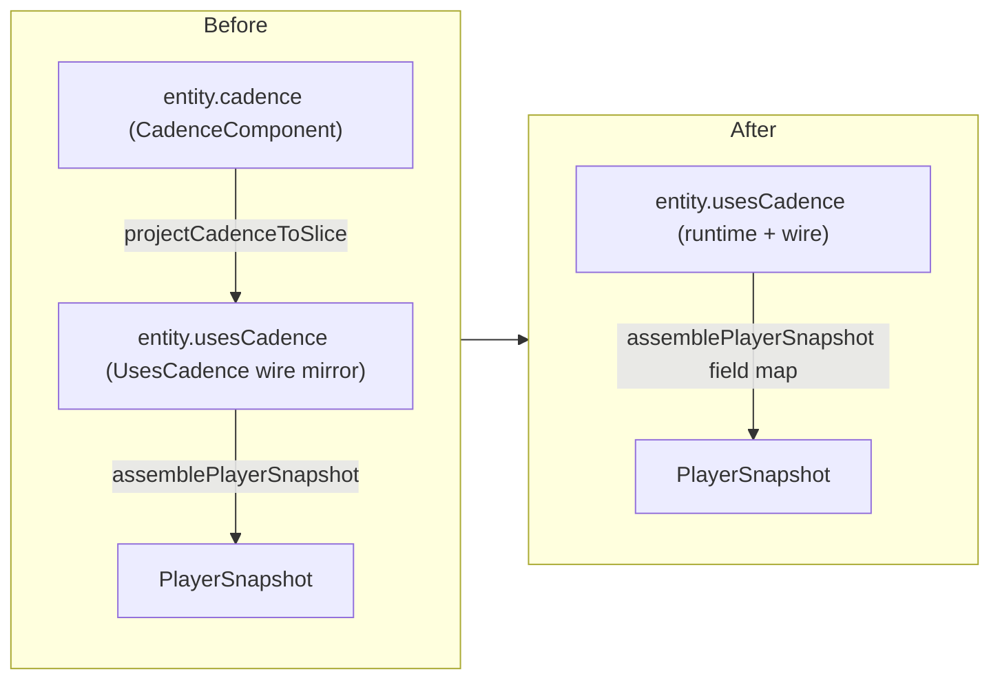
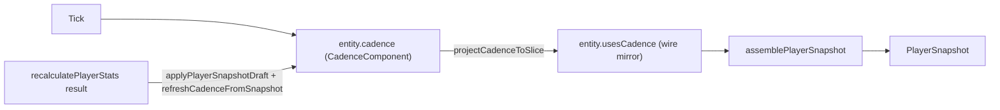
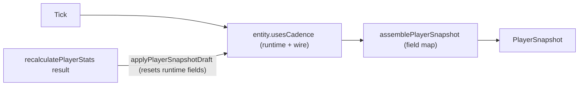

# Server Phase 4.3 — Rename Legacy Components

Implements the third outstanding follow-up from [.cursor/design/cleanup.md](.cursor/design/cleanup.md) lines 72–73 ("Rename legacy component keys to the verb-phrase taxonomy"). Originating context: [.cursor/plans/server-phase-4-snapshot-slices_f3c9a8d2.plan.md](.cursor/plans/server-phase-4-snapshot-slices_f3c9a8d2.plan.md) Step 1 naming table.

End state:

- Every entity key on `ServerEntity` follows the two-word lower-camel verb-phrase convention (`hasPosition`, `tracksCombat`, `usesCadence`, …). No legacy keys remain.
- The five archetype runtime components are merged into their wire-mirror slices. Each merged slice uses **short field names** (`usesCadence.count`, `usesEnergy.energy`, `usesReload.ammo`); `assemblePlayerSnapshot` performs the mapping to wire field names.
- Merged archetype slices (`usesCadence`, `usesEnergy`, `appliesDots`, `chillsTarget`, `usesCooldown`, `usesReload`) are **optional** on the entity — attached only when the player has that archetype. **Component presence is the archetype gate**: code does `if (entity.usesCadence)`, never `if (combatArchetype === 'cadence')`. Per-archetype queries are pure composition: `world.cadencePlayers = playerEntities.with('usesCadence')` — no `where` predicate, no `reindex` needed.
- Chill state splits cleanly off `dot` into a dedicated `chillsTarget` runtime+wire slice.
- `World.getPlayerCombatState` / `getMonsterCombatState` / `getPlayerCombatAt` / `setPlayerCombatAt` / `getMonsterAi` / `getBossState` / `setBossState` / `getPlayerEntity` / `getMonsterEntity` / `hasPlayer` / `hasMonster` are all deleted. ID-keyed access goes through one composition-agnostic `world.getEntity(id): ServerEntity | undefined` backed by a `Map<EntityId, ServerEntity>` wired via miniplex `onEntityAdded` / `onEntityRemoved`. Iteration uses pre-created queries on `World` (`monsterEntities`, `playerEntities`, `knockbackedMonsters`, `bossScriptedMonsters`, `cadencePlayers`, `energyPlayers`, `dotPlayers`, `cooldownPlayers`, `reloadPlayers`). Archetype narrowing is composition-driven via `isPlayerEntity(e)` / `isMonsterEntity(e)` type guards.
- `World.cadencePlayers` / `energyPlayers` / `dotPlayers` / `cooldownPlayers` / `reloadPlayers` queries are **rebuilt** as pure-composition `playerEntities.with('usesCadence')` (etc.) and become the canonical per-archetype iterables. A new `world.chillingPlayers = playerEntities.with('chillsTarget')` joins them.
- `World.ensureCadenceComponent` / `ensureEnergyComponent` / `ensureDotComponent` / `ensureCooldownComponent` / `ensureReloadComponent` and `refreshArchetypeComponents` are deleted. Slice attach/detach concentrates in one place: `applyPlayerSnapshotDraft`'s `syncArchetypeSlice` helper, called at the equip / unequip / skill-unlock / hydrate / respawn seam.
- Wire-parity check at boot (`diffPlayerRoundTrip` / `diffMonsterRoundTrip` in [server/src/ecs/projection.ts](server/src/ecs/projection.ts)) continues to pass.

---

## Architecture



Core invariants:

- Wire DTOs (`PlayerSnapshot`, `MonsterSnapshot`, `NodeSnapshot`) stay byte-identical. Field names on the DTOs do not change — only the names of the typed slice fields the projection reads from.
- `recalculatePlayerStats` and other shared formula helpers in `@mmo-idle/shared` are untouched; they keep consuming `PlayerSnapshot` DTOs. The seam is `playerSnapshotAdapter.ts` which already does field-name mapping.
- Each merged archetype slice is **optional**, attached only when the player has that archetype. The `playerEntities` query drops the archetype slices from its `with(...)` list; per-archetype queries (`cadencePlayers`, etc.) are pure-composition `playerEntities.with('usesCadence')`. `combatArchetype` on `usesSkills` remains as a wire/persistence-side string; it is read only at the hydrate / equip seam to decide which slice to attach.
- ECS idiom: archetype-specific code gates on **component presence** (`if (entity.usesCadence)`) rather than on a string check. The archetype query already filters, so prototypes that iterate `world.cadencePlayers` don't need any inline gate.
- `assemblePlayerSnapshot` writes default values (`0`, `false`) for wire fields whose owning slice is absent — preserving byte-identical wire output across archetype changes.
- Type names follow the slice taxonomy: `TracksCombat`, `TracksEngagement`, `ControlsMonster`, `HasKnockback`, `ScriptsBoss`, `UsesCadence`, `UsesEnergy`, `AppliesDots`, `ChillsTarget`, `UsesCooldown`, `UsesReload`. The `Component` suffix and `Runtime State` suffix are dropped.
- The `tracksEngagement` field stores the last timestamp the player entered combat. It's a scalar (`number`); we keep it as a primitive component (not an object) since wrapping it adds noise.
- `applyPlayerSnapshotDraft` (in [server/src/ecs/playerSnapshotAdapter.ts](server/src/ecs/playerSnapshotAdapter.ts)) resets the archetype-runtime-only fields (cadence `seqDmg`/`charge`/`echo`, energy AC/CS/SM/SE bookkeeping, etc.) to defaults whenever it writes back from a draft, matching today's `refresh*FromSnapshot` semantics.

---

## Code Architecture (walkthrough)

Read top to bottom; steps are ordered by dependency. The file index at the end is the canonical lookup for every touched path.

Steps 1–5 are pure key renames (single key per step, mechanical). Steps 6–10 merge each archetype runtime component into its wire-mirror slice (one archetype per step, same pattern). Step 11 swaps the per-archetype id lookups (`getPlayerEntity` / `getMonsterEntity`) for a composition-agnostic `Map<EntityId, ServerEntity>` index wired via miniplex `onEntityAdded` / `onEntityRemoved`, and promotes shared filtered subsets to pre-created queries on `World`. Step 12 deletes residual lifecycle dead code. Step 13 validates.

### Step 1 — Rename `combatState` → `tracksCombat`; type `CombatState` → `TracksCombat`

**Goal:** Bring the most-referenced legacy key (~50 call sites across 19 files) onto the new naming scheme. Delete the bespoke `getPlayer/MonsterCombatState` accessors at the same time so callers use entity lookups directly.

A. Move the type definition into `ecs/components/`:

| File                                                                                   | Symbol                                                                                                                                                                                      | Action | Summary                                                                                                                                                                                                                                                                                                                                                                                                                                                      |
| -------------------------------------------------------------------------------------- | ------------------------------------------------------------------------------------------------------------------------------------------------------------------------------------------- | ------ | ------------------------------------------------------------------------------------------------------------------------------------------------------------------------------------------------------------------------------------------------------------------------------------------------------------------------------------------------------------------------------------------------------------------------------------------------------------ |
| [server/src/ecs/components/tracksCombat.ts](server/src/ecs/components/tracksCombat.ts) | `TracksCombat`, `makeTracksCombat`, `resetTracksCombat`, `tickCooldowns`, `tickStatusEffectDurations`, and all `get*` / `set*` field helpers (`getCounter`, `setCounter`, `getResource`, …) | add    | New home for the runtime "combat state" bag. Body is identical to today's [server/src/systems/combatState.ts](server/src/systems/combatState.ts) with `CombatState` renamed to `TracksCombat`.                                                                                                                                                                                                                                                               |
| [server/src/systems/combatState.ts](server/src/systems/combatState.ts)                 | `updateCombatState`                                                                                                                                                                         | modify | Keeps only the tick driver (it's a system, not a component definition). Re-exports `TracksCombat`, `makeTracksCombat`, `resetTracksCombat`, the field helpers, and the legacy `CombatState` alias from `../ecs/components/tracksCombat` for one commit's worth of grace; final state imports straight from the new file. Updates the iteration to `entity.tracksCombat` and fixes the stale comment that says state lives on `World.playerCombatState` Maps. |
| [server/src/ecs/entity.ts](server/src/ecs/entity.ts)                                   | `ServerEntity`                                                                                                                                                                              | modify | `combatState?: CombatState` → `tracksCombat?: TracksCombat`; import path moves to `./components/tracksCombat`.                                                                                                                                                                                                                                                                                                                                               |

B. Update entity-union types and queries:

```ts
// server/src/ecs/components/player.ts
export type PlayerEntity = With<ServerEntity,
  | 'isPlayer'
  | 'tracksCombat'
  | 'tracksEngagement'       // renamed in Step 2 but listed here so PlayerEntity stays stable
  | /* …all slice keys, with merged usesCadence/Energy/Cooldown/Reload + appliesDots + chillsTarget… */
>;
```

```ts
// server/src/world/World.ts (excerpt)
readonly monsterEntities = this.ecs.with(
  'controlsMonster',  // Step 3
  'tracksCombat',
  'isMonster',
  /* … */
);

readonly playerEntities = this.ecs.with(
  'tracksCombat',
  'tracksEngagement', // Step 2
  'isPlayer',
  /* …merged slices… */
);
```

C. Delete the bespoke accessors and switch call sites to entity lookup:

```ts
// before
const cs = world.getMonsterCombatState(monsterId);
// after
// Step 1 interim shape (still uses getMonsterEntity; Step 11 sweeps to the
// composition-narrowing pattern `world.getEntity(id)` + `isMonsterEntity`).
const cs = world.getMonsterEntity(monsterId)?.tracksCombat;
```

| File                                                   | Symbol                                                                      | Action                                             |
| ------------------------------------------------------ | --------------------------------------------------------------------------- | -------------------------------------------------- |
| [server/src/world/World.ts](server/src/world/World.ts) | `getPlayerCombatState`, `getMonsterCombatState`                             | remove                                             |
| ~19 system files (see audit in plan workspace)         | `entity.combatState` / `target.combatState` / `attacker.combatState` / etc. | modify — global s/`\.combatState\b/\.tracksCombat/ |

Invariants / error handling: `entity.tracksCombat` is required on `PlayerEntity` and `MonsterEntity` so non-null access stays sound. Where today's code did `if (!cs) return;` after an Optional helper, the interim code resolves through `getPlayerEntity` / `getMonsterEntity` which may return undefined — preserve those guards. Step 11 sweeps these lookups to `world.getEntity(id)` + `isPlayerEntity` / `isMonsterEntity` guards.

Wire impact: none.

---

### Step 2 — Rename `combatAt` → `tracksEngagement`

**Goal:** Move the "last-engaged timestamp" scalar onto the new key. Delete the bespoke `getPlayerCombatAt` / `setPlayerCombatAt` wrappers in favor of direct field access.

| File                                                                                                                                                                                                                                                                                                                                                                                                                                                   | Symbol                                   | Action | Summary                                                                                                                                   |
| ------------------------------------------------------------------------------------------------------------------------------------------------------------------------------------------------------------------------------------------------------------------------------------------------------------------------------------------------------------------------------------------------------------------------------------------------------ | ---------------------------------------- | ------ | ----------------------------------------------------------------------------------------------------------------------------------------- |
| [server/src/ecs/entity.ts](server/src/ecs/entity.ts)                                                                                                                                                                                                                                                                                                                                                                                                   | `ServerEntity.combatAt`                  | rename | `combatAt?: number` → `tracksEngagement?: number`.                                                                                        |
| [server/src/ecs/components/player.ts](server/src/ecs/components/player.ts)                                                                                                                                                                                                                                                                                                                                                                             | `PlayerEntity`                           | modify | Replace `'combatAt'` with `'tracksEngagement'` in the `With<>` union.                                                                     |
| [server/src/world/World.ts](server/src/world/World.ts)                                                                                                                                                                                                                                                                                                                                                                                                 | `getPlayerCombatAt`, `setPlayerCombatAt` | remove | Inline at call sites.                                                                                                                     |
| [server/src/world/World.ts](server/src/world/World.ts)                                                                                                                                                                                                                                                                                                                                                                                                 | `attachPlayerEntity` initial stamp       | modify | `combatAt: 0` → `tracksEngagement: 0`.                                                                                                    |
| Callers: [server/src/systems/combat.ts](server/src/systems/combat.ts) (×4), [server/src/systems/spawning/index.ts](server/src/systems/spawning/index.ts), [server/src/systems/aoeDamage.ts](server/src/systems/aoeDamage.ts), [server/src/systems/defenseSystems.ts](server/src/systems/defenseSystems.ts), [server/src/systems/classes/reload/reloadT3.ts](server/src/systems/classes/reload/reloadT3.ts), [server/src/index.ts](server/src/index.ts) | —                                        | modify | Replace `world.setPlayerCombatAt(id, now)` with `const e = world.getPlayerEntity(id); if (e) e.tracksEngagement = now;`. Reads similarly. |

Code shape:

```ts
// server/src/systems/combat.ts (typical site)
const attacker = world.getPlayerEntity(attackerId);
if (attacker) attacker.tracksEngagement = now;
```

Wire impact: none. `tracksEngagement` is a server-only field.

---

### Step 3 — Rename `monsterAi` → `controlsMonster`; type `MonsterAI` → `ControlsMonster`

**Goal:** Pull the type out of `World.ts` (where it currently lives) into a proper component file under `ecs/components/` and rename the key.

| File                                                                                                                                                                                                                                                                                                                  | Symbol                            | Action | Summary                                                                                                                |
| --------------------------------------------------------------------------------------------------------------------------------------------------------------------------------------------------------------------------------------------------------------------------------------------------------------------- | --------------------------------- | ------ | ---------------------------------------------------------------------------------------------------------------------- |
| [server/src/ecs/components/controlsMonster.ts](server/src/ecs/components/controlsMonster.ts)                                                                                                                                                                                                                          | `ControlsMonster`                 | add    | Move the `MonsterAI` interface here verbatim (only the name changes).                                                  |
| [server/src/world/World.ts](server/src/world/World.ts)                                                                                                                                                                                                                                                                | `MonsterAI` interface             | remove | Re-exported from `controlsMonster.ts` for one commit if needed to ease callers, but final state has only the new name. |
| [server/src/world/World.ts](server/src/world/World.ts)                                                                                                                                                                                                                                                                | `getMonsterAi`                    | remove | Inline at call sites: `world.getMonsterEntity(id)?.controlsMonster` (sweep to composition narrow in Step 11).          |
| [server/src/ecs/entity.ts](server/src/ecs/entity.ts)                                                                                                                                                                                                                                                                  | `ServerEntity.monsterAi`          | rename | `monsterAi?: MonsterAI` → `controlsMonster?: ControlsMonster`.                                                         |
| [server/src/ecs/components/monster.ts](server/src/ecs/components/monster.ts)                                                                                                                                                                                                                                          | `MonsterEntity`                   | modify | `'monsterAi'` → `'controlsMonster'` in the union.                                                                      |
| [server/src/world/World.ts](server/src/world/World.ts)                                                                                                                                                                                                                                                                | `monsterEntities = ecs.with(...)` | modify | `'monsterAi'` → `'controlsMonster'`.                                                                                   |
| [server/src/systems/spawning/index.ts](server/src/systems/spawning/index.ts)                                                                                                                                                                                                                                          | `createMonster`, `spawnMonster`   | modify | `monsterAi: { … }` stamp → `controlsMonster: { … }`.                                                                   |
| Callers: [server/src/systems/ai.ts](server/src/systems/ai.ts), [server/src/systems/autoTarget.ts](server/src/systems/autoTarget.ts), [server/src/systems/bossScripts.ts](server/src/systems/bossScripts.ts), [server/src/systems/combat.ts](server/src/systems/combat.ts), [server/src/index.ts](server/src/index.ts) | —                                 | modify | `entity.monsterAi.X` → `entity.controlsMonster.X`.                                                                     |

Wire impact: none.

---

### Step 4 — Rename `knockback` → `hasKnockback`; type `KnockbackComponent` → `HasKnockback`

**Goal:** Bring the optional-on-attach knockback bag onto the naming scheme. The system implementation stays in [server/src/systems/knockback.ts](server/src/systems/knockback.ts); only the type moves.

| File                                                                                   | Symbol                                                                            | Action | Summary                                                                                                                                                              |
| -------------------------------------------------------------------------------------- | --------------------------------------------------------------------------------- | ------ | -------------------------------------------------------------------------------------------------------------------------------------------------------------------- |
| [server/src/ecs/components/hasKnockback.ts](server/src/ecs/components/hasKnockback.ts) | `HasKnockback`                                                                    | add    | New home for the type.                                                                                                                                               |
| [server/src/systems/knockback.ts](server/src/systems/knockback.ts)                     | `KnockbackComponent` (type), `applyKnockback`, `updateKnockback`, `isKnockedBack` | modify | Type renamed; imports updated; comment about a legacy `World.monsterKnockback` Map dropped. The miniplex query becomes `world.monsterEntities.with('hasKnockback')`. |
| [server/src/ecs/entity.ts](server/src/ecs/entity.ts)                                   | `ServerEntity.knockback`                                                          | rename | `knockback?: KnockbackComponent` → `hasKnockback?: HasKnockback`.                                                                                                    |
| [server/src/world/World.ts](server/src/world/World.ts)                                 | `addComponent` / `removeComponent` calls                                          | modify | String literal `'knockback'` → `'hasKnockback'`.                                                                                                                     |

Wire impact: none.

---

### Step 5 — Rename `bossState` → `scriptsBoss`; type `BossRuntimeState` → `ScriptsBoss`

**Goal:** Same shape as Step 4. Delete the bespoke `getBossState` / `setBossState` accessors. Fix the stale documentation in both `bossScripts.ts` and `CLAUDE.md` that still describes a `World.bossState: Map<…>` (the migration to an ECS component happened in Phase 3 but the docs weren't updated).

| File                                                                                 | Symbol                                                        | Action | Summary                                                                                                                                                                                                  |
| ------------------------------------------------------------------------------------ | ------------------------------------------------------------- | ------ | -------------------------------------------------------------------------------------------------------------------------------------------------------------------------------------------------------- |
| [server/src/ecs/components/scriptsBoss.ts](server/src/ecs/components/scriptsBoss.ts) | `ScriptsBoss`, `initScriptsBoss`                              | add    | Move the `BossRuntimeState` interface and the private `initBossState` factory here, renaming both.                                                                                                       |
| [server/src/systems/bossScripts.ts](server/src/systems/bossScripts.ts)               | `updateBossScripts`, internal use of the type                 | modify | Import the new type; rewrite the file header comment to reflect the ECS-component reality.                                                                                                               |
| [server/src/ecs/entity.ts](server/src/ecs/entity.ts)                                 | `ServerEntity.bossState`                                      | rename | `bossState?: BossRuntimeState` → `scriptsBoss?: ScriptsBoss`.                                                                                                                                            |
| [server/src/world/World.ts](server/src/world/World.ts)                               | `getBossState`, `setBossState`                                | remove | Inline at the two call sites in `bossScripts.ts`: `e.scriptsBoss ?? (e.scriptsBoss = initScriptsBoss(script))`. The miniplex `addComponent(e, 'scriptsBoss', state)` path stays inside `bossScripts.ts`. |
| [CLAUDE.md](CLAUDE.md)                                                               | "Runtime state" paragraph in the Boss fight scripting section | modify | Replace "`World.bossState: Map<string, BossRuntimeState>`" with "Per-monster `scriptsBoss?: ScriptsBoss` ECS component".                                                                                 |

Wire impact: none.

---

### Step 6 — Merge `cadence` runtime component into `usesCadence`

**Goal:** Eliminate the runtime-vs-wire-mirror split. After this step, `entity.usesCadence` is the single source of truth for everything cadence-related. The new field names are short (no `cadence` prefix) because the slice itself already names the concern.

A. Define the merged slice:

```ts
// server/src/ecs/components/usesCadence.ts (new file)
export interface UsesCadence {
  count: number; // ↔ snapshot.cadenceCount
  threshold: number; // ↔ snapshot.cadenceThreshold
  empoweredArmed: boolean; // ↔ snapshot.cadenceEmpoweredArmed
  speedStacks: number; // ↔ snapshot.cadenceSpeedStacks
  seqDmg: number; // runtime-only (Delayed Verdict)
  charge: number; // runtime-only (Iron Patience)
  echo: number; // runtime-only (Rising Tide)
}

export function makeUsesCadence(snapshot: PlayerSnapshot): UsesCadence {
  return {
    count: snapshot.cadenceCount,
    threshold: snapshot.cadenceThreshold,
    empoweredArmed: snapshot.cadenceEmpoweredArmed,
    speedStacks: snapshot.cadenceSpeedStacks,
    seqDmg: 0,
    charge: 0,
    echo: 0,
  };
}
```

B. Update the projection helpers to conditionally produce the slice and to default on absence:

```ts
// server/src/ecs/projection.ts decomposePlayerSnapshot (excerpt)
// Optional slice — only stamp when the player is a cadence-class player.
if (snapshot.combatArchetype === 'cadence') {
  stamp.usesCadence = {
    count:          snapshot.cadenceCount,
    threshold:      snapshot.cadenceThreshold,
    empoweredArmed: snapshot.cadenceEmpoweredArmed,
    speedStacks:    snapshot.cadenceSpeedStacks,
    seqDmg: 0, charge: 0, echo: 0,
  };
}

// server/src/ecs/projection.ts assemblePlayerSnapshot (excerpt)
// Defaults preserve byte-identical wire output for non-cadence players.
cadenceCount:          entity.usesCadence?.count          ?? 0,
cadenceThreshold:      entity.usesCadence?.threshold      ?? 0,
cadenceEmpoweredArmed: entity.usesCadence?.empoweredArmed ?? false,
cadenceSpeedStacks:    entity.usesCadence?.speedStacks    ?? 0,
```

C. Update the seam adapter to **attach / detach** the slice when archetype changes, and to write field values only when attached:

```ts
// server/src/ecs/playerSnapshotAdapter.ts (excerpt)
// After applying every other field, reconcile archetype membership:
syncArchetypeSlice(
  world,
  entity,
  draft.combatArchetype === "cadence",
  "usesCadence",
  () => ({
    count: draft.cadenceCount,
    threshold: draft.cadenceThreshold,
    empoweredArmed: draft.cadenceEmpoweredArmed,
    speedStacks: draft.cadenceSpeedStacks,
    seqDmg: 0,
    charge: 0,
    echo: 0,
  }),
);

// helper
function syncArchetypeSlice<K extends keyof ServerEntity>(
  world: World,
  entity: ServerEntity,
  shouldHave: boolean,
  key: K,
  factory: () => NonNullable<ServerEntity[K]>,
): void {
  if (shouldHave && !entity[key]) {
    world.ecs.addComponent(entity, key, factory());
  } else if (!shouldHave && entity[key]) {
    world.ecs.removeComponent(entity, key);
  }
  // If already present and still should be, leave runtime fields alone — the
  // recalc only adjusts wire-mirror fields, which are then re-applied below
  // (or left at their pre-recalc value if the slice already held them).
}
```

`applyPlayerSnapshotDraft` (and its callers `withPlayerSnapshotDraft` / `recalculatePlayerEntityStats`) gain a `world: World` parameter so they can call `addComponent` / `removeComponent`. Callers in spawning / inventory / skills / testRoomInteract / index.ts pass the world reference through (~7 sites).

D. Delete the old runtime component and its bridge:

| File                                                                                                             | Symbol                                                                                                                   | Action                                                                                                                                                               |
| ---------------------------------------------------------------------------------------------------------------- | ------------------------------------------------------------------------------------------------------------------------ | -------------------------------------------------------------------------------------------------------------------------------------------------------------------- |
| [server/src/ecs/components/cadence.ts](server/src/ecs/components/cadence.ts)                                     | `CadenceComponent`, `CadencePlayerEntity`, `makeCadenceComponent`, `refreshCadenceFromSnapshot`, `projectCadenceToSlice` | remove (delete file)                                                                                                                                                 |
| [server/src/ecs/components/snapshotSlices.ts](server/src/ecs/components/snapshotSlices.ts)                       | `UsesCadence` interface                                                                                                  | remove (now lives in `usesCadence.ts`)                                                                                                                               |
| [server/src/ecs/entity.ts](server/src/ecs/entity.ts)                                                             | `cadence?: CadenceComponent` line                                                                                        | remove                                                                                                                                                               |
| [server/src/ecs/components/player.ts](server/src/ecs/components/player.ts)                                       | `'usesCadence'` in the `PlayerEntity` `With<>` union                                                                     | remove (slice is now optional)                                                                                                                                       |
| [server/src/world/World.ts](server/src/world/World.ts)                                                           | `'usesCadence'` in `playerEntities = ecs.with(...)`                                                                      | remove (slice is now optional)                                                                                                                                       |
| [server/src/world/World.ts](server/src/world/World.ts)                                                           | `cadencePlayers` query                                                                                                   | rebuild as `playerEntities.with('usesCadence')` — pure composition                                                                                                   |
| [server/src/world/World.ts](server/src/world/World.ts)                                                           | `ensureCadenceComponent`, `refreshArchetypeComponents` cadence branch                                                    | remove — the adapter now owns attach/detach                                                                                                                          |
| [server/src/systems/classes/cadence/cadencePrototype.ts](server/src/systems/classes/cadence/cadencePrototype.ts) | All `entity.cadence.X` reads/writes; presence gate                                                                       | modify — iterate `world.cadencePlayers`; access `entity.usesCadence.X` (typed non-optional via `With<E, 'usesCadence'>`); no `combatArchetype` string check anywhere |

E. Archetype-membership gate becomes **component presence**:

```ts
// Before — runtime gate
if (entity.cadence) {
  /* cadence logic */
}

// After — query iteration; the query already filters
for (const entity of world.cadencePlayers) {
  /* entity.usesCadence is typed non-optional here */
}

// Or, for one-off checks
if (entity.usesCadence) {
  /* cadence logic — `combatArchetype === 'cadence'` is implied */
}
```

Invariants / error handling:

- `usesCadence` is **optional** on `ServerEntity` and not part of the `playerEntities` query. Code outside `world.cadencePlayers` iteration that needs the slice must check presence (`if (entity.usesCadence)` or use the `cadencePlayers` query).
- `world.cadencePlayers = playerEntities.with('usesCadence')` is pure composition — no `where`, no `reindex`. miniplex auto-updates the query as `addComponent` / `removeComponent` fire.
- Slice attach/detach happens **only** in `applyPlayerSnapshotDraft` (the seam where `combatArchetype` can change). If a future system mutates archetype outside the adapter, it must call the same attach/detach helper. Documented in the adapter file header.
- `refreshArchetypeComponents` and `ensureCadenceComponent` go away in this step. The adapter's `syncArchetypeSlice` is the single replacement.

Wire impact: none (verified via `diffPlayerRoundTrip` at boot). The wire fields default to `0` / `false` when the slice is absent, matching what today's always-present slice writes for non-cadence players.

---

### Step 7 — Merge `energy` runtime component into `usesEnergy`

**Goal:** Same shape as Step 6, applied to the energy archetype.

```ts
// server/src/ecs/components/usesEnergy.ts (new file)
export interface UsesEnergy {
  energy: number; // ↔ snapshot.energyCount
  energyMax: number; // runtime-only (default 100; SE T3 doubles)
  empoweredReady: boolean; // ↔ snapshot.empoweredReady (mirror of combat-state flag)

  // Alternating Currents (energy-balanced-t3-a) runtime
  acChargePhase: boolean;
  acDischargeMs: number;
  acTickNext: number;
  acSpeedBase: number;
  acSpeedActive: boolean;

  // Capacitor Shunt (energy-balanced-t3-c) runtime
  csReservoir: number;

  // Superconducting Mass (energy-heavy-t3-c) runtime
  smChargePool: number;

  // Singularity Execute (energy-heavy-t3-a) runtime
  seInitialized: boolean;
}
```

| File                                                                                                                                                                                                         | Symbol                                                                       | Action                                                                                                                   |
| ------------------------------------------------------------------------------------------------------------------------------------------------------------------------------------------------------------ | ---------------------------------------------------------------------------- | ------------------------------------------------------------------------------------------------------------------------ | -------------------------------------------------------------------------------- |
| [server/src/ecs/components/usesEnergy.ts](server/src/ecs/components/usesEnergy.ts)                                                                                                                           | `UsesEnergy`, `makeUsesEnergy`                                               | add                                                                                                                      |
| [server/src/ecs/components/energy.ts](server/src/ecs/components/energy.ts)                                                                                                                                   | `EnergyComponent` and helpers                                                | remove (delete file)                                                                                                     |
| [server/src/ecs/components/snapshotSlices.ts](server/src/ecs/components/snapshotSlices.ts)                                                                                                                   | `UsesEnergy` interface                                                       | remove                                                                                                                   |
| [server/src/ecs/projection.ts](server/src/ecs/projection.ts)                                                                                                                                                 | `decomposePlayerSnapshot.usesEnergy`, `assemblePlayerSnapshot` energy fields | modify                                                                                                                   | `energyCount` ↔ `energy` mapping                                                 |
| [server/src/ecs/playerSnapshotAdapter.ts](server/src/ecs/playerSnapshotAdapter.ts)                                                                                                                           | `applyPlayerSnapshotDraft` energy block                                      | modify                                                                                                                   | Map `draft.energyCount` → `usesEnergy.energy`; reset runtime AC/CS/SM/SE fields. |
| [server/src/world/World.ts](server/src/world/World.ts)                                                                                                                                                       | `'usesEnergy'` in `playerEntities.with(...)`                                 | remove (slice is now optional)                                                                                           |
| [server/src/world/World.ts](server/src/world/World.ts)                                                                                                                                                       | `energyPlayers` query                                                        | rebuild as `playerEntities.with('usesEnergy')`                                                                           |
| [server/src/world/World.ts](server/src/world/World.ts)                                                                                                                                                       | `ensureEnergyComponent`                                                      | remove — adapter's `syncArchetypeSlice` owns attach/detach                                                               |
| [server/src/ecs/components/player.ts](server/src/ecs/components/player.ts)                                                                                                                                   | `'usesEnergy'` in `PlayerEntity`                                             | remove                                                                                                                   |
| [server/src/systems/classes/energy/energyPrototype.ts](server/src/systems/classes/energy/energyPrototype.ts), [server/src/systems/classes/energy/energyT3.ts](server/src/systems/classes/energy/energyT3.ts) | `entity.energy.X` references; presence gate                                  | modify — iterate `world.energyPlayers` (no inline gate); access `entity.usesEnergy.X` (typed non-optional via the query) |

`assemblePlayerSnapshot` writes defaults when the slice is absent: `energyCount: entity.usesEnergy?.energy ?? 0`, `empoweredReady: entity.usesEnergy?.empoweredReady ?? false`.

`decomposePlayerSnapshot` stamps the slice only when `snapshot.combatArchetype === 'energy'`. `applyPlayerSnapshotDraft` calls `syncArchetypeSlice(world, entity, draft.combatArchetype === 'energy', 'usesEnergy', factory)`.

Wire impact: none.

---

### Step 8 — Merge `dot` into `appliesDots` and split chill into `chillsTarget`

**Goal:** Same shape as Step 6 with one twist — the DoT runtime component carries both DoT state and chill state today (`targetChillStacks`). We move chill into a dedicated **independently-attachable** `chillsTarget` slice. `appliesDots` is attached for any DoT-class player; `chillsTarget` is attached only when the player has the `dot.freezing-cold` passive — because that's the passive that actually applies chill stacks. **Component presence is the gate for both.**

A. Merged DoT slice (runtime + wire), optional on the entity:

```ts
// server/src/ecs/components/appliesDots.ts (new file)
export interface AppliesDots {
  targetDotStacks: number; // ↔ snapshot.targetDotStacks (already aligned)
  itInitialized: boolean; // runtime-only (Invigorating Toxins)
  itBaseCd: number; // runtime-only
}
```

B. Chill slice owns its own field, independently attachable:

```ts
// server/src/ecs/components/chillsTarget.ts (new file)
export interface ChillsTarget {
  targetChillStacks: number; // ↔ snapshot.targetChillStacks
}
```

C. DoT T3 logic that today writes `entity.dot.targetChillStacks` (Freezing Cold mirror) switches to `entity.chillsTarget.targetChillStacks` — and only fires on entities that actually have the slice:

```ts
// server/src/systems/classes/dot/dotT3.ts mirrorDotT3PlayerSnapshot (excerpt)
for (const entity of world.chillingPlayers) {
  entity.chillsTarget.targetChillStacks = chillStacksOnCurrentTarget;
}
```

D. Attach/detach decisions in the adapter:

```ts
// server/src/ecs/playerSnapshotAdapter.ts (excerpt)
syncArchetypeSlice(
  world,
  entity,
  draft.combatArchetype === "dot",
  "appliesDots",
  () => ({
    targetDotStacks: draft.targetDotStacks,
    itInitialized: false,
    itBaseCd: 0,
  }),
);
syncArchetypeSlice(
  world,
  entity,
  draft.passives["dot.freezing-cold"] > 0,
  "chillsTarget",
  () => ({ targetChillStacks: draft.targetChillStacks }),
);
```

E. World queries:

```ts
// server/src/world/World.ts (excerpt)
readonly dotPlayers       = this.playerEntities.with('appliesDots');
readonly chillingPlayers  = this.playerEntities.with('chillsTarget');
```

F. Removals:

| File                                                                                       | Symbol                                                          | Action                                                     |
| ------------------------------------------------------------------------------------------ | --------------------------------------------------------------- | ---------------------------------------------------------- |
| [server/src/ecs/components/dot.ts](server/src/ecs/components/dot.ts)                       | `DotComponent` and helpers                                      | remove (delete file)                                       |
| [server/src/ecs/components/snapshotSlices.ts](server/src/ecs/components/snapshotSlices.ts) | `AppliesDots`, `ChillsTarget` interfaces                        | remove                                                     |
| [server/src/ecs/components/player.ts](server/src/ecs/components/player.ts)                 | `'appliesDots'`, `'chillsTarget'` in `PlayerEntity`             | remove (slices are now optional)                           |
| [server/src/world/World.ts](server/src/world/World.ts)                                     | `'appliesDots'`, `'chillsTarget'` in `playerEntities.with(...)` | remove                                                     |
| [server/src/world/World.ts](server/src/world/World.ts)                                     | `ensureDotComponent`                                            | remove — adapter's `syncArchetypeSlice` owns attach/detach |

Code-side renames in [server/src/systems/classes/dot/dotPrototype.ts](server/src/systems/classes/dot/dotPrototype.ts) and [server/src/systems/classes/dot/dotT3.ts](server/src/systems/classes/dot/dotT3.ts):

```ts
// Before
entity.dot.targetDotStacks   = …;
entity.dot.targetChillStacks = …;
if (entity.dot && !entity.dot.itInitialized) { … }

// After — iterate the typed queries (no inline gate)
for (const entity of world.dotPlayers) {
  entity.appliesDots.targetDotStacks = …;
  if (!entity.appliesDots.itInitialized) { … }
}
for (const entity of world.chillingPlayers) {
  entity.chillsTarget.targetChillStacks = …;
}
```

`assemblePlayerSnapshot` writes defaults when the slices are absent: `targetDotStacks: entity.appliesDots?.targetDotStacks ?? 0`, `targetChillStacks: entity.chillsTarget?.targetChillStacks ?? 0`.

Wire impact: none.

---

### Step 9 — Merge `cooldown` runtime component into `usesCooldown`

**Goal:** Same shape as Step 6. Note: this archetype's wire-mirror and runtime field names already line up (`executionReady`, `executionCooldownPct`, `isChanneling`, `channelingPct`), so the merge is mostly a deletion + a move of the extra runtime fields onto the same slice.

```ts
// server/src/ecs/components/usesCooldown.ts (new file)
export interface UsesCooldown {
  // Wire mirrors
  executionReady: boolean;
  executionCooldownPct: number;
  isChanneling: boolean;
  channelingPct: number;

  // Runtime-only
  initialized: boolean;
  executionCooldownMs: number;
  odActive: boolean;
  odRemainingMs: number;
  odBaseCd: number;
  alActive: boolean;
  alRemainingMs: number;
  alBaseCd: number;
  batteryTimerAcc: number;
  singularNoTargetMs: number;
  beamRemainingMs: number;
  beamNextTickMs: number;
  beamTargetId: string;
}
```

`usesCooldown` is optional on the entity. `world.cooldownPlayers = playerEntities.with('usesCooldown')` (pure composition). `assemblePlayerSnapshot` defaults: `executionReady: entity.usesCooldown?.executionReady ?? false`, `executionCooldownPct: entity.usesCooldown?.executionCooldownPct ?? 0`, `isChanneling: entity.usesCooldown?.isChanneling ?? false`, `channelingPct: entity.usesCooldown?.channelingPct ?? 0`.

Removals: [server/src/ecs/components/cooldown.ts](server/src/ecs/components/cooldown.ts), `'usesCooldown'` from `playerEntities.with(...)` and `PlayerEntity`, `ensureCooldownComponent`. Update [server/src/systems/classes/cooldown/cooldownPrototype.ts](server/src/systems/classes/cooldown/cooldownPrototype.ts) and [server/src/systems/classes/cooldown/cooldownT3.ts](server/src/systems/classes/cooldown/cooldownT3.ts) to iterate `world.cooldownPlayers` (no inline gate) and access `entity.usesCooldown.X`.

Note: [server/src/systems/combat.ts](server/src/systems/combat.ts) today reads `player.usesCooldown.isChanneling` unconditionally. After this step the access becomes `player.usesCooldown?.isChanneling ?? false` (or the combat path narrows on the `usesCooldown` query upstream). Apply the smallest safe change at each call site — usually `?.` + default.

Wire impact: none.

---

### Step 10 — Merge `reload` runtime component into `usesReload`

**Goal:** Same shape as Step 6.

```ts
// server/src/ecs/components/usesReload.ts (new file)
export interface UsesReload {
  ammo: number; // ↔ snapshot.ammoCount
  ammoMax: number; // ↔ snapshot.ammoMax (already aligned)
  laserHeat: number; // ↔ snapshot.heatPct (rounded at projection time)
  laserOverheated: boolean; // ↔ snapshot.laserOverheated (already aligned)
  reloadingMs: number; // runtime-only
  snipeCooldownMs: number; // runtime-only
}
```

Projection mapping with defaults on absence:

```ts
// server/src/ecs/projection.ts (assemblePlayerSnapshot reload block)
ammoCount:       entity.usesReload?.ammo            ?? 0,
ammoMax:         entity.usesReload?.ammoMax         ?? 0,
heatPct:         entity.usesReload ? Math.round(entity.usesReload.laserHeat) : 0,
laserOverheated: entity.usesReload?.laserOverheated ?? false,
```

`usesReload` is optional on the entity. `world.reloadPlayers = playerEntities.with('usesReload')` (pure composition).

Removals: [server/src/ecs/components/reload.ts](server/src/ecs/components/reload.ts), `'usesReload'` from `playerEntities.with(...)` and `PlayerEntity`, `ensureReloadComponent`. Update [server/src/systems/classes/reload/reloadPrototype.ts](server/src/systems/classes/reload/reloadPrototype.ts), [server/src/systems/classes/reload/reloadT3.ts](server/src/systems/classes/reload/reloadT3.ts) to iterate `world.reloadPlayers` and access `entity.usesReload.X`.

Wire impact: none.

---

### Step 11 — Switch id lookup to a miniplex-lifecycle index; promote shared queries

**Goal:** Stop the archetype-helper pattern (`world.getPlayerEntity(id)`, `world.getMonsterEntity(id)`) and replace it with a single composition-agnostic id index plus pre-created reusable queries on the world. After this step, callers either (a) ask the world for an entity by id and narrow by component composition, or (b) iterate a pre-created query — never a bespoke per-archetype helper.

The miniplex README is explicit on three points the new approach reflects:

- Prefer **object identity** over numerical/string IDs. The codebase still needs id lookup at the network/persistence seam (socket id, DB hydrate), so we maintain one Map keyed on `entityId` — populated by miniplex's `onEntityAdded` / `onEntityRemoved` lifecycle events.
- **Reuse queries.** Calling `world.with(...)` inside a system function is "pure overhead." Promote frequently-iterated filtered subsets to class-field queries on `World`.
- **Prefer component composition over value predicates.** Steps 6–10 turn each archetype into its own optional component (`usesCadence`, `usesEnergy`, …). Per-archetype queries become pure-composition (`.with('usesCadence')`) — automatically maintained by miniplex as `addComponent` / `removeComponent` fire. No `where(...)` predicates, no `reindex` calls.

A. Add a composition-agnostic id index on `World`, wired via miniplex lifecycle:

```ts
// server/src/world/World.ts

private readonly entityIndex = new Map<EntityId, ServerEntity>();

private wireEntityIndex(): void {
  this.ecs.onEntityAdded.subscribe(e => {
    this.entityIndex.set(e.entityId, e);
  });
  this.ecs.onEntityRemoved.subscribe(e => {
    this.entityIndex.delete(e.entityId);
  });
}
// Called once from the constructor before init() spawns anything.

/** Look up any entity by its gameplay id. Narrow by component composition. */
getEntity(id: EntityId): ServerEntity | undefined {
  return this.entityIndex.get(id);
}
```

Notes:

- O(1) lookup. The Map is the single piece of id-keyed state on `World`.
- No archetype in the signature. Callers narrow via component presence (`if (!e?.isPlayer) return;`) or via the existing `isPlayerEntity(e)` / `isMonsterEntity(e)` type guards in [server/src/ecs/components/player.ts](server/src/ecs/components/player.ts) / [server/src/ecs/components/monster.ts](server/src/ecs/components/monster.ts).
- `wireEntityIndex` must run before any `ecs.add(...)` so the first entity is indexed.

B. Migrate every id-lookup call site to `world.getEntity(id)` + composition narrowing:

```ts
// Before — archetype-named helper (deleted)
const player = world.getPlayerEntity(socketId);
if (!player) return;
player.tracksCombat.X = ...;

// After — composition narrows the type
const e = world.getEntity(socketId);
if (!isPlayerEntity(e)) return;
e.tracksCombat.X = ...;
```

```ts
// Before
const target = world.getMonsterEntity(targetId);
if (!target) return;
target.hasHealth.hp -= dmg;

// After
const target = world.getEntity(targetId);
if (!isMonsterEntity(target)) return;
target.hasHealth.hp -= dmg;
```

For cases that need only one component (not the full archetype), narrow on that component directly:

```ts
const e = world.getEntity(id);
if (!e?.hasHealth) return; // composition gate
e.hasHealth.hp = e.hasHealth.maxHp;
```

| File                                                                                                                                                                                                                                                                                                                                                                                                 | ~call sites                                                                                       |
| ---------------------------------------------------------------------------------------------------------------------------------------------------------------------------------------------------------------------------------------------------------------------------------------------------------------------------------------------------------------------------------------------------- | ------------------------------------------------------------------------------------------------- |
| [server/src/world/World.ts](server/src/world/World.ts)                                                                                                                                                                                                                                                                                                                                               | ~6 (`detachPlayerEntity`, `removeMonsterEntity`, internal helpers being deleted in earlier steps) |
| [server/src/systems/spawning/index.ts](server/src/systems/spawning/index.ts)                                                                                                                                                                                                                                                                                                                         | ~3 (`respawnPlayer`, `ensureBoss`)                                                                |
| [server/src/systems/combat.ts](server/src/systems/combat.ts)                                                                                                                                                                                                                                                                                                                                         | ~5                                                                                                |
| [server/src/systems/aoeDamage.ts](server/src/systems/aoeDamage.ts)                                                                                                                                                                                                                                                                                                                                   | ~2                                                                                                |
| [server/src/systems/defenseSystems.ts](server/src/systems/defenseSystems.ts)                                                                                                                                                                                                                                                                                                                         | ~1                                                                                                |
| [server/src/systems/weaponEffects.ts](server/src/systems/weaponEffects.ts)                                                                                                                                                                                                                                                                                                                           | ~3                                                                                                |
| [server/src/systems/bossScripts.ts](server/src/systems/bossScripts.ts)                                                                                                                                                                                                                                                                                                                               | ~2                                                                                                |
| [server/src/systems/classes/cadence/cadencePrototype.ts](server/src/systems/classes/cadence/cadencePrototype.ts), [server/src/systems/classes/dot/dotT3.ts](server/src/systems/classes/dot/dotT3.ts), [server/src/systems/classes/energy/energyT3.ts](server/src/systems/classes/energy/energyT3.ts), [server/src/systems/classes/reload/reloadT3.ts](server/src/systems/classes/reload/reloadT3.ts) | ~6 total                                                                                          |
| [server/src/systems/testRoomInteract.ts](server/src/systems/testRoomInteract.ts)                                                                                                                                                                                                                                                                                                                     | ~1                                                                                                |
| [server/src/index.ts](server/src/index.ts)                                                                                                                                                                                                                                                                                                                                                           | ~8 socket handlers + 30 s autosave loop                                                           |

C. Delete the archetype-named accessors:

| File                                                   | Symbol                                | Action                                                                                                                                            |
| ------------------------------------------------------ | ------------------------------------- | ------------------------------------------------------------------------------------------------------------------------------------------------- |
| [server/src/world/World.ts](server/src/world/World.ts) | `getPlayerEntity`, `getMonsterEntity` | remove                                                                                                                                            |
| [server/src/world/World.ts](server/src/world/World.ts) | `hasPlayer`, `hasMonster`             | remove — inline as `world.getEntity(id) !== undefined` at the few call sites, or drop entirely where existence is implied by a successful narrow. |

D. Promote shared component-composition queries to class fields on `World`. After Steps 6–10, all queries on `World` are **pure composition** (`.with(...)` only — no `where(...)`, no `reindex`):

```ts
// server/src/world/World.ts (excerpt)
readonly knockbackedMonsters  = this.monsterEntities.with('hasKnockback');
readonly bossScriptedMonsters = this.monsterEntities.with('scriptsBoss');

// Already created by Steps 6–10; listed here for completeness:
readonly cadencePlayers  = this.playerEntities.with('usesCadence');
readonly energyPlayers   = this.playerEntities.with('usesEnergy');
readonly dotPlayers      = this.playerEntities.with('appliesDots');
readonly chillingPlayers = this.playerEntities.with('chillsTarget');
readonly cooldownPlayers = this.playerEntities.with('usesCooldown');
readonly reloadPlayers   = this.playerEntities.with('usesReload');
```

| Query                        | Replaces                                                              | Iterated by                                                                          |
| ---------------------------- | --------------------------------------------------------------------- | ------------------------------------------------------------------------------------ |
| `world.knockbackedMonsters`  | inline `world.monsterEntities.with('knockback')` recreated per call   | [server/src/systems/knockback.ts](server/src/systems/knockback.ts) `updateKnockback` |
| `world.bossScriptedMonsters` | `scriptsBoss`-based iteration today re-created in `updateBossScripts` | [server/src/systems/bossScripts.ts](server/src/systems/bossScripts.ts)               |

miniplex automatically keeps each query in sync as `addComponent` / `removeComponent` fire from the adapter's `syncArchetypeSlice`. No `where(...)` predicates means no `reindex` calls anywhere in this phase.

E. Type guards stay. [server/src/ecs/components/player.ts](server/src/ecs/components/player.ts) `isPlayerEntity(e)` and [server/src/ecs/components/monster.ts](server/src/ecs/components/monster.ts) `isMonsterEntity(e)` are the standard composition-based narrows from `ServerEntity` to the archetype types. They're used at the boundary right after `world.getEntity(id)` returns.

Ordering note: This step runs **after** Steps 1–10 so the new lookup + query patterns reference renamed slice names (`tracksCombat`, `usesCadence`, etc.) directly. Doing it before the renames would force a double-touch on the same call sites.

Wire impact: none.

Invariants / risks:

- Every entity attach goes through `this.ecs.add(...)` (already the case codebase-wide). The audit found no direct `ecs.entities.push` bypass.
- `applyPlayerSnapshotDraft` is the **only** path that mutates archetype membership (via `syncArchetypeSlice` per Steps 6–10). Verified by ripgrep: every other writer either calls the adapter or doesn't change archetype. If a future system mutates `combatArchetype` outside the adapter, it MUST call the same attach/detach helper — documented in the adapter's file header.
- No `reindex` calls anywhere. miniplex's archetype queries update automatically on `addComponent` / `removeComponent`.

---

### Step 12 — Clean up archetype lifecycle plumbing

**Goal:** With every archetype merged, the per-archetype attach/detach machinery becomes dead code. Remove it.

| File                                                                                       | Symbol                                                                                                                                                    | Action | Summary                                                                                                                                                  |
| ------------------------------------------------------------------------------------------ | --------------------------------------------------------------------------------------------------------------------------------------------------------- | ------ | -------------------------------------------------------------------------------------------------------------------------------------------------------- |
| [server/src/world/World.ts](server/src/world/World.ts)                                     | `ensureCadenceComponent`, `ensureEnergyComponent`, `ensureDotComponent`, `ensureCooldownComponent`, `ensureReloadComponent`, `refreshArchetypeComponents` | remove | All five archetype slices are stamped at `attachPlayerEntity` time and live for the player's lifetime.                                                   |
| [server/src/world/World.ts](server/src/world/World.ts)                                     | `attachPlayerEntity`                                                                                                                                      | modify | Stamp the merged slices using the new `makeUses*` factories; drop the conditional `ensure*Component` calls.                                              |
| Callers of `world.refreshArchetypeComponents(id)` (spawning, testRoomInteract, equip flow) | —                                                                                                                                                         | remove | The merged slices live for the player's lifetime; after `recalculatePlayerStats` the slice fields are already up-to-date via `applyPlayerSnapshotDraft`. |
| [server/src/ecs/components/snapshotSlices.ts](server/src/ecs/components/snapshotSlices.ts) | File-level doc comment                                                                                                                                    | modify | Drop the paragraph about "runtime still lives on `entity.cadence`, `entity.energy`, …" — it's no longer accurate.                                        |

---

### Step 13 — Validate

**Goal:** Prove the rename didn't break anything.

| Command                                                                                                               | What                                                                                                                         | Expected                                    |
| --------------------------------------------------------------------------------------------------------------------- | ---------------------------------------------------------------------------------------------------------------------------- | ------------------------------------------- |
| `pnpm typecheck`                                                                                                      | server + shared + client                                                                                                     | Zero errors                                 |
| `pnpm build`                                                                                                          | full build                                                                                                                   | Zero errors                                 |
| Boot dev server, observe boot log                                                                                     | `diffPlayerRoundTrip` / `diffMonsterRoundTrip` parity check                                                                  | Logs `Wire parity: OK`                      |
| Manual smoke: log in, kill a monster, switch archetypes, equip/unequip, transition nodes, hit a boss, die and respawn | Each archetype's empowered attack and T3 paths still fire; auto-combat target still updates; persistence saves on disconnect | No visual regressions; client console clean |

If any wire parity check fails, the diff log identifies the slice + field that drifted — fix the projection mapping for that one field and re-validate.

---

### File index (alphabetical)

| File                                                                                                                 | Purpose                                                                                                                                                                                                                                                                                                                                                                |
| -------------------------------------------------------------------------------------------------------------------- | ---------------------------------------------------------------------------------------------------------------------------------------------------------------------------------------------------------------------------------------------------------------------------------------------------------------------------------------------------------------------- |
| [CLAUDE.md](CLAUDE.md)                                                                                               | Update boss-script runtime-state paragraph (Step 5).                                                                                                                                                                                                                                                                                                                   |
| [server/src/ecs/components/appliesDots.ts](server/src/ecs/components/appliesDots.ts)                                 | Merged DoT slice (Step 8) — new file.                                                                                                                                                                                                                                                                                                                                  |
| [server/src/ecs/components/cadence.ts](server/src/ecs/components/cadence.ts)                                         | Deleted (Step 6).                                                                                                                                                                                                                                                                                                                                                      |
| [server/src/ecs/components/chillsTarget.ts](server/src/ecs/components/chillsTarget.ts)                               | Chill slice split out of DoT (Step 8) — new file.                                                                                                                                                                                                                                                                                                                      |
| [server/src/ecs/components/controlsMonster.ts](server/src/ecs/components/controlsMonster.ts)                         | Monster AI bag relocated from `World.ts` (Step 3) — new file.                                                                                                                                                                                                                                                                                                          |
| [server/src/ecs/components/cooldown.ts](server/src/ecs/components/cooldown.ts)                                       | Deleted (Step 9).                                                                                                                                                                                                                                                                                                                                                      |
| [server/src/ecs/components/dot.ts](server/src/ecs/components/dot.ts)                                                 | Deleted (Step 8).                                                                                                                                                                                                                                                                                                                                                      |
| [server/src/ecs/components/energy.ts](server/src/ecs/components/energy.ts)                                           | Deleted (Step 7).                                                                                                                                                                                                                                                                                                                                                      |
| [server/src/ecs/components/hasKnockback.ts](server/src/ecs/components/hasKnockback.ts)                               | Knockback type relocated (Step 4) — new file.                                                                                                                                                                                                                                                                                                                          |
| [server/src/ecs/components/monster.ts](server/src/ecs/components/monster.ts)                                         | `MonsterEntity` union updated (Steps 1, 3).                                                                                                                                                                                                                                                                                                                            |
| [server/src/ecs/components/player.ts](server/src/ecs/components/player.ts)                                           | `PlayerEntity` union updated (Steps 1, 2, 6–10).                                                                                                                                                                                                                                                                                                                       |
| [server/src/ecs/components/reload.ts](server/src/ecs/components/reload.ts)                                           | Deleted (Step 10).                                                                                                                                                                                                                                                                                                                                                     |
| [server/src/ecs/components/scriptsBoss.ts](server/src/ecs/components/scriptsBoss.ts)                                 | Boss-script type relocated (Step 5) — new file.                                                                                                                                                                                                                                                                                                                        |
| [server/src/ecs/components/snapshotSlices.ts](server/src/ecs/components/snapshotSlices.ts)                           | Remove the merged archetype interfaces (`UsesCadence`, `UsesEnergy`, `AppliesDots`, `ChillsTarget`, `UsesCooldown`, `UsesReload`); update file-level doc.                                                                                                                                                                                                              |
| [server/src/ecs/components/tracksCombat.ts](server/src/ecs/components/tracksCombat.ts)                               | Combat-state runtime bag relocated (Step 1) — new file.                                                                                                                                                                                                                                                                                                                |
| [server/src/ecs/components/usesCadence.ts](server/src/ecs/components/usesCadence.ts)                                 | Merged cadence slice (Step 6) — new file.                                                                                                                                                                                                                                                                                                                              |
| [server/src/ecs/components/usesCooldown.ts](server/src/ecs/components/usesCooldown.ts)                               | Merged cooldown slice (Step 9) — new file.                                                                                                                                                                                                                                                                                                                             |
| [server/src/ecs/components/usesEnergy.ts](server/src/ecs/components/usesEnergy.ts)                                   | Merged energy slice (Step 7) — new file.                                                                                                                                                                                                                                                                                                                               |
| [server/src/ecs/components/usesReload.ts](server/src/ecs/components/usesReload.ts)                                   | Merged reload slice (Step 10) — new file.                                                                                                                                                                                                                                                                                                                              |
| [server/src/ecs/entity.ts](server/src/ecs/entity.ts)                                                                 | All key renames + drop merged runtime keys (Steps 1–10).                                                                                                                                                                                                                                                                                                               |
| [server/src/ecs/playerSnapshotAdapter.ts](server/src/ecs/playerSnapshotAdapter.ts)                                   | Update `applyPlayerSnapshotDraft` to (a) take a `world: World` parameter, (b) map wire fields → renamed slice fields, (c) attach/detach optional archetype slices via the `syncArchetypeSlice` helper based on `draft.combatArchetype` and `draft.passives['dot.freezing-cold']` (Steps 6–10).                                                                         |
| [server/src/ecs/projection.ts](server/src/ecs/projection.ts)                                                         | Update `decomposePlayerSnapshot` / `assemblePlayerSnapshot` mappings (Steps 6–10).                                                                                                                                                                                                                                                                                     |
| [server/src/index.ts](server/src/index.ts)                                                                           | Replace `world.getPlayer/SetPlayerCombatAt` callers (Steps 1–5) and migrate every socket handler's entity lookup to `world.getEntity(socket.id)` + `isPlayerEntity` narrow (Step 11).                                                                                                                                                                                  |
| [server/src/systems/ai.ts](server/src/systems/ai.ts)                                                                 | `monsterAi` → `controlsMonster` (Step 3).                                                                                                                                                                                                                                                                                                                              |
| [server/src/systems/aoeDamage.ts](server/src/systems/aoeDamage.ts)                                                   | `combatAt` → `tracksEngagement` (Step 2).                                                                                                                                                                                                                                                                                                                              |
| [server/src/systems/attackCounter.ts](server/src/systems/attackCounter.ts)                                           | `combatState` → `tracksCombat` (Step 1).                                                                                                                                                                                                                                                                                                                               |
| [server/src/systems/autoTarget.ts](server/src/systems/autoTarget.ts)                                                 | `monsterAi` → `controlsMonster` (Step 3).                                                                                                                                                                                                                                                                                                                              |
| [server/src/systems/bossScripts.ts](server/src/systems/bossScripts.ts)                                               | `bossState` → `scriptsBoss`, type rename, header comment fix (Step 5).                                                                                                                                                                                                                                                                                                 |
| [server/src/systems/buffSync.ts](server/src/systems/buffSync.ts)                                                     | `combatState` → `tracksCombat` (Step 1).                                                                                                                                                                                                                                                                                                                               |
| [server/src/systems/classes/cadence/cadencePrototype.ts](server/src/systems/classes/cadence/cadencePrototype.ts)     | Drop `entity.cadence`; use `usesCadence` + archetype-gate (Step 6).                                                                                                                                                                                                                                                                                                    |
| [server/src/systems/classes/cooldown/cooldownPrototype.ts](server/src/systems/classes/cooldown/cooldownPrototype.ts) | Drop `entity.cooldown`; use `usesCooldown` (Step 9).                                                                                                                                                                                                                                                                                                                   |
| [server/src/systems/classes/cooldown/cooldownT3.ts](server/src/systems/classes/cooldown/cooldownT3.ts)               | Same (Step 9).                                                                                                                                                                                                                                                                                                                                                         |
| [server/src/systems/classes/dot/dotPrototype.ts](server/src/systems/classes/dot/dotPrototype.ts)                     | Drop `entity.dot`; use `appliesDots` + `chillsTarget` (Step 8).                                                                                                                                                                                                                                                                                                        |
| [server/src/systems/classes/dot/dotT3.ts](server/src/systems/classes/dot/dotT3.ts)                                   | Same (Step 8).                                                                                                                                                                                                                                                                                                                                                         |
| [server/src/systems/classes/energy/energyPrototype.ts](server/src/systems/classes/energy/energyPrototype.ts)         | Drop `entity.energy`; use `usesEnergy` (Step 7).                                                                                                                                                                                                                                                                                                                       |
| [server/src/systems/classes/energy/energyT3.ts](server/src/systems/classes/energy/energyT3.ts)                       | Same (Step 7).                                                                                                                                                                                                                                                                                                                                                         |
| [server/src/systems/classes/reload/reloadPrototype.ts](server/src/systems/classes/reload/reloadPrototype.ts)         | Drop `entity.reload`; use `usesReload` (Step 10).                                                                                                                                                                                                                                                                                                                      |
| [server/src/systems/classes/reload/reloadT3.ts](server/src/systems/classes/reload/reloadT3.ts)                       | Same (Step 10).                                                                                                                                                                                                                                                                                                                                                        |
| [server/src/systems/combat.ts](server/src/systems/combat.ts)                                                         | `combatState` → `tracksCombat`, `combatAt` → `tracksEngagement`, `monsterAi` → `controlsMonster` (Steps 1, 2, 3).                                                                                                                                                                                                                                                      |
| [server/src/systems/combatPipeline.ts](server/src/systems/combatPipeline.ts)                                         | No code change — context already typed on entities. Verify no `combatState` references slipped in (Step 1).                                                                                                                                                                                                                                                            |
| [server/src/systems/combatState.ts](server/src/systems/combatState.ts)                                               | Becomes thin tick-driver; re-exports new names; remove stale `playerCombatState` Map comment (Step 1).                                                                                                                                                                                                                                                                 |
| [server/src/systems/debuffMechanics.ts](server/src/systems/debuffMechanics.ts)                                       | `combatState` → `tracksCombat` (Step 1).                                                                                                                                                                                                                                                                                                                               |
| [server/src/systems/defenseSystems.ts](server/src/systems/defenseSystems.ts)                                         | `combatState`, `combatAt` renames (Steps 1, 2).                                                                                                                                                                                                                                                                                                                        |
| [server/src/systems/empoweredAttacks.ts](server/src/systems/empoweredAttacks.ts)                                     | `combatState` → `tracksCombat` (Step 1).                                                                                                                                                                                                                                                                                                                               |
| [server/src/systems/knockback.ts](server/src/systems/knockback.ts)                                                   | `KnockbackComponent` → `HasKnockback`; query string update (Step 4).                                                                                                                                                                                                                                                                                                   |
| [server/src/systems/spawning/index.ts](server/src/systems/spawning/index.ts)                                         | All key renames at monster/player spawn + respawn (Steps 1, 2, 3).                                                                                                                                                                                                                                                                                                     |
| [server/src/systems/testRoomInteract.ts](server/src/systems/testRoomInteract.ts)                                     | `combatState` → `tracksCombat` (Step 1).                                                                                                                                                                                                                                                                                                                               |
| [server/src/systems/weaponEffects.ts](server/src/systems/weaponEffects.ts)                                           | `combatState` → `tracksCombat` (Step 1).                                                                                                                                                                                                                                                                                                                               |
| [server/src/world/World.ts](server/src/world/World.ts)                                                               | All entity queries updated; bespoke accessors deleted; `entityIndex` Map + `wireEntityIndex` + `getEntity(id)` added (Step 11); shared queries (`knockbackedMonsters`, `bossScriptedMonsters`, `cadencePlayers`, `energyPlayers`, `dotPlayers`, `cooldownPlayers`, `reloadPlayers`) promoted to class fields (Step 11); archetype lifecycle helpers deleted (Step 12). |

---

## Data and Control Flow

### Before



Each tick, archetype prototypes mutate `entity.cadence` (etc.), then `project*ToSlice` mirrors it to `entity.usesCadence`. The wire-mirror slice is what `assemblePlayerSnapshot` actually reads.

### After



Single slice. No mirror step. `assemblePlayerSnapshot` does a one-line-per-field rename to the wire DTO.

### Call path — typical per-tick combat mutation (cadence finisher)

1. `world.tick(dt, now)` → `updateCombat(...)` iterates `world.playerEntities`.
2. Combat pipeline fires `onAttack` listeners; cadence prototype reads `entity.usesCadence.threshold` and `entity.usesCadence.empoweredArmed`.
3. On a finisher hit, listener mutates `entity.usesCadence.count`, `entity.usesCadence.speedStacks`, `entity.usesCadence.empoweredArmed` directly.
4. `world.buildSnapshot(nodeId)` calls `assemblePlayerSnapshot(entity)` once per broadcast tick; that reads the merged slice and writes the wire field names onto the DTO.
5. `node:state` emit.

### Call path — equipment change (boundary recalc)

1. Socket handler receives `inventory:equipItem`, resolves `const e = world.getEntity(socket.id)`, and narrows with `if (!isPlayerEntity(e)) return;`.
2. `withPlayerSnapshotDraft(entity, recalculatePlayerStats)` runs:
   - `assemblePlayerSnapshot(entity)` builds a DTO.
   - Shared formula mutates the DTO (sets `cadenceThreshold`, `cadenceCount`, etc.).
   - `applyPlayerSnapshotDraft(entity, draft)` writes `draft.cadenceCount` → `entity.usesCadence.count`, etc., and resets the merged slice's runtime-only fields (`seqDmg`, `charge`, `echo`) to 0.
3. Next tick consumes the refreshed slice.

---

## Rule Alignment

- **ECS source-of-truth** — Phase 4's invariant ("typed slices are the runtime source of truth, wire DTOs are projected at the boundary") is preserved. The change eliminates the last legacy split between runtime and wire-mirror components.
- **Naming convention** — Every entity key on `ServerEntity` is now a two-word UpperCamelCase verb phrase (lower-camel for keys, UpperCamel for types). Convention codified in [server/src/ecs/components/snapshotSlices.ts](server/src/ecs/components/snapshotSlices.ts) file header.
- **No bespoke accessors for entity archetypes** — A single composition-agnostic id index (`world.getEntity(id): ServerEntity | undefined`, backed by a Map wired via miniplex `onEntityAdded` / `onEntityRemoved`) replaces every `getPlayer*` / `getMonster*` helper. Callers narrow by component presence or via the standard `isPlayerEntity` / `isMonsterEntity` type guards. Per-tick iteration goes through pre-created **pure-composition** queries on `World`. The "archetype" of an entity is literally whatever components it currently has — same as the miniplex README's design. `combatArchetype` survives only as a wire/persistence-side classification string, read only at the hydrate / equip seam to decide which optional archetype slice to attach.
- **Reuse queries** — Per the miniplex README's "reuse queries where possible" best practice, all frequently-iterated filtered subsets become class fields on `World` (`knockbackedMonsters`, `bossScriptedMonsters`, `cadencePlayers`, …) instead of being re-created inside system function bodies.
- **Wire compatibility** — Wire DTOs (`PlayerSnapshot`, `MonsterSnapshot`) unchanged. `diffPlayerRoundTrip` / `diffMonsterRoundTrip` parity check at boot guards against regression.
- **Adapter scope** — `playerSnapshotAdapter.ts` is the only place doing wire-field-name ↔ slice-field-name mapping outside of `projection.ts`. The per-tick hot path never goes through the adapter.

---

## Risks and Validation

**Risks**

- **Field-name renames in tight loops.** The cadence/cooldown T3 modules read fields up to a dozen times per listener. A typo in any field rename will not be caught at runtime (TypeScript will catch it). Mitigation: `pnpm typecheck` after each step.
- **`tracksEngagement` rename touches the `index.ts` socket handlers.** The `setPlayerCombatAt` callers all run on hot reconnect/disconnect paths. Mitigation: keep the inline equivalent (`if (entity) entity.tracksEngagement = now`) one-liner.
- **Archetype activation gate stays as component presence.** The merged archetype slices remain optional (attached only when the archetype matches), so today's `if (entity.cadence)` short-circuit is replaced by `if (entity.usesCadence)` — same shape, renamed field. The seam that flips membership shrinks to one place (`applyPlayerSnapshotDraft`'s `syncArchetypeSlice` helper). Mitigation: smoke-test each archetype after the merge; a single seam means a single test path.
- **`refreshArchetypeComponents` deletion.** Today's flow calls this after `recalculatePlayerStats` from skill unlock / equip paths. The replacement is `applyPlayerSnapshotDraft`'s `syncArchetypeSlice`, which performs the attach/detach via `world.ecs.addComponent` / `removeComponent` based on the draft's `combatArchetype`. A misplaced or skipped call would leave a stale slice attached; mitigation is to centralize the call in one place and assert in code review that every archetype-mutating path runs through the adapter.
- **CLAUDE.md rule update.** Step 5 updates the boss-script paragraph. If left stale, it actively misinforms future contributors. Mitigation: explicit task in Step 5.

**Validation**

1. `pnpm typecheck` after each of Steps 1–11. Zero errors required before continuing.
2. `pnpm build` after Step 12. Zero errors.
3. Boot dev server, observe the `Wire parity: OK` log line from [server/src/index.ts](server/src/index.ts).
4. Manual smoke (after Step 13):
   - Each archetype's empowered attack fires (cadence finisher, cooldown execution, dot stacks tick on monsters, energy at 100, reload after burst).
   - Skill unlock + equip/unequip both succeed without resetting runtime cadence/energy state spuriously mid-combat.
   - Node transition + respawn clear archetype runtime fields as expected.
   - Save on disconnect persists the renamed slices correctly; reconnect rehydrates with no observable difference.

---

## Out of scope (follow-ups)

- **Predicate-based persistent queries.** miniplex's `world.with(...).where(predicate)` builds _persistent_ queries (auto-updated on add/remove) but requires manual `reindex(entity)` when the predicate's input fields mutate. This phase deliberately uses **only** pure-composition queries (`.with(...)`) to keep reindex churn out of the codebase. If a future system needs a predicate query (e.g. "all damaged entities"), it must own the corresponding `reindex(e)` calls.
- **Map-backed `playerById` / `monsterById` indexes.** Tracked separately in [cleanup.md](.cursor/design/cleanup.md) — only worth doing if profiling justifies.
- **Map-backed `entityById` index.** `world.getEntity(id, ...)` is still O(N) over the archetype query. Same trade-off as today; revisit only if profiling shows it hot.
- **Renaming `CombatState` type-internal field helpers (`getCounter`, `setFlag`, etc.).** These operate on the bag's internal `Record<string, number>` keys; their names are accurate. No change.
- **`recalculatePlayerStats` consuming slice components directly.** Still uses the `PlayerSnapshot` DTO via the adapter. A future phase can migrate it; not required for this rename.
- **Wire DTO field renames** (e.g. `cadenceCount` → `count` inside `PlayerSnapshot`). This would break client compat — explicitly out of scope per Phase 4 invariants.
