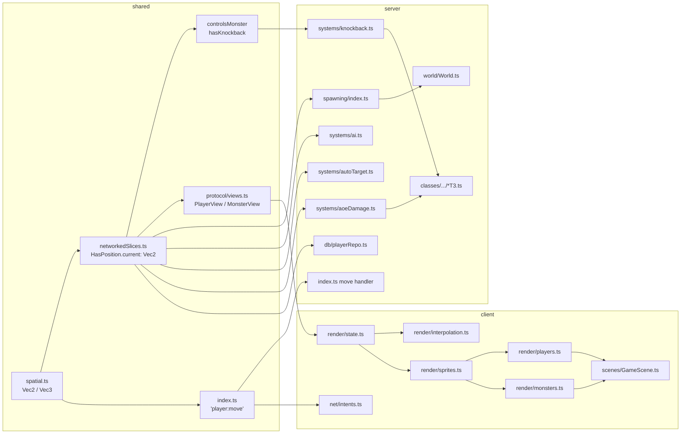

## Architecture

Notes and assumptions:

- `Vec2` already exists in [shared/src/systems/spatial.ts](shared/src/systems/spatial.ts) and is used by `HasPosition.current` and `MotionVector.direction`. The refactor extends its usage; it is not a new shape.
- The codebase has no `z: number` fields anywhere (verified via grep on `z:`, `position.z`, `targetZ`, `currentZ`). `Vec3` is added to `spatial.ts` as a forward-compatible type with no migrations.
- ECS invariant from CLAUDE.md is preserved: `hasPosition.current` is the source of truth for entity position. We are renaming wire fields and runtime slice fields, not changing the ECS topology.
- DB persistence is unaffected: `hasPosition` is the only persisted slice that carries coordinates and it already serializes `current` as a `Vec2`. `controlsMonster` and `hasKnockback` are runtime-only.

## Scope of the refactor

The codebase already exports `Vec2` from [shared/src/systems/spatial.ts](shared/src/systems/spatial.ts) and uses it in some places (`HasPosition.current`, `MotionVector.direction`, movement helpers). The remaining work is to drive that type through the rest of the codebase wherever an `(x, y)` pair appears as:

- a struct/interface field (`spawnX/spawnY`, `startX/startY`, `targetX/targetY`)
- a function parameter pair (`(x: number, y: number)`)
- a function return type (`{ x: number; y: number }` literal)
- a wire-protocol field on `PlayerView` / `MonsterView` / `'player:move'`

A search for `z: number`, `position.z`, `targetZ`, `currentZ` returns nothing — there is no 3D data in the project. `Vec3` will be added as a type definition only (no field conversions).

## What we will NOT convert

- `NodeDefinition.{ width, height }` (size, not a position).
- Effect spritesheet `rowSlices: { y, h }` in [shared/src/registries/effects.ts](shared/src/registries/effects.ts) (sprite-sheet metadata).
- `Phaser` callbacks where `setPosition(x, y)` / `add.image(x, y, ...)` take primitive numbers — we pass `pos.x, pos.y` at the boundary.
- Local scalar `dx`, `dy` math intermediates.
- Phaser-style `width`/`height` on shadow, sprite, and HUD options.

## Phasing (shared → server → client)

### Phase 1 — Shared types and component shapes

- [shared/src/systems/spatial.ts](shared/src/systems/spatial.ts): replace inline `{ x: number; y: number }` parameter types in `distanceSq` and `isWithinRange` with `Vec2`. Add a sibling `Vec3` interface (`x`, `y`, `z`) and a `zeroVec2()` / `zeroVec3()` helper for parity.
- [shared/src/components/controlsMonster.ts](shared/src/components/controlsMonster.ts): collapse `spawnX: number; spawnY: number` to `spawn: Vec2`. Runtime-only slice — not persisted, no DB migration needed.
- [shared/src/components/hasKnockback.ts](shared/src/components/hasKnockback.ts): collapse `startX/startY/endX/endY` to `start: Vec2; end: Vec2`. Runtime-only.
- [shared/src/protocol/views.ts](shared/src/protocol/views.ts): replace `x, y, targetX, targetY` on `PlayerView` and `MonsterView` with `pos: Vec2` and `target: Vec2`. Update `composePlayerView` and `composeMonsterView` accordingly.
- [shared/src/index.ts](shared/src/index.ts) socket map: change `'player:move': (position: { x: number; y: number })` to `'player:move': (pos: Vec2)`.

### Phase 2 — Server systems and persistence

- [server/src/systems/spawning/index.ts](server/src/systems/spawning/index.ts): `createMonster(world, nodeId, typeId, x, y)` → `(world, nodeId, typeId, pos: Vec2)`. Inside the entity literal, store `controlsMonster.spawn = pos` and `hasPosition.current = pos`. `spawnMonster` builds a `Vec2` once. `ensureBoss` likewise.
- [server/src/world/World.ts](server/src/world/World.ts): forward the same `Vec2` signature on `World.createMonster`. The test-room dummy spawn loop builds a `Vec2` per dummy.
- [server/src/systems/ai.ts](server/src/systems/ai.ts): `setMonsterTarget(world, e, target: Vec2)`. Replace every `{ x: ai.spawnX, y: ai.spawnY }` literal with `ai.spawn` after the slice rename. The `dx, dy, distSq, dist` chase-math locals stay scalar.
- [server/src/systems/autoTarget.ts](server/src/systems/autoTarget.ts): `clampToNode(world, nodeId, pos: Vec2): Vec2`. The two `setEntityMotion` call sites build `pos` as a `Vec2` from existing locals.
- [server/src/systems/aoeDamage.ts](server/src/systems/aoeDamage.ts): `applyPlayerAoe(world, attacker, center: Vec2, radius, damage, excludeId?)` and the matching `applyMonsterAoe` signature. Drop `centerX/centerY`.
- [server/src/systems/knockback.ts](server/src/systems/knockback.ts): `applyKnockback(world, monsterId, from: Vec2, distance, durationMs?)`. `updateKnockback` reads `kb.start` / `kb.end` and writes `entity.hasPosition.current = { x: newX, y: newY }`.
- [server/src/systems/classes/reload/reloadT3.ts](server/src/systems/classes/reload/reloadT3.ts) and [server/src/systems/classes/dot/dotT3.ts](server/src/systems/classes/dot/dotT3.ts): update `applyKnockback` and `applyPlayerAoe` call sites to pass a `Vec2` argument.
- [server/src/systems/combat.ts](server/src/systems/combat.ts): empowered AoE call site → pass `Vec2`.
- [server/src/index.ts](server/src/index.ts): `socket.on('player:move', (pos) => setEntityMotion(world, p, pos))`. Test-room teleport `spawnX/spawnY` becomes a `Vec2` literal passed straight into `entity.hasPosition.current`.
- [server/src/db/playerRepo.ts](server/src/db/playerRepo.ts): `buildFreshSlices(id, name, pos: Vec2)` and the two callers (fresh char + spawn). The DB blob format is unchanged because `HasPosition.current` already serializes as `{ x, y }`.

### Phase 3 — Client wire consumption and render state

- [client/src/render/state.ts](client/src/render/state.ts): the `transform` map entry becomes `{ pos: Vec2; target: Vec2; speed: number }`; the `interpolation` map entry becomes `{ base: Vec2; lungeOffset: Vec2 }`.
- [client/src/render/interpolation.ts](client/src/render/interpolation.ts): `stepInterpolation` reads `transform.target` / `interp.base` / `interp.lungeOffset`. `getOwnBase(): Vec2 | null`. `applyLunge(state, id, target: Vec2, scene)`.
- [client/src/render/sprites.ts](client/src/render/sprites.ts): `tryMakeImage(scene, pos: Vec2, frame, displayW, displayH)`. Inside, call `scene.add.image(pos.x, pos.y, ...)`.
- [client/src/render/shadows.ts](client/src/render/shadows.ts): `ensureShadow(state, id, pos: Vec2, shadowOffsetY, scene, opts)`. The existing `width: number; height: number` on `opts` is shadow size — leave it.
- [client/src/render/players.ts](client/src/render/players.ts) and [client/src/render/monsters.ts](client/src/render/monsters.ts): every read of `view.x` / `view.y` / `view.targetX` / `view.targetY` becomes `view.pos.x` / `view.target.x` / etc. The `interp.baseX = view.x` lines become `interp.base = { ...view.pos }`. Calls to `applyLunge` / `spawnAttackEffect` / `spawnDamageNumber` are updated to pass `Vec2` where the new signatures require.
- [client/src/render/effectOverlays.ts](client/src/render/effectOverlays.ts), [client/src/render/labels.ts](client/src/render/labels.ts), [client/src/render/healthBars.ts](client/src/render/healthBars.ts), [client/src/render/cooldownBars.ts](client/src/render/cooldownBars.ts): adjust position reads to use `view.pos` if they currently read `view.x` / `view.y`. (Confirmed by grep that these files reference position fields.)
- [client/src/scenes/GameScene.ts](client/src/scenes/GameScene.ts):
  - `fxAoeRing(pos: Vec2, radius, color)`, `playOneShotEffect(id, pos: Vec2, opts?)`, `spawnDamageNumber(pos: Vec2, ...)`, `spawnAttackEffect(style, from: Vec2, to: Vec2, opts?)`.
  - `Array<{ x: number; y: number }>` waypoint type → `Array<Vec2>`.
  - Click-to-move conversion path now produces a single `Vec2` and forwards it to `sendMove`.
- [client/src/net/intents.ts](client/src/net/intents.ts): `sendMove(socket: GameSocket, pos: Vec2)` — `socket.emit('player:move', pos)`.

### Phase 4 — Vec3 (forward-compatible only)

Add `Vec3` to [shared/src/systems/spatial.ts](shared/src/systems/spatial.ts) but do not migrate any code — no z-axis exists yet. Documented as a placeholder for future 3D mechanics. If you'd prefer to omit Vec3 entirely, that's a one-line removal at the end.

## Verification

- `pnpm -r typecheck` should be clean across `shared`, `server`, and `client`.
- Boot the server with the runtime invariants (`[marker-invariants]`, `[network-invariants]`) — these already enforce networked-component allowlists and will catch if `pos` / `target` rename breaks a wire slice.
- Manual smoke test: connect a client, move via click, observe combat (lunges, AoE rings, knockback slides) — these touch every code path the refactor changes.
- DB compatibility check: the `characters` table stores `hasPosition` as JSON — `current` already serializes as `{ x, y }`, so existing saves stay loadable. `controlsMonster` and `hasKnockback` are runtime-only, so their renames have no DB impact.

## Wire-format change note

`PlayerView` / `MonsterView` are sent over the wire each broadcast tick. Converting `x, y, targetX, targetY` → `pos, target` is a hard cut: every connected client must run new code after deploy. Since this is a hobby LAN/playtest project with no live users, that's acceptable. If you'd rather preserve the flat shape on the wire and only refactor server-internal types, say so and I'll narrow Phase 1's `views.ts` change and skip Phase 3's `view.x` rewrites.
