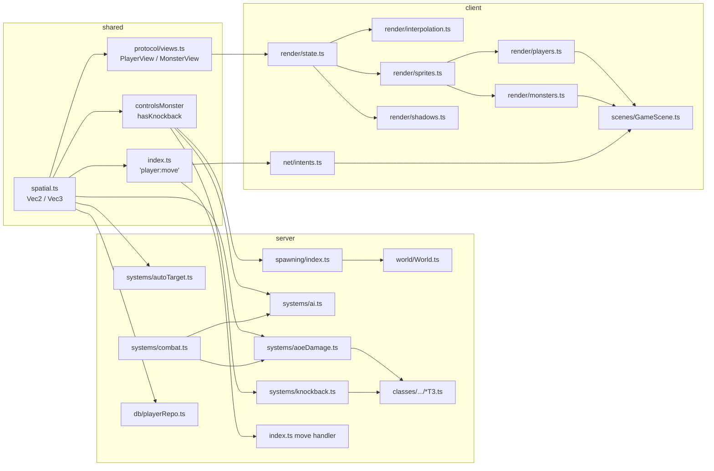

## Architecture



Notes and assumptions:

- `Vec2` already exists in [`shared/src/systems/spatial.ts`](shared/src/systems/spatial.ts) and is used by `HasPosition.current` and `MotionVector.direction`. The refactor extends its usage; it is not a new shape.
- The codebase has no `z: number` fields anywhere (verified via grep on `z:`, `position.z`, `targetZ`, `currentZ`). `Vec3` is added to `spatial.ts` as a forward-compatible type with no migrations.
- ECS invariant from `CLAUDE.md` is preserved: `hasPosition.current` is the source of truth for entity position. We are renaming wire fields and runtime slice fields, not changing the ECS topology.
- DB persistence is unaffected: `hasPosition` is the only persisted slice carrying coordinates and it already serializes `current` as a `Vec2`. `controlsMonster` and `hasKnockback` are runtime-only.
- **Hard cut on the wire**: `PlayerView` / `MonsterView` and `'player:move'` change shape. Every connected client must run new code after deploy. Acceptable for this LAN/hobby project (no live users).

## Out of scope (follow-ups)

- `NodeDefinition.{ width, height }` — represents size, not position.
- Effect spritesheet `rowSlices: { y, h }` in [`shared/src/registries/effects.ts`](shared/src/registries/effects.ts) — sprite-sheet metadata.
- Phaser primitives at the boundary (`scene.add.image(x, y, ...)`, `setPosition(x, y)`, `setDisplaySize(w, h)`) — caller passes `pos.x, pos.y` at the call site.
- Local `dx`, `dy` scalar math intermediates inside system internals (AI, knockback easing, AoE radius checks).
- Phaser-style `width: number; height: number` on shadow/sprite options (dimensions, not positions).
- Any runtime population/use of `Vec3.z` — the type is added only.
- Sprite/label/bar code that reads `sprite.x` / `sprite.y` from Phaser game objects (those are Phaser primitives, not `Vec2`).

## Code Architecture (walkthrough)

Read this section **top to bottom** — each step depends on the previous one's type changes compiling. Phase 1 lands the shared shapes; Phase 2 propagates them through the server; Phase 3 consumes them on the client. The complete list of touched files lives in the [File index (alphabetical)](#file-index-alphabetical) at the end.

### Step 1 — Shared `Vec3` and `Vec2`-typed spatial helpers

**Goal:** Land the type primitives that downstream code will import. Adds `Vec3` (no migrations) and tightens the parameter types on `distanceSq` / `isWithinRange` so the rest of the refactor can rely on `Vec2` everywhere.

| File                                                             | Symbol                  | Action | Summary                                                                                   |
| ---------------------------------------------------------------- | ----------------------- | ------ | ----------------------------------------------------------------------------------------- |
| [`shared/src/systems/spatial.ts`](shared/src/systems/spatial.ts) | `Vec3`                  | add    | Sibling interface with `x`, `y`, `z`                                                      |
| [`shared/src/systems/spatial.ts`](shared/src/systems/spatial.ts) | `zeroVec2` / `zeroVec3` | add    | Convenience zero builders (parity with `zeroMotion`)                                      |
| [`shared/src/systems/spatial.ts`](shared/src/systems/spatial.ts) | `distanceSq`            | modify | Replace inline `{ x: number; y: number }` parameter type with `Vec2`. No behavior change. |
| [`shared/src/systems/spatial.ts`](shared/src/systems/spatial.ts) | `isWithinRange`         | modify | Same — tighten signature to `(a: Vec2, b: Vec2, range)`.                                  |

```ts
// shared/src/systems/spatial.ts (top of file, beside existing Vec2)
export interface Vec2 {
  x: number;
  y: number;
}

export interface Vec3 {
  x: number;
  y: number;
  z: number;
}

export function zeroVec2(): Vec2 {
  return { x: 0, y: 0 };
}
export function zeroVec3(): Vec3 {
  return { x: 0, y: 0, z: 0 };
}

export function distanceSq(a: Vec2, b: Vec2): number {
  /* unchanged body */
}
export function isWithinRange(a: Vec2, b: Vec2, range: number): boolean {
  /* unchanged body */
}
```

**Compatibility:** `Vec3` has no callers yet — adding it is non-breaking. `distanceSq` / `isWithinRange` accepted `{ x: number; y: number }` literals before; `Vec2` is structurally compatible so every existing call still compiles.

### Step 2 — Vec2-shaped runtime components

**Goal:** Collapse paired `spawnX/spawnY` and `startX/startY/endX/endY` fields into `Vec2` slices on the two runtime-only components that carry coordinates. After this step, downstream server code can read `ai.spawn` / `kb.start` / `kb.end` instead of building scratch `{ x, y }` literals.

| File                                                                                   | Symbol            | Action | Logic                                                           |
| -------------------------------------------------------------------------------------- | ----------------- | ------ | --------------------------------------------------------------- |
| [`shared/src/components/controlsMonster.ts`](shared/src/components/controlsMonster.ts) | `ControlsMonster` | modify | Replace `spawnX: number; spawnY: number` with `spawn: Vec2`     |
| [`shared/src/components/hasKnockback.ts`](shared/src/components/hasKnockback.ts)       | `HasKnockback`    | modify | Replace `startX/startY/endX/endY` with `start: Vec2; end: Vec2` |

```ts
// shared/src/components/controlsMonster.ts
import type { Vec2 } from "../systems/spatial";

export interface ControlsMonster {
  spawn: Vec2;
  wanderRadius: number;
  idleUntil: number;
  leashRange: number;
  idleMinMs: number;
  idleMaxMs: number;
  lastAggroAt: number;
  baseSpeed: number;
  kiteTimer: number;
}
```

```ts
// shared/src/components/hasKnockback.ts
import type { Vec2 } from "../systems/spatial";

export interface HasKnockback {
  start: Vec2;
  end: Vec2;
  elapsedMs: number;
  durationMs: number;
}
```

**Invariant:** Both components are runtime-only — `controlsMonster` is rebuilt by `createMonster` on every spawn, `hasKnockback` exists only mid-slide. Neither is persisted (verified in [`server/src/db/playerRepo.ts`](server/src/db/playerRepo.ts)), so no DB migration is required.

### Step 3 — Vec2-typed wire views and socket map

**Goal:** Switch the broadcast payloads (`PlayerView` / `MonsterView`) and the only inbound coordinate event (`'player:move'`) to use `Vec2`. After this step the wire contract is the new shape; subsequent steps make the producers and consumers match it.

A. **Views.** Replace the four flat fields (`x`, `y`, `targetX`, `targetY`) with `pos: Vec2` and `target: Vec2` on both views, then update the composers.

| File                                                           | Symbol               | Action | Logic                                                        |
| -------------------------------------------------------------- | -------------------- | ------ | ------------------------------------------------------------ |
| [`shared/src/protocol/views.ts`](shared/src/protocol/views.ts) | `PlayerView`         | modify | Replace `x/y/targetX/targetY` with `pos: Vec2; target: Vec2` |
| [`shared/src/protocol/views.ts`](shared/src/protocol/views.ts) | `MonsterView`        | modify | Same shape change                                            |
| [`shared/src/protocol/views.ts`](shared/src/protocol/views.ts) | `composePlayerView`  | modify | Emit `pos`/`target` instead of `x/y/targetX/targetY`         |
| [`shared/src/protocol/views.ts`](shared/src/protocol/views.ts) | `composeMonsterView` | modify | Same                                                         |

```ts
// shared/src/protocol/views.ts (excerpt)
import type { Vec2 } from "../systems/spatial";

export interface PlayerView {
  id: string;
  name: string;
  pos: Vec2;
  target: Vec2;
  hp: number;
  // ... rest unchanged
}

export function composePlayerView(entity: NetworkedEntity): PlayerView | null {
  // ... guards unchanged
  const pos = entity.hasPosition.current;
  const target = entity.isMoving
    ? pointFromMotion(pos, entity.isMoving.motion)
    : pos;
  return {
    id: entity.isPlayer.id,
    name: entity.isPlayer.name,
    pos,
    target,
    // ... rest unchanged
  };
}
```

The `MonsterView` change is identical (replace four scalar reads with `pos` / `target`).

B. **Socket map.** The only inbound coordinate event is `'player:move'`.

| File                                         | Symbol                                | Action | Logic                  |
| -------------------------------------------- | ------------------------------------- | ------ | ---------------------- |
| [`shared/src/index.ts`](shared/src/index.ts) | `ClientToServerEvents['player:move']` | modify | Payload becomes `Vec2` |

```ts
// shared/src/index.ts (excerpt)
import type { Vec2 } from "./systems/spatial";

export interface ClientToServerEvents {
  "player:move": (pos: Vec2) => void;
  "player:setAuto": (enabled: boolean) => void;
  // ... rest unchanged
}
```

**Ordering note:** All wire-shape edits must land in the same commit as the server/client consumers (Steps 4–10). A half-deployed change would silently break broadcast composition. Since this is a LAN game, a single full rebuild covers the deploy.

### Step 4 — Server spawning and `World.createMonster`

**Goal:** Push `Vec2` through the spawning APIs so monster creation stops carrying paired scalars. Touches both the standalone helper and the thin `World` wrapper.

| File                                                                           | Symbol                | Action | Logic                                                                                                                        |
| ------------------------------------------------------------------------------ | --------------------- | ------ | ---------------------------------------------------------------------------------------------------------------------------- |
| [`server/src/systems/spawning/index.ts`](server/src/systems/spawning/index.ts) | `createMonster`       | modify | Signature `(world, nodeId, typeId, pos: Vec2)`. Inside, write `hasPosition.current = pos` and `controlsMonster.spawn = pos`. |
| [`server/src/systems/spawning/index.ts`](server/src/systems/spawning/index.ts) | `spawnMonster`        | modify | Build a single `Vec2` once and forward                                                                                       |
| [`server/src/systems/spawning/index.ts`](server/src/systems/spawning/index.ts) | `respawnPlayer`       | modify | Build the spawn point as one `Vec2` and assign to `hasPosition.current`                                                      |
| [`server/src/systems/spawning/index.ts`](server/src/systems/spawning/index.ts) | `ensureBoss`          | modify | Pass `Vec2` to `createMonster`                                                                                               |
| [`server/src/world/World.ts`](server/src/world/World.ts)                       | `World.createMonster` | modify | Forward `Vec2`; update internal callers (test-room dummies, boss rotation)                                                   |

```ts
// server/src/systems/spawning/index.ts (createMonster signature)
export function createMonster(
  world: World,
  nodeId: string,
  typeId: string,
  pos: Vec2,
): MonsterEntity | null {
  // ... existing guards
  const entity: MonsterEntity = {
    // ... unchanged slices
    hasPosition: { current: pos, nodeId, speed: def.stats.speed },
    controlsMonster: {
      spawn: pos,
      wanderRadius,
      idleUntil: Date.now(),
      leashRange: def.ai.leashRange,
      idleMinMs: def.ai.idleMinMs,
      idleMaxMs: def.ai.idleMaxMs,
      lastAggroAt: 0,
      baseSpeed: def.stats.speed,
      kiteTimer: 0,
    },
    // ... rest unchanged
  };
  // ... rest unchanged
}
```

```ts
// server/src/systems/spawning/index.ts (spawnMonster loop)
const pos: Vec2 = {
  x: Math.floor(Math.random() * (node.width - 128)) + 64,
  y: Math.floor(Math.random() * (node.height - 128)) + 64,
};
// ... distance check using distanceSq(e.hasPosition.current, pos)
return createMonster(world, nodeId, typeId, pos) !== null;
```

```ts
// server/src/systems/spawning/index.ts (respawnPlayer)
const spawn: Vec2 = {
  x: GAME_CONFIG.NODE_WIDTH / 2,
  y: GAME_CONFIG.NODE_HEIGHT / 2,
};
entity.hasPosition.nodeId = "node-5-5";
entity.hasPosition.current = spawn;
```

**Invariant:** `hasPosition.current` and `controlsMonster.spawn` share the same `Vec2` reference here. That is safe because neither is mutated in place — every writer assigns a new object (e.g. `entity.hasPosition.current = { x: newX, y: newY }` in `updateKnockback`). If a future change starts mutating these slices in place, clone at the assignment site.

### Step 5 — Knockback system

**Goal:** Replace `(fromX, fromY)` parameter pair with a `Vec2`, and read/write `kb.start` / `kb.end` instead of the four scalars.

| File                                                                 | Symbol            | Action | Logic                                                                                                                       |
| -------------------------------------------------------------------- | ----------------- | ------ | --------------------------------------------------------------------------------------------------------------------------- |
| [`server/src/systems/knockback.ts`](server/src/systems/knockback.ts) | `applyKnockback`  | modify | Signature `(world, monsterId, from: Vec2, distance, durationMs?)`; build `start: Vec2; end: Vec2` for `setMonsterKnockback` |
| [`server/src/systems/knockback.ts`](server/src/systems/knockback.ts) | `updateKnockback` | modify | Read `kb.start`/`kb.end`; write `entity.hasPosition.current = { x: newX, y: newY }`                                         |

```ts
// server/src/systems/knockback.ts
export function applyKnockback(
  world: World,
  monsterId: string,
  from: Vec2,
  distance: number,
  durationMs: number = DEFAULT_KNOCKBACK_DURATION_MS,
): void {
  const entity = world.getMonsterEntity(monsterId);
  if (!entity) return;
  const position = entity.hasPosition;
  const dx = position.current.x - from.x;
  const dy = position.current.y - from.y;
  const distSq = dx * dx + dy * dy;
  if (distSq < 0.0001) return;
  const dist = Math.sqrt(distSq);

  const end: Vec2 = {
    x: position.current.x + (dx / dist) * distance,
    y: position.current.y + (dy / dist) * distance,
  };
  const node = NODE_REGISTRY.get(position.nodeId);
  if (node) {
    end.x = Math.max(
      MONSTER_BOUND_MARGIN,
      Math.min(node.width - MONSTER_BOUND_MARGIN, end.x),
    );
    end.y = Math.max(
      MONSTER_BOUND_MARGIN,
      Math.min(node.height - MONSTER_BOUND_MARGIN, end.y),
    );
  }

  world.setMonsterKnockback(monsterId, {
    start: { x: position.current.x, y: position.current.y },
    end,
    elapsedMs: 0,
    durationMs,
  });
  // ... existing speed / state / stopEntity / setAttackTarget calls unchanged
}

export function updateKnockback(world: World, dt: number): void {
  for (const entity of world.knockbackedMonsters) {
    const kb = entity.hasKnockback;
    kb.elapsedMs += dt;
    const t = Math.min(1, kb.elapsedMs / kb.durationMs);
    const ease = 1 - Math.pow(1 - t, 3);
    entity.hasPosition.current = {
      x: kb.start.x + (kb.end.x - kb.start.x) * ease,
      y: kb.start.y + (kb.end.y - kb.start.y) * ease,
    };
    stopEntity(world, entity);
    if (t >= 1) {
      entity.hasPosition.current = { x: kb.end.x, y: kb.end.y };
      stopEntity(world, entity);
      world.clearMonsterKnockback(entity.isMonster.id);
    }
  }
}
```

### Step 6 — AoE damage

**Goal:** Replace the `centerX, centerY` parameter pair on both AoE helpers with a single `Vec2`. Internal radius math (`distanceSq`) already accepts `Vec2`, so the body simplifies.

| File                                                                 | Symbol            | Action | Logic                                                             |
| -------------------------------------------------------------------- | ----------------- | ------ | ----------------------------------------------------------------- |
| [`server/src/systems/aoeDamage.ts`](server/src/systems/aoeDamage.ts) | `applyPlayerAoe`  | modify | `(world, attacker, center: Vec2, radius, baseDamage, excludeId?)` |
| [`server/src/systems/aoeDamage.ts`](server/src/systems/aoeDamage.ts) | `applyMonsterAoe` | modify | Same shape                                                        |

```ts
// server/src/systems/aoeDamage.ts
export function applyPlayerAoe(
  world: World,
  attacker: PlayerEntity,
  center: Vec2,
  radius: number,
  baseDamage: number,
  excludeId?: string,
): void {
  const radiusSq = radius * radius;
  const attackerNodeId = attacker.hasPosition.nodeId;
  const attackerId = attacker.isPlayer.id;
  const toKill: MonsterEntity[] = [];

  for (const monster of world.monsterEntitiesInNode(attackerNodeId)) {
    if (monster.isMonster.id === excludeId) continue;
    if (distanceSq(monster.hasPosition.current, center) > radiusSq) continue;
    // ... unchanged damage math + toKill bookkeeping
  }
  // ... unchanged kill resolution
}
```

`applyMonsterAoe` mirrors the change (replace `centerX/centerY` with `center: Vec2`).

### Step 7 — AI movement helpers

**Goal:** Stop building `{ x: ai.spawnX, y: ai.spawnY }` literals everywhere — read `ai.spawn` directly. Tighten the local `setMonsterTarget` helper to accept a `Vec2` (it already does, structurally; just rename the type).

| File                                                   | Symbol             | Action | Logic                                                                                                                                                                              |
| ------------------------------------------------------ | ------------------ | ------ | ---------------------------------------------------------------------------------------------------------------------------------------------------------------------------------- |
| [`server/src/systems/ai.ts`](server/src/systems/ai.ts) | `setMonsterTarget` | modify | Signature `(world, entity, target: Vec2)`                                                                                                                                          |
| [`server/src/systems/ai.ts`](server/src/systems/ai.ts) | `updateMonsters`   | modify | Every `{ x: ai.spawnX, y: ai.spawnY }` literal → `ai.spawn`; wander branch builds a fresh `Vec2` from `ai.spawn.x + cos(angle) * radius`. Local `dx`/`dy` chase scalars unchanged. |

```ts
// server/src/systems/ai.ts (excerpts)
function setMonsterTarget(
  world: World,
  entity: MonsterEntity,
  target: Vec2,
): void {
  setEntityMotion(world, entity, target);
}

// Leash check
if (
  distanceSq(e.hasPosition.current, ai.spawn) >
  ai.leashRange * ai.leashRange
) {
  setAggroTarget(world, e, null, now);
  ai.kiteTimer = 0;
  e.hasPosition.speed = ai.baseSpeed;
  e.hasAwareness.state = "returning";
  setAttackTarget(world, e, null);
  setMonsterTarget(world, e, ai.spawn);
  continue;
}

// Returning branch
if (distanceSq(e.hasPosition.current, ai.spawn) < 16) {
  e.hasPosition.current = { x: ai.spawn.x, y: ai.spawn.y };
  // ... unchanged
} else {
  setMonsterTarget(world, e, ai.spawn);
}

// Wander branch
setMonsterTarget(world, e, {
  x: Math.max(minX, Math.min(maxX, ai.spawn.x + Math.cos(angle) * radius)),
  y: Math.max(minY, Math.min(maxY, ai.spawn.y + Math.sin(angle) * radius)),
});
```

### Step 8 — `clampToNode`, combat, and T3 archetype call sites

**Goal:** Update all remaining server call sites that still pass paired scalars to the helpers reshaped in Steps 5–6.

A. **`autoTarget.ts`** — collapse `clampToNode` to accept and return `Vec2`.

| File                                                                   | Symbol              | Action | Logic                                                  |
| ---------------------------------------------------------------------- | ------------------- | ------ | ------------------------------------------------------ |
| [`server/src/systems/autoTarget.ts`](server/src/systems/autoTarget.ts) | `clampToNode`       | modify | `(world, nodeId, pos: Vec2): Vec2`                     |
| [`server/src/systems/autoTarget.ts`](server/src/systems/autoTarget.ts) | `updateAutoTargets` | modify | Build the candidate `Vec2` once, pass to `clampToNode` |

```ts
// server/src/systems/autoTarget.ts
function clampToNode(world: World, nodeId: string, pos: Vec2): Vec2 {
  const node = NODE_REGISTRY.get(nodeId);
  if (!node) return pos;
  return {
    x: Math.max(NODE_MARGIN, Math.min(node.width - NODE_MARGIN, pos.x)),
    y: Math.max(NODE_MARGIN, Math.min(node.height - NODE_MARGIN, pos.y)),
  };
}

// Inside updateAutoTargets — both ranged branches:
const candidate: Vec2 = {
  x: targetPos.x - (dx / dist) * idealDist,
  y: targetPos.y - (dy / dist) * idealDist,
};
setEntityMotion(
  world,
  player,
  clampToNode(world, player.hasPosition.nodeId, candidate),
);
```

B. **`combat.ts`** — empowered AoE call site and leash-aggro guard.

| File                                                           | Symbol                                   | Action | Logic                                              |
| -------------------------------------------------------------- | ---------------------------------------- | ------ | -------------------------------------------------- |
| [`server/src/systems/combat.ts`](server/src/systems/combat.ts) | `updateCombat` (empowered AoE call)      | modify | Pass `target.hasPosition.current` directly         |
| [`server/src/systems/combat.ts`](server/src/systems/combat.ts) | `updateCombat` (retaliation aggro guard) | modify | `distanceSq(player.hasPosition.current, ai.spawn)` |

```ts
// server/src/systems/combat.ts (excerpts)
if (isEmpowered) {
  applyPlayerAoe(
    world,
    player,
    target.hasPosition.current,
    GAME_CONFIG.EMPOWERED_AOE_RADIUS,
    Math.round(player.dealsDamage.attack * GAME_CONFIG.EMPOWERED_AOE_MULT),
    target.isMonster.id,
  );
}

// retaliation aggro guard
if (
  distanceSq(player.hasPosition.current, ai.spawn) <=
  ai.leashRange * ai.leashRange
) {
  setAggroTarget(world, target, player.isPlayer.id, now);
  // ... unchanged
}
```

C. **T3 archetype call sites** — match the new `applyKnockback` / `applyPlayerAoe` signatures.

| File                                                                                             | Symbol                      | Action | Logic                                                                                                                       |
| ------------------------------------------------------------------------------------------------ | --------------------------- | ------ | --------------------------------------------------------------------------------------------------------------------------- |
| [`server/src/systems/classes/dot/dotT3.ts`](server/src/systems/classes/dot/dotT3.ts)             | Glacial Fracture branch     | modify | `applyKnockback(world, monsterId, player.hasPosition.current, GLACIAL_FRACTURE_KNOCKBACK_PX, ...)`                          |
| [`server/src/systems/classes/reload/reloadT3.ts`](server/src/systems/classes/reload/reloadT3.ts) | Gatling `applyKnockback`    | modify | `applyKnockback(world, monster.isMonster.id, player.hasPosition.current, GATLING_KNOCKBACK_DISTANCE, GATLING_KNOCKBACK_MS)` |
| [`server/src/systems/classes/reload/reloadT3.ts`](server/src/systems/classes/reload/reloadT3.ts) | Empowered AoE in laser path | modify | `applyPlayerAoe(world, player, target.hasPosition.current, GAME_CONFIG.EMPOWERED_AOE_RADIUS, ...)`                          |

```ts
// server/src/systems/classes/dot/dotT3.ts (glacial fracture branch)
if (ctx.defenderType === "monster") {
  applyKnockback(
    world,
    ctx.defender.isMonster.id,
    player.hasPosition.current,
    GLACIAL_FRACTURE_KNOCKBACK_PX,
    GLACIAL_FRACTURE_KNOCKBACK_MS,
  );
}
```

```ts
// server/src/systems/classes/reload/reloadT3.ts (Gatling)
applyKnockback(
  world,
  monster.isMonster.id,
  player.hasPosition.current,
  GATLING_KNOCKBACK_DISTANCE,
  GATLING_KNOCKBACK_MS,
);

// empowered AoE
applyPlayerAoe(
  world,
  player,
  target.hasPosition.current,
  GAME_CONFIG.EMPOWERED_AOE_RADIUS,
  Math.round(player.dealsDamage.attack * GAME_CONFIG.EMPOWERED_AOE_MULT),
  target.isMonster.id,
);
```

### Step 9 — Server entrypoint and DB

**Goal:** Consume the new `'player:move'` payload shape on the server, and reshape the test-room teleport and DB factory to build `Vec2` directly.

| File                                                         | Symbol                   | Action | Logic                                                                |
| ------------------------------------------------------------ | ------------------------ | ------ | -------------------------------------------------------------------- |
| [`server/src/index.ts`](server/src/index.ts)                 | `'player:move'` handler  | modify | `(pos) => setEntityMotion(world, p, pos)`                            |
| [`server/src/index.ts`](server/src/index.ts)                 | Test-room teleport block | modify | Build a single `Vec2` and assign to `hasPosition.current`            |
| [`server/src/db/playerRepo.ts`](server/src/db/playerRepo.ts) | `getOrCreateCharacter`   | modify | Build spawn `Vec2`, forward to `buildFreshSlices`                    |
| [`server/src/db/playerRepo.ts`](server/src/db/playerRepo.ts) | `buildFreshSlices`       | modify | Signature `(id, name, pos: Vec2)`; write `hasPosition.current = pos` |

```ts
// server/src/index.ts
socket.on("player:move", (pos) => {
  const p = world.getPlayerEntity(socket.id);
  if (!p) return;
  if (p.isChanneling) return;
  setEntityMotion(world, p, pos);
});

// test-room teleport
const spawn: Vec2 = {
  x: GAME_CONFIG.NODE_WIDTH / 2,
  y: GAME_CONFIG.NODE_HEIGHT / 2 - 200,
};
p.hasPosition.nodeId = TEST_ROOM_NODE_ID;
p.hasPosition.current = spawn;
```

```ts
// server/src/db/playerRepo.ts
export function getOrCreateCharacter(
  db: DB,
  accountId: string,
  characterName: string,
): PersistedPlayerSlices {
  const row = db
    .select()
    .from(characters)
    .where(eq(characters.accountId, accountId))
    .get();
  if (row) return hydratePlayerSlices(row);

  const charId = randomUUID();
  const spawn: Vec2 = {
    x: GAME_CONFIG.NODE_WIDTH / 2,
    y: GAME_CONFIG.NODE_HEIGHT / 2,
  };
  const fresh = buildFreshSlices(charId, characterName, spawn);
  // ... unchanged insert
  return fresh;
}

function buildFreshSlices(
  id: string,
  name: string,
  pos: Vec2,
): PersistedPlayerSlices {
  // ... unchanged equipment setup
  return {
    isPlayer: { id, name },
    hasPosition: {
      current: pos,
      nodeId: "node-5-5",
      speed: GAME_CONFIG.PLAYER_SPEED,
    },
    // ... rest unchanged
  };
}
```

**DB compatibility:** `hasPosition` is serialized via `JSON.stringify`. Because `HasPosition.current` was already a `Vec2`-shaped object (`{ x, y }`), existing stored rows are still loadable — no migration required.

### Step 10 — Client render state and interpolation

**Goal:** Make the render-side maps mirror the new wire view. `transform` becomes `{ pos: Vec2; target: Vec2; speed }` and `interpolation` becomes `{ base: Vec2; lungeOffset: Vec2 }`. After this step, downstream renderers stop touching paired scalars.

| File                                                                       | Symbol                      | Action | Logic                                                          |
| -------------------------------------------------------------------------- | --------------------------- | ------ | -------------------------------------------------------------- |
| [`client/src/render/state.ts`](client/src/render/state.ts)                 | `RenderState.transform`     | modify | Map value becomes `{ pos: Vec2; target: Vec2; speed: number }` |
| [`client/src/render/state.ts`](client/src/render/state.ts)                 | `RenderState.interpolation` | modify | Map value becomes `{ base: Vec2; lungeOffset: Vec2 }`          |
| [`client/src/render/interpolation.ts`](client/src/render/interpolation.ts) | `stepInterpolation`         | modify | Read `transform.target` / `interp.base` / `interp.lungeOffset` |
| [`client/src/render/interpolation.ts`](client/src/render/interpolation.ts) | `getOwnBase`                | modify | Returns `Vec2 \| null`                                         |
| [`client/src/render/interpolation.ts`](client/src/render/interpolation.ts) | `applyLunge`                | modify | Signature `(state, id, target: Vec2, scene)`                   |

```ts
// client/src/render/state.ts (excerpt)
import type {
  Vec2,
  NetworkedEntity,
  PlayerView,
  MonsterView,
} from "@mmo-idle/shared";

export interface RenderState {
  // ... unchanged maps
  transform: Map<NetworkId, { pos: Vec2; target: Vec2; speed: number }>;
  interpolation: Map<NetworkId, { base: Vec2; lungeOffset: Vec2 }>;
  // ... rest unchanged
}
```

```ts
// client/src/render/interpolation.ts
export function stepInterpolation(state: RenderState, dt: number): void {
  for (const id of state.ids) {
    const transform = state.transform.get(id);
    const interp = state.interpolation.get(id);
    const sprite = state.sprite.get(id);
    if (!transform || !interp || !sprite) continue;

    const dx = transform.target.x - interp.base.x;
    const dy = transform.target.y - interp.base.y;
    const distSq = dx * dx + dy * dy;
    if (distSq > 1) {
      const dist = Math.sqrt(distSq);
      const step = Math.min(transform.speed * dt, dist);
      interp.base = {
        x: interp.base.x + (dx / dist) * step,
        y: interp.base.y + (dy / dist) * step,
      };
    } else {
      interp.base = { x: transform.target.x, y: transform.target.y };
    }

    sprite.setPosition(
      interp.base.x + interp.lungeOffset.x,
      interp.base.y + interp.lungeOffset.y,
    );
  }
}

export function getOwnBase(state: RenderState): Vec2 | null {
  if (!state.ownId) return null;
  const interp = state.interpolation.get(state.ownId);
  return interp ? { x: interp.base.x, y: interp.base.y } : null;
}

export function applyLunge(
  state: RenderState,
  id: string,
  target: Vec2,
  scene: GameScene,
): void {
  const interp = state.interpolation.get(id);
  if (!interp) return;
  const LUNGE_DIST = 26;
  const dx = target.x - interp.base.x;
  const dy = target.y - interp.base.y;
  const dist = Math.sqrt(dx * dx + dy * dy);
  if (dist < 1) return;

  scene.tweens.killTweensOf(interp.lungeOffset);
  interp.lungeOffset = {
    x: (dx / dist) * LUNGE_DIST,
    y: (dy / dist) * LUNGE_DIST,
  };
  scene.tweens.add({
    targets: interp.lungeOffset,
    x: 0,
    y: 0,
    delay: 60,
    duration: 200,
    ease: "Quad.easeOut",
  });
}
```

**Note:** Phaser tweens still need a writable target object — replacing `lungeOffset` wholesale and tweening its `x`/`y` keeps that working. `shadows.drawShadows` already reads `interp.lungeOffsetX/Y`; it switches to `interp.lungeOffset.x/y` (see Step 11).

### Step 11 — Client renderers and sprites

**Goal:** Update every renderer that consumes `view.x/view.y` or pushes paired scalars into `transform` / `interpolation` to use the new `Vec2` fields. Phaser primitives at the boundary still take `(x, y)`; pass `pos.x, pos.y` at those call sites.

| File                                                             | Symbol                               | Action | Logic                                                                                                                                                                                                                                                         |
| ---------------------------------------------------------------- | ------------------------------------ | ------ | ------------------------------------------------------------------------------------------------------------------------------------------------------------------------------------------------------------------------------------------------------------- |
| [`client/src/render/sprites.ts`](client/src/render/sprites.ts)   | `tryMakeImage`                       | modify | Signature `(scene, pos: Vec2, frame, displayW, displayH)`                                                                                                                                                                                                     |
| [`client/src/render/sprites.ts`](client/src/render/sprites.ts)   | `ensureSprite` / `updateSpriteFrame` | modify | Pass `snapshot.pos` to `tryMakeImage`; fallback rectangle uses `pos.x, pos.y`; read `interp.base` instead of `baseX/baseY`                                                                                                                                    |
| [`client/src/render/shadows.ts`](client/src/render/shadows.ts)   | `ensureShadow`                       | modify | Signature `(state, id, pos: Vec2, shadowOffsetY, scene, opts)`                                                                                                                                                                                                |
| [`client/src/render/shadows.ts`](client/src/render/shadows.ts)   | `drawShadows`                        | modify | Use `interp.base.x + interp.lungeOffset.x` (and `.y`)                                                                                                                                                                                                         |
| [`client/src/render/players.ts`](client/src/render/players.ts)   | `upsertPlayer`                       | modify | Read `player.pos` / `player.target`; seed `transform` with `pos`/`target` `Vec2`s; seed `interpolation.base = { ...player.pos }`; pass `player.pos` to `ensureShadow`/`ensureSprite`; pass `Vec2` to `applyLunge` / `spawnAttackEffect` / `spawnDamageNumber` |
| [`client/src/render/monsters.ts`](client/src/render/monsters.ts) | `upsertMonster`                      | modify | Same shape changes mirrored for monsters                                                                                                                                                                                                                      |

```ts
// client/src/render/sprites.ts
import type { Vec2, PlayerView, MonsterView } from "@mmo-idle/shared";

export function tryMakeImage(
  scene: Phaser.Scene,
  pos: Vec2,
  frame: string | null,
  displayW: number,
  displayH: number,
): Phaser.GameObjects.Image | null {
  if (!frame) return null;
  if (!scene.textures.exists(ATLAS_KEY)) return null;
  if (!scene.textures.get(ATLAS_KEY).has(frame)) return null;
  return scene.add
    .image(pos.x, pos.y, ATLAS_KEY, frame)
    .setDisplaySize(displayW, displayH);
}

export function ensureSprite(state, id, snapshot, scene, opts) {
  if (state.sprite.has(id)) return;
  const frame = opts.isPlayer
    ? getPlayerFrame(snapshot as PlayerView)
    : getMonsterFrame((snapshot as MonsterView).monsterTypeId);

  const sprite =
    tryMakeImage(scene, snapshot.pos, frame, opts.displayW, opts.displayH) ??
    scene.add.rectangle(
      snapshot.pos.x,
      snapshot.pos.y,
      opts.displayW,
      opts.displayH,
      opts.fallbackColor,
    );
  // ... unchanged
}

export function updateSpriteFrame(state, id, snapshot, scene, opts) {
  // ... unchanged frame diff
  const interp = state.interpolation.get(id);
  const base = interp?.base ?? snapshot.pos;
  state.sprite.get(id)?.destroy();
  const sprite =
    tryMakeImage(scene, base, newFrame, opts.displayW, opts.displayH) ??
    scene.add.rectangle(
      base.x,
      base.y,
      opts.displayW,
      opts.displayH,
      opts.fallbackColor,
    );
  // ... unchanged
}
```

```ts
// client/src/render/shadows.ts (signature + draw loop excerpt)
export function ensureShadow(
  state: RenderState,
  id: string,
  pos: Vec2,
  shadowOffsetY: number,
  scene: GameScene,
  opts: {
    width: number;
    height: number;
    depth: number;
    fillColor?: number;
    fillAlpha?: number;
    playerTier?: number;
  },
): void {
  if (state.shadow.has(id)) return;
  const shadow = scene.add
    .ellipse(pos.x, pos.y + shadowOffsetY, opts.width, opts.height)
    .setDepth(opts.depth);
  // ... unchanged style branching
}

export function drawShadows(state: RenderState): void {
  for (const id of state.ids) {
    // ... unchanged style refresh
    shadow.setPosition(
      interp.base.x + interp.lungeOffset.x,
      interp.base.y + interp.lungeOffset.y + meta.shadowOffsetY,
    );
  }
}
```

```ts
// client/src/render/players.ts (excerpt — new-entity branch)
state.transform.set(player.id, {
  pos: { ...player.pos },
  target: { ...player.target },
  speed: player.speed,
});
state.interpolation.set(player.id, {
  base: { ...player.pos },
  lungeOffset: { x: 0, y: 0 },
});

ensureShadow(state, player.id, player.pos, shadowOffsetY, scene, {
  width: 52,
  height: 14,
  depth: 3,
  playerTier: player.playerTier,
});
ensureSprite(state, player.id, player, scene, {
  /* ... */
});
// ... unchanged label + bars

if (isOwn) {
  state.ownId = player.id;
  state.ownNodeId = player.nodeId;
  scene.cameraTarget.setPosition(player.pos.x, player.pos.y);
  // ... unchanged
}

// existing-entity branch
const transform = state.transform.get(player.id);
if (transform) {
  transform.target = { ...player.target };
  transform.speed = player.speed;
}

// node-change snap
const interp = state.interpolation.get(player.id);
if (interp) interp.base = { ...player.pos };
const sprite = state.sprite.get(player.id);
sprite?.setPosition(player.pos.x, player.pos.y);

// attack effect
scene.spawnAttackEffect(
  player.attackStyle,
  { x: ownSprite.x, y: ownSprite.y },
  { x: targetSprite.x, y: targetSprite.y },
  {
    empowered: false,
    execution: false,
    archetype: player.combatArchetype ?? undefined,
  },
);
if (player.attackRange <= 150) {
  applyLunge(
    state,
    player.id,
    { x: targetInterp.base.x, y: targetInterp.base.y },
    scene,
  );
}
```

```ts
// client/src/render/monsters.ts (excerpt — kite-snap and existing-entity branch)
const interp = state.interpolation.get(monster.id);
if (interp) {
  const snapDx = monster.pos.x - interp.base.x;
  const snapDy = monster.pos.y - interp.base.y;
  if (snapDx * snapDx + snapDy * snapDy > 80 * 80) {
    interp.base = { ...monster.pos };
  }
}
state.view.set(monster.id, monster);
const transform = state.transform.get(monster.id);
if (transform) {
  transform.target = { ...monster.target };
  transform.speed = monster.speed;
}
```

**Note (out of scope):** `effectOverlays.ts`, `labels.ts`, `healthBars.ts`, `cooldownBars.ts` all position themselves from `sprite.x` / `sprite.y` (Phaser game-object primitives) and `state.spriteMeta`. They never read `view.x` / `view.y`, so no changes there.

### Step 12 — `GameScene` and intents

**Goal:** Update the scene-level effect helpers, waypoint arrays, and the `sendMove` intent to take `Vec2`. The pointer / autopath flows build a `Vec2` once and forward it.

| File                                                               | Symbol                      | Action | Logic                                                                                     |
| ------------------------------------------------------------------ | --------------------------- | ------ | ----------------------------------------------------------------------------------------- |
| [`client/src/net/intents.ts`](client/src/net/intents.ts)           | `sendMove`                  | modify | Signature `(socket, pos: Vec2)`; emit `pos` directly                                      |
| [`client/src/scenes/GameScene.ts`](client/src/scenes/GameScene.ts) | `fxAoeRing`                 | modify | `(pos: Vec2, radius, color)`                                                              |
| [`client/src/scenes/GameScene.ts`](client/src/scenes/GameScene.ts) | `playOneShotEffect`         | modify | `(id, pos: Vec2, opts?)`                                                                  |
| [`client/src/scenes/GameScene.ts`](client/src/scenes/GameScene.ts) | `spawnAttackEffect`         | modify | `(style, from: Vec2, to: Vec2, flags?)`                                                   |
| [`client/src/scenes/GameScene.ts`](client/src/scenes/GameScene.ts) | `spawnDamageNumber`         | modify | `(pos: Vec2, barOffsetY, amount, color)`                                                  |
| [`client/src/scenes/GameScene.ts`](client/src/scenes/GameScene.ts) | `autoPath` type (waypoints) | modify | If any helper builds `{ x, y }` waypoints, type the array as `Vec2[]`                     |
| [`client/src/scenes/GameScene.ts`](client/src/scenes/GameScene.ts) | pointer-down handler        | modify | Build a single `Vec2` and forward to `sendMove`; update `transform.target` to that `Vec2` |
| [`client/src/scenes/GameScene.ts`](client/src/scenes/GameScene.ts) | `sendAutoPathMove`          | modify | Build a single `Vec2` exit point and forward                                              |

```ts
// client/src/net/intents.ts
import type { GameSocket } from "./socket";
import type { Vec2 } from "@mmo-idle/shared";

export function sendMove(socket: GameSocket, pos: Vec2): void {
  socket.emit("player:move", pos);
}
```

```ts
// client/src/scenes/GameScene.ts (excerpts)
this.input.on('pointerdown', (pointer: Phaser.Input.Pointer) => {
  if (!this.myId) return;
  const dest: Vec2 = { x: Math.round(pointer.worldX), y: Math.round(pointer.worldY) };
  if (this.autoMode) this.setAutoMode(false);
  if (this.autoPath.length > 0) this.cancelAutoPath();
  sendMove(this.socket, dest);
  const transform = this.state.ownId ? this.state.transform.get(this.state.ownId) : undefined;
  if (transform) transform.target = dest;
  this.targetMarker.setPosition(dest.x, dest.y).setVisible(true);
});

private fxAoeRing(pos: Vec2, radius: number, color: number): void {
  const ring = this.add.graphics({ x: pos.x, y: pos.y }).setDepth(11);
  // ... unchanged tween
}

private playOneShotEffect(id: string, pos: Vec2, opts?: { scale?: number; depth?: number }): void {
  const def = EFFECT_BY_ID.get(id);
  if (!def) return;
  // ... unchanged setup using pos.x / pos.y + anchor offsets
}

spawnAttackEffect(
  style: string,
  from: Vec2,
  to: Vec2,
  flags?: { empowered?: boolean; execution?: boolean; archetype?: CombatArchetype; dotPath?: 'poison' | 'fire' | 'frost' },
): void {
  // ... ring branch
  if (empowered || execution) this.fxAoeRing(to, GAME_CONFIG.EMPOWERED_AOE_RADIUS, ringColor);
  // ... archetype dispatches consume from.x / to.x as before
}

spawnDamageNumber(pos: Vec2, barOffsetY: number, amount: number, color: string): void {
  const jitter = (Math.random() - 0.5) * 18;
  const startY = pos.y - barOffsetY - 6;
  const text = this.add.text(pos.x + jitter, startY, String(amount), { /* ... */ });
  // ... unchanged tween
}

sendAutoPathMove(fromNodeId: string): void {
  // ... compute dr/dc as before
  const dest: Vec2 = { x: Math.round(x), y: Math.round(y) };
  sendMove(this.socket, dest);
  const transform = this.state.ownId ? this.state.transform.get(this.state.ownId) : undefined;
  if (transform) transform.target = dest;
}
```

**Note:** `players.ts` / `monsters.ts` callers of `spawnAttackEffect` / `spawnDamageNumber` are updated in Step 11 to pass `Vec2` arguments.

### Step 13 — Verification

**Goal:** Final smoke pass after all phases land.

- Run `pnpm -r typecheck` from repo root — must be clean across `shared`, `server`, `client`.
- Boot the server with `IS_DEV=true` — `[marker-invariants]` and `[network-invariants]` must report OK (Step 3 changes networked slice fields; the network allowlist check will catch a missed rename).
- Browser smoke: connect a client, click-to-move (`'player:move'` payload), engage a melee monster (combat + AoE ring + lunge), trigger Glacial Fracture or Gatling to exercise knockback, run into a dungeon to spawn a boss (test-room and ensureBoss path).

### File index (alphabetical)

| File                                                                                             | Purpose                                                                                                 |
| ------------------------------------------------------------------------------------------------ | ------------------------------------------------------------------------------------------------------- |
| [`client/src/net/intents.ts`](client/src/net/intents.ts)                                         | `sendMove` accepts `Vec2`; emits `pos` directly.                                                        |
| [`client/src/render/interpolation.ts`](client/src/render/interpolation.ts)                       | `stepInterpolation` / `getOwnBase` / `applyLunge` consume the new `Vec2` interpolation shape.           |
| [`client/src/render/monsters.ts`](client/src/render/monsters.ts)                                 | `upsertMonster` reads `monster.pos` / `monster.target`; seeds `transform`/`interpolation` with `Vec2`s. |
| [`client/src/render/players.ts`](client/src/render/players.ts)                                   | `upsertPlayer` mirrors the monster changes; lunge/attack callers pass `Vec2`.                           |
| [`client/src/render/shadows.ts`](client/src/render/shadows.ts)                                   | `ensureShadow` takes `Vec2`; `drawShadows` reads `interp.base` / `interp.lungeOffset`.                  |
| [`client/src/render/sprites.ts`](client/src/render/sprites.ts)                                   | `tryMakeImage` / `ensureSprite` / `updateSpriteFrame` take `Vec2`.                                      |
| [`client/src/render/state.ts`](client/src/render/state.ts)                                       | `RenderState.transform` and `interpolation` use `Vec2` fields.                                          |
| [`client/src/scenes/GameScene.ts`](client/src/scenes/GameScene.ts)                               | Scene effect helpers + click/autopath flows take `Vec2`.                                                |
| [`server/src/db/playerRepo.ts`](server/src/db/playerRepo.ts)                                     | `buildFreshSlices(id, name, pos: Vec2)`; spawn `Vec2` built once in `getOrCreateCharacter`.             |
| [`server/src/index.ts`](server/src/index.ts)                                                     | `'player:move'` handler consumes `Vec2`; test-room teleport builds `Vec2`.                              |
| [`server/src/systems/ai.ts`](server/src/systems/ai.ts)                                           | `setMonsterTarget` takes `Vec2`; reads `ai.spawn` instead of `spawnX/Y`.                                |
| [`server/src/systems/aoeDamage.ts`](server/src/systems/aoeDamage.ts)                             | `applyPlayerAoe` / `applyMonsterAoe` take `center: Vec2`.                                               |
| [`server/src/systems/autoTarget.ts`](server/src/systems/autoTarget.ts)                           | `clampToNode(pos: Vec2): Vec2`; range branches build a `Vec2` once.                                     |
| [`server/src/systems/classes/dot/dotT3.ts`](server/src/systems/classes/dot/dotT3.ts)             | Glacial Fracture branch passes `player.hasPosition.current` to `applyKnockback`.                        |
| [`server/src/systems/classes/reload/reloadT3.ts`](server/src/systems/classes/reload/reloadT3.ts) | Gatling knockback and laser empowered AoE pass `Vec2`.                                                  |
| [`server/src/systems/combat.ts`](server/src/systems/combat.ts)                                   | Empowered AoE + retaliation aggro guard consume `Vec2`.                                                 |
| [`server/src/systems/knockback.ts`](server/src/systems/knockback.ts)                             | `applyKnockback(from: Vec2, ...)`; reads/writes `kb.start` / `kb.end`.                                  |
| [`server/src/systems/spawning/index.ts`](server/src/systems/spawning/index.ts)                   | `createMonster`/`spawnMonster`/`respawnPlayer`/`ensureBoss` use `Vec2`.                                 |
| [`server/src/world/World.ts`](server/src/world/World.ts)                                         | `World.createMonster(nodeId, typeId, pos: Vec2)`; internal callers build `Vec2`.                        |
| [`shared/src/components/controlsMonster.ts`](shared/src/components/controlsMonster.ts)           | `ControlsMonster.spawn: Vec2`.                                                                          |
| [`shared/src/components/hasKnockback.ts`](shared/src/components/hasKnockback.ts)                 | `HasKnockback.start` / `end: Vec2`.                                                                     |
| [`shared/src/index.ts`](shared/src/index.ts)                                                     | `'player:move'` event payload becomes `Vec2`.                                                           |
| [`shared/src/protocol/views.ts`](shared/src/protocol/views.ts)                                   | `PlayerView` / `MonsterView` carry `pos`/`target` as `Vec2`; composers updated.                         |
| [`shared/src/systems/spatial.ts`](shared/src/systems/spatial.ts)                                 | Adds `Vec3`, `zeroVec2`, `zeroVec3`; tightens `distanceSq`/`isWithinRange` to `Vec2`.                   |

## Data and Control Flow

### Before changes

Coordinates cross four boundaries — wire, ECS runtime, render runtime, Phaser primitives — and the shape mutates at each one: the wire is `x, y, targetX, targetY`; the runtime `controlsMonster` and `hasKnockback` are `spawnX/Y` and `startX/Y/endX/Y`; the render `transform`/`interpolation` are flat `x/y/targetX/targetY/baseX/baseY/lungeOffsetX/Y`; Phaser is `setPosition(x, y)`. Every helper takes paired scalar parameters; every system builds throwaway `{ x: ai.spawnX, y: ai.spawnY }` objects to satisfy `distanceSq`.

### After changes

Coordinates are a `Vec2` at every boundary except the Phaser primitives at the very edge (`scene.add.image(pos.x, pos.y, ...)`). The wire carries `pos: Vec2; target: Vec2`. The runtime slices are `controlsMonster.spawn: Vec2` and `hasKnockback.start/end: Vec2`. Render `transform = { pos, target, speed }`, `interpolation = { base, lungeOffset }`. Helpers (`applyKnockback`, `applyPlayerAoe`, `clampToNode`, `setMonsterTarget`, `tryMakeImage`, `ensureShadow`, `sendMove`, …) all take `Vec2`. Phaser-callback boundaries unpack `pos.x, pos.y` at the call site.

```mermaid
sequenceDiagram
  participant Click as Click handler (GameScene)
  participant Intent as sendMove
  participant SocketC as Socket (client)
  participant SocketS as Socket (server)
  participant World as World (ECS)
  participant Combat as Combat / AI
  participant Compose as composePlayerView / composeMonsterView
  participant Delta as Broadcast
  participant Apply as applyDelta (client)
  participant Render as upsertPlayer / upsertMonster

  Click->>Intent: dest: Vec2
  Intent->>SocketC: emit('player:move', pos)
  SocketC->>SocketS: 'player:move' (Vec2)
  SocketS->>World: setEntityMotion(world, p, pos)
  World->>Combat: tick (uses Vec2 via ai.spawn / hasPosition.current)
  Combat->>World: applyKnockback(world, id, from: Vec2, ...)
  Combat->>World: applyPlayerAoe(world, attacker, center: Vec2, ...)
  World->>Compose: build views
  Compose->>Delta: PlayerView/MonsterView with pos/target: Vec2
  Delta->>Apply: 'node:state' (Vec2 fields)
  Apply->>Render: upsert (view.pos, view.target)
  Render->>Render: transform.pos/target = Vec2; interp.base = Vec2
```

### Call path — `'player:move'` (primary flow)

1. Pointer-down in `GameScene` builds `dest: Vec2 = { x: round(worldX), y: round(worldY) }`.
2. `sendMove(socket, dest)` emits `'player:move'` with the `Vec2`.
3. Server handler in `server/src/index.ts` calls `setEntityMotion(world, p, pos)` (pos is `Vec2`).
4. Logic tick runs `updateAutoTargets` / `updateMonsters` / `updateCombat` reading `hasPosition.current` (Vec2), `ai.spawn` (Vec2), `kb.start/end` (Vec2).
5. Broadcast tick: `composePlayerView` / `composeMonsterView` emit `pos` / `target` as `Vec2`.
6. Client `applyDelta` updates `RenderState.view.set(id, view)`; `upsertPlayer` / `upsertMonster` copy `view.pos` / `view.target` into `transform.pos` / `transform.target`.
7. `stepInterpolation` advances `interp.base` toward `transform.target`; `drawShadows` reads `interp.base + interp.lungeOffset`; Phaser `setPosition(x, y)` unpacks the final `Vec2`.

### Call path — knockback (sub-flow)

1. Server combat handler (e.g. Glacial Fracture in `dotT3.ts`) calls `applyKnockback(world, monsterId, player.hasPosition.current, distance, durationMs)`.
2. `applyKnockback` builds `start: Vec2` from current position and computes `end: Vec2` after clamping to node bounds, stores both in `hasKnockback`.
3. Every logic tick, `updateKnockback` eases `start → end` and writes `hasPosition.current = { x, y }`.
4. Broadcast composes `target = pos` while knocked back (motion vector is cleared by `stopEntity`), so the client snaps to the slide path via `transform.target` updates.

### Call path — DB hydrate (startup sub-flow)

1. Socket connects; `getOrCreateCharacter` either returns a hydrated row (already `Vec2`-shaped JSON) or builds a fresh `spawn: Vec2` and calls `buildFreshSlices(id, name, spawn)`.
2. `buildFreshSlices` writes `hasPosition.current = pos`, returns the `PersistedPlayerSlices`.
3. Server attaches slices to a new `PlayerEntity`; `controlsMonster` does not apply (player entities don't have it).

### Call path — clean / disconnect

No code path other than slice-shape assignment changes. `saveCharacter` continues to `JSON.stringify(entity.hasPosition)` — the shape was already `Vec2`-compatible.

## Rule Alignment

- **ECS topology preserved** (`CLAUDE.md`): `hasPosition.current` remains the source of truth for entity position. The refactor only renames paired scalars to a `Vec2` field; no entity lifecycle, attach/detach, or marker rules change.
- **Component-shapes-in-shared** (`CLAUDE.md` ECS conventions): `controlsMonster` and `hasKnockback` are still defined in `shared/src/components/`. Their shape is updated in shared; the server consumes them via miniplex without re-exporting.
- **Entity-native game logic** (`CLAUDE.md`): No new snapshots, no new round-trip layers. Systems still mutate slice fields directly (`hasPosition.current`, `controlsMonster.spawn`).
- **Networked-slice dirty tracking** (`CLAUDE.md` ECS conventions): `attachComponent` / `detachComponent` are not used here — knockback and motion already go through their existing helpers (`world.setMonsterKnockback`, `setEntityMotion`). The dirty tracker continues to fire on attach/detach.
- **Persistence shape** (`CLAUDE.md`): `hasPosition` JSON shape is unchanged on disk because `current` was already `Vec2`-shaped. `controlsMonster` and `hasKnockback` are runtime-only, so their renames have no persistence impact.
- **TypeScript strict, no `any`** (`CLAUDE.md` coding conventions): all signatures use named `Vec2` / `Vec3` types; no inline `{ x: number; y: number }` literals remain in shared signatures.
- **One feature at a time, shared → server → client** (`CLAUDE.md`): the phasing ordering matches; each step depends on the previous one's types.

## Risks and validation

- **Wire-format break.** `PlayerView` / `MonsterView` and `'player:move'` change shape simultaneously. Mitigation: deploy server and client together (single `pnpm play` build covers it on LAN). Validate via `[network-invariants]` boot log and a manual smoke test in browser.
- **Shared reference between `hasPosition.current` and `controlsMonster.spawn` in `createMonster`.** Both are assigned the same `pos` reference. Today neither is mutated in place — every writer assigns a new object. Risk if a future change starts mutating. Mitigation: keep the existing pattern (`entity.hasPosition.current = { x: …, y: … }` on writes) and add a code comment near the `createMonster` body if needed.
- **Phaser tween targeting `interp.lungeOffset`.** The current code tweens `lungeOffsetX`/`lungeOffsetY` on the `interp` object; the new code replaces `lungeOffset` and tweens its `x`/`y`. Verify the tween still resets to zero after the duration (smoke test: melee attack — sprite should lunge then return).
- **`distanceSq` / `isWithinRange` are hot paths.** No behavior change, but `Vec2` is an interface (no class allocation) so call cost is identical. Validate by running an existing combat-heavy scene and watching the dev tick log for spikes.
- **DB compatibility for `hasPosition`.** Existing rows already serialize `current` as `{ x, y }`. Mitigation: smoke test by booting against the dev SQLite DB; a fresh row will be created via `buildFreshSlices(Vec2)` and read back unchanged.
- **Type errors from missed renames.** `pnpm -r typecheck` from the repo root is the canonical check. Any missed call site (`view.x`, `ai.spawnX`, `kb.startX`, …) is a compile-time error.

**Validation checklist:**

1. `pnpm -r typecheck` clean.
2. Server boot log shows `[marker-invariants] Marker components OK` and `[network-invariants] Networked component mismatch:` is absent.
3. Browser smoke (LAN): click-to-move; engage a melee monster (lunge + AoE ring); trigger Gatling on a Reload character to exercise knockback; visit a dungeon node to confirm `ensureBoss` spawns; visit the test room (boss rotation).
4. Disconnect/reconnect to verify `getOrCreateCharacter` / `buildFreshSlices` round-trip a position.
