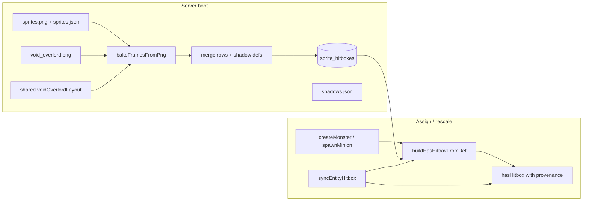
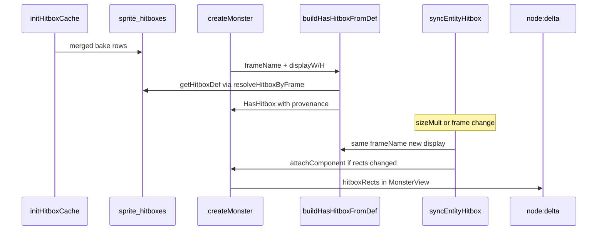

# Void Overlord Hitbox Bake (Option 1)

## Architecture

The game bakes hitboxes from atlas PNG + JSON at server boot (`initHitboxCache` → SQLite → `getHitboxDef`). The void encounter uses a **separate** sheet ([`client/public/assets/ultimate_bosses/void_overlord.png`](client/public/assets/ultimate_bosses/void_overlord.png)) with frames defined in code ([`client/src/sprites/voidOverlordSheet.ts`](client/src/sprites/voidOverlordSheet.ts)). Those frame names (`boss-0`, `minion-12`, …) are never baked today, so [`resolveMonsterHitbox`](server/src/hitbox/resolve.ts) falls back to square AABBs.

This plan adds the void bake **and** generalizes hitbox assignment so any sprite can be **rescaled after the slice is attached** without multiplying rects in place (the pattern already used by [`syncMinionHitbox`](server/src/systems/classes/archetypes/summoner/spawn.ts)).



**Assumptions:** Server cwd is `server/`. Frame crop math lives in shared `voidOverlordLayout` and must match client `initVoidOverlordSheet`. `replaceAllHitboxes` replaces the **entire** table once per boot with **merged** main + void rows.

**Rescale invariant:** Never multiply `hasHitbox.rects` in place for a size change. Always re-derive from the immutable baked `HitboxDef` using stored `frameName` + new display size (optionally `scaleMult` on base display). Prevents drift, supports `scaleX ≠ scaleY`, and allows frame swaps by changing `frameName` only.

**Wire note:** `HasHitbox` gains optional provenance fields; [`composeMonsterView`](shared/src/protocol/views.ts) continues to expose only `hitboxRects` to the client (no client bake). Extra slice fields ride the delta but are ignored by the renderer.

---

## Code Architecture (walkthrough)

Read this section **top to bottom**. Each step depends on the previous. Use the **File index (alphabetical)** at the end for quick path lookup.

### Step 1 — Shared void sheet layout (single source of truth)

**Goal:** One module defines crop rectangles, display sizes, minion frame pools, and stable per-entity frame selection — used by client frame registration, server hitbox bake, and server frame-name resolution.

| File                                                                                   | Symbol              | Action | Summary                                                      |
| -------------------------------------------------------------------------------------- | ------------------- | ------ | ------------------------------------------------------------ |
| [`shared/src/sprites/voidOverlordLayout.ts`](shared/src/sprites/voidOverlordLayout.ts) | constants + helpers | add    | Boss/minion grid constants, display sizes, frame builders    |
| [`shared/src/index.ts`](shared/src/index.ts)                                           | exports             | modify | Re-export layout API                                         |
| [`client/src/sprites/voidOverlordSheet.ts`](client/src/sprites/voidOverlordSheet.ts)   | layout imports      | modify | Import from shared; keep Phaser-only `initVoidOverlordSheet` |

```typescript
// shared/src/sprites/voidOverlordLayout.ts (excerpt)
export const VOID_OVERLORD_SHEET_W = 2172;
export const VOID_OVERLORD_BOSS_W = 543;
export const VOID_OVERLORD_BOSS_H = 362;
export const VOID_OVERLORD_MINION_Y0 = 452;
export const VOID_OVERLORD_MINION_ROW_H = 136;
export const VOID_OVERLORD_MINION_COLS = 16;
export const VOID_OVERLORD_MINION_ROWS = 2;

export const VOID_OVERLORD_DISPLAY: Record<
  string,
  {
    displayW: number;
    displayH: number;
    barOffsetY: number;
    visualOffsetY?: number;
  }
> = {
  /* same as today */
};

export const VOID_OVERLORD_MINION_POOLS: Record<string, readonly number[]> = {
  /* same */
};

export function stableFrameIndex(id: string, count: number): number {
  /* same hash */
}

export function resolveVoidOverlordMinionFrameName(
  monsterTypeId: string,
  entityId: string,
): string | null {
  const pool = VOID_OVERLORD_MINION_POOLS[monsterTypeId];
  if (!pool?.length) return null;
  return `minion-${pool[stableFrameIndex(entityId, pool.length)]}`;
}

export function resolveVoidOverlordBossFrameName(): "boss-0" {
  return "boss-0";
}

export interface VoidOverlordAtlasFrame {
  filename: string;
  sourceSize: { w: number; h: number };
  spriteSourceSize: { x: number; y: number; w: number; h: number };
  frame: { x: number; y: number; w: number; h: number };
}

export function buildVoidOverlordAtlasFrames(): VoidOverlordAtlasFrame[] {
  // boss-0..3 + minion-0..31 — same math as client voidOverlordSheet today
}

export function isVoidOverlordSheetMonster(monsterTypeId: string): boolean {
  return (
    monsterTypeId === "void-overlord" ||
    monsterTypeId === "void-horror" ||
    monsterTypeId === "abyssal-titan"
  );
}
```

**Client `initVoidOverlordSheet`:** Loop `buildVoidOverlordAtlasFrames()` and `texture.add(name, 0, frame.x, frame.y, frame.w, frame.h)`.

**Dependencies:** None.

---

### Step 2 — Refactor baker: frame list in, merged batch out

**Goal:** Extract reusable PNG→rows baking; merge main atlas + void sheet in one `initHitboxCache` pass; write merged `shadows.json`.

| File                                                                 | Symbol                     | Action | Summary                                                       |
| -------------------------------------------------------------------- | -------------------------- | ------ | ------------------------------------------------------------- |
| [`server/src/hitbox/bake/index.ts`](server/src/hitbox/bake/index.ts) | `bakeFramesFromPng`        | add    | sharp + greedy cover per frame list                           |
| [`server/src/hitbox/bake/index.ts`](server/src/hitbox/bake/index.ts) | `bakeSpriteHitboxes`       | modify | Returns `{ rows, shadowDefs }`; no DB write                   |
| [`server/src/hitbox/bake/index.ts`](server/src/hitbox/bake/index.ts) | `bakeVoidOverlordHitboxes` | add    | void PNG + `buildVoidOverlordAtlasFrames()`                   |
| [`server/src/hitbox/paths.ts`](server/src/hitbox/paths.ts)           | `getVoidOverlordPaths`     | add    | PNG under `ultimate_bosses/`                                  |
| [`server/src/hitbox/cache.ts`](server/src/hitbox/cache.ts)           | `initHitboxCache`          | modify | Merge both bakes; composite hash; single `replaceAllHitboxes` |

```typescript
// server/src/hitbox/cache.ts (orchestration excerpt)
const mainHash = sha256File(atlasPng);
const voidHash = sha256File(voidPaths.png);
const compositeHash = createHash("sha256")
  .update(mainHash)
  .update(voidHash)
  .digest("hex");

const main = await bakeSpriteHitboxes(atlasPng, atlasJson);
const voidBaked = await bakeVoidOverlordHitboxes(voidPaths.png);
replaceAllHitboxes(db, [...main.rows, ...voidBaked.rows], compositeHash);
writeShadowDefsFile(getAtlasPaths().atlasJson, compositeHash, {
  ...main.shadowDefs,
  ...voidBaked.shadowDefs,
});
```

**Inputs:** Main atlas paths; void PNG path.

**Outputs:** ~main frame count + 36 void rows in DB; merged shadow defs.

**Error handling:** Missing main atlas → throw (fail boot). Missing void PNG → throw if file expected; log if optional in dev only (prefer throw for consistency).

**Ordering note:** Remove internal `replaceAllHitboxes` from `bakeSpriteHitboxes` before wiring merge, or boot wipes main hitboxes mid-init.

**Dependencies:** Step 1 (`buildVoidOverlordAtlasFrames`).

---

### Step 3 — Provenance on `HasHitbox` + generic resolve/sync (arbitrary rescale)

**Goal:** After assignment, any entity can change display size (or frame) by re-resolving from the baked def — no in-place rect multiplication. Collapses duplicate scaling logic and sets up void overlord + summoner minions + future enrage-grow on the same path.

#### Step 3A — Shared types and pure builder

| File                                                                       | Symbol                                             | Action | Summary                          |
| -------------------------------------------------------------------------- | -------------------------------------------------- | ------ | -------------------------------- |
| [`shared/src/hitbox/types.ts`](shared/src/hitbox/types.ts)                 | `HasHitbox`                                        | modify | Add optional provenance fields   |
| [`shared/src/hitbox/resolveHitbox.ts`](shared/src/hitbox/resolveHitbox.ts) | `scaleHitboxDefToDisplay`, `buildHasHitboxFromDef` | add    | Pure helpers; no DB access       |
| [`shared/src/hitbox/constants.ts`](shared/src/hitbox/constants.ts)         | —                                                  | modify | Re-export or keep fallbacks only |
| [`shared/src/index.ts`](shared/src/index.ts)                               | exports                                            | modify | Export new module                |

```typescript
// shared/src/hitbox/types.ts
export interface HasHitbox {
  rects: HitboxRect[];
  /** Baked atlas frame key; null when using fallback AABB only. */
  frameName?: string | null;
  /** Source-space dimensions used for the last resolve (from HitboxDef or fallback). */
  sourceW?: number;
  sourceH?: number;
  /** Nominal display size at last resolve (before optional scaleMult). */
  displayW?: number;
  displayH?: number;
}
```

```typescript
// shared/src/hitbox/resolveHitbox.ts
export function scaleHitboxDefToDisplay(
  def: HitboxDef,
  displayW: number,
  displayH: number,
): HitboxRect[] {
  const scaleX = displayW / def.sourceW;
  const scaleY = displayH / def.sourceH;
  return def.rects.map((r) => ({
    offsetX: r.offsetX * scaleX,
    offsetY: r.offsetY * scaleY,
    halfW: r.halfW * scaleX,
    halfH: r.halfH * scaleY,
  }));
}

export function buildHasHitboxFromDef(args: {
  frameName: string | null;
  def: HitboxDef | undefined;
  displayW: number;
  displayH: number;
  fallback: HitboxRect;
  /** Used when def is missing; defaults to displayW/H. */
  fallbackSourceW?: number;
  fallbackSourceH?: number;
}): HasHitbox {
  const { frameName, def, displayW, displayH, fallback } = args;
  if (frameName && def) {
    return {
      frameName,
      sourceW: def.sourceW,
      sourceH: def.sourceH,
      displayW,
      displayH,
      rects: scaleHitboxDefToDisplay(def, displayW, displayH),
    };
  }
  const srcW = args.fallbackSourceW ?? displayW;
  const srcH = args.fallbackSourceH ?? displayH;
  const scaleX = displayW / srcW;
  const scaleY = displayH / srcH;
  const fb = {
    offsetX: fallback.offsetX * scaleX,
    offsetY: fallback.offsetY * scaleY,
    halfW: fallback.halfW * scaleX,
    halfH: fallback.halfH * scaleY,
  };
  return {
    frameName: null,
    sourceW: srcW,
    sourceH: srcH,
    displayW,
    displayH,
    rects: [fb],
  };
}
```

**Inputs:** `HitboxDef` from caller (server looks up cache); display dimensions; fallback rect.

**Outputs:** Full `HasHitbox` slice with provenance + scaled `rects`.

**Error handling:** `n/a` — pure functions.

#### Step 3B — Server resolve + sync

| File                                                                                                                 | Symbol                 | Action | Summary                                                                   |
| -------------------------------------------------------------------------------------------------------------------- | ---------------------- | ------ | ------------------------------------------------------------------------- |
| [`server/src/hitbox/resolve.ts`](server/src/hitbox/resolve.ts)                                                       | `resolveHitboxByFrame` | add    | `getHitboxDef(frameName)` → `buildHasHitboxFromDef`                       |
| [`server/src/hitbox/resolve.ts`](server/src/hitbox/resolve.ts)                                                       | `syncEntityHitbox`     | add    | Re-resolve from provenance or explicit args; `attachComponent` if changed |
| [`server/src/hitbox/resolve.ts`](server/src/hitbox/resolve.ts)                                                       | `resolveMonsterHitbox` | modify | Void branch + `entityId`; all paths use `buildHasHitboxFromDef`           |
| [`server/src/hitbox/resolve.ts`](server/src/hitbox/resolve.ts)                                                       | `resolveMinionHitbox`  | modify | Delegate to `resolveHitboxByFrame`                                        |
| [`server/src/hitbox/resolve.ts`](server/src/hitbox/resolve.ts)                                                       | `resolvePlayerHitbox`  | modify | Delegate to `resolveHitboxByFrame`                                        |
| [`server/src/systems/classes/archetypes/summoner/spawn.ts`](server/src/systems/classes/archetypes/summoner/spawn.ts) | `syncMinionHitbox`     | modify | Thin wrapper → `syncEntityHitbox`                                         |

```typescript
// server/src/hitbox/resolve.ts
export function resolveHitboxByFrame(
  frameName: string | null,
  displayW: number,
  displayH: number,
  fallback: HitboxRect,
): HasHitbox {
  const def = frameName ? getHitboxDef(frameName) : undefined;
  return buildHasHitboxFromDef({
    frameName,
    def,
    displayW,
    displayH,
    fallback,
  });
}

/** Re-derive hitbox after assignment (size change, frame change, or enrage grow). */
export function syncEntityHitbox(
  world: World,
  entity: { hasHitbox?: HasHitbox },
  args: {
    frameName: string | null;
    displayW: number;
    displayH: number;
    fallback: HitboxRect;
  },
): void {
  const next = resolveHitboxByFrame(
    args.frameName,
    args.displayW,
    args.displayH,
    args.fallback,
  );
  if (!hitboxEqual(entity.hasHitbox?.rects, next.rects)) {
    attachComponent(world, entity, "hasHitbox", next);
  }
}

/** Convenience: rescale using stored frame + new scaleMult on base display. */
export function syncEntityHitboxScale(
  world: World,
  entity: { hasHitbox?: HasHitbox },
  scaleMult: number,
  fallback: HitboxRect,
): void {
  const hb = entity.hasHitbox;
  if (!hb?.displayW || !hb.displayH) return;
  const mult = Math.max(0.1, scaleMult);
  syncEntityHitbox(world, entity, {
    frameName: hb.frameName ?? null,
    displayW: hb.displayW * mult,
    displayH: hb.displayH * mult,
    fallback,
  });
}
```

**`resolveMonsterHitbox` void branch:**

```typescript
export function resolveMonsterHitbox(
  monsterTypeId: string,
  isBoss: boolean,
  entityId?: string,
): HasHitbox {
  if (isVoidOverlordSheetMonster(monsterTypeId)) {
    const display = VOID_OVERLORD_DISPLAY[monsterTypeId];
    const frameName =
      monsterTypeId === "void-overlord"
        ? resolveVoidOverlordBossFrameName()
        : entityId
          ? resolveVoidOverlordMinionFrameName(monsterTypeId, entityId)
          : null;
    const fb = isBoss ? FALLBACK_BOSS_AABB : FALLBACK_MONSTER_AABB;
    if (display) {
      return resolveHitboxByFrame(
        frameName,
        display.displayW,
        display.displayH,
        fb,
      );
    }
  }
  const frame = resolveMonsterFrame(monsterTypeId);
  const displaySize = isBoss ? BOSS_DISPLAY_SIZE : MONSTER_DISPLAY_SIZE;
  const fb = isBoss ? FALLBACK_BOSS_AABB : FALLBACK_MONSTER_AABB;
  return resolveHitboxByFrame(frame, displaySize, displaySize, fb);
}
```

**`syncMinionHitbox` migration:**

```typescript
export function syncMinionHitbox(
  world: World,
  minion: MinionEntity,
  sizeMult: number,
): void {
  const typeId = minion.isMinion.monsterTypeId;
  const frame = resolveMonsterFrame(typeId);
  const mult = Math.max(0.1, sizeMult);
  const displaySize = MINION_BASE_DISPLAY_SIZE * mult;
  syncEntityHitbox(world, minion, {
    frameName: frame,
    displayW: displaySize,
    displayH: displaySize,
    fallback: FALLBACK_MONSTER_AABB,
  });
}
```

**Note:** Summoner minions re-pass `frameName` from `resolveMonsterFrame` each sync rather than reading `minion.hasHitbox.frameName` — equivalent for static type, clearer when type changes via passive.

**Arbitrary rescale after assignment (general recipe):**

1. At spawn: `attachComponent(..., 'hasHitbox', resolveXHitbox(...))` — slice includes `frameName`, `sourceW/H`, `displayW/H`, `rects`.
2. On runtime size change: `syncEntityHitbox(world, entity, { frameName, displayW, displayH, fallback })` OR `syncEntityHitboxScale(world, entity, scaleMult, fallback)` if only mult changes and base display is stored.
3. On frame swap: call `syncEntityHitbox` with new `frameName` (same display dims).
4. Never do `rect.halfW *= mult` on the existing slice.

**Dependencies:** Steps 1–2 (void frames in cache).

---

### Step 4 — Spawn wiring + client shadows

**Goal:** Void encounter monsters get correct frame at spawn; shadows.json includes void frame keys.

| File                                                                                       | Symbol                    | Action     | Summary                                               |
| ------------------------------------------------------------------------------------------ | ------------------------- | ---------- | ----------------------------------------------------- |
| [`server/src/systems/world/spawning/index.ts`](server/src/systems/world/spawning/index.ts) | `createMonster`           | modify     | `hasHitbox: resolveMonsterHitbox(typeId, isBoss, id)` |
| [`client/src/render/ultimateBossSprites.ts`](client/src/render/ultimateBossSprites.ts)     | `spriteMeta.currentFrame` | verify     | Matches baked `frameName` (`boss-0`, `minion-N`)      |
| [`client/public/assets/shadows.json`](client/public/assets/shadows.json)                   | —                         | regenerate | Merged bake output                                    |

```typescript
// server/src/systems/world/spawning/index.ts
hasHitbox: resolveMonsterHitbox(typeId, isBoss, id),
```

**Boss animation:** Combat hitbox uses `boss-0` only. Follow-up: union across `boss-0..3` if needed.

**Dependencies:** Step 3.

---

### Step 5 — Validation and dev workflow

| Action                   | Summary                                                                          |
| ------------------------ | -------------------------------------------------------------------------------- |
| Reboot server            | Log shows main + ~36 void frames baked                                           |
| Tactical mode `node-9-0` | Overlord ~400px multi-rect; minions non-square; not 40/28px squares              |
| Minion variety           | Two `void-horror` different IDs → different outlines                             |
| Summoner                 | Resize minion passive → hitbox grows via `syncMinionHitbox` → `syncEntityHitbox` |
| Regression               | Wolf/slime hitboxes unchanged                                                    |

---

### File index (alphabetical)

| File                                                                                                                 | Purpose                                                         |
| -------------------------------------------------------------------------------------------------------------------- | --------------------------------------------------------------- |
| [`client/public/assets/shadows.json`](client/public/assets/shadows.json)                                             | Regenerated merged shadow defs                                  |
| [`client/src/render/ultimateBossSprites.ts`](client/src/render/ultimateBossSprites.ts)                               | Verify `currentFrame` keys                                      |
| [`client/src/sprites/voidOverlordSheet.ts`](client/src/sprites/voidOverlordSheet.ts)                                 | Import shared layout; thin Phaser init                          |
| [`server/src/hitbox/bake/index.ts`](server/src/hitbox/bake/index.ts)                                                 | `bakeFramesFromPng`, void bake, merge exports                   |
| [`server/src/hitbox/cache.ts`](server/src/hitbox/cache.ts)                                                           | Dual-atlas boot merge                                           |
| [`server/src/hitbox/paths.ts`](server/src/hitbox/paths.ts)                                                           | Void PNG path helper                                            |
| [`server/src/hitbox/resolve.ts`](server/src/hitbox/resolve.ts)                                                       | `resolveHitboxByFrame`, `syncEntityHitbox`, thin type resolvers |
| [`server/src/index.ts`](server/src/index.ts)                                                                         | Unchanged if `initHitboxCache` signature unchanged              |
| [`server/src/systems/classes/archetypes/summoner/spawn.ts`](server/src/systems/classes/archetypes/summoner/spawn.ts) | `syncMinionHitbox` → `syncEntityHitbox`                         |
| [`server/src/systems/world/spawning/index.ts`](server/src/systems/world/spawning/index.ts)                           | Pass monster `id` to resolver                                   |
| [`shared/src/hitbox/constants.ts`](shared/src/hitbox/constants.ts)                                                   | Fallback AABBs                                                  |
| [`shared/src/hitbox/resolveHitbox.ts`](shared/src/hitbox/resolveHitbox.ts)                                           | Pure `buildHasHitboxFromDef` + `scaleHitboxDefToDisplay`        |
| [`shared/src/hitbox/types.ts`](shared/src/hitbox/types.ts)                                                           | `HasHitbox` provenance fields                                   |
| [`shared/src/index.ts`](shared/src/index.ts)                                                                         | Export hitbox + void layout                                     |
| [`shared/src/sprites/voidOverlordLayout.ts`](shared/src/sprites/voidOverlordLayout.ts)                               | Crop layout + frame name resolvers                              |

---

## Data and Control Flow

### Before changes

1. Boot bakes main atlas only; void frames absent from DB.
2. `HasHitbox` is `{ rects }` only; rescale by re-calling type-specific resolvers (minion) or not at all (monsters).
3. Void types → square fallbacks at wrong display scale (80px boss).

### After changes

1. Boot bakes main + void (36 frames) → merged DB + `shadows.json`.
2. Every resolve returns provenance + scaled rects via `buildHasHitboxFromDef`.
3. Runtime rescale: `syncEntityHitbox` / `syncEntityHitboxScale` re-lookup baked def, never mutate rects in place.



### Call path — void minion spawn

1. `ultimateEncounter.spawnTracked` → `world.createMonster(...)`.
2. `id = world.allocMonsterId(nodeId)`.
3. `resolveMonsterHitbox(typeId, isBoss, id)` → `resolveVoidOverlordMinionFrameName` → `minion-12`.
4. `resolveHitboxByFrame('minion-12', 60, 60, FALLBACK_MONSTER_AABB)` → `buildHasHitboxFromDef`.
5. `hasHitbox` attached with `rects` + `frameName` + `displayW/H`.
6. Combat uses `posHitboxFromEntity` → `rects` only (unchanged).

### Call path — summoner minion rescale (existing behavior, new primitive)

1. Stat recalc changes `sizeMult` → `syncMinionHitbox(world, minion, sizeMult)`.
2. `syncEntityHitbox` with `frameName` from `resolveMonsterFrame(typeId)`, `displayW/H = 48 * sizeMult`.
3. `getHitboxDef(frame)` → `buildHasHitboxFromDef` → new `rects`; `hitboxEqual` gates dirty attach.

---

## Rule Alignment

- **Server authoritative:** Bake + resolve on server; client renders `hitboxRects` from views.
- **Shared-first:** Void layout + pure `buildHasHitboxFromDef` in `@mmo-idle/shared`; server owns `getHitboxDef` cache lookup.
- **ECS:** `attachComponent` + `hitboxEqual` for rescale (matches summoner pattern); provenance on slice enables safe re-resolve.
- **Simplicity:** One rescale primitive (`syncEntityHitbox`); type resolvers stay thin wrappers.
- **No client bake:** Provenance fields are not required on the client render path.

---

## Risks and validation

| Risk                                             | Mitigation                                                                            |
| ------------------------------------------------ | ------------------------------------------------------------------------------------- |
| Layout drift client vs bake                      | Single `buildVoidOverlordAtlasFrames()` in shared                                     |
| `replaceAllHitboxes` wipe                        | Single merged write in `initHitboxCache`                                              |
| Delta payload growth                             | Optional provenance fields (~4 numbers + string); views still send `hitboxRects` only |
| `syncEntityHitboxScale` without prior provenance | No-op if `displayW/H` missing; spawn must use new resolvers                           |
| Boss anim uses `boss-0` only                     | Document; union bake follow-up                                                        |
| `visualOffsetY` on overlord                      | Server combat anchor vs client sprite — out of scope                                  |
| Summoner regression                              | Validate minion resize in test room                                                   |

**Validation checklist:**

- Server log: void frame count ≈ 36 added to main.
- Tactical mode: void overlord + minions show multi-rect outlines at correct scale.
- Summoner minion: hitbox scales when `sizeMult` changes.
- Wolf/slime: unchanged hitboxes.

---

## Out of scope (follow-ups)

- `visualOffsetY` baked into server hitbox `offsetY` for void-overlord combat parity.
- Union hitbox across `boss-0..3` animation frames.
- `MONSTER_FRAMES` entries for void types (resolve branch suffices).
- Client-side rescale from provenance (not needed; server sends scaled `hitboxRects`).
- Automated PNG fixture tests for void bake.
- Boss enrage `syncEntityHitboxScale` (primitive exists; no script wired yet).
