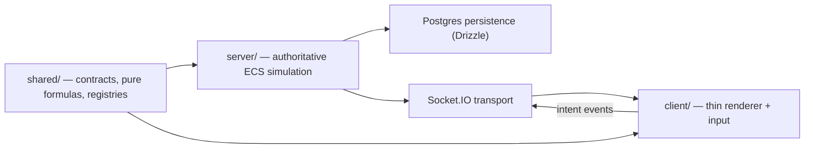

# MMO Idle Architecture

Status: current as of 2026-07-06.

This is the standing reference for how the codebase is structured. Read it end-to-end the first time, then use it as a lookup when adding new mechanics. If this doc and the code disagree, the code wins — file it as a doc bug. For per-system implementation detail and balance-in-progress notes beyond what's covered here, see the paired `docs/<system>-plan.md` / `docs/<system>-current-state.md` docs and the scoreboard in `docs/system-rework-status.md`.

The architectural axioms that all rules below derive from:

1. **The server is authoritative.** All gameplay outcomes (HP, damage, rewards, progression, persistence) are decided server-side. The client renders what it is told.
2. **Components describe behavior; systems define it.** Component presence on an entity is the contract that says "this behavior applies." A system iterates the components it cares about and implements the behavior.
3. **Compose, do not branch.** Adding a burn effect to a new skill must reuse the DoT system. Adding a shield to a new class must reuse the shield system. New mechanics ship as new components attached to existing systems, not as new systems.
4. **The minimum subset of systems.** Fewer systems means fewer balancing knobs to tune in parallel. A new "system" is a last resort, taken only when no existing system fits.
5. **Verb naming.** Component names are two-word verb phrases (`AppliesDots`, `HasHealth`, `TracksCombat`, `IsMoving`, `UsesCadence`, `ChillsTarget`). The key on `ServerEntity` is the lower-camel form (`appliesDots`, `hasHealth`). The name describes what the entity *does*, not what category it belongs to.

---

## Package boundaries



| Package | Owns | Imports from |
| --- | --- | --- |
| `shared/` | component shapes, pure formulas, protocol DTOs, static databases, registries | nothing in the workspace |
| `server/` | authoritative ECS world, all gameplay systems, persistence | `shared/` |
| `client/` | Phaser rendering, React HUD, input → intent translation | `shared/` |

Hard rules:

- `shared/` must not import from `server/`, `client/`, Phaser, Socket.IO, Postgres/Drizzle, Express, miniplex, or any Node-only API.
- `client/` must not import from `server/`.
- `server/` must not import from `client/`.
- Anything stateful, mutable, or time-dependent lives in `server/`. Anything pure and deterministic that both sides need lives in `shared/`.

---

## What goes in `shared/`

```text
shared/src/
  components/
    core/networkedSlices.ts        ← HasPosition, HasHealth, DealsDamage, ...
    combat/                         ← TracksCombat, StatusEffect, PlayerBuff, ...
    targeting/                      ← HasAttackTarget, HasAggroTarget, ScriptsBoss, ...
    archetypes/
      cadence/                      ← UsesCadence, HasDetonation, HasHemorrhage
      cooldown/                     ← UsesCooldown, IsChanneling, HasOverdrive, HasAlignment, HasEntropy
      dot/                          ← AppliesDots, ChillsTarget, HasDot, HasChill, HasFrozen, HasConflagration, HasAshbrandBurn
      energy/                       ← UsesEnergy, InAcChargePhase, InAcDischarge
      reload/                       ← UsesReload
  protocol/
    delta.ts                        ← EntityDelta, DeltaSnapshot
    networkedEntity.ts              ← NETWORKED_PLAYER_KEYS, NETWORKED_MONSTER_KEYS, NetworkedEntity
    views.ts                        ← composePlayerView, composeMonsterView
    combatEvents.ts, socketEvents.ts
  registries/effects.ts             ← EFFECT_DEFS, EFFECT_BY_ID
  systems/                          ← pure formulas: stats, damage, skills, spatial
  passives.ts                       ← typed PassiveKey union
  skillTree.ts, items.ts, recipeDatabase.ts, monsterDatabase.ts,
  biomeDatabase.ts, world/nodeBiomes.ts
```

Responsibilities:

- **Component interfaces.** Every component shape is declared here, in a small file colocated with the feature it belongs to. Components are data; no logic.
- **Pure formula helpers.** Stat recalculation, damage computation, skill unlock validation, biome XP curves, vector math. Same code runs on the server (for authority) and on the client (for tooltips/previews).
- **Networked slice allowlist.** `NETWORKED_PLAYER_KEYS` / `NETWORKED_MONSTER_KEYS` is the *only* place that decides what components cross the wire.
- **Static databases.** Skill tree, items, recipes, monsters, biomes, effect descriptors, buff IDs.

Forbidden in `shared/`:

- Functions that mutate world state.
- Anything that reads `Date.now()`, randomness, or filesystem.
- Imports from `phaser`, `miniplex`, `socket.io`, `pg`/`drizzle-orm`, `express`.

---

## ECS model

The server world is a single `miniplex` `World<ServerEntity>`. An entity is just an id with a bag of attached components.

### `ServerEntity` is the universe

`server/src/ecs/entity.ts` lists every possible component key as an optional field. This is the only place that knows the full list — feature modules still own each component's *shape*, but the union of keys lives here so miniplex's typed queries (`world.with('appliesDots', 'tracksCombat')`) can resolve.

```ts
export interface ServerEntity {
  entityId: EntityId;
  hasPosition?: HasPosition;
  hasHealth?: HasHealth;
  tracksCombat?: TracksCombat;
  appliesDots?: AppliesDots;
  hasDot?: HasDot;
  // ... every component lives here as an optional field
}
```

Two derived "shape" types are convenient for systems that always operate on a player or monster:

- `PlayerEntity` — `ServerEntity` narrowed to require `isPlayer`, `hasPosition`, `hasHealth`, `usesSkills`, `tracksCombat`, etc.
- `MonsterEntity` — `ServerEntity` narrowed to require `isMonster`, `controlsMonster`, `hasAwareness`, etc.

These types are populated by canonical queries on `World` (`world.playerEntities`, `world.monsterEntities`), so any code that iterates them is guaranteed the required slices exist.

**Player query tiers.** `playerEntities` = all connected players including corpses (serialization, id lookup, party roster). `livePlayers` = `playerEntities.without('isDead')` — use for every gameplay tick; archetype queries (`cadencePlayers`, `dotPlayers`, …) derive from `livePlayers`. `deadPlayers` = timeout sweep only. `livePlayersInNode(nodeId)` for spatial combat scans.

### Component categories

| Category | Examples | Notes |
| --- | --- | --- |
| **Identity** | `IsPlayer`, `IsMonster` | Presence determines entity kind. |
| **Networked state** | `HasPosition`, `HasHealth`, `DealsDamage`, `PerformsAttack`, `MitigatesDamage`, `HasStatus`, `TracksProgression`, `HoldsInventory`, `UsesSkills`, `IsDead` | Allowlisted in `NETWORKED_*_KEYS`; serialized as deltas. `IsDead` is runtime-only (never persisted). |
| **Archetype slices** | `UsesCadence`, `UsesCooldown`, `UsesEnergy`, `UsesReload`, `AppliesDots`, `ChillsTarget` | Networked. Presence gates archetype behavior. |
| **Target / link** | `HasAttackTarget`, `HasAggroTarget` | Presence means "currently has a target." Detach when target is dropped. |
| **Transient state markers** | `IsMoving`, `IsChanneling`, `IsBossEngaged`, `InAcChargePhase`, `InAcDischarge`, `HasEmpoweredAttack` | Presence is the sub-state. No "disabled = true" sentinel. |
| **Status effect markers** | `HasDot`, `HasChill`, `HasFrozen`, `HasSmolder`, `HasConflagration`, `HasDetonation`, `HasHemorrhage`, `HasEntropy`, `HasAshbrandBurn`, `HasAlignment`, `HasOverdrive` | Attached when the matching `statusEffects` entry exists; iterated by tick drivers. |
| **Server-only runtime** | `ControlsMonster` (AI), `HasKnockback`, `ScriptsBoss`, `TracksCombat`, `HoldsShields`, `EvadesHits` | Never networked. |
| **Lookup-only effects** | `plating-shred`, `vulnerability`, energy/cooldown counters | Live inside `tracksCombat.statusEffects`, not as components. Promoted to markers only when a system needs to *iterate* the set. |

**Heuristic for adding a new status effect.** If any tick loop needs to iterate every entity with the effect, add a `hasX` marker (attach on apply, detach in a once-per-tick sweep). If the effect is only read by id from one or two call sites that already have the entity, stay in `tracksCombat.statusEffects`. Stacking semantics, refreshable duration, and `sourceId` tracking always live in `statusEffects` regardless of marker presence.

### Presence is the contract

Behavior is gated by component presence, never by string discriminators:

```ts
if (entity.usesCadence) { ... }          // good
if (entity.combatArchetype === 'cadence') { ... }  // banned

if (entity.isMoving) advanceMotion(...);  // good
if (entity.speed > 0) advanceMotion(...); // banned
```

When behavior starts, attach the component. When behavior stops, detach the component. There is no "zero-duration" or "false-flag" representation of absence:

| Lifecycle | API |
| --- | --- |
| Attach with a value | `attachComponent(world, entity, 'usesCadence', initUsesCadence(...))` |
| Attach a marker (empty value) | `attachMarker(world, entity, 'hasDot')` |
| Detach | `detachComponent(world, entity, 'usesCadence')` |
| Detach a marker when its effect ends | `detachMarkerIfNoEffect(world, entity, 'hasDot', state, 'dot')` |
| Motion | `setEntityMotion(world, entity, target)` / `stopEntity(world, entity)` |
| Targets | `setAttackTarget`, `setAggroTarget` |

All of these automatically mark the slice dirty for delta serialization. Never assign to `entity.someComponent = value` directly for a networked slice — use the helpers above.

### Verb naming taxonomy

Every component name is a two-word verb phrase. The key on `ServerEntity` is the lower-camel form of the same name.

| Verb stem | Meaning | Examples |
| --- | --- | --- |
| `Is*` | identity / sub-state presence | `IsPlayer`, `IsMonster`, `IsMoving`, `IsChanneling`, `IsBossEngaged` |
| `Has*` | possession / active condition | `HasPosition`, `HasHealth`, `HasAttackTarget`, `HasDot`, `HasFrozen`, `HasKnockback` |
| `Uses*` | opted-in archetype with runtime state | `UsesCadence`, `UsesCooldown`, `UsesEnergy`, `UsesReload`, `UsesSkills`, `UsesAutocombat` |
| `Applies*` | applies an effect outward each hit | `AppliesDots` |
| `Tracks*` | accumulates / books long-running state | `TracksCombat`, `TracksProgression`, `TracksEngagement` |
| `Holds*` | container of items / values | `HoldsInventory`, `HoldsShields` |
| `Deals*`, `Performs*`, `Mitigates*`, `Evades*` | role in the damage exchange | `DealsDamage`, `PerformsAttack`, `MitigatesDamage`, `EvadesHits` |
| `Controls*` | server-only behavior owner | `ControlsMonster` |
| `Scripts*` | scripted behavior owner | `ScriptsBoss` |
| `In*` | inside a finite sub-state | `InAcChargePhase`, `InAcDischarge` |
| `Shows*`, `Chills*` | observable side-effect on others | `ShowsSacred`, `ChillsTarget` |

When you introduce a new component, pick the verb that already encodes the behavior. If you find yourself reaching for a noun (`Cadence`, `Burn`), reframe: who does what to whom?

---

## Composability: reusing components across mechanics

This is the most important architectural rule for new feature work.

> A new mechanic attaches existing components to entities that don't have them. It almost never defines a new system.

### Worked example: a "burn-on-crit" weapon

Goal: a weapon that applies a fire-style burn DoT on critical hits, regardless of the wielder's class.

There is no "burn system" — the DoT system already covers it. The procedure is:

1. The DoT system iterates `world.dottedMonsters` (the `hasDot` marker) and ticks damage from `tracksCombat.statusEffects['dot']`.
2. Attach `appliesDots` to the player when the weapon is equipped (in the inventory/equip path).
3. In an `onHit` combat listener registered by the weapon module, call `applyStatusEffect(defender.tracksCombat, { id: 'dot', ... })` and `attachMarker(world, defender, 'hasDot')`.
4. Nothing else changes. The DoT tick loop, expiry, HUD overlay, and combat events all work because the same components are now attached.

`AppliesDots` lives in the DoT archetype folder, but it is not "the DoT class component." It is "the component that says *this entity applies DoT stacks on hit*." Anything that wants that behavior — a class root, a T3 path, a weapon, a buff, a status effect — attaches `AppliesDots`. The DoT system doesn't care where the component came from.

### When to add a new component vs. reuse existing ones

| Need | Action |
| --- | --- |
| New flavor of an existing behavior (a different DoT, a different shield) | Reuse the component, vary the data inside it. |
| Same behavior gated by a new condition | Attach an existing component, gate the attach. |
| A *new behavior* that some entities have and others don't | New component, attached by the system that owns the behavior. |
| A new tick loop that scans all entities for a condition | Stop — add a marker component instead and iterate `world.<marker>Entities`. |

### When to add a new system

Almost never. Add a new system only when:

- The behavior is genuinely periodic and doesn't fit any existing tick (movement, AI, combat, defense, archetype tick, buff sync, broadcast).
- No existing combat-pipeline event (`beforeAttack`, `onAttack`, `onHit`, `onDamageTaken`, `afterHit`, `onKill`) is a fit.
- The behavior cannot be expressed as "attach component X, system Y already handles X."

If you do add a new system, register it through the same patterns existing systems use:

- Archetype-like ticks register through the **mechanic registry** in `server/src/systems/classes/registry.ts`. Don't edit `World.tick()` directly.
- Combat reactions register through `registerCombatListener(...)`.
- Buffs register through `defineBuff(...)` in the owning module's `BUFFS` array, which gets picked up by `syncPlayerBuffs`.

---

## Server: authoritative simulation

```text
server/src/
  ecs/
    world.ts                  ← createEcsWorld()
    entity.ts                 ← ServerEntity (the union of all components)
    dirtyTracker.ts           ← per-entity per-slice dirty bits
    deltaEncoder.ts           ← entity → EntityDelta (add / patch / remove)
    markerHelpers.ts          ← attach/detach component + marker helpers
    dirtyHelpers.ts           ← markSliceDirty / markSliceDetached
    archetypeSliceSync.ts     ← attach/detach archetype slices on class change
    playerEntityFormulas.ts   ← entity-native wrappers for shared formulas
    markerInvariants.ts       ← [marker-invariants] / [network-invariants] dev checks
  world/
    World.ts                  ← World class: queries, tick(), buildNodeDelta()
    nodeRegistry.ts, nodeDelta.ts, monsterLifecycle.ts, playerLifecycle.ts, testRoom.ts
  systems/
    classes/
      registry.ts             ← MODULES list + tickAllMechanics + collectMechanicBuffs
      mechanicModule.ts       ← MechanicModule / defineMechanic
      archetypes/
        cadence/  cooldown/  dot/  energy/  reload/
      shared/                 ← cross-archetype helpers: classActive, debuffs, resources
    combat/
      engine/                 ← combat, combatPipeline, combatState, attackCounter, empoweredAttacks
      ai/                     ← ai, autoTarget, bossScripts, engagement, targeting, packs, swarm
      damage/                 ← aoeDamage, knockback, weaponEffects
      buffs/                  ← buffSync, descriptor
    defense/                  ← regen/, shields/, mitigation/, core/
    player/
      economy/                ← inventory, crafting
      progression/            ← skills, rewards, quests
      abilities/               ← abilityFiring.ts, abilityEffects.ts (Technique/Guard)
      stances/                 ← stanceSwitch.ts
      rites/                   ← riteOoc.ts
    world/                    ← movement, spawning, transitions, testRoomInteract, mobility/mobilityBoots.ts
    world/dungeons/dungeon.ts ← guarded-altar dungeon state machine
    combatBootstrap.ts        ← initCombatSystems(): the only place combat-pipeline listeners register
  db/                         ← Drizzle + Postgres, component-shaped persistence
  index.ts                    ← Express + Socket.IO + game loop wiring
```

### Tick schedule

`World.tick(dt, now)` runs at 10 Hz and is the only place that orders systems. Current order (`server/src/world/World.ts`), including everything the post-rework systems added:

```ts
updateCombatState(world, dt);          // decrement durations, statusEffect lifecycle
updateShields(world, dt);
updateRuneDerivedConfig(world, now);   // stamps rune-derived flags read later this tick
tickAllMechanics(world, dt, now);      // class registry: cooldown → energy → reload → dot → cadence
updateWeaponEffects(world, dt);
updateBossScripts(world, dt);
updateUltimateEncounters(world, dt);
updatePartyFollow(world, now);
updateAutoTraverse(world);
updateAutoTargets(world, now);
updateAbilityFiring(world);            // Technique/Guard: fires abilities, arms hasArmedAbility
updateStanceSwitch(world);             // switches activeStance (anti-thrash cooldown), recalcs stats
updateKnockback(world, dt);
updateMobilityState(world, dt);        // boot ramp timers, on-acquire edge detection
updateMovement(world, dt, now);
updateNodeFeatures(world, dt);
updateTransitions(world);
if (IS_DEV) updateTestRoomInteract(world, now);
updatePacks(world, now);               // pack aggro propagation + alpha-call telegraphs
updateMonsters(world, dt, now);        // the single AI/movement/attack executor
updateSwarm(world);                    // bends this tick's motion with separation/cohesion
updateCombat(world, dt, now);          // emits combat pipeline events
updateDefensiveSystems(world, dt, now);
updateAbilityHealing(world, dt);
syncPlayerBuffs(world, now);           // populates hasStatus.activeBuffs
mirrorHpForecast(world);
updateAutoIntent(world);
updateExpiredEmotes(world, now);
updateDeadPlayersInWorld(world, now);
tickDungeons(world, now);              // guarded-altar dungeon state machine
```

Each system iterates a narrow miniplex query (`world.dottedMonsters`, `world.cadencePlayers`, …). Archetypes register themselves through the mechanic registry; new *loadout* layers (abilities/stances/rites) instead added one ordered call each directly in `tick()` — they aren't archetypes, so they don't go through the mechanic registry, but each is still a single self-contained system call reading component presence, not a branch inside an existing one. `World.tick()` grows by one line per genuinely new system; it never grows for a new archetype, ability, stance, rite, core, or buff.

### Combat pipeline

`combatPipeline.ts` exposes a six-phase mutable event:

```
beforeAttack → onAttack → onHit → onDamageTaken → afterHit → onKill
```

Listeners read/write `CombatContext.damage`, `metadata`, and `cancelled`. The pipeline is the canonical extension point: weapon effects, defense (evasion, shields, hit-to-DoT), archetype hits, debuff multipliers, ability Technique riders, and mobility-boot procs all register listeners rather than mutating the attack inline. Listener ordering by registration is meaningful — more specific handlers register first and can claim a hit via `ctx.metadata['dotHandled']` (or equivalent flags) so the generic handler skips.

`server/src/systems/combatBootstrap.ts` (`initCombatSystems()`) is the single place every module's combat-pipeline listeners get registered, for both the live server and bench harnesses — see CLAUDE.md. Adding a new `onHit`/`onKill`/etc. listener always means adding one call inside `initCombatSystems()`, never registering ad hoc from elsewhere.

### Networked snapshot

Broadcast runs at 5 Hz. `World.buildNodeDelta(nodeId, dirty, opts)` produces a `DeltaSnapshot`:

```ts
type EntityDelta =
  | { kind: 'add';    netId, entityKind, components }
  | { kind: 'patch';  netId, components, removed? }
  | { kind: 'remove'; netId };
```

Component attach/detach automatically marks the slice dirty; the encoder reads `NETWORKED_PLAYER_KEYS` / `NETWORKED_MONSTER_KEYS` to know what's serializable. Server-only components (`controlsMonster`, `tracksCombat`, `hasKnockback`, `scriptsBoss`, marker components, lookup-only effects) never appear on the wire.

`state:sync` sends a full resync as a `DeltaSnapshot` with `full: true` on connect / reconnect / node transition. `node:delta` carries patches between broadcasts.

### Persistence

`server/src/db/` (Drizzle over Postgres) persists one JSON blob per long-lived player slice: `isPlayer`, `hasPosition`, `hasHealth`, `tracksProgression`, `holdsInventory`, `usesSkills`. `playerRepo.ts` is the hydrate/save boundary. Runtime-only slices and derived state (passives, archetype slices, combat state) are rebuilt on attach via `syncArchetypeSlices` + `recalculatePlayerEntityStats`. Save fires on disconnect and every 30 s.

Every post-rework loadout system (abilities, stances, rites, cores, catalysts, global mastery) added **zero new persisted slices** — they all fold into the existing `tracksProgression` JSON blob (`knownAbilities`/`equippedAbilities`, `knownStances`/`equippedStances`/`activeStance`, `knownRites`/`equippedRites`, `catalysts`/`catalystProgress`) or, for cores, into the existing `holdsInventory.equipment` map as a 5th slot. This is the intended pattern for new player-facing state: extend an existing whole-slice JSON blob rather than adding a persisted column, unless the state is genuinely a new top-level concern.

### Buffs

`BuffDescriptor` (in `server/src/systems/combat/buffs/descriptor.ts`) packages everything about a buff — id, a projection function from player state to an active-or-null buff, and display metadata including a required `category`:

```ts
defineBuff('ability-guard', (ctx) => {
  if (!ctx.player.hasStatus?.statusEffects['ability-guard']) return null;
  return { id: 'ability-guard', stacks: 1, durationPct: 1 };
}, { label: 'GUARD', color: '#88ccff', category: 'neutral' });
```

`syncPlayerBuffs` projects every descriptor and writes the result to `hasStatus.activeBuffs`. Adding a buff is one descriptor in the owning module and requires *zero* client changes — `BuffBar.tsx` reads the wire payload and renders. Abilities, stances, and mobility boots all add their buffs this way (`abilityBuffs.ts`, `MOBILITY_BUFFS` in `mobilityBoots.ts`) rather than inventing their own status-bar plumbing.

---

## Post-rework systems

The systems below shipped in the "system rework" (see `docs/system-rework-status.md` and each system's `docs/<system>-current-state.md`). They are covered here at architecture level only — where state lives, who owns the mechanic, and the extension point. Balance numbers, per-biome content, and exhaustive item lists live in the paired docs, not here. Where a current-state doc's prose disagreed with the code as of this refresh, the note below says so explicitly; code wins.

Four of these (Abilities, Stances, Rites, Cores) are **loadout layers**: player-chosen, slotted, persisted in `TracksProgression` (or, for Cores, the existing equipment map), and folded into `recalculatePlayerEntityStats` alongside skills and gear. They are listed in decreasing "activity": Abilities fire on triggers mid-combat, Stances switch reactively, Rites are always-on, Cores are pure equipped modifiers.

### Abilities (Technique / Guard)

- **State:** `TracksProgression.knownAbilities` (learned) + `equippedAbilities: {technique, guard}` (networked, persisted — one JSON blob, no migration). A server-only, non-networked sibling component `HasArmedAbility` (`server/src/ecs/entity.ts`) tracks "next hit fires the armed Technique," deliberately kept separate from the pre-existing class-owned `HasEmpoweredAttack` so the two "next hit is special" mechanisms never collide.
- **Owner:** `server/src/systems/player/abilities/abilityFiring.ts` (`updateAbilityFiring`, ticked after `updateAutoTargets`) decides trigger/cooldown and arms Technique / fires Guard. `abilityEffects.ts` registers the Technique's `onHit` rider and the Guard's `onDamageTaken` reader through `initCombatSystems()`.
- **Extension point:** a new ability is one `AbilityDef` (trigger + effect kind) in `shared/src/abilities.ts` plus one `AbilityRecipe` (biome-level gated, same shape as `RuneRecipe`). New trigger/effect *kinds* need a branch in `abilityFiring.ts`/`abilityEffects.ts`; existing kinds need nothing else.
- **Composition:** Technique riders are ordinary combat-pipeline listeners; Guard effects are ordinary buffs; both Technique and Guard have an optional rune override on two new but structurally ordinary rune-action channels (`TECHNIQUE`/`GUARD`), parallel to the pre-existing `CONTROL` channel pattern (e.g. `taunt.ts`).

### Stances

- **State:** `TracksProgression.knownStances`, `equippedStances: {default, reactive}`, and `activeStance` (networked so the client can render current posture; server-derived, not player-writable directly). Slot shape mirrors Abilities' `{technique, guard}` almost verbatim — the third near-identical loadout template after Abilities.
- **Owner:** `server/src/systems/player/stances/stanceSwitch.ts` (`updateStanceSwitch`, ticked right after ability firing). Compares the desired stance (reactive stance's rune condition + an anti-thrash switch cooldown) against `activeStance`; on a change it calls `recalculatePlayerEntityStats` and marks the slice dirty.
- **Extension point:** a new stance is one `StanceDef` (`statEffects`/`mechanicEffects`) in `shared/src/stances.ts` plus a `StanceRecipe`. Pure stat-delta stances need no other code — the stats pipeline already folds any equipped stance's effects in.
- **Composition:** stance stat deltas fold into the same accumulators skill-tree nodes and gear use in `shared/src/systems/stats.ts`; switching rides a new `STANCE` rune channel + `switch-stance` action, structurally identical to every other rune-derived flag. One deliberate one-off: a stance's `damageReduction` is folded *after* the mid-pipeline `[0, 0.9]` DR clamp so a negative-DR tradeoff stance still combines correctly with gear before the final clamp.

### Rites

- **State:** `TracksProgression.knownRites` + `equippedRites` (type alias `EquippedRites = string[]`) — a flat, interchangeable list, unlike Abilities'/Stances' role-based slots. No `activeStance`-style runtime field: rites are always-on while equipped.
- **Owner:** no per-tick driver exists — rites have no firing logic and no rune-action channel at all (a deliberate divergence: a channel would contradict "always-on passive" framing). `server/src/systems/player/rites/riteOoc.ts` exposes out-of-combat hooks (`oocRegenDelay()`, read by `combat.ts`; `runRiteOoc()`, called from `defense/index.ts` gated to out-of-combat) and one `onKill` combat listener registered through `initCombatSystems()`. `riteSlotCount(globalMastery)` in `shared/src/rites.ts` is currently a stub hardcoded to 2.
- **Extension point:** a new rite is one `RiteDef` (`mechanicEffects`, `rite.*` keys) plus a `RiteRecipe` (T3-band biome gate). A rite that only sets a passive already read somewhere (regen delay, cleanse, buff decay) needs no other code; a new *behavior* needs a new read site in `riteOoc.ts` or a new combat listener.
- **Composition:** rites fold into `usesSkills.passives` via the same `mergePassives` path as skills/stances/equipment — no bespoke state. Note: Rites' harmful-debuff predicate (`isHarmfulPlayerStatusEffect`, used by Cleansing Breath) is shared authority also used by Abilities' Cleanse — changing that one function changes both systems.

### Cores

- **State:** no new component at all — `'core'` is simply the 5th value of `EquipmentSlot`, living inside the pre-existing `HoldsInventory.equipment` map. Fully networked and persisted for free through the existing equipment plumbing (old saves default the slot to `null` via `emptyEquipment()`).
- **Owner:** no bespoke tick system. The only core-specific logic is `coreIsActive(rangeTag, selectedRange)` (`shared/src/systems/cores.ts`), called from the equipment loop in `shared/src/systems/stats.ts` to skip a directional core's stats/effects entirely when it doesn't match the player's `selectedRange` (a pre-existing, already-mechanical field). Rank-ups reuse the gear evolution machinery (`shared/src/systems/evolution.ts`) with `requiredPlusFor(recipe)` returning `0` for the `core` slot — cores rank up by owning the predecessor outright, not by upgrading it to +3 first like every other slot.
- **Extension point:** a new core is an ordinary `Recipe`/item with `slot: 'core'` and a `rangeTag` (`close`/`mid`/`far`/`universal`/`party`) — it flows through `ITEM_DATABASE` and the generic equip/forge UI automatically.
- **Composition:** the strongest reuse case of the four loadout layers — equip, persist, network, and most UI needed **zero** new code; only the stats-loop range-gate and the evolution required-plus parameter are genuinely new.

### Aspects & Biome Catalysts economy

- **State:** `TracksProgression.essences` (existing) plus new `catalysts` and `catalystProgress` (both `Record<string, number>` keyed by biome group) — all inside the already-networked/persisted `tracksProgression` slice, so no allowlist or migration work was needed to add them.
- **Owner:** `grantCatalystProgress()` (`server/src/systems/player/progression/rewards.ts`) accumulates per-kill weight and mints whole catalysts at a configured threshold, carrying the remainder. Every crafting/upgrade/evolution site that spends catalysts follows the same read-then-subtract pattern as essence spending.
- **Extension point:** a new catalyst axis is just a new key in the `Record<string, number>` maps plus a weight source and a cost entry at the relevant crafting site.
- **Note:** `docs/aspects-catalysts-current-state.md` is titled and written as a pre-implementation audit ("catalysts don't exist yet") — that is stale; catalysts are fully implemented as described above. Trust this section and the code, not that doc's prose, until it's refreshed.

### Biome ecology AI primitives (packs, patrol, swarm, telegraphs)

- **State:** coordination state lives on the existing server-only `ControlsMonster` (patrol index/direction/override, per-mob scratch) plus a new server-only, non-networked, non-persisted `InPack { packId, role }` component. Nothing here is persisted — monsters are always ephemeral (world axiom).
- **Owner:** three new tick calls bracket the existing `updateMonsters` executor rather than replacing it: `updatePacks` (propagates an aggroed pack member's target onto un-aggroed packmates, scatters survivors via `onPackAlphaDead`) runs *before* `updateMonsters`; `updateSwarm` (boids separation/cohesion bending the tick's motion vector) runs *after* it. Patrol is a data-driven replacement for random wander on `ControlsMonster`, read inside `updateMonsters` itself. Telegraphs are one-shot `world.pushEvent(nodeId, { kind: 'ecology-pulse', ... })` animation events — no networked per-tick booleans, matching the existing anti-pattern rule against flag-based animation state.
- **Extension point:** retrofitting a new biome is adding optional `pack` / `swarm` / `patrol` / `chargeOnAggro` fields to that biome's monster defs (`shared/src/data/monsters/`) — no server code changes for the primitive itself, only for a genuinely new primitive shape.
- **Composition:** this is the rare case of three genuinely new coordination systems (no existing system iterated multiple monsters together), justified because no existing tick or combat-pipeline event could express cross-entity coordination. Terrain, hazards, DoTs, and boss scripting were all pre-existing and are reused as-is.

### Elite-tag targeting

- **State:** none. `elite?: boolean` is a static flag on the monster definition — no component, no networked field, no runtime state. Because it's def-level, a monster can never become elite only at runtime (e.g. a boss script can't "promote" a normal add mid-fight).
- **Owner:** two independent call sites re-derive the same static flag: the client outline color (`client/src/render/monsters.ts`, yellow, lower precedence than pack-alpha/guardian/throne tints) and the server auto-combat scorer (`targetPriority.ts`, `ELITE_FOCUS_WEIGHT` bonus gated behind the `focus-elites` rune). This is unrelated to monster-side aggro *policy* (`monsterTargeting.ts` / `docs/monster-targeting-current-state.md`), which governs which player a monster attacks, not which monster a player's autocombat prefers.
- **Extension point:** tag a monster def `elite: true`; both consumers pick it up with no further wiring.
- **Composition:** pure reuse — the elite system's only "new" code is the `focus-elites` rune (cloned from an existing targeting rune) and one scoring-weight constant.

### Dungeons: the guarded altar

- **State:** `TracksDungeon`, a server-only, non-networked, non-persisted component (source tag: `dungeonGuardian` / `dungeonBoss`, plus guard-group bookkeeping). Runtime state (`DungeonState`: status, living guardian ids, participant ids, timers) is keyed by node id inside `World` and is never persisted, consistent with monsters being ephemeral.
- **Owner:** `server/src/systems/world/dungeons/dungeon.ts` is the state machine (`idle → bossAwakening → boss → cooldown`, altar activation, node-wipe/freeze reset). Shared defs (`DungeonDef`, `DungeonGuardDef`, `BIOME_GUARD_POSTURE`) live in `shared/src/dungeons/`.
- **Invariant (architectural, not a balance choice):** guardians never gate the boss. Disturbing the altar aggroes every survivor and starts the boss timer; survivors grant only their normal monster rewards whether killed before or after activation. There is no wave system, no kill-count gate, and no bonus for leaving guardians alive.
- **Extension point:** a dungeon's guard is generated from one per-biome posture (`pack` / `patrol` / `post-hold`) applied to that biome/tier's own ambient monster pool, so new dungeons and new tiers need no authoring. `DUNGEON_CONTENT_BY_NODE` overrides one node when it must diverge.
- **Composition:** reuses `bossScript` wholesale for the boss, the shipped ecology primitives for the guard (`inPack`/call-allies, `holdPost`/`holdPatrol`), and the ordinary combat pipeline for everything else. Only the dungeon state machine itself is new.
- **History:** this replaced the gauntlet system (waves, pre-encounter groups, guardian auras, `unclearedThreat` hooks). See `docs/archive/dungeon-gauntlet-current-state.md` for that design; it is not current.

### Mobility boots

- **State:** entirely passive-driven — `usesSkills.passives['mobility.<key>']` numeric entries (stealth, kite/ooc-speed, tenacity, ramp), read live each tick. Transient effects (e.g. on-kill haste) ride the ordinary status-effect/buff machinery; a few server-only scratch fields live directly in `TracksCombat` (a move timer, last-target id, an acquire cooldown) and are never persisted.
- **Owner:** `server/src/systems/world/mobility/mobilityBoots.ts` — four collapsed helper functions (speed multiplier, detection/pull-range multiplier, incoming-CC duration multiplier, and a per-tick bookkeeping pass wired into `World.tick` as `updateMobilityState`) plus event-triggered boot buffs registered as ordinary `onKill`/`onDamageTaken` combat listeners through `initCombatSystems()`.
- **Extension point:** a new boot passive is a new `mobility.<key>` entry read by one of the four existing helper functions — the equipment `mechanicEffects → usesSkills.passives` pipeline already turns gear into passives, so no new plumbing is needed unless the trigger shape itself is new (in which case: a new status-effect id + a `MOBILITY_BUFFS` entry for the HUD).
- **Note:** the Trench boot's "every Nth hit" trigger shape is explicitly not implemented yet — the file's own primitive set doesn't cover a discrete per-hit counter trigger, flagged in a comment at the top of the file.

---

## Client: thin renderer

```text
client/src/
  scenes/GameScene.ts         ← compat re-export; real lifecycle/system schedule is scenes/game/GameScene.ts
  net/
    socket.ts                 ← Socket.IO event registration
    deltaApplier.ts           ← applyDelta(state, snapshot, scene)
    intents.ts                ← outbound socket emits
  render/
    state.ts                  ← per-concern Maps keyed by NetworkId
    sprites.ts shadows.ts labels.ts healthBars.ts cooldownBars.ts
    interpolation.ts effectOverlays.ts combatFx.ts
    players.ts monsters.ts destroy.ts
    castBars.ts dungeonHazards.ts minions.ts movementEffects.ts
    nodeGates.ts thoughtBubbles.ts ultimateBossSprites.ts depth.ts
  fx/                         ← one file per attack style
  input/                      ← clickToMove, autoPath, keyboard, debug
  audio/                      ← sound engine
  hud/                        ← React HUD components (BuffBar, StatPanel, AbilityBar, CatalystPanel, ...)
  ui/                         ← React panels (SkillTree, Inventory, Crafting, Map, Quest,
                                 AbilitiesPanel, StancesPanel, RitesPanel, BuildRunesTab, MasteryPanel)
  hudBus.ts                   ← reactive event bus for HUD state
  main.ts                     ← Phaser bootstrap + React mounts
```

Each new post-rework loadout system (abilities, stances, rites, cores, catalysts, mastery) shipped as one more React panel reading its own slice of `PlayerView` off `hudBus` — no new render pipeline, no god object. The pattern in "Pipeline" below still holds unchanged.

### Pipeline

```
Socket.IO inbound → deltaApplier → render state maps → per-frame render systems → Phaser
                  ↘ combat event queue → combatFx dispatcher → Phaser
                  ↘ hudBus.emit → React HUD
input + HUD CustomEvents → intents.ts → Socket.IO outbound
```

God objects are explicitly prohibited. Each render concern owns its own map keyed by `NetworkId`, and an entity exists in a given map iff that concern currently applies — boss decorations only for bosses, debug rings only while debug is toggled. No render module reaches into another module's Phaser handles; each module owns ensure, update, and destroy for its own concern.

`deltaApplier.ts` is the single network seam. It applies `add`/`patch`/`remove` deltas to local `NetworkedEntity` state, composes `PlayerView` / `MonsterView` via shared formulas, calls each render concern's `ensure`/`update`/`destroy`, drains combat events into the FX dispatcher, and publishes the local-player view to `hudBus`.

### Where shared formulas help

The client may import pure formulas from `shared/`:

- Tooltip math (preview stat changes from a skill unlock, equipment swap).
- `composePlayerView` / `composeMonsterView` to assemble HUD view models from networked components.
- Effect descriptors (`EFFECT_DEFS`) so the client knows how to render a server-emitted effect ID.

The client must never compute authoritative values: HP changes, damage, rewards, buffs, progression all come from the wire. There is no client-side prediction.

---

## How to add a new mechanic

A repeatable recipe for the common case.

### 1. Decide what behavior already covers this

Before writing anything, ask: which existing system would handle this if the right component were attached? Burn? → DoT. New buff? → buff descriptor. Shield-on-condition? → defense/shields. New attack timing? → an existing archetype. Most additions never reach step 2.

### 2. If you must add a component

- File: `shared/src/components/<area>/<verbName>.ts`.
- Export the interface `Verbs Object` and an `initVerbsObject(...)` factory.
- Add the lower-camel key to `ServerEntity` in `server/src/ecs/entity.ts`.
- If networked, add it to `NETWORKED_PLAYER_KEYS` / `NETWORKED_MONSTER_KEYS` and to `NetworkedEntity` in `shared/src/protocol/networkedEntity.ts`.
- Re-export from `shared/src/components/index.ts`.
- If this is a marker component (presence-only), add its key to `MarkerKey` in `server/src/ecs/markerHelpers.ts`.

### 3. Attach the component from the right place

- Class root / T1 / T3 unlock → `syncArchetypeSlices` (in `server/src/ecs/archetypeSliceSync.ts`).
- Equipment → the equip / unequip path in `server/src/systems/player/economy/inventory.ts`.
- Combat reaction (e.g. burn on hit) → a `registerCombatListener('onHit', ...)` inside the owning module's `init*` function.
- Status effect → `applyStatusEffect(state, {...})` + `attachMarker(world, defender, 'hasX')`.

### 4. Let the existing system do the work

If you reused an existing component (`appliesDots`, `holdsShields`, etc.), there is no system to write. The existing tick already iterates the marker query and reads the status data.

### 5. If you need a buff icon

Add one `defineBuff(...)` descriptor in the owning module. Add the `BuffId` to `shared/src/components/combat/buffs.ts` (`BUFF_IDS`). Done. The HUD picks it up.

### 6. If you need a new visual effect

- Effect descriptor (sprite, frames, attach point): one entry in `shared/src/registries/effects.ts`.
- Combat-event-style FX (slash, gunshot, frost burst): one file in `client/src/fx/` and one entry in the dispatcher in `client/src/render/combatFx.ts`.
- Persistent overlay (chill, freeze, conflagration glow): server emits the effect ID via `hasStatus.activeEffects`; the client overlay system attaches/detaches the sprite.

### 7. Verify

- `pnpm dev:server` boots; the dev-only `[marker-invariants]` and `[network-invariants]` checks print OK.
- The new component appears in component deltas only when attached and disappears when detached.
- The mechanic behaves the same after a disconnect/reconnect (hydration rebuilds runtime slices from persisted state).

---

## Anti-patterns

| Don't | Do |
| --- | --- |
| Add a new flag to `tracksCombat.flags`/`counters`/`strings` to express "is this entity X-y?". | Attach an `IsX` / `HasX` / `UsesX` component. |
| Iterate every player and `if (player.combatArchetype === 'cadence')`. | `for (const e of world.cadencePlayers)`. |
| Write a new tick loop that scans all monsters for a status. | Promote the status to a marker component and iterate `world.<marker>Monsters`. |
| Mutate `entity.someNetworkedSlice.field = value` and assume it will broadcast. | Use `attachComponent`/`detachComponent` (auto dirty) or call `markSliceDirty(world, entity, key)` explicitly. |
| Mirror server runtime state onto a client-only field and read it from React. | Read `PlayerView` (composed from networked components) via `hudBus`. |
| Add a new system for "burn." | Attach `appliesDots` and configure the DoT data. |
| Encode "no target" as `attackTargetId = null`. | Detach `hasAttackTarget`. |
| Encode "stopped" as `motion.x === 0 && motion.y === 0`. | Detach `isMoving`. |
| Name a component `Cadence`, `Burn`, `Stunned`. | Name it `UsesCadence`, `AppliesDots`, `IsStunned`. |
| Branch a system on `combatArchetype` to add an effect. | Attach the existing archetype's component to gain the effect. |

---

## Quick reference: where to put things

| Adding... | Goes in... |
| --- | --- |
| New networked field on every player | new component in `shared/src/components/`, add to `NETWORKED_PLAYER_KEYS` |
| New archetype path (T3) | server module under `systems/classes/archetypes/<class>/`, register listeners in module `init`, add buff descriptors to module `buffs` |
| New status effect (DoT flavor, debuff) | reuse `appliesDots` + `applyStatusEffect`; if iterated, add a marker component |
| New weapon mechanic | combat listener in `systems/combat/damage/weaponEffects.ts`; never a new tick |
| New defense layer | `systems/defense/<category>/`, register via `initDefenseSystems` |
| New monster behavior | data in `MONSTER_DATABASE` (and `bossScript` for bosses); rarely new code |
| New quest | entry in `QUEST_DATABASE`; `registerKillForQuests` already iterates |
| New buff icon | `defineBuff(...)` in the owning module; add ID to `BUFF_IDS` |
| New persistent visual overlay | descriptor in `shared/src/registries/effects.ts`; server emits the ID; client overlay system picks it up |
| New attack-style FX | one file in `client/src/fx/` + one dispatcher entry |
| New ability | `AbilityDef` in `shared/src/abilities.ts` + `AbilityRecipe`; new trigger/effect kinds need a branch in `abilityFiring.ts`/`abilityEffects.ts` |
| New stance | `StanceDef` in `shared/src/stances.ts` + `StanceRecipe`; pure stat deltas need no other code |
| New rite | `RiteDef` in `shared/src/rites.ts` + `RiteRecipe`; new OOC behavior needs a read site in `riteOoc.ts` |
| New core | ordinary `Recipe`/item with `slot: 'core'` + `rangeTag`; flows through `ITEM_DATABASE` and generic equip/forge UI |
| New biome ecology retrofit | `pack`/`swarm`/`patrol`/`chargeOnAggro` fields on that biome's monster defs in `shared/src/data/monsters/` |
| New elite mob | `elite: true` on the monster def; client outline + `focus-elites` targeting bonus apply with no further wiring |
| New T1 boss exam | `preEncounter` group + `unclearedThreat` mode + `bossScript` in `gauntletDatabase.ts` — data over existing primitives |
| New mobility boot passive | `mobility.<key>` entry read by an existing helper in `mobilityBoots.ts`; new trigger shape needs a status-effect id + `MOBILITY_BUFFS` entry |